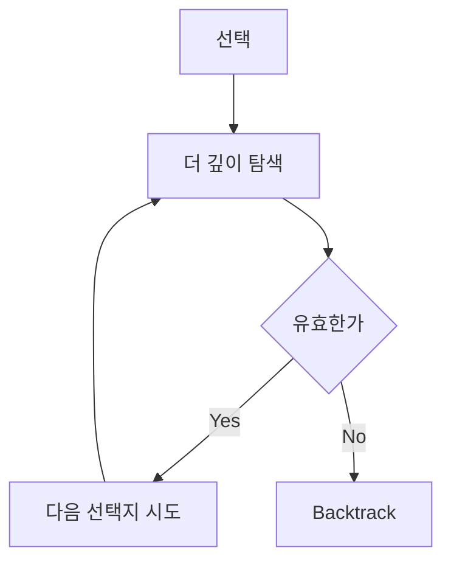
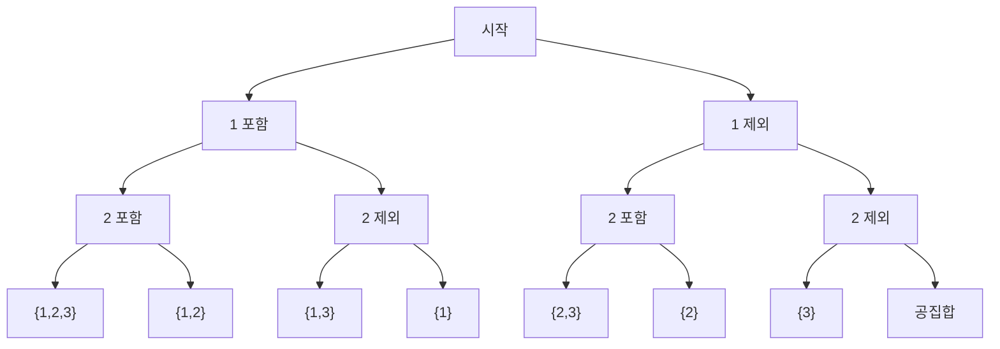

# Backtracking

백트래킹(Backtracking)은 **가능한 선택을 하나씩 시도해 보다가, 더 볼 필요가 없으면 되돌아오는 완전탐색 기법**이다.

한 줄로 요약하면 다음과 같다.

```text
선택하고 내려가고
막히면 되돌아온다
```

백트래킹은 DFS와 매우 가깝지만,
단순 DFS보다 더 중요한 것이 있다.

```text
정답이 될 수 없는 가지를 가능한 한 빨리 자른다
```

이 점이 핵심이다.

---

## 1. 언제 쓰는가

문제에서 아래 표현이 보이면 백트래킹을 떠올리면 된다.

- 모든 경우를 만들어야 함
- 순열 / 조합 / 부분집합
- 조건을 만족하는 경우만 찾기
- N-Queen, 스도쿠, 연산자 끼워넣기
- 경우를 세되 가지치기가 가능함

즉 완전탐색이 필요한데,
무식하게 다 보면 너무 크고,
중간에 버릴 수 있는 조건이 있을 때 백트래킹이 강하다.

---

## 2. DFS와의 차이

- DFS: 그냥 깊이 우선으로 탐색
- 백트래킹: 불가능한 가지는 더 내려가지 않음

즉 백트래킹은 DFS 위에 **유효성 검사 + 복구**가 추가된 형태라고 보면 된다.



즉 백트래킹의 핵심은 "끝까지 갔다가 돌아온다"가 아니라,
조건이 틀린 순간 더 내려가지 않고 곧바로 이전 상태로 복구한다는 데 있다.

---

## 3. 핵심 구조

백트래킹은 거의 항상 아래 구조를 가진다.

```java
void dfs(int depth) {
    if (종료 조건) {
        정답 처리;
        return;
    }

    for (선택지 : 가능한 선택들) {
        if (불가능하면) continue;

        선택;
        dfs(depth + 1);
        복구;
    }
}
```

여기서 핵심 3단계는 항상 같다.

1. 선택
2. 재귀
3. 복구

복구를 빼먹으면 상태가 다음 가지에 남아서 망가진다.

---

## 4. 상태 공간 트리로 이해하기

백트래킹은 보통 상태 공간 트리로 생각하면 이해가 쉽다.

예를 들어 원소 `{1, 2, 3}`의 부분집합을 만들면:

- 1을 선택할지 말지
- 2를 선택할지 말지
- 3을 선택할지 말지

로 계속 분기된다.



즉 각 재귀 호출은 트리의 한 노드이고,
선택 하나가 간선 하나라고 보면 된다.

---

## 5. 순열, 조합, 부분집합의 차이

백트래킹 입문에서 가장 중요한 구분이다.

| 유형 | 순서 중요 | 중복 방문 방지 |
|---|---|---|
| 순열 | 중요 | `visited` 필요 |
| 조합 | 중요하지 않음 | `start` 필요 |
| 부분집합 | 포함/제외 | depth만 증가 |

이 세 가지는 코테에서 거의 공식처럼 나온다.

---

## 6. 순열

### 의미

서로 다른 원소를 순서 있게 뽑는다.

예:

```text
1 2 와 2 1 은 다르다
```


```java
int[] arr = {1, 2, 3};
int[] out = new int[3];
boolean[] visited = new boolean[3];

void perm(int depth, int r) {
    if (depth == r) {
        System.out.println(Arrays.toString(out));
        return;
    }

    for (int i = 0; i < arr.length; i++) {
        if (visited[i]) continue;

        visited[i] = true;
        out[depth] = arr[i];
        perm(depth + 1, r);
        visited[i] = false;
    }
}
```

`visited`가 핵심이다.
같은 원소를 한 번만 쓰게 만든다.

---

## 7. 조합

### 의미

순서 없이 뽑는다.

예:

```text
1 2 와 2 1 은 같다
```


```java
int[] arr = {1, 2, 3, 4};
int[] out = new int[2];

void comb(int depth, int start, int r) {
    if (depth == r) {
        System.out.println(Arrays.toString(out));
        return;
    }

    for (int i = start; i < arr.length; i++) {
        out[depth] = arr[i];
        comb(depth + 1, i + 1, r);
    }
}
```

여기서는 `start`가 핵심이다.
이전 인덱스보다 뒤만 보게 해서 순서 중복을 막는다.

---

## 8. 부분집합

### 의미

각 원소마다:

- 넣는다
- 안 넣는다

두 갈래로 나뉜다.


```java
int[] arr = {1, 2, 3};
boolean[] selected = new boolean[arr.length];

void subset(int depth) {
    if (depth == arr.length) {
        List<Integer> result = new ArrayList<>();
        for (int i = 0; i < arr.length; i++) {
            if (selected[i]) result.add(arr[i]);
        }
        System.out.println(result);
        return;
    }

    selected[depth] = false;
    subset(depth + 1);

    selected[depth] = true;
    subset(depth + 1);
}
```

부분집합은 백트래킹의 가장 기본적인 이진 분기 구조다.

---

## 9. 가지치기가 왜 중요한가

완전탐색은 경우의 수가 급격히 커진다.

예:

- 순열: `N!`
- 부분집합: `2^N`
- N-Queen: 매우 빠르게 폭증

따라서 백트래킹의 핵심 질문은 이것이다.

```text
이 상태에서 더 내려가도 정답이 나올 가능성이 있는가?
```

없으면 바로 중단해야 한다.

---

## 10. 대표 예시: N-Queen

N-Queen은 백트래킹의 대표 문제다.

한 행에 퀸을 하나씩 놓으면서,
기존 퀸과 다음 조건이 겹치면 안 된다.

- 같은 열
- 같은 대각선

즉 현재 행에서 열 하나를 고르되,
안전하지 않은 위치는 바로 버린다.

### 핵심 가지치기

```text
이미 충돌하면 그 아래 행은 볼 필요가 없다
```

이게 백트래킹의 본질이다.

---

## 11. N-Queen 코드 감각

보통 다음 세 배열을 쓴다.

```java
boolean[] col;
boolean[] diag1;
boolean[] diag2;
```

- `col[c]`: c열 사용 여부
- `diag1[row + col]`: `/` 방향 대각선 (왼쪽 아래 ↔ 오른쪽 위)
- `diag2[row - col + n]`: `\` 방향 대각선 (왼쪽 위 ↔ 오른쪽 아래)

이렇게 하면 매번 보드를 다 훑지 않고,
현재 위치가 가능한지 `O(1)`에 검사할 수 있다.

### N-Queen Java 코드

```java
int n;
boolean[] col;
boolean[] diag1; // row + col
boolean[] diag2; // row - col + n
int count = 0;

void solve(int row) {
    if (row == n) {
        count++;
        return;
    }

    for (int c = 0; c < n; c++) {
        if (col[c] || diag1[row + c] || diag2[row - c + n]) continue;

        col[c] = true;
        diag1[row + c] = true;
        diag2[row - c + n] = true;

        solve(row + 1);

        col[c] = false;
        diag1[row + c] = false;
        diag2[row - c + n] = false;
    }
}
```

핵심 흐름은 다음과 같다.

1. 한 행에 퀸을 하나 놓는다
2. 열, `/` 대각선, `\` 대각선에 충돌이 있으면 건너뛴다
3. 선택 → 재귀 → 복구 순서를 지킨다
4. 모든 행을 채우면 정답 하나를 찾은 것이다

---

## 12. 복구가 왜 필요한가

예를 들어 현재 원소를 선택하고 내려갔다가 돌아오면,
다음 가지를 위해 상태를 원래대로 되돌려야 한다.

예:

```java
visited[i] = true;
dfs(depth + 1);
visited[i] = false;
```

이 마지막 복구가 없으면,
다른 가지에서도 `i`가 이미 사용된 것처럼 남아 버린다.

즉 백트래킹은 상태를 공유하므로,
복구가 필수다.

---

## 13. 중복이 있는 입력에서 주의할 점

예를 들어 `[1, 1, 2]`로 순열을 만들면 중복 결과가 생길 수 있다.
이 경우는 보통 다음 방법을 쓴다.

- 먼저 정렬
- 같은 깊이에서 같은 값을 여러 번 선택하지 않도록 스킵

즉 입력에 중복이 있으면 단순 백트래킹만으로는 부족할 수 있다.

---

## 14. 자주 하는 실수

### 1) 선택 후 복구를 안 함

가장 흔한 실수다.

### 2) 종료 조건을 잘못 둠

순열, 조합, 부분집합마다 종료 깊이가 다르다.

### 3) 조합인데 `start`를 안 씀

순서 중복이 생긴다.

### 4) 순열인데 `visited`를 안 씀

같은 원소를 여러 번 사용하게 된다.

### 5) 가지치기 조건이 없음

시간 초과가 나기 쉽다.

---

## 15. 시험장용 최소 암기 버전

```text
백트래킹:
선택 -> 재귀 -> 복구

핵심:
불가능한 가지는 빨리 자른다

대표:
순열
조합
부분집합
N-Queen

포인트:
visited
start
pruning
```

---

## 16. 최종 요약

백트래킹은 다음 문장으로 정리할 수 있다.

```text
가능한 선택을 만들어 보되,
정답이 될 수 없는 가지는 즉시 잘라내는 DFS 기반 완전탐색
```

문제를 보면 먼저 이 질문을 하면 된다.

```text
모든 경우를 만들되,
중간에 버릴 수 있는 조건이 있는가?
```

있다면 백트래킹일 가능성이 높다.
