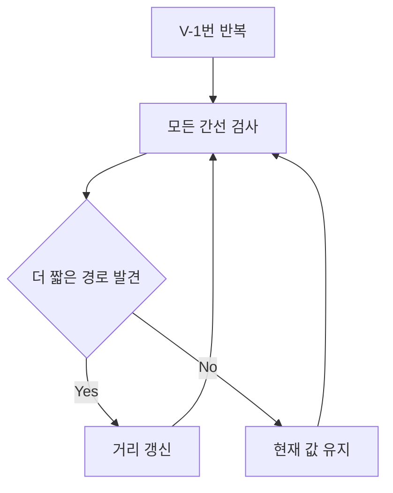
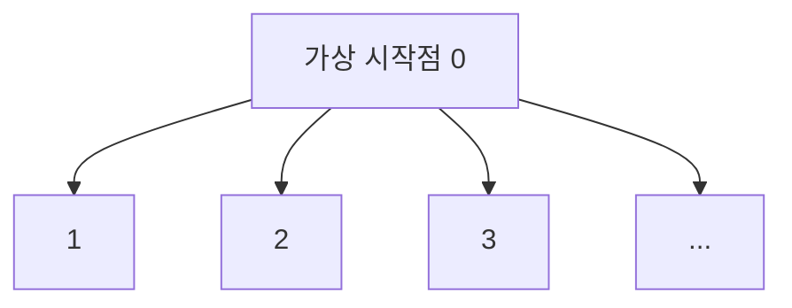
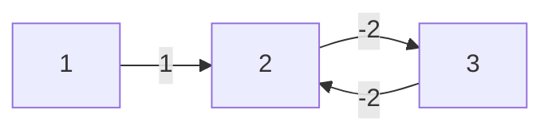

# Bellman-Ford

Bellman-Ford는 **음수 간선이 있을 수 있는 그래프에서 한 시작점 최단 거리를 구하는 알고리즘**이다.

한 줄로 요약하면 다음과 같다.

```text
모든 간선을 여러 번 완화하면서 최단 거리를 갱신하는 알고리즘
```

다익스트라와 비교하면 느리지만,
음수 간선과 음수 사이클 판별을 다룰 수 있다는 점이 강점이다.

---

## 1. 언제 쓰는가

아래 상황이면 Bellman-Ford를 고려한다.

- 음수 간선이 존재할 수 있음
- 한 시작점 최단 거리 문제
- 음수 사이클 여부까지 판단해야 함
- 다익스트라를 쓰면 안 되는 입력

즉 다음 분기가 핵심이다.

- 음수 간선 없음 -> Dijkstra 우선
- 음수 간선 있음 -> Bellman-Ford 검토

---

## 2. 핵심 아이디어

최단 경로가 잘 정의되어 있다면 같은 정점을 반복하지 않는다고 볼 수 있으므로,
간선을 최대 `V - 1`개만 사용한다.

따라서:

```text
모든 간선을 V - 1번 반복해서 완화하면
최단 거리가 전파된다
```

여기서 완화(relaxation)란,
더 짧은 경로를 발견했을 때 거리값을 갱신하는 것이다.



즉 Bellman-Ford는 "가장 가까운 정점 하나를 확정"하는 방식이 아니라,
모든 간선을 반복해서 훑으며 최단 거리 정보가 한 단계씩 퍼져 나가게 만드는 알고리즘이다.

---

## 3. 완화가 무슨 뜻인가

간선 `(u, v, w)`가 있다고 하자.

현재:

- `dist[u] = 5`
- `dist[v] = 20`
- `w = 3`

이면 `u`를 거쳐 `v`로 가는 비용은 `8`이다.
기존 `20`보다 짧으므로:

```java
dist[v] = 8;
```

로 갱신한다.

즉 완화는:

```text
더 짧은 길이 있으면 거리표를 줄이는 작업
```

이다.

---

## 4. 왜 `V - 1`번이면 충분한가

정점이 `V`개인 그래프에서,
도달 가능한 음수 사이클이 없다면,
사이클을 사용하지 않는 최단 경로는 최대 `V - 1`개의 간선만 가진다.

예:

- 정점 5개
- 한 경로가 모든 정점을 한 번씩 지난다고 해도 간선은 최대 4개

즉 1번 완화로 길이 1 경로가,
2번 완화로 길이 2 경로가,
...
`V - 1`번 완화로 길이 `V - 1` 경로까지 전파된다.

---

## 5. 작은 예시로 따라가기

그래프:

```text
1 -> 2 (4)
1 -> 3 (5)
2 -> 3 (-2)
3 -> 4 (3)
```

시작점은 1이다.

초기 거리:

```text
dist[1] = 0
dist[2] = INF
dist[3] = INF
dist[4] = INF
```

### 1번째 완화 라운드

- `1 -> 2`: dist[2] = 4
- `1 -> 3`: dist[3] = 5
- `2 -> 3`: dist[3] = min(5, 4 + -2) = 2
- `3 -> 4`: dist[4] = 5

결과:

```text
0, 4, 2, 5
```

### 2번째 완화 라운드

더 줄어드는 값이 있는지 본다.
이번에는 이미 최단 거리가 모두 전파되어 더 이상 갱신이 없다.

즉 Bellman-Ford는 이렇게 간선을 반복해서 보면서,
최단 경로 정보가 멀리 퍼지게 만든다.

---

## 6. 전체 구현

```java
import java.util.*;

class Edge {
    int from;
    int to;
    int cost;

    Edge(int from, int to, int cost) {
        this.from = from;
        this.to = to;
        this.cost = cost;
    }
}

long[] bellmanFord(int n, List<Edge> edges, int start) {
    long INF = 1_000_000_000_000L;
    long[] dist = new long[n + 1];
    Arrays.fill(dist, INF);
    dist[start] = 0;

    for (int i = 1; i <= n - 1; i++) {
        boolean updated = false;

        for (Edge e : edges) {
            if (dist[e.from] == INF) continue;

            if (dist[e.to] > dist[e.from] + e.cost) {
                dist[e.to] = dist[e.from] + e.cost;
                updated = true;
            }
        }

        if (!updated) break;
    }

    return dist;
}
```

여기서 `updated` 최적화는 중요하다.
어떤 라운드에서 더 이상 갱신이 없다면,
그 뒤로도 변하지 않으므로 일찍 종료할 수 있다.

---

## 7. 음수 사이클 판별

`V - 1`번 완화가 끝난 뒤에도,
한 번 더 완화를 했을 때 값이 줄어든다면 음수 사이클이 있다.

왜냐하면 정상적인 최단 경로는 이미 다 전파됐어야 하는데,
계속 줄어든다는 것은 음수 사이클을 돌면서 값을 무한히 낮출 수 있다는 뜻이기 때문이다.


```java
boolean hasNegativeCycle(List<Edge> edges, long[] dist, long INF) {
    for (Edge e : edges) {
        if (dist[e.from] == INF) continue;
        if (dist[e.to] > dist[e.from] + e.cost) {
            return true;
        }
    }
    return false;
}
```

여기서 핵심은 \"한 번 더\"라는 점이다.

- `V - 1`번까지는 정상 최단 경로 전파
- 그 다음 한 번은 음수 사이클 존재 여부 확인

즉 마지막 1회는 최단 거리 계산용이 아니라,
그래프의 모순 여부를 검사하는 단계라고 보면 된다.

위 함수의 `INF`는 앞선 `bellmanFord`와 같은 상수를 넘겨준다고 생각하면 된다.

---

## 8. 주의: 시작점에서 도달 가능한 음수 사이클만 잡힌다

Bellman-Ford에서 `dist[e.from] == INF`를 건너뛰므로,
시작점에서 갈 수 없는 음수 사이클은 현재 시작점 기준 최단 거리 계산에는 영향을 주지 않는다.

즉 문제에서 묻는 것이:

- 시작점 기준 최단 거리인가
- 그래프 전체의 어떤 음수 사이클이든 존재하는가

에 따라 해석이 달라질 수 있다.

작은 예시를 보자.

- 시작점이 1
- 1과 전혀 연결되지 않은 다른 컴포넌트에 음수 사이클 존재

이 경우 Bellman-Ford는 그 사이클을 현재 시작점 기준 계산에서는 감지하지 못할 수 있다.

즉 \"그래프 전체 어디든 음수 사이클 있나\"를 묻는 문제와
\"시작점에서 영향을 받는 음수 사이클 있나\"를 묻는 문제는 다를 수 있다.

이 차이를 문제에서 반드시 확인해야 한다.

### 그래프 전체 음수 사이클 검사는 super source를 붙이면 된다

만약 문제에서 "그래프 전체 어딘가에 음수 사이클이 있는가"를 묻는다면,
가상의 정점 `0`을 만들고 모든 정점으로 비용 `0` 간선을 연결하면 된다.



그다음 `0`에서 Bellman-Ford를 시작하면
모든 컴포넌트가 도달 가능한 상태가 된다.

구현 감각은 다음과 같다.

```java
for (int v = 1; v <= n; v++) {
    edges.add(new Edge(0, v, 0));
}

// 정점 번호 범위가 0..n 이므로 총 정점 수는 n + 1
long[] dist = bellmanFord(n + 1, edges, 0);
```

즉 시작점 하나의 문제를
"전체 그래프를 다 보는 시작점" 문제로 바꿔 주는 셈이다.

---

## 9. 음수 사이클 예시를 손으로 보기

그래프:

```text
1 -> 2 (1)
2 -> 3 (-2)
3 -> 2 (-2)
```

시작점은 1이라고 하자.

2와 3 사이를 한 번 돌면 비용이:

```text
-2 + -2 = -4
```

이다.

즉 2와 3을 계속 왕복할수록 거리값을 더 줄일 수 있다.

이 경우 `V - 1`번 완화 후에도
`2`, `3`의 거리는 한 번 더 줄어들 수 있다.

그래서 Bellman-Ford는 마지막 1회 검사에서 이를 음수 사이클로 판별한다.

### 음수 사이클 다이어그램



2 → 3 → 2 경로의 비용 합이 $-2 + (-2) = -4 < 0$ 이므로,
이 사이클을 반복할수록 거리가 무한히 줄어든다.

---

## 10. 왜 간선 리스트로 구현하는가

Bellman-Ford는 \"모든 간선을 매 라운드마다 한 번씩 본다\"가 핵심이다.

그래서 인접 리스트보다는 오히려:

```java
List<Edge> edges
```

형태가 더 자연스럽다.

다익스트라는 현재 정점에서 나가는 간선만 보면 되므로 인접 리스트가 잘 맞고,
Bellman-Ford는 그래프 전체 간선을 반복 스캔하므로 간선 리스트가 잘 맞는다.

---

## 11. 시간 복잡도

Bellman-Ford의 시간 복잡도는:

```text
O(VE)
```

이다.

그래서 정점과 간선이 큰 그래프에서는 느리다.
음수 간선이 없다면 보통 Dijkstra가 훨씬 효율적이다.

---

## 12. 언제 Bellman-Ford를 실제로 고르는가

실전에서는 다음 식으로 판단하면 된다.

- 음수 간선이 없다 -> Dijkstra 먼저
- 음수 간선이 있다 -> Bellman-Ford 검토
- 모든 쌍이 필요하고 정점 수가 작다 -> Floyd-Warshall 검토

즉 Bellman-Ford는 가장 빠른 기본 선택은 아니지만,
음수 간선 때문에 다른 선택지가 막힐 때 매우 중요해진다.

---

## 13. Dijkstra와 비교

| 항목 | Bellman-Ford | Dijkstra |
|---|---|---|
| 음수 간선 | 가능 | 불가 |
| 음수 사이클 판별 | 가능 | 불가 |
| 속도 | 느림 | 빠름 |
| 핵심 구조 | 모든 간선 반복 완화 | 우선순위 큐 그리디 |

즉 Bellman-Ford는 "느리지만 더 일반적"인 알고리즘이다.

---

## 14. Floyd-Warshall과 비교

- Bellman-Ford: 시작점 하나
- Floyd-Warshall: 모든 정점 쌍

즉 둘 다 음수 간선을 다룰 수 있지만,
문제가 요구하는 시작점 범위가 다르다.

---

## 15. 자주 하는 실수

### 1) `INF` 상태에서 더함

도달하지 못한 정점은 건너뛰어야 한다.

### 2) `V`번이 아니라 `V - 1`번 완화해야 함

최단 경로 간선 수 상한은 `V - 1`개다.

### 3) 음수 사이클 판별 단계를 빼먹음

문제가 음수 사이클 존재 여부를 물으면 반드시 한 번 더 확인해야 한다.

### 4) `int` overflow

거리 합이 커질 수 있으므로 `long`이 더 안전하다.

---

## 16. 시험장용 최소 암기 버전

```text
Bellman-Ford:
음수 간선 가능한 단일 시작점 최단 거리

핵심:
모든 간선을 V-1번 완화

음수 사이클:
한 번 더 완화했는데 갱신되면 존재

복잡도:
O(VE)
```

---

## 17. 최종 요약

Bellman-Ford는 다음 문장으로 정리할 수 있다.

```text
음수 간선을 허용하는 그래프에서,
모든 간선을 반복 완화해 한 시작점 최단 거리를 구하는 알고리즘
```

문제를 보면 먼저 이 질문을 하면 된다.

```text
음수 간선이 있을 수 있는가?
```

그 답이 예라면 Bellman-Ford를 검토해야 한다.
