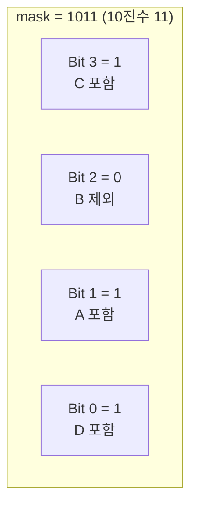
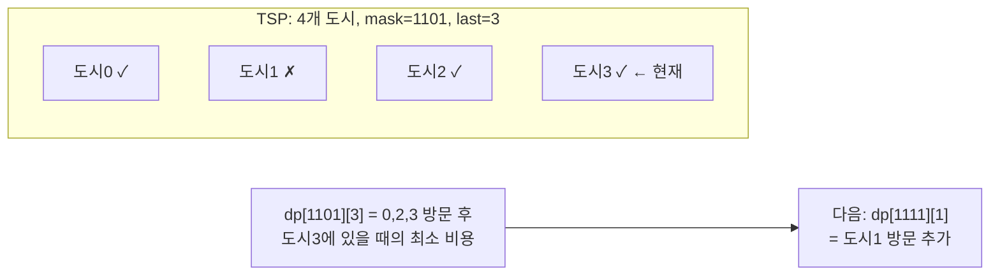

# Bitmask

비트마스크(Bitmask)는 **정수의 비트를 이용해 여러 개의 상태를 압축해서 표현하는 기법**이다.

한 줄로 요약하면 다음과 같다.

```text
여러 개의 on/off 상태를 하나의 정수로 관리한다
```

코딩테스트에서는 "집합"이나 "방문 상태"를 작게 압축하는 용도로 매우 자주 나온다.

---

## 1. 언제 쓰는가

아래 상황이면 비트마스크를 떠올릴 수 있다.

- 방문한 원소 집합 관리
- 부분집합 순회
- 상태 압축 DP
- 작은 `N`에 대해 모든 집합 탐색
- 포함 / 제외 상태를 빠르게 관리

특히 다음이 보이면 강하게 의심한다.

```text
N <= 20
```

왜냐하면 부분집합 수가 `2^N`이라,
20 정도면 전부 보는 것이 아직 가능하기 때문이다.

---

## 2. 왜 유용한가

예를 들어 방문 여부를 `boolean[]`로 관리할 수도 있다.
하지만 비트마스크를 쓰면:

- 상태 전체를 정수 하나로 표현 가능
- 비교 / 복사 / 저장이 쉬움
- DP 상태로 쓰기 좋음

즉 여러 개의 `true/false`를 하나로 압축하는 셈이다.

---

## 3. 기본 연산

### i번째 비트 켜기

```java
mask |= (1 << i);
```

### i번째 비트 끄기

```java
mask &= ~(1 << i);
```

### i번째 비트 토글

```java
mask ^= (1 << i);
```

### i번째 비트 확인

```java
(mask & (1 << i)) != 0
```

이 네 개는 거의 외워야 한다.

```text
예: mask = 0101 (5)

켜기: mask |= (1<<1)  → 0101 | 0010 = 0111 (7)   → 1번 비트 ON
끄기: mask &= ~(1<<2) → 0111 & 1011 = 0011 (3)   → 2번 비트 OFF
확인: mask & (1<<0)   → 0011 & 0001 = 0001 (≠0)  → 0번 포함
토글: mask ^= (1<<1)  → 0011 ^ 0010 = 0001 (1)   → 1번 반전
```

---

## 4. 부분집합으로 이해하기

원소가 4개라고 하자.

- `0000` : 공집합
- `0001` : 0번만 포함
- `0101` : 0번, 2번 포함
- `1111` : 전부 포함

즉 mask 하나가 집합 하나를 뜻한다.



보통 오른쪽 끝 비트를 0번 원소로 본다.

즉 정수 하나가 곧 집합 하나를 뜻하고,
어떤 비트가 켜져 있느냐가 어떤 원소를 포함하는지를 나타낸다.

---

## 5. 모든 부분집합 순회

원소가 `n`개면 부분집합은 `2^n`개다.


```java
for (int mask = 0; mask < (1 << n); mask++) {
    // mask 하나가 부분집합 하나
}
```

예를 들어 `n = 3`이면:

- `000`
- `001`
- `010`
- `011`
- `100`
- `101`
- `110`
- `111`

총 8개다.

---

## 6. 부분집합 안의 원소 순회

```java
for (int i = 0; i < n; i++) {
    if ((mask & (1 << i)) != 0) {
        // i번째 원소가 포함됨
    }
}
```

즉 mask 하나를 보고,
어떤 원소가 들어 있는지 확인할 수 있다.

---

## 7. 손으로 보는 예시

원소 `{A, B, C}`가 있다고 하자.

`mask = 5`이면 이진수로 `101`이다.

의미:

- 0번 비트 켜짐 -> A 포함
- 1번 비트 꺼짐 -> B 제외
- 2번 비트 켜짐 -> C 포함

즉 집합은 `{A, C}`다.

이 감각이 중요하다.

---

## 8. 집합 연산도 빠르게 가능하다

비트마스크는 집합 연산과 잘 대응된다.

- 합집합: `a | b`
- 교집합: `a & b`
- 차집합 일부: `a & ~b`

즉 집합을 정수처럼 다룰 수 있다.

그래서 비트마스크를 익히면
"집합 연산"과 "비트 연산"이 사실상 같은 것으로 느껴지기 시작한다.

---

## 9. 상태 압축 DP

비트마스크가 강력한 이유는 DP와 결합될 때다.

대표 예시:

```text
dp[mask][last]
```

의미:

- `mask`: 방문한 정점 집합
- `last`: 마지막 정점

즉 여러 방문 상태를 `boolean[]` 대신 정수 하나로 압축해 두는 것이다.

대표 문제:

- 외판원 순회 TSP
- 방문 집합 기반 최소 비용 문제
- 매칭 일부 문제

예를 들어 외판원 순회에서
`mask = 13`이라면 이진수 `1101`로 해석할 수 있고,
"0, 2, 3번 도시는 방문했고 1번 도시는 아직 안 갔다"는 뜻이 된다.

이처럼 `boolean[] visited` 여러 칸을 정수 하나로 바꿔 저장하는 것이 상태 압축 DP의 핵심이다.



```text
전이: dp[mask | (1<<next)][next]
    = min(dp[mask][last] + dist[last][next])
단, next가 mask에 아직 없어야 한다: (mask & (1<<next)) == 0
```

---

## 10. 왜 `N <= 20`이 자주 보이는가

부분집합 수는 `2^N`개다.

- `N = 10` -> 1024
- `N = 20` -> 약 100만
- `N = 25` -> 약 3300만

즉 `N`이 조금만 커져도 상태 수가 폭발한다.

그래서 비트마스크는 보통 작은 `N`에서 강하다.

즉 비트마스크는 강력하지만,
상태 수가 `2^N`이라서 입력 크기에 매우 민감하다는 점도 같이 기억해야 한다.

---

## 11. 부분집합 DP가 아니라도 자주 쓰인다

비트마스크는 DP에서만 쓰는 것이 아니다.

예:

- 알파벳 방문 여부
- 퍼즐 상태 저장
- 여러 조건 on/off 관리
- 부분집합 완전탐색

즉 "상태가 여러 개의 예/아니오 조합으로 표현될 수 있는가"를 먼저 보면 된다.

대표적으로 문자열 문제에서 알파벳 사용 여부,
그래프 문제에서 방문한 정점 집합,
브루트포스 문제에서 선택한 원소 집합을 표현할 때 매우 자주 등장한다.

### 부분집합의 부분집합을 도는 패턴도 중요하다

실전에서는 어떤 집합 `mask`의 모든 부분집합 `sub`를 다시 순회하는 경우가 자주 나온다.

```java
for (int sub = mask; sub > 0; sub = (sub - 1) & mask) {
    // sub는 mask의 부분집합
}
```

이 패턴이 맞는 이유는
`sub - 1`이 마지막 켜진 비트를 끄고 오른쪽을 전부 1로 만든 뒤,
`& mask`가 원래 집합 밖의 비트를 정리해 주기 때문이다.

예를 들어 `mask = 1101`이면 순회는:

```text
1101 -> 1100 -> 1001 -> 1000 -> 0101 -> 0100 -> 0001
```

처럼 진행되고,
공집합 `0000`은 필요하면 루프 밖에서 따로 처리한다.

이 패턴은 부분집합 DP, SOS DP, 브루트포스 최적화에서 매우 자주 쓰인다.

### 원소 수는 `bitCount`로 바로 셀 수 있다

```java
int cnt = Integer.bitCount(mask);
```

선택된 원소 수, 홀짝 판단, `k`개 선택 제약 같은 문제에서는
직접 루프를 돌기보다 `bitCount`를 쓰는 편이 더 간단하고 실수도 적다.

---

## 12. 자주 하는 실수

### 1) 비트 인덱스를 0부터 세는지 혼동

대부분 0번 비트부터 쓴다.

### 2) `1 << n` 범위 초과

`n`이 너무 크면 `int`가 위험할 수 있다.
필요하면 `1L << n`을 써야 한다.

### 3) 원소 번호와 비트 번호를 그대로 섞음

문제 원소 번호가 1부터 시작하면,
비트는 보통 0부터 맞춰 주는 것이 편하다.

### 4) 음수 시프트나 괄호 실수

```java
mask & (1 << i)
```

처럼 괄호를 명확히 두는 편이 안전하다.

---

## 13. 시험장용 최소 암기 버전

```text
비트마스크:
여러 boolean 상태를 정수 하나로 압축

기본 연산:
켜기  |=
끄기  &= ~
토글  ^=
확인  &

핵심 사용처:
부분집합 순회
방문 상태 압축
DP 상태 압축
```

---

## 14. 최종 요약

비트마스크는 다음 문장으로 정리할 수 있다.

```text
여러 개의 on/off 상태를 비트 하나씩에 담아
빠르게 집합을 관리하는 기법
```

문제를 보면 먼저 이 질문을 하면 된다.

```text
이 상태를 boolean 여러 개 대신
정수 하나로 압축할 수 있는가?
```

그렇다면 비트마스크를 고려할 만하다.
