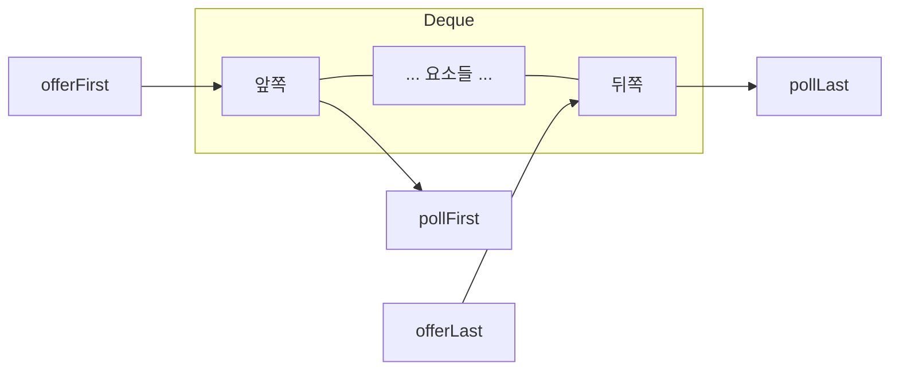
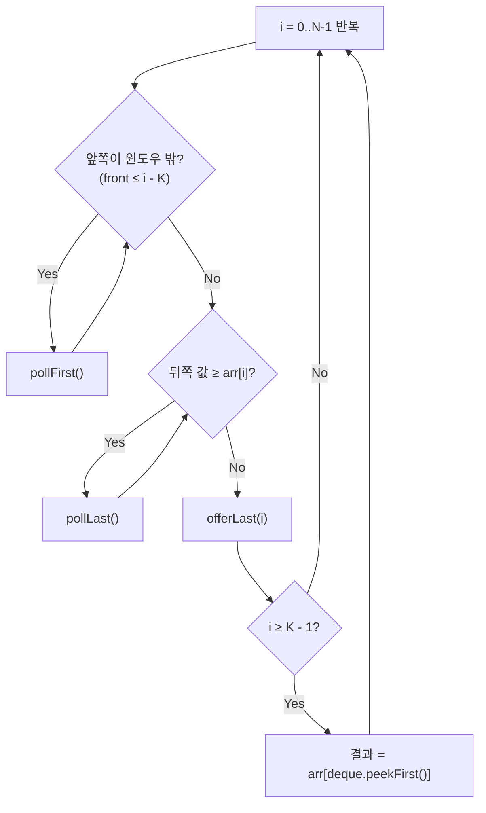
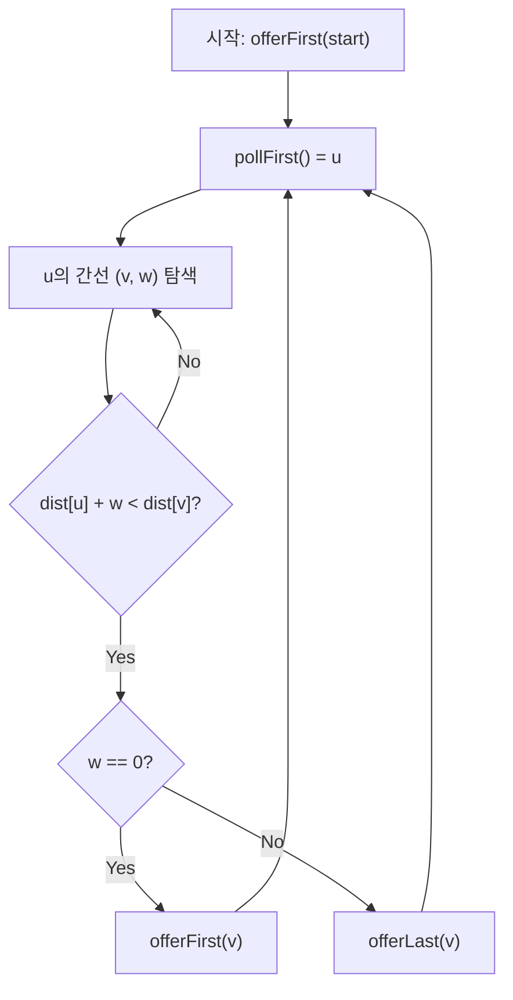

# Deque

덱(Deque, Double-Ended Queue)은 **양쪽 끝에서 삽입과 삭제가 모두 O(1)인 자료구조**다.

한 줄로 요약하면 다음과 같다.

```text
앞에서도 넣고 빼고, 뒤에서도 넣고 빼는 큐
```

코테에서 덱은 주로 **슬라이딩 윈도우 최솟값/최댓값**과 **0-1 BFS**에 쓰인다.

---

## 1. 언제 쓰는가

| 상황 | 이유 |
| --- | --- |
| 슬라이딩 윈도우 최솟값/최댓값 | 모노톤 덱으로 O(N) 풀이 |
| 0-1 BFS | 가중치가 0 또는 1인 그래프 최단 경로 |
| 양방향 큐가 필요할 때 | 앞뒤 모두 접근 |
| 히스토그램 최대 직사각형 | 스택과 유사하게 활용 |

---

## 2. Java Deque 기본 사용법

Java에서 `Deque` 인터페이스는 `ArrayDeque`로 구현한다.

### 주요 메서드

| 메서드 | 설명 | 위치 |
| --- | --- | --- |
| `offerFirst(e)` | 앞에 삽입 | Front |
| `offerLast(e)` | 뒤에 삽입 | Back |
| `pollFirst()` | 앞에서 제거 | Front |
| `pollLast()` | 뒤에서 제거 | Back |
| `peekFirst()` | 앞 원소 확인 | Front |
| `peekLast()` | 뒤 원소 확인 | Back |

```java
Deque<Integer> deque = new ArrayDeque<>();

deque.offerLast(1);   // [1]
deque.offerLast(2);   // [1, 2]
deque.offerFirst(0);  // [0, 1, 2]

deque.peekFirst();    // 0
deque.peekLast();     // 2

deque.pollFirst();    // 0 제거, [1, 2]
deque.pollLast();     // 2 제거, [1]
```

### Stack 대용으로 쓰기

`Stack` 대신 `ArrayDeque`를 쓰는 것이 더 빠르다.

```java
Deque<Integer> stack = new ArrayDeque<>();
stack.push(1);     // offerFirst
stack.push(2);     // offerFirst
stack.pop();       // pollFirst → 2
stack.peek();      // peekFirst → 1
```

### Queue 대용으로 쓰기

```java
Deque<Integer> queue = new ArrayDeque<>();
queue.offer(1);    // offerLast
queue.offer(2);    // offerLast
queue.poll();      // pollFirst → 1
```



즉 덱 하나로 앞뒤 삽입과 삭제를 모두 처리할 수 있어서,
큐처럼도 쓰고 스택처럼도 쓰는 패턴이 자연스럽게 나온다.

---

## 3. 모노톤 덱 Monotone Deque

모노톤 덱은 **덱 안의 원소가 단조 증가 또는 단조 감소를 유지**하는 기법이다.

슬라이딩 윈도우 문제에서 매우 강력하다.

핵심 아이디어:

```text
덱에는 인덱스를 저장한다
새 원소를 넣을 때, 덱 뒤에서부터 새 원소보다
크거나 같은(최솟값 덱) 것들을 모두 제거한 뒤 삽입
→ 덱의 앞이 항상 현재 윈도우의 최솟값
```

---

## 4. 슬라이딩 윈도우 최솟값

크기 K인 슬라이딩 윈도우가 배열 위를 이동하면서 각 위치의 최솟값을 구하는 문제다.

### 브루트포스: O(NK)

매 위치마다 K개를 순회한다.

### 모노톤 덱: O(N)

```java
int[] slidingWindowMin(int[] arr, int k) {
    int n = arr.length;
    int[] result = new int[n - k + 1];
    Deque<Integer> deque = new ArrayDeque<>(); // 인덱스 저장

    for (int i = 0; i < n; i++) {
        // 1. 윈도우 밖의 원소 제거
        while (!deque.isEmpty() && deque.peekFirst() <= i - k) {
            deque.pollFirst();
        }

        // 2. 뒤에서부터 현재 값보다 크거나 같은 것 제거
        while (!deque.isEmpty() && arr[deque.peekLast()] >= arr[i]) {
            deque.pollLast();
        }

        // 3. 현재 인덱스 삽입
        deque.offerLast(i);

        // 4. 결과 기록 (윈도우가 완성된 후)
        if (i >= k - 1) {
            result[i - k + 1] = arr[deque.peekFirst()];
        }
    }

    return result;
}
```

### 손 계산 예시

```text
arr = [3, 1, 4, 1, 5, 9, 2, 6], K = 3

i=0: deque=[0]                                        → 윈도우 미완성
i=1: arr[1]=1 < arr[0]=3 → 0 제거, deque=[1]          → 윈도우 미완성
i=2: arr[2]=4 > arr[1]=1 → deque=[1,2]                → 결과: arr[1]=1
i=3: arr[3]=1 ≤ arr[2]=4 → 2 제거
     arr[3]=1 ≤ arr[1]=1 → 1 제거, deque=[3]          → 결과: arr[3]=1
i=4: arr[4]=5 > arr[3]=1 → deque=[3,4]                → 결과: arr[3]=1
i=5: 윈도우 범위 [3,4,5]
     front=3, 5-3=2 < K=3 → 남음
     arr[5]=9 > arr[4]=5 → deque=[3,4,5]              → 결과: arr[3]=1
i=6: 윈도우 범위 [4,5,6]
     front=3, 6-3=3 ≥ K=3 → 3 제거
     arr[6]=2 < arr[5]=9 → 5 제거
     arr[6]=2 < arr[4]=5 → 4 제거, deque=[6]          → 결과: arr[6]=2
i=7: 윈도우 범위 [5,6,7]
     arr[7]=6 > arr[6]=2 → deque=[6,7]                → 결과: arr[6]=2

최종 결과: [1, 1, 1, 1, 2, 2]
```



여기서 덱에 **값이 아니라 인덱스**를 넣는 이유는,
윈도우 범위를 벗어났는지와 현재 값과의 대소 비교를 동시에 처리해야 하기 때문이다.

---

## 5. 슬라이딩 윈도우 최댓값

최솟값과 방향만 반대다.

```java
// 뒤에서부터 현재 값보다 작거나 같은 것 제거 (최솟값과 반대)
while (!deque.isEmpty() && arr[deque.peekLast()] <= arr[i]) {
    deque.pollLast();
}
```

---

## 6. 0-1 BFS

간선 가중치가 **0 또는 1**인 그래프에서 최단 경로를 구하는 기법이다.

일반 BFS는 가중치 없는 그래프에서 동작하고,
다익스트라는 양의 가중치 그래프에서 동작하지만,
0-1 BFS는 덱을 써서 **O(V + E)**에 최단 경로를 구한다.

### 핵심 아이디어

```text
가중치가 0인 간선 → 덱 앞에 넣음 (offerFirst)
가중치가 1인 간선 → 덱 뒤에 넣음 (offerLast)
```

이렇게 하면 BFS 순서가 자연스럽게 최단 거리 순이 된다.


```java
int[] bfs01(int n, List<int[]>[] graph, int start) {
    // graph[u] = list of {v, weight} where weight is 0 or 1
    int[] dist = new int[n + 1];
    Arrays.fill(dist, Integer.MAX_VALUE);
    dist[start] = 0;

    Deque<Integer> deque = new ArrayDeque<>();
    deque.offerFirst(start);

    while (!deque.isEmpty()) {
        int u = deque.pollFirst();

        for (int[] edge : graph[u]) {
            int v = edge[0], w = edge[1];
            if (dist[u] + w < dist[v]) {
                dist[v] = dist[u] + w;
                if (w == 0) {
                    deque.offerFirst(v); // 비용 0: 앞에
                } else {
                    deque.offerLast(v);  // 비용 1: 뒤에
                }
            }
        }
    }

    return dist;
}
```

시간 복잡도: **O(V + E)** (다익스트라의 O(E log V)보다 빠르다)

### 왜 동작하는가

```text
덱 앞에서 꺼내므로, 거리가 작은 것이 먼저 처리된다.
가중치 0 간선은 거리가 같으므로 앞에 넣어 먼저 처리하고,
가중치 1 간선은 거리가 +1이므로 뒤에 넣어 나중에 처리한다.
→ BFS처럼 거리 순서가 유지된다.
```



### 0-1 BFS가 쓰이는 상황

| 문제 유형 | 설명 |
| --- | --- |
| 벽 부수기 | 벽을 부수면 비용 1, 빈 칸 이동은 비용 0 |
| 도로 역방향 | 도로를 뒤집으면 비용 1, 순방향은 비용 0 |
| 격자 이동 | 특정 방향은 비용 0, 다른 방향은 비용 1 |

---

## 7. 모노톤 덱의 원리

왜 모노톤 덱이 정확한 답을 주는가?

```text
덱에 남아 있는 원소는 "미래에 최솟값이 될 후보"다.

원소 x가 들어올 때 덱 뒤에 x보다 큰 원소가 있으면:
- 그 원소는 x보다 먼저 윈도우 밖으로 나가거나
- 나가기 전에도 x가 더 작으므로 최솟값이 될 수 없다
→ 따라서 제거해도 답에 영향이 없다
```

이것이 **Amortized O(1)** 인 이유:

```text
각 원소는 최대 한 번 들어가고 한 번 나간다
→ 총 2N번의 연산 → O(N)
```

---

## 8. 다중 조건 슬라이딩 윈도우

때로는 최솟값과 최댓값의 **차이**가 K 이하인 가장 긴 구간을 찾는 문제가 나온다.

```java
int longestSubarray(int[] arr, int k) {
    Deque<Integer> maxDeque = new ArrayDeque<>();
    Deque<Integer> minDeque = new ArrayDeque<>();
    int left = 0, ans = 0;

    for (int right = 0; right < arr.length; right++) {
        while (!maxDeque.isEmpty() && arr[maxDeque.peekLast()] <= arr[right])
            maxDeque.pollLast();
        while (!minDeque.isEmpty() && arr[minDeque.peekLast()] >= arr[right])
            minDeque.pollLast();

        maxDeque.offerLast(right);
        minDeque.offerLast(right);

        while (arr[maxDeque.peekFirst()] - arr[minDeque.peekFirst()] > k) {
            left++;
            if (maxDeque.peekFirst() < left) maxDeque.pollFirst();
            if (minDeque.peekFirst() < left) minDeque.pollFirst();
        }

        ans = Math.max(ans, right - left + 1);
    }

    return ans;
}
```

모노톤 덱 두 개(최대용 + 최소용)를 동시에 유지한다.

---

## 9. 덱 vs 스택 vs 큐

| 자료구조 | 삽입 | 삭제 | 코테 용도 |
| --- | --- | --- | --- |
| Stack | 뒤에만 | 뒤에만 | 괄호, 히스토그램, DFS |
| Queue | 뒤에만 | 앞에만 | BFS |
| Deque | 앞뒤 모두 | 앞뒤 모두 | 슬라이딩 윈도우, 0-1 BFS |

Java에서는 세 가지 모두 `ArrayDeque`로 구현할 수 있다.

---

## 10. 자주 하는 실수

### 1) 인덱스와 값을 혼동

모노톤 덱에는 **인덱스**를 저장한다. 값이 아니다.
값을 저장하면 윈도우 범위 체크가 안 된다.

### 2) 윈도우 범위 체크를 빠뜨림

```java
while (!deque.isEmpty() && deque.peekFirst() <= i - k) {
    deque.pollFirst();
}
```

이걸 안 하면 윈도우 밖의 원소가 답에 포함된다.

### 3) 0-1 BFS에서 dist 갱신 조건 실수

```java
if (dist[u] + w < dist[v])  // 엄격한 < 여야 한다
```

`<=`로 하면 같은 거리로 중복 방문하여 무한 루프 가능.

### 4) LinkedList를 덱으로 사용

`LinkedList`는 `Deque`를 구현하지만 `ArrayDeque`보다 느리다.
코테에서는 항상 `ArrayDeque`를 쓰자.

---

## 11. 시험장용 최소 암기 버전

```text
Deque 생성:
Deque<Integer> dq = new ArrayDeque<>();

슬라이딩 윈도우 최솟값 (모노톤 덱):
1. 앞에서 윈도우 밖 제거 (deque.peekFirst() <= i - k)
2. 뒤에서 현재보다 크거나 같은 것 제거
3. 현재 인덱스 offerLast
4. deque.peekFirst()가 최솟값

0-1 BFS:
가중치 0 → offerFirst
가중치 1 → offerLast
나머지는 BFS와 동일

핵심:
덱에는 인덱스를 저장
각 원소 최대 1번 입출 → O(N)
```

---

## 12. 최종 요약

덱은 다음 문장으로 정리할 수 있다.

```text
양쪽 끝에서 O(1)에 삽입/삭제하는 자료구조
```

코테에서의 활용은 두 가지가 핵심이다.

```text
1. 슬라이딩 윈도우 최솟값/최댓값 → 모노톤 덱
2. 0-1 BFS → 가중치 0은 앞, 1은 뒤
```

문제를 보면 이 질문을 하면 된다.

```text
"구간이 이동하면서 최솟값/최댓값을 빠르게 구해야 하는가?"
→ 모노톤 덱

"간선 가중치가 0과 1뿐인가?"
→ 0-1 BFS with 덱
```
