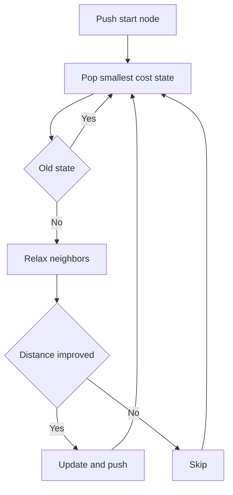
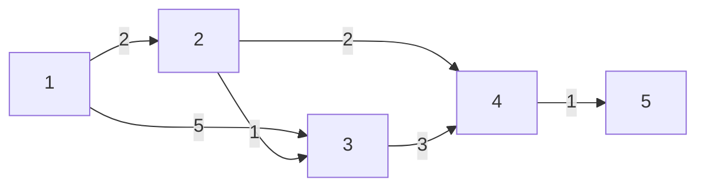

# Dijkstra

Dijkstra 알고리즘은 **하나의 시작점에서 모든 정점까지의 최단 거리**를 구하는 대표적인 알고리즘이다.

한 줄로 요약하면 다음과 같다.

```text
현재까지 가장 가까운 정점을 하나씩 확정해 나가면서
최단 거리 정보를 갱신하는 Greedy 기반 최단 경로 알고리즘
```

---

## 1. 언제 쓰는가

문제에서 아래 표현이 보이면 Dijkstra를 먼저 의심하면 된다.

- 한 시작점에서 모든 정점까지의 최소 비용
- 특정 출발 도시에서 다른 도시들까지의 최단 거리
- 가중치가 있는 그래프
- 비용이 음수가 아님
- 최소 시간, 최소 거리, 최소 비용

대표 비교:

| 알고리즘 | 해결 대상 |
|---|---|
| BFS | 가중치 없는 그래프의 최단 거리 |
| Dijkstra | 음수 가중치가 없는 그래프에서 한 시작점 최단 거리 |
| Bellman-Ford | 음수 간선이 있을 수 있는 그래프에서 한 시작점 최단 거리 |
| Floyd-Warshall | 모든 정점 쌍 최단 거리 |

즉,

- BFS는 가중치가 모두 동일한 경우
- Dijkstra는 가중치가 있지만 음수가 없는 경우
- Floyd-Warshall은 시작점이 하나가 아니라 모든 정점인 경우

---

## 2. 핵심 아이디어

다익스트라의 핵심은 다음 한 문장이다.

```text
아직 확정되지 않은 정점들 중
현재까지의 최단 거리가 가장 짧은 정점은
이제 정말 최단 거리로 확정할 수 있다
```

왜 이런 생각이 가능할까?

가중치가 모두 0 이상이면,

- 지금 가장 짧은 후보보다
- 나중에 다른 정점을 돌아서 오는 경로가
- 더 짧아질 수 없다

왜냐하면 중간에 간선을 한 번 더 지날 때마다 비용이 줄어들지 않고 같거나 늘어나기 때문이다.

이 성질 덕분에 다익스트라는 **Greedy** 하게 동작할 수 있다.

---

## 3. 어떤 문제를 푸는가

다익스트라는 보통 다음 문제를 푼다.

```text
Single Source Shortest Path
```

즉, 시작점 `start`가 하나 주어졌을 때:

- `start -> 1`
- `start -> 2`
- `start -> 3`
- ...
- `start -> N`

각 정점까지의 최단 거리를 모두 구하는 문제다.

예를 들어 시작점이 1번이면 `dist[i]`는 다음 의미를 가진다.

```java
dist[i] = 1번 정점에서 i번 정점까지의 최단 거리
```

---

## 4. 필요한 자료구조

다익스트라는 보통 아래 3개가 핵심이다.

### 1) 인접 리스트

각 정점에서 갈 수 있는 다음 정점들과 가중치를 저장한다.

```java
ArrayList<Edge>[] graph = new ArrayList[n + 1];
```

`graph[u]`에는 `u`에서 출발하는 모든 간선이 들어간다.

예:

```text
1 -> 2 (3)
1 -> 4 (8)
2 -> 3 (5)
```

이면

```text
graph[1] = [(2,3), (4,8)]
graph[2] = [(3,5)]
```

### 2) 거리 배열 `dist`

시작점에서 각 정점까지의 현재 최단 거리 후보를 저장한다.

```java
long[] dist = new long[n + 1];
```

초기에는:

- 시작점은 `0`
- 나머지는 `INF`

### 3) 우선순위 큐 `PriorityQueue`

현재까지 발견한 정점들 중에서 **가장 짧은 거리 후보**를 먼저 꺼내기 위해 사용한다.

```java
PriorityQueue<State> pq = new PriorityQueue<>(
    (a, b) -> Long.compare(a.cost, b.cost)
);
```

즉, 큐의 맨 앞에는 항상 "지금 가장 가까운 후보 정점"이 온다.

---

## 5. 왜 우선순위 큐를 쓰는가

다익스트라를 단순 배열로 구현할 수도 있다.

하지만 그 경우 매 단계마다:

- 아직 방문하지 않은 정점 중
- 최단 거리 값이 가장 작은 정점

을 선형 탐색해야 해서 느리다.

우선순위 큐를 쓰면 이 작업을 훨씬 빠르게 처리할 수 있다.

그래서 실전에서는 보통:

- 인접 리스트
- 우선순위 큐

조합이 정석이다.

---

## 6. 알고리즘 흐름

전체 흐름은 다음과 같다.

1. `dist`를 모두 `INF`로 초기화한다.
2. 시작점의 거리를 `0`으로 둔다.
3. 우선순위 큐에 `(시작점, 0)`을 넣는다.
4. 큐에서 가장 가까운 정점을 하나 꺼낸다.
5. 그 정점에서 갈 수 있는 모든 간선을 확인한다.
6. 더 짧은 경로가 발견되면 `dist`를 갱신하고 큐에 다시 넣는다.
7. 큐가 빌 때까지 반복한다.

핵심 갱신은 다음 한 줄이다.

```java
if (dist[next] > dist[cur] + weight) {
    dist[next] = dist[cur] + weight;
}
```

이 과정을 **간선 완화(Relaxation)** 라고 부른다.



즉 다익스트라는 "가장 가까운 후보를 꺼내고, 오래된 정보는 버리고, 더 짧아진 이웃만 다시 큐에 넣는 과정"이라고 보면 된다.

---

## 7. 간선 완화(Relaxation)란 무엇인가

예를 들어 현재 `cur` 정점까지의 최단 거리 후보가 7이라고 하자.

그리고 `cur -> next` 간선 비용이 3이라면:

```text
start -> cur -> next = 10
```

이다.

이 값이 기존 `dist[next]`보다 더 작으면,

```java
dist[next] = 10;
```

으로 갱신한다.

즉 다익스트라는 계속해서

```text
"이 정점을 거쳐 가는 게 더 이득인가?"
```

를 반복해서 묻는 알고리즘이다.

---

## 8. 작은 예시로 따라가기

다음 그래프를 보자.

```text
1 -> 2 (2)
1 -> 3 (5)
2 -> 3 (1)
2 -> 4 (2)
3 -> 4 (3)
4 -> 5 (1)
```

시작점은 1이다.

### 초기 상태

```text
dist[1] = 0
dist[2] = INF
dist[3] = INF
dist[4] = INF
dist[5] = INF
```

우선순위 큐:

```text
(1, 0)
```

### 1단계: 1을 꺼냄

1에서 갈 수 있는 정점들을 확인한다.

- 1 -> 2 = 2
- 1 -> 3 = 5

갱신 후:

```text
dist[2] = 2
dist[3] = 5
```

큐:

```text
(2, 2), (3, 5)
```

### 2단계: 2를 꺼냄

2에서 갈 수 있는 정점:

- 2 -> 3 = 1
- 2 -> 4 = 2

새 거리 계산:

- 1 -> 2 -> 3 = 3
- 1 -> 2 -> 4 = 4

기존과 비교:

- `dist[3] = 5`였는데 `3`이 더 짧으므로 갱신
- `dist[4] = INF`였는데 `4`로 갱신

현재 상태:

```text
dist[1] = 0
dist[2] = 2
dist[3] = 3
dist[4] = 4
dist[5] = INF
```

### 3단계: 3을 꺼냄

3에서 4로 가면:

- 1 -> 2 -> 3 -> 4 = 6

그런데 이미 `dist[4] = 4`이므로 갱신하지 않는다.

### 4단계: 4를 꺼냄

4에서 5로 가면:

- 1 -> 2 -> 4 -> 5 = 5

따라서:

```text
dist[5] = 5
```

최종 결과:

```text
1 -> 1 = 0
1 -> 2 = 2
1 -> 3 = 3
1 -> 4 = 4
1 -> 5 = 5
```

핵심은 `1 -> 3`의 직접 경로 5보다

```text
1 -> 2 -> 3 = 3
```

이 더 짧다는 점이 자동으로 반영된다는 것이다.

### 예시 그래프 구조



---

## 9. 기본 구현

실전에서 바로 쓸 수 있는 정석 구현이다.

```java
import java.util.*;

public class Main {
    static class Edge {
        int to;
        int weight;

        Edge(int to, int weight) {
            this.to = to;
            this.weight = weight;
        }
    }

    static class State {
        int node;
        long cost;

        State(int node, long cost) {
            this.node = node;
            this.cost = cost;
        }
    }

    static final long INF = 1_000_000_000_000L;
    static ArrayList<Edge>[] graph;
    static long[] dist;

    static void dijkstra(int start) {
        PriorityQueue<State> pq = new PriorityQueue<>(
            (a, b) -> Long.compare(a.cost, b.cost)
        );

        Arrays.fill(dist, INF);
        dist[start] = 0;
        pq.offer(new State(start, 0));

        while (!pq.isEmpty()) {
            State cur = pq.poll();

            // 오래된 정보면 무시
            if (cur.cost > dist[cur.node]) continue;

            for (Edge edge : graph[cur.node]) {
                long newCost = dist[cur.node] + edge.weight;

                if (newCost < dist[edge.to]) {
                    dist[edge.to] = newCost;
                    pq.offer(new State(edge.to, newCost));
                }
            }
        }
    }

    public static void main(String[] args) {
        int n = 5;
        graph = new ArrayList[n + 1];
        dist = new long[n + 1];

        for (int i = 1; i <= n; i++) {
            graph[i] = new ArrayList<>();
        }

        graph[1].add(new Edge(2, 2));
        graph[1].add(new Edge(3, 5));
        graph[2].add(new Edge(3, 1));
        graph[2].add(new Edge(4, 2));
        graph[3].add(new Edge(4, 3));
        graph[4].add(new Edge(5, 1));

        dijkstra(1);

        for (int i = 1; i <= n; i++) {
            if (dist[i] == INF) {
                System.out.println(i + ": INF");
            } else {
                System.out.println(i + ": " + dist[i]);
            }
        }
    }
}
```

---

## 10. 왜 `if (cur.cost > dist[cur.node]) continue;`가 필요한가

다익스트라에서 우선순위 큐에는 **같은 정점이 여러 번 들어갈 수 있다**.

예를 들어:

1. 정점 3이 비용 10으로 큐에 들어감
2. 나중에 더 좋은 경로를 찾아 비용 7로 또 들어감

그러면 큐 안에는:

```text
(3, 10)
(3, 7)
```

둘 다 존재할 수 있다.

이때 먼저 `(3, 7)`이 나와서 `dist[3] = 7`로 확정된 뒤,
나중에 `(3, 10)`이 나오면 이것은 오래된 정보다.

그래서:

```java
if (cur.cost > dist[cur.node]) continue;
```

로 버린다.

이 한 줄이 없으면 쓸데없는 연산이 크게 늘어난다.

이 방식은 실전에서 매우 자주 쓰는 정석 패턴이다.

---

## 11. `visited` 배열을 쓰는 방식과 차이

다익스트라는 두 가지 스타일로 자주 구현한다.

### 방식 1. `visited` 사용

정점을 처음 꺼냈을 때 방문 확정 처리한다.

```java
if (visited[cur]) continue;
visited[cur] = true;
```

### 방식 2. 오래된 정보 건너뛰기

```java
if (cur.cost > dist[cur.node]) continue;
```

둘 다 많이 쓴다.

실전에서는 보통 **오래된 정보 건너뛰기 방식**이 더 간단하고 유연하다.

이유:

- `visited` 없이도 구현 가능
- 더 짧은 경로가 다시 들어오는 상황을 자연스럽게 처리
- 경로 복원 코드와도 잘 맞음

---

## 12. 초기화에서 주의할 점

다익스트라 초기화는 다음이 기본이다.

```java
Arrays.fill(dist, INF);
dist[start] = 0;
```

그리고 시작점을 우선순위 큐에 넣는다.

```java
pq.offer(new State(start, 0));
```

자주 하는 실수:

- `dist[start] = 0`을 안 함
- `INF`를 너무 작게 둠
- `int`로 두었다가 거리 합 overflow 발생

안전하게 가려면 보통 `long`을 쓰는 편이 낫다.

---

## 13. 인접 리스트를 왜 쓰는가

다익스트라는 대부분 **인접 리스트**로 구현한다.

이유:

- 현재 정점에서 나가는 간선만 확인하면 되기 때문
- 인접 행렬로 하면 필요 없는 간선까지 다 훑게 됨

예를 들어 정점이 10000개인데 간선은 20000개 정도면 희소 그래프다.

이때 인접 행렬은 `10000 x 10000`이라 매우 비효율적이다.

반면 인접 리스트는 실제 존재하는 간선만 저장하므로 훨씬 적합하다.

---

## 14. 시간 복잡도

우선순위 큐 + 인접 리스트 기준 다익스트라의 시간 복잡도는 보통 다음처럼 본다.

```text
O((V + E) log V)
```

직관적으로 보면:

- 정점과 간선을 한 번씩 확인하고
- 우선순위 큐 삽입/삭제마다 `log V`

가 붙는다고 생각하면 된다.

배열 기반 다익스트라는:

```text
O(V^2)
```

이라서 정점 수가 작고 그래프가 조밀할 때만 고려할 만하다.

실전에서는 대부분 우선순위 큐 버전을 쓴다.

---

## 15. 다익스트라가 성립하는 이유

다익스트라가 맞으려면 가장 중요한 전제가 있다.

```text
간선 가중치가 음수가 아니어야 한다
```

왜냐하면 다익스트라는

```text
"현재 가장 가까운 정점은 이제 확정해도 된다"
```

를 믿고 진행하는데,
음수 간선이 있으면 나중에 멀리 돌아갔다가 오히려 더 짧아질 수 있기 때문이다.

즉, Greedy의 근거가 사라진다.

---

## 16. 왜 음수 간선에서 실패하는가

예를 들어 다음 상황을 보자.

```text
1 -> 2 = 2
1 -> 3 = 5
3 -> 2 = -10
```

처음 보면 1에서 2까지는 비용 2라서 매우 짧아 보인다.

하지만 실제로는:

```text
1 -> 3 -> 2 = -5
```

가 더 짧다.

다익스트라는 중간에 정점을 "이미 최단 거리로 확정했다"고 보고 진행하는데,
음수 간선이 있으면 이 확정이 뒤집힐 수 있다.

그래서 음수 간선이 보이면 Dijkstra를 쓰면 안 된다.

대신:

- Bellman-Ford
- SPFA
- Floyd-Warshall

같은 다른 접근을 봐야 한다.

---

## 17. 경로 복원

최단 거리 값만이 아니라 실제 경로까지 알고 싶다면 `prev` 배열을 둔다.

정의:

```java
prev[next] = next로 오기 직전의 정점
```

즉, 어떤 정점이 더 좋은 거리로 갱신될 때
그 직전 정점이 누구였는지를 기록한다.

예:

```java
if (newCost < dist[edge.to]) {
    dist[edge.to] = newCost;
    prev[edge.to] = cur.node;
    pq.offer(new State(edge.to, newCost));
}
```

그 뒤 목적지에서 시작점 쪽으로 역추적하면 된다.

### 경로 복원

```java
import java.util.*;

public class Main {
    static class Edge {
        int to;
        int weight;

        Edge(int to, int weight) {
            this.to = to;
            this.weight = weight;
        }
    }

    static class State {
        int node;
        long cost;

        State(int node, long cost) {
            this.node = node;
            this.cost = cost;
        }
    }

    static final long INF = 1_000_000_000_000L;
    static ArrayList<Edge>[] graph;
    static long[] dist;
    static int[] prev;

    static void dijkstra(int start) {
        PriorityQueue<State> pq = new PriorityQueue<>(
            (a, b) -> Long.compare(a.cost, b.cost)
        );

        Arrays.fill(dist, INF);
        Arrays.fill(prev, -1);
        dist[start] = 0;
        pq.offer(new State(start, 0));

        while (!pq.isEmpty()) {
            State cur = pq.poll();
            if (cur.cost > dist[cur.node]) continue;

            for (Edge edge : graph[cur.node]) {
                long newCost = dist[cur.node] + edge.weight;

                if (newCost < dist[edge.to]) {
                    dist[edge.to] = newCost;
                    prev[edge.to] = cur.node;
                    pq.offer(new State(edge.to, newCost));
                }
            }
        }
    }

    static List<Integer> getPath(int start, int end) {
        List<Integer> path = new ArrayList<>();

        if (dist[end] == INF) return path;

        for (int cur = end; cur != -1; cur = prev[cur]) {
            path.add(cur);
        }

        Collections.reverse(path);
        return path;
    }
}
```

예를 들어 `1 -> 5` 경로가

```text
1 -> 2 -> 4 -> 5
```

라면 `prev`는 대략 다음 느낌으로 채워진다.

```text
prev[2] = 1
prev[4] = 2
prev[5] = 4
```

따라서 5부터 거꾸로 따라 올라가면 전체 경로를 복원할 수 있다.

---

## 18. 목표 정점 하나만 필요할 때

시작점에서 모든 정점까지의 거리가 아니라
특정 목적지 하나까지의 거리만 필요할 때도 있다.

이 경우 다익스트라를 돌리다가

```text
목적지 정점이 우선순위 큐에서 꺼내지는 순간
```

종료할 수 있다.

이 시점에서는 그 정점의 거리가 최단 거리로 확정되었기 때문이다.

즉,

- 모든 정점이 필요하면 끝까지 수행
- 하나의 목적지만 필요하면 조기 종료 가능

---

## 19. 무방향 그래프와 방향 그래프

입력 처리에서 자주 헷갈리는 부분이다.

### 방향 그래프

```java
graph[a].add(new Edge(b, cost));
```

### 무방향 그래프

```java
graph[a].add(new Edge(b, cost));
graph[b].add(new Edge(a, cost));
```

무방향 그래프인데 한 방향만 넣으면 결과가 완전히 틀어진다.

---

## 20. 같은 두 정점 사이에 여러 간선이 있을 때

예를 들어:

```text
1 -> 2 (10)
1 -> 2 (3)
```

둘 다 존재할 수 있다.

이 경우는 두 간선을 모두 인접 리스트에 넣어도 다익스트라는 정상 동작한다.

왜냐하면 완화 과정에서 더 짧은 쪽이 결국 채택되기 때문이다.

다만 미리 줄이고 싶다면 입력 시 더 작은 간선만 남기는 방법도 있다.

실전에서는 그냥 모두 넣고 다익스트라를 돌려도 충분한 경우가 많다.

---

## 21. 암시적 그래프(Implicit Graph)에서도 가능하다

모든 문제에서 간선을 미리 `graph[u]`에 저장할 필요는 없다.

어떤 문제는 간선이 공식으로 주어진다.

예:

- 좌표 차이로 이동 비용 계산
- 상태 전이 비용을 즉석 계산
- 원형 구조에서 상대 거리 기반 이동

이 경우에는 인접 리스트를 만들지 않고
현재 상태에서 다음 상태를 **필요한 순간에만 계산**할 수 있다.

예를 들어:

```java
for (int next = 0; next < n; next++) {
    if (next == cur) continue;

    int cost = calc(cur, next);
    if (cost == -1) continue;

    if (dist[next] > dist[cur] + cost) {
        dist[next] = dist[cur] + cost;
        pq.offer(new State(next, dist[next]));
    }
}
```

이 방식은 그래프를 명시적으로 저장하지 않는 다익스트라다.

다만 이 경우는 정점 하나를 꺼낼 때마다 모든 후보를 훑을 수 있어서,
시간 복잡도가 더 나빠질 수 있다.

즉,

- 간선을 저장하기 비효율적이면 유용
- 대신 매번 다음 상태를 계산하는 비용을 고려해야 함

---

## 22. Floyd-Warshall과 비교

다익스트라와 Floyd-Warshall은 자주 비교된다.

| 상황 | 추천 |
|---|---|
| 시작점이 하나 | Dijkstra |
| 모든 정점 쌍이 필요 | Floyd-Warshall |
| 정점 수가 작다 | Floyd-Warshall 고려 |
| 그래프가 희소하다 | Dijkstra 유리 |
| 음수 간선이 있다 | Dijkstra 불가 |

핵심 차이:

- Dijkstra는 한 출발점 기준
- Floyd-Warshall은 모든 출발점 기준

즉, 시작점이 하나면 Dijkstra가 보통 더 자연스럽고 빠르다.

---

## 23. Bellman-Ford와 비교

둘 다 한 시작점 최단 거리 알고리즘이지만 차이가 크다.

| 항목 | Dijkstra | Bellman-Ford |
|---|---|---|
| 음수 간선 | 불가 | 가능 |
| 속도 | 빠름 | 느림 |
| 핵심 아이디어 | Greedy + PQ | 모든 간선 반복 완화 |

그래서 보통은:

- 음수 간선이 없으면 Dijkstra
- 음수 간선이 있을 수 있으면 Bellman-Ford

로 생각하면 된다.

---

## 24. 자주 하는 실수

### 1) 음수 간선인데 Dijkstra 사용

가장 위험한 실수다.

### 2) `PriorityQueue` 정렬 기준을 잘못 둠

최소 비용이 먼저 나와야 한다.

```java
PriorityQueue<State> pq = new PriorityQueue<>(
    (a, b) -> Long.compare(a.cost, b.cost)
);
```

### 3) `Edge`의 가중치와 `State`의 현재 거리 의미를 섞음

간선의 `weight`와
큐에 넣는 현재까지의 `cost`는 다른 값이다.

이 둘을 같은 개념으로 혼동하면 버그가 자주 난다.

### 4) 오래된 정보 스킵을 안 함

```java
if (cur.cost > dist[cur.node]) continue;
```

를 빼면 시간 낭비가 커진다.

### 5) `int` overflow

거리 합이 커지면 `long`을 써야 한다.

### 6) 무방향 그래프인데 양쪽 간선을 안 넣음

### 7) 시작점 초기화를 빼먹음

```java
dist[start] = 0;
```

### 8) 도달 불가 출력 처리를 안 함

```java
if (dist[i] == INF) System.out.println("INF");
```

---

## 25. 시험장용 최소 암기 버전

```text
정의:
한 시작점에서 모든 정점까지 최단 거리

조건:
간선 가중치가 음수면 안 됨

핵심:
현재 가장 가까운 정점을 먼저 확정

자료구조:
dist 배열
인접 리스트
PriorityQueue

완화:
if (dist[next] > dist[cur] + w)
    dist[next] = dist[cur] + w

정석 체크:
if (poll된 cost > dist[node]) continue

복잡도:
O((V + E) log V)
```

---

## 26. 최종 요약

Dijkstra는 다음 문장으로 정리할 수 있다.

```text
음수 가중치가 없는 그래프에서,
현재까지 가장 가까운 정점을 하나씩 꺼내며
최단 거리 후보를 갱신하는 알고리즘
```

핵심만 다시 압축하면:

- 한 시작점 최단 거리 문제에 사용
- 우선순위 큐로 가장 가까운 정점을 먼저 꺼냄
- 완화 식은 `dist[next] > dist[cur] + weight`
- 오래된 정보는 `continue`
- 음수 간선이 있으면 쓰면 안 됨
- 경로 복원은 `prev` 배열로 가능

실전에서는

- 가중치가 있고
- 음수 간선이 없고
- 시작점이 하나

이 세 조건이 보이면 가장 먼저 떠올릴 알고리즘이다.
