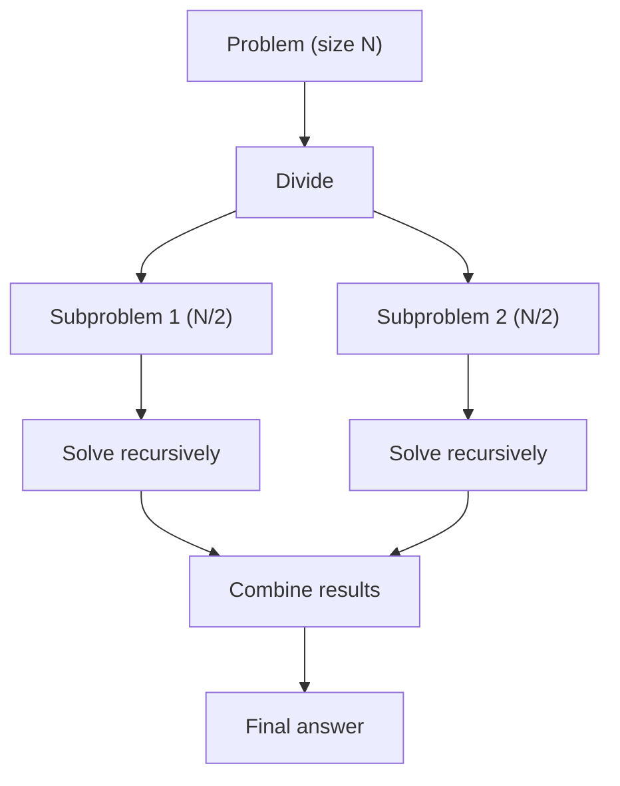
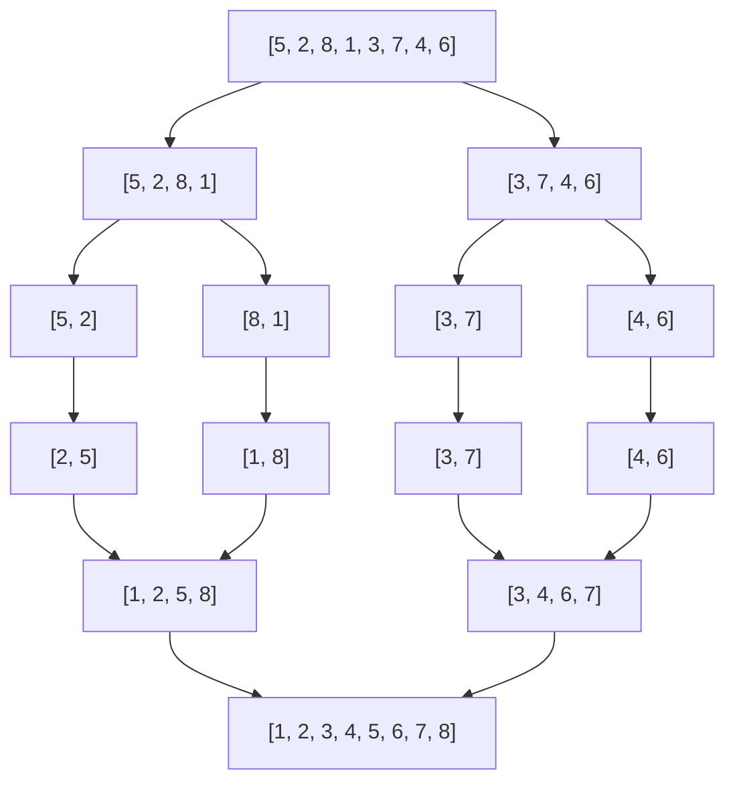
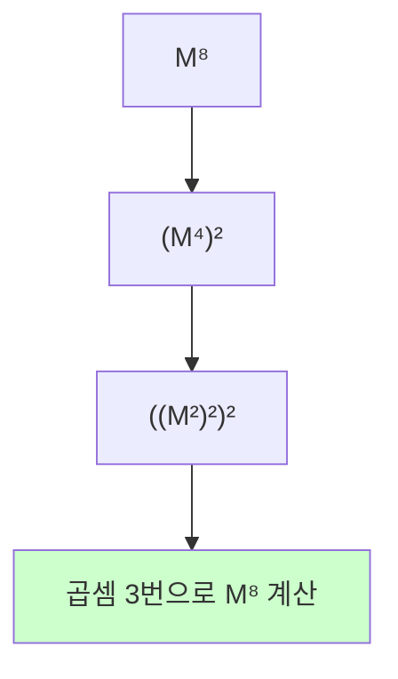
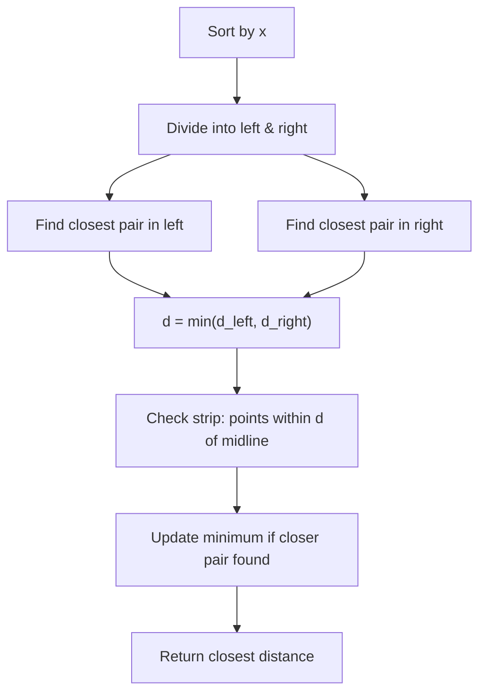

# Divide and Conquer

분할 정복(Divide and Conquer)은 **문제를 작은 부분으로 나누고, 각 부분을 재귀적으로 풀고, 결과를 합치는 알고리즘 패러다임**이다.

한 줄로 요약하면 다음과 같다.

```text
큰 문제를 쪼개고 → 재귀로 풀고 → 합친다
```

---

## 1. 언제 쓰는가

| 상황 | 예시 |
| --- | --- |
| 정렬 | 병합 정렬, 퀵 정렬 |
| 탐색 | 이분 탐색 |
| 거듭제곱 | 분할 정복 거듭제곱 |
| 행렬 거듭제곱 | 피보나치 O(log N) |
| 가장 가까운 두 점 | Closest Pair |
| 구간 문제 | 병합 정렬 기반 Inversion Count |

---

## 2. 핵심 아이디어

분할 정복의 세 단계:

```text
1. Divide   : 문제를 2개 이상의 작은 문제로 분할
2. Conquer  : 각 부분 문제를 재귀적으로 해결
3. Combine  : 부분 결과를 합쳐 전체 답을 구성
```



핵심 차이:
- **분할 정복 vs DP**: 분할 정복은 부분 문제가 겹치지 않고, DP는 겹친다
- **분할 정복 vs 그리디**: 분할 정복은 쪼갠 뒤 합치고, 그리디는 매 단계 최선을 선택

---

## 3. 병합 정렬 Merge Sort

분할 정복의 가장 대표적인 예시다.

핵심 아이디어:

```text
배열을 반으로 나누고 → 각각 정렬하고 → 합친다
```


```java
int[] temp;

void mergeSort(int[] arr, int left, int right) {
    if (left >= right) return;

    int mid = (left + right) / 2;
    mergeSort(arr, left, mid);
    mergeSort(arr, mid + 1, right);
    merge(arr, left, mid, right);
}

void merge(int[] arr, int left, int mid, int right) {
    int i = left, j = mid + 1, k = left;

    while (i <= mid && j <= right) {
        if (arr[i] <= arr[j]) {
            temp[k++] = arr[i++];
        } else {
            temp[k++] = arr[j++];
        }
    }
    while (i <= mid) temp[k++] = arr[i++];
    while (j <= right) temp[k++] = arr[j++];

    for (int idx = left; idx <= right; idx++) {
        arr[idx] = temp[idx];
    }
}
```

시간 복잡도: **O(N log N)** (항상)



---

## 4. Inversion Count (역순쌍 세기)

병합 정렬을 응용하면 **역순쌍의 개수**를 O(N log N)에 구할 수 있다.

역순쌍: `i < j`인데 `arr[i] > arr[j]`인 쌍

핵심 아이디어:

```text
merge 과정에서 왼쪽 부분의 원소가 오른쪽 부분의 원소보다 크면
그 왼쪽 원소 이후의 모든 원소도 역순쌍을 형성한다
```


```java
long inversionCount;
int[] temp;

void mergeSortCount(int[] arr, int left, int right) {
    if (left >= right) return;

    int mid = (left + right) / 2;
    mergeSortCount(arr, left, mid);
    mergeSortCount(arr, mid + 1, right);
    mergeCount(arr, left, mid, right);
}

void mergeCount(int[] arr, int left, int mid, int right) {
    int i = left, j = mid + 1, k = left;

    while (i <= mid && j <= right) {
        if (arr[i] <= arr[j]) {
            temp[k++] = arr[i++];
        } else {
            inversionCount += (mid - i + 1); // 핵심!
            temp[k++] = arr[j++];
        }
    }
    while (i <= mid) temp[k++] = arr[i++];
    while (j <= right) temp[k++] = arr[j++];

    for (int idx = left; idx <= right; idx++) {
        arr[idx] = temp[idx];
    }
}
```

`mid - i + 1` 이 핵심이다.
왼쪽 포인터 i 뒤의 모든 원소가 arr[j]보다 크기 때문이다.

```text
예: 왼쪽 [2, 5, 7]  오른쪽 [3, 4, 8]
    i=0                j=0

arr[i]=2 ≤ arr[j]=3 → 그대로, i++
arr[i]=5 > arr[j]=3 → 역순쌍! count += (mid-i+1) = 2
  (5와 3, 7과 3이 모두 역순쌍)
  ↑ i 뒤의 5, 7은 모두 3보다 크므로 한꺼번에 셈
```

---

## 5. 퀵 정렬의 아이디어 Quick Select

퀵 정렬 자체는 `Arrays.sort()`가 해주지만,
**K번째 원소를 O(N) 평균에 찾는 Quick Select**는 알아둘 만하다.

핵심 아이디어:

```text
피벗을 기준으로 파티션하면
피벗의 최종 위치를 알 수 있다
→ K번째가 피벗 왼쪽이면 왼쪽만 재귀
→ K번째가 피벗 오른쪽이면 오른쪽만 재귀
→ 피벗이 K번째면 바로 반환
```


```java
int quickSelect(int[] arr, int left, int right, int k) {
    if (left == right) return arr[left];

    int pivotIdx = partition(arr, left, right);

    if (k == pivotIdx) return arr[k];
    else if (k < pivotIdx) return quickSelect(arr, left, pivotIdx - 1, k);
    else return quickSelect(arr, pivotIdx + 1, right, k);
}

int partition(int[] arr, int left, int right) {
    int pivot = arr[right];
    int i = left;

    for (int j = left; j < right; j++) {
        if (arr[j] <= pivot) {
            swap(arr, i, j);
            i++;
        }
    }
    swap(arr, i, right);
    return i;
}
```

시간 복잡도:
- 평균: **O(N)**
- 최악: O(N²) (피벗이 항상 최솟값/최댓값)

```text
Partition 과정 (pivot = arr[right] = 4):

[7, 2, 1, 8, 6, 3, 5, 4]
 i                    pivot
 j→

j=0: 7>4  → skip
j=1: 2≤4  → swap(arr[0],arr[1]) → [2, 7, 1, 8, 6, 3, 5, 4], i=1
j=2: 1≤4  → swap(arr[1],arr[2]) → [2, 1, 7, 8, 6, 3, 5, 4], i=2
j=3: 8>4  → skip
j=4: 6>4  → skip
j=5: 3≤4  → swap(arr[2],arr[5]) → [2, 1, 3, 8, 6, 7, 5, 4], i=3
j=6: 5>4  → skip
swap(arr[3], pivot)             → [2, 1, 3, 4, 6, 7, 5, 8]
                                         ↑ pivot은 최종 위치 3
```

---

## 6. 분할 정복 거듭제곱

$a^n$을 O(log N)에 계산한다.

```text
a^n = (a^(n/2))² × a^(n%2)
```

```java
long power(long base, long exp, long mod) {
    long result = 1;
    base %= mod;
    while (exp > 0) {
        if ((exp & 1) == 1) result = result * base % mod;
        base = base * base % mod;
        exp >>= 1;
    }
    return result;
}
```

---

## 7. 행렬 거듭제곱

분할 정복 거듭제곱을 행렬에 적용하면
피보나치 수를 **O(log N)**에 구할 수 있다.

핵심 아이디어:

$$\begin{pmatrix} F_{n+1} \\ F_n \end{pmatrix} = \begin{pmatrix} 1 & 1 \\ 1 & 0 \end{pmatrix}^n \begin{pmatrix} 1 \\ 0 \end{pmatrix}$$


```java
static final long MOD = 1_000_000_007;

long[][] multiply(long[][] A, long[][] B) {
    int n = A.length;
    long[][] C = new long[n][n];
    for (int i = 0; i < n; i++)
        for (int j = 0; j < n; j++)
            for (int k = 0; k < n; k++)
                C[i][j] = (C[i][j] + A[i][k] * B[k][j]) % MOD;
    return C;
}

long[][] matPow(long[][] M, long exp) {
    int n = M.length;
    long[][] result = new long[n][n];
    for (int i = 0; i < n; i++) result[i][i] = 1; // 단위 행렬

    while (exp > 0) {
        if ((exp & 1) == 1) result = multiply(result, M);
        M = multiply(M, M);
        exp >>= 1;
    }
    return result;
}

// 피보나치 F(n) 구하기
long fibonacci(long n) {
    if (n <= 1) return n;
    long[][] M = { {1, 1}, {1, 0} };
    long[][] result = matPow(M, n - 1);
    return result[0][0];
}
```

이 기법은 다음과 같은 선형 점화식에도 적용할 수 있다.

```text
f(n) = a·f(n-1) + b·f(n-2) + ...
→ 행렬로 변환 → O(log N) 계산
```



```text
일반 방법: M을 8번 곱함 → 곱셈 7회
분할 정복: M → M² → M⁴ → M⁸ → 곱셈 3회
N=10⁹일 때 곱셈 30회로 완료
```

---

## 8. 가장 가까운 두 점 Closest Pair

2차원 평면에서 가장 가까운 두 점을 O(N log N)에 찾는 문제다.

핵심 아이디어:

```text
1. x좌표 기준 정렬
2. 배열을 반으로 나누어 각각 최소 거리 구함
3. 중앙 선 근처만 추가 확인 (strip)
```



---

## 9. 분할 정복의 시간 복잡도 분석

마스터 정리(Master Theorem)로 분석한다.

$T(N) = a \cdot T(N/b) + O(N^c)$

| 조건 | 결과 |
| --- | --- |
| $\log_b a < c$ | $O(N^c)$ |
| $\log_b a = c$ | $O(N^c \log N)$ |
| $\log_b a > c$ | $O(N^{\log_b a})$ |

예시:
- 병합 정렬: $T(N) = 2T(N/2) + O(N)$ → $a=2, b=2, c=1$ → $\log_2 2 = 1 = c$ → **O(N log N)**
- 이분 탐색: $T(N) = T(N/2) + O(1)$ → $a=1, b=2, c=0$ → $\log_2 1 = 0 = c$ → **O(log N)**
- 카라츠바 곱셈: $T(N) = 3T(N/2) + O(N)$ → $a=3, b=2, c=1$ → $\log_2 3 ≈ 1.58 > 1$ → **O(N^{1.58})**

---

## 10. DP와의 차이

| 분할 정복 | DP |
| --- | --- |
| 부분 문제가 독립적 | 부분 문제가 겹침 (중복) |
| 메모이제이션 불필요 | 메모이제이션 필수 |
| 하향식 재귀 | 상향식 또는 하향식 |
| 예: 병합 정렬 | 예: 피보나치 |

분할 정복에서 부분 문제가 겹치면 그건 DP로 풀어야 한다.

---

## 11. 자주 하는 실수

### 1) 기저 조건을 안 세움

```java
if (left >= right) return; // 반드시 필요
```

이걸 안 하면 무한 재귀 → 스택 오버플로우.

### 2) 병합 시 임시 배열 할당을 매번 함

`temp` 배열을 전역으로 한 번만 만들자. 매번 `new`하면 느리다.

### 3) 행렬 거듭제곱에서 단위 행렬 초기화를 빠뜨림

```java
for (int i = 0; i < n; i++) result[i][i] = 1;
```

### 4) Quick Select에서 피벗 선택이 최악인 경우

정렬된 배열에서 마지막 원소를 피벗으로 쓰면 O(N²)이다.
랜덤 피벗을 쓰면 평균 O(N)을 보장한다.

---

## 12. 시험장용 최소 암기 버전

```text
병합 정렬:
mergeSort(left, mid) + mergeSort(mid+1, right) + merge

Inversion Count:
merge에서 arr[i] > arr[j]이면 count += (mid - i + 1)

분할 정복 거듭제곱:
while (exp > 0) { if (odd) result *= base; base *= base; exp >>= 1; }

행렬 거듭제곱:
matPow(M, exp) → 피보나치 O(log N)

Quick Select:
partition → 피벗 위치와 K 비교 → 한쪽만 재귀
```

---

## 13. 최종 요약

분할 정복은 다음 문장으로 정리할 수 있다.

```text
문제를 독립적인 부분으로 나누고
재귀적으로 풀고
결과를 합치는 패러다임
```

문제를 보면 이 질문을 하면 된다.

```text
"이 문제를 반으로 나누면
각 부분을 풀고 합칠 수 있는가?"
→ 그렇다면 분할 정복이다
```
