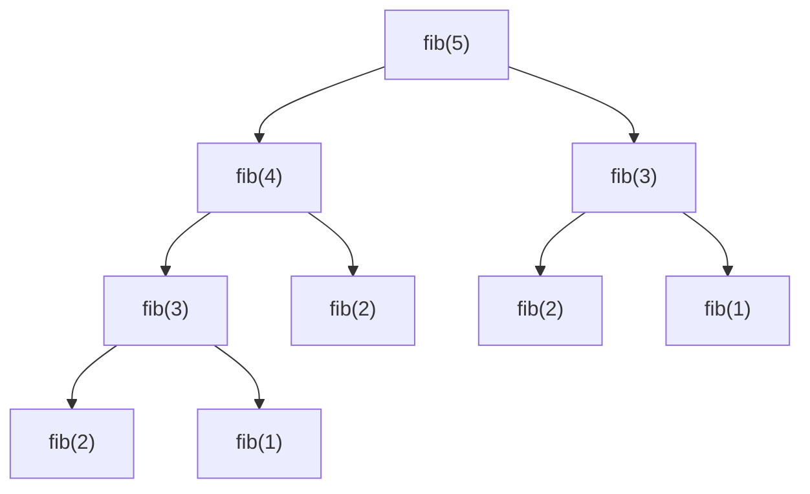
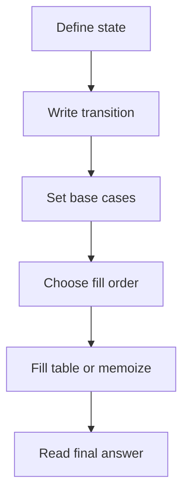

# Dynamic Programming

동적 계획법(Dynamic Programming, DP)은 **큰 문제를 작은 문제로 나누고, 같은 계산을 반복하지 않도록 저장하면서 푸는 기법**이다.

한 줄로 요약하면 다음과 같다.

```text
작은 문제의 답을 저장해 두고
그 답으로 큰 문제를 만든다
```

---

## 1. DP는 언제 쓰는가

문제에서 아래 느낌이 나면 DP를 의심하면 된다.

- 경우의 수 최댓값 / 최솟값
- i번째까지 봤을 때의 최적해
- 선택 / 비선택
- 이전 상태에 따라 현재 답이 결정됨
- 같은 부분 문제가 반복됨
- 완전탐색은 되지만 너무 느림

대표 예시:

- 피보나치 수열
- 계단 오르기
- 배낭 문제
- LIS, LCS
- 문자열 편집 거리
- 트리 DP
- 비트마스크 DP

---

## 2. DP의 본질

DP의 핵심은 두 가지다.

### 1) 부분 문제 중복 Overlapping Subproblems

같은 작은 문제를 여러 번 계산하게 된다.

예:

```text
f(5)를 구할 때 f(4), f(3)이 필요하고
f(4)를 구할 때 또 f(3), f(2)가 필요하다
```

즉 `f(3)` 같은 계산이 반복된다.

### 2) 최적 부분 구조 Optimal Substructure

큰 문제의 최적해가 작은 문제의 최적해로부터 만들어진다.

예:

```text
i번째까지의 최댓값은
(i-1)번째까지의 최댓값을 바탕으로 만든다
```

이 두 조건이 잘 맞으면 DP가 강력하다.

---

## 3. 왜 DP가 필요한가

완전탐색으로 모든 경우를 보려면 지수 시간이 걸리는 문제들이 많다.

하지만 작은 문제의 답을 저장하면,
같은 계산을 다시 하지 않아도 된다.

예를 들어 피보나치를 단순 재귀로 풀면 매우 느리다.

```java
int fib(int n) {
    if (n <= 1) return n;
    return fib(n - 1) + fib(n - 2);
}
```

이 방식은 `fib(3)`, `fib(2)` 등을 계속 다시 계산한다.



위 그림을 보면 `fib(3)`이 두 번, `fib(2)`가 세 번 호출되는 것이 보인다.
`n`이 커지면 이런 중복 호출이 기하급수적으로 늘어난다.

반면 DP로 저장하면 각 값은 한 번만 계산한다.

---

## 4. DP를 푸는 사고 순서

DP 문제를 풀 때는 아래 순서가 가장 중요하다.

```text
1. dp[state]가 무엇을 의미하는가?
2. 점화식은 무엇인가?
3. 초기값은 무엇인가?
4. 어떤 순서로 계산해야 하는가?
5. 최종 답은 어디에 있는가?
```

이 다섯 개가 정리되면 구현은 대부분 자연스럽게 따라온다.



DP는 결국 이 순서대로 정리하는 작업이다. 코드보다 먼저 이 흐름이 머릿속에서 정리되어야 점화식이 흔들리지 않는다.

---

## 5. 상태 정의가 가장 중요하다

DP에서 가장 어려운 것은 코드가 아니라 **상태 정의**다.

예를 들어 계단 오르기 문제라면:

```text
dp[i] = i번째 계단까지 왔을 때의 최대 점수
```

로 정의할 수 있다.

배낭 문제라면:

```text
dp[i][w] = 앞에서 i개 물건만 고려했을 때
           무게 한도 w에서 얻을 수 있는 최대 가치
```

이처럼 상태는 다음을 담아야 한다.

- 지금 어디까지 왔는가
- 무엇을 알고 있는가
- 무엇이 답을 결정하는가

상태 정의가 잘못되면 점화식도 꼬인다.

---

## 6. 점화식이란 무엇인가

점화식은 현재 상태를 더 작은 상태들로 표현한 식이다.

예:

```text
dp[i] = max(dp[i - 1], dp[i - 2] + value[i])
```

이 식은 현재 답이 이전 답들로부터 만들어진다는 뜻이다.

DP의 본질은 사실상 이 한 문장이다.

```text
현재 답을 이전에 계산한 답들로 만든다
```

---

## 7. 초기값 Base Case

점화식만 있다고 끝이 아니다.
초기값이 반드시 필요하다.

예를 들어 피보나치:

```text
dp[0] = 0
dp[1] = 1
```

배낭 문제:

```text
dp[0][w] = 0
```

초기값은 DP의 출발점이다.
이걸 잘못 두면 전체가 틀린다.

---

## 8. Top-Down과 Bottom-Up

DP 구현 방식은 크게 두 가지다.

### 1) Top-Down 메모이제이션

재귀로 문제를 풀되,
이미 계산한 값은 저장해 두고 다시 계산하지 않는다.

```java
int[] memo;

int fib(int n) {
    if (n <= 1) return n;
    if (memo[n] != -1) return memo[n];
    return memo[n] = fib(n - 1) + fib(n - 2);
}
```

장점:

- 점화식 그대로 쓰기 쉬움
- 문제 구조를 재귀적으로 보기 좋음

단점:

- 재귀 호출 오버헤드
- 스택 깊이 문제 가능

### 2) Bottom-Up 테이블 채우기

작은 상태부터 차례대로 채운다.

```java
int[] dp = new int[n + 1];
dp[0] = 0;
dp[1] = 1;

for (int i = 2; i <= n; i++) {
    dp[i] = dp[i - 1] + dp[i - 2];
}
```

장점:

- 반복문이라 안정적
- 계산 순서가 명확함

실전에서는 보통 Bottom-Up을 더 많이 쓴다.

---

## 9. 가장 기본 예제: 피보나치

정의:

```text
dp[i] = i번째 피보나치 수
```

점화식:

```text
dp[i] = dp[i - 1] + dp[i - 2]
```

초기값:

```text
dp[0] = 0
dp[1] = 1
```


```java
int fib(int n) {
    if (n <= 1) return n;

    int[] dp = new int[n + 1];
    dp[0] = 0;
    dp[1] = 1;

    for (int i = 2; i <= n; i++) {
        dp[i] = dp[i - 1] + dp[i - 2];
    }

    return dp[n];
}
```

이 문제는 DP의 가장 순수한 입문형이다.

---

## 10. 1차원 DP의 대표 패턴

다음과 같은 문제는 1차원 DP인 경우가 많다.

- i번째까지 왔을 때의 최댓값
- i번째까지 고려했을 때의 경우의 수
- 앞에서부터 차례로 결정하는 문제

대표 예시:

- 계단 오르기
- 집 털기 House Robber
- 동전 교환
- 연속합

즉 축이 하나면 보통 `dp[i]` 형태를 먼저 생각하면 된다.

---

## 11. 선택 / 비선택 패턴

DP에서 가장 많이 나오는 사고다.

예를 들어 어떤 원소를 고를지 말지 결정하는 문제라면,
현재 선택이 이전 상태에 어떤 영향을 주는지만 보면 된다.

예시:

```text
i번째 원소를 고른다 / 안 고른다
```

이 패턴은 다음 문제에 자주 나온다.

- 집 털기
- 계단 문제
- 배낭 문제
- 트리 독립 집합

---

## 12. 최대값 / 최소값 DP 예시: House Robber 형태

문제:

```text
인접한 두 칸을 동시에 선택할 수 없을 때 최대 합
```

정의:

```text
dp[i] = 0..i 구간에서 얻을 수 있는 최대 합
```

점화식:

```text
dp[i] = max(dp[i - 1], dp[i - 2] + arr[i])
```

왜냐하면:

- i를 안 고르면 `dp[i - 1]`
- i를 고르면 `i - 1`은 못 고르므로 `dp[i - 2] + arr[i]`


```java
int solve(int[] arr) {
    int n = arr.length;
    if (n == 1) return arr[0];

    int[] dp = new int[n];
    dp[0] = arr[0];
    dp[1] = Math.max(arr[0], arr[1]);

    for (int i = 2; i < n; i++) {
        dp[i] = Math.max(dp[i - 1], dp[i - 2] + arr[i]);
    }

    return dp[n - 1];
}
```

---

## 13. 경우의 수 DP 예시: 계단 오르기 수

문제:

```text
한 번에 1칸 또는 2칸 오를 수 있을 때
n칸에 도달하는 방법 수
```

정의:

```text
dp[i] = i칸에 도달하는 방법 수
```

점화식:

```text
dp[i] = dp[i - 1] + dp[i - 2]
```

이유:

- 마지막에 1칸 올라왔다면 `dp[i - 1]`
- 마지막에 2칸 올라왔다면 `dp[i - 2]`

즉 경우의 수 DP도 결국 상태 정의와 점화식의 문제다.

---

## 14. 2차원 DP는 언제 나오는가

상태를 하나의 축으로 표현하기 부족할 때 2차원 DP가 나온다.

예:

- 몇 번째 원소까지 봤는가
- 현재 용량은 얼마인가
- 문자열의 어디까지 비교했는가
- 좌표 `(i, j)`에 도달했는가

대표 예시:

- 배낭 문제
- LCS
- 격자 경로 문제

---

## 15. 배낭 문제 0/1 Knapsack

문제:

```text
각 물건은 한 번만 고를 수 있을 때
무게 제한 W 안에서 최대 가치를 구하라
```

정의:

```text
dp[i][w] = 앞의 i개 물건만 고려했을 때
           무게 한도 w에서 얻을 수 있는 최대 가치
```

점화식:

- i번째 물건을 안 고름
- i번째 물건을 고름

즉:

```text
dp[i][w] = max(
    dp[i - 1][w],
    dp[i - 1][w - weight[i]] + value[i]
)
```


```java
int knapsack(int[] weight, int[] value, int n, int W) {
    int[][] dp = new int[n + 1][W + 1];

    for (int i = 1; i <= n; i++) {
        for (int w = 0; w <= W; w++) {
            dp[i][w] = dp[i - 1][w];
            if (w >= weight[i]) {
                dp[i][w] = Math.max(dp[i][w], dp[i - 1][w - weight[i]] + value[i]);
            }
        }
    }

    return dp[n][W];
}
```

이 문제는 "선택/비선택" DP의 대표다.

### 손 계산 예시

```text
물건: (무게, 가치) = (2,3), (3,4), (4,5)   W=5
```

```text
       w= 0  1  2  3  4  5
i=0       0  0  0  0  0  0
i=1(2,3)  0  0  3  3  3  3
i=2(3,4)  0  0  3  4  4  7
i=3(4,5)  0  0  3  4  5  7
```

```text
dp[2][5]: 무게 2 + 무게 3 = 5 ≤ W → 가치 3+4 = 7 ✓
dp[3][5]: 무게 4 > 남은 용량이므로 물건3 못 넣음 → 7 유지
```

---

## 16. 문자열 DP 예시: LCS

LCS(Longest Common Subsequence)는 두 문자열의 최장 공통 부분 수열 길이를 구하는 문제다.

정의:

```text
dp[i][j] = 첫 문자열 앞 i개,
           둘째 문자열 앞 j개를 봤을 때의 LCS 길이
```

점화식:

- 문자가 같으면 대각선에서 +1
- 다르면 위/왼쪽 중 큰 값

```text
if a[i - 1] == b[j - 1]
    dp[i][j] = dp[i - 1][j - 1] + 1
else
    dp[i][j] = max(dp[i - 1][j], dp[i][j - 1])
```

이 문제는 "두 축을 동시에 따라가며 비교"하는 DP의 대표다.

### 손 계산 예시

```text
a = "ABCB",  b = "BDCB"
```

```text
       ""  B  D  C  B
  ""    0  0  0  0  0
   A    0  0  0  0  0
   B    0  1  1  1  1
   C    0  1  1  2  2
   B    0  1  1  2  3
```

```text
a[3]='B' == b[3]='B' → dp[3][3] = dp[2][2] + 1 = 0+1 = 1 (최초 매치)
a[2]='C' == b[2]='C' → dp[3][3] = dp[2][2] + 1 = 1+1 = 2
a[3]='B' == b[3]='B' → dp[4][4] = dp[3][3] + 1 = 2+1 = 3

LCS = "BCB", 길이 3
```

---

## 17. LIS 최장 증가 부분 수열

LIS는 수열 DP의 대표 문제다.

### `O(N^2)` DP 정의

```text
dp[i] = i에서 끝나는 LIS 길이
```

점화식:

```text
arr[j] < arr[i] 이면
 dp[i] = max(dp[i], dp[j] + 1)
```


```java
int lis(int[] arr) {
    int n = arr.length;
    int[] dp = new int[n];
    Arrays.fill(dp, 1);

    int answer = 1;

    for (int i = 0; i < n; i++) {
        for (int j = 0; j < i; j++) {
            if (arr[j] < arr[i]) {
                dp[i] = Math.max(dp[i], dp[j] + 1);
            }
        }
        answer = Math.max(answer, dp[i]);
    }

    return answer;
}
```

LIS는 나중에 `O(N log N)` 최적화도 배우게 되지만,
처음에는 DP 관점으로 이해하는 것이 중요하다.

> **O(N log N) 방식 요약**: `tails` 배열을 유지하면서, 새 원소가 `tails` 끝보다 크면 추가, 아니면 이진 탐색으로 대체할 위치를 찾는다. `tails.length`가 LIS 길이가 된다. N이 크면(10만 이상) 이 방식이 필수다.

---

## 18. 점화식이 안 보일 때 질문해야 할 것

DP가 막힐 때는 아래를 스스로 물어보면 된다.

1. 마지막 행동은 무엇이었는가?
2. 현재 상태를 결정하는 최소 정보는 무엇인가?
3. 현재를 만들 수 있는 직전 상태는 무엇인가?
4. 중복 계산이 생기는가?
5. 답을 표로 저장할 수 있는가?

특히 "마지막 행동"을 생각하는 것이 매우 강력하다.

예:

- 마지막에 물건을 골랐는가?
- 마지막 문자가 같은가?
- 마지막 계단을 어떻게 왔는가?

---

## 19. 메모리 최적화

어떤 DP는 전체 테이블이 필요 없다.
오직 직전 상태만 필요할 때는 공간을 줄일 수 있다.

예:

피보나치:

```java
int fib(int n) {
    if (n <= 1) return n;

    int a = 0;
    int b = 1;

    for (int i = 2; i <= n; i++) {
        int c = a + b;
        a = b;
        b = c;
    }

    return b;
}
```

즉 상태 전이가 오직 몇 개의 이전 값에만 의존하면,
배열 전체를 들고 있을 필요가 없다.

---

## 20. DP와 그리디의 차이

둘 다 최적화를 다루지만 다르다.

### 그리디

```text
지금 당장 가장 좋아 보이는 선택을 한다
```

### DP

```text
가능한 상태를 저장하면서
모든 필요한 선택을 체계적으로 비교한다
```

예를 들어 어떤 문제가:

- 현재 최선 선택이 미래에도 항상 최선이다 -> 그리디 가능
- 현재 선택이 미래에 미치는 영향이 복잡하다 -> DP 가능성 높음

즉 그리디가 안 보이면 DP를 생각하는 경우가 많다.

---

## 21. 트리 DP와 비트마스크 DP도 결국 DP다

DP는 배열 한 줄짜리 문제만 뜻하지 않는다.

### 트리 DP

```text
dp[node]
dp[node][state]
```

형태로 트리 위에서 진행한다.

### 비트마스크 DP

```text
dp[mask][last]
```

처럼 방문 집합과 마지막 위치를 상태로 둔다.

즉 DP의 본질은 자료 구조가 아니라:

```text
상태를 정의하고
그 상태를 이전 상태들로 전이하는 것
```

이다.

---

## 22. 자주 하는 실수

### 1) 상태 정의가 불완전함

현재 답을 결정하는 정보가 상태에 다 들어 있어야 한다.

### 2) 초기값을 잘못 둠

특히 `0`, `-INF`, `INF` 중 무엇으로 초기화해야 하는지 주의해야 한다.

### 3) 점화식은 맞는데 계산 순서를 틀림

Bottom-Up에서는 이전 상태가 먼저 계산되어 있어야 한다.

### 4) 최댓값 문제인데 기본값을 0으로 두면 안 되는 경우

음수 값이 있을 수 있으면 초기값 설계를 더 조심해야 한다.

### 5) 경우의 수 문제에서 int overflow

경우의 수는 매우 빨리 커진다.
`long`이나 `mod` 처리가 필요할 수 있다.

### 6) 완전탐색을 억지로 DP로 착각함

상태 수가 너무 크면 DP도 불가능하다.
즉 상태 수와 전이 수를 같이 계산해야 한다.

---

## 23. 실전 판단 기준

문제를 보고 아래 조건이 보이면 DP를 먼저 의심하면 된다.

- 작은 답으로 큰 답을 만들 수 있다
- 이전 선택의 결과를 저장하면 다시 쓸 수 있다
- 최댓값, 최솟값, 경우의 수를 묻는다
- 완전탐색은 되지만 중복 계산이 많다
- 배열, 문자열, 트리, 부분집합 상태가 차례로 진행된다

그리고 항상 다음을 적어 보면 된다.

```text
dp[...] = 무엇인가?
```

이 한 줄이 잡히면 절반은 끝난다.

---

## 24. 시험장용 최소 암기 버전

```text
DP:
작은 문제 답을 저장해서 큰 문제 만들기

순서:
1. 상태 정의
2. 점화식
3. 초기값
4. 계산 순서
5. 최종 답 위치

자주 나오는 형태:
dp[i]
dp[i][j]
dp[node]
dp[mask]

대표 패턴:
선택 / 비선택
앞에서부터 진행
문자열 두 축 비교
서브트리 합치기
```

---

## 25. 최종 요약

DP는 다음 문장으로 정리할 수 있다.

```text
중복되는 작은 문제의 답을 저장해 두고
그 답들로 큰 문제를 만드는 기법
```

핵심만 다시 압축하면:

- DP의 본질은 상태 정의와 점화식이다
- 초기값과 계산 순서까지 맞아야 한다
- 1차원, 2차원, 트리, 비트마스크 등 형태는 다양하다
- 최댓값, 최솟값, 경우의 수 문제에서 특히 자주 나온다
- 문제를 보면 먼저 `dp[...] = 무엇인가`를 적어 본다

DP 문제를 풀 때는 항상 이 질문을 하면 된다.

```text
현재 답을 결정하는 최소 정보는 무엇이고,
그 정보를 이전 상태의 답으로 만들 수 있는가?
```

이 질문의 답이 예라면 DP일 가능성이 높다.
