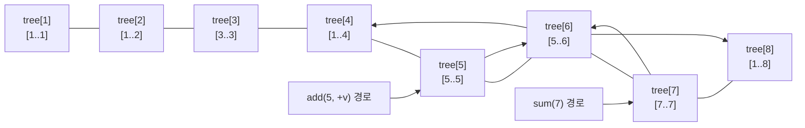

# Fenwick Tree

펜윅 트리(Fenwick Tree, BIT)는 **배열의 prefix sum과 점 업데이트를 빠르게 처리하는 자료구조**다.

한 줄로 요약하면 다음과 같다.

```text
누적합 전용으로 단순화한 세그먼트 트리 같은 구조
```

세그먼트 트리보다 구현이 짧고,
합 관련 문제에서 매우 자주 쓰인다.

---

## 1. 언제 쓰는가

아래 조합이면 펜윅 트리를 떠올릴 수 있다.

- 점 업데이트 + 구간 합
- prefix sum이 자주 필요함
- 구현은 단순한 편이 좋음
- 세그먼트 트리까지는 과함

즉:

```text
합 전용 업데이트 / 쿼리 문제
```

에 특히 잘 맞는다.

---

## 2. 핵심 아이디어

펜윅 트리는 `tree[i]`가 어떤 구간의 합을 들고 있게 만든다.
이 구간 크기는 `lowbit(i)`로 결정된다.

```java
lowbit(i) = i & -i
```

즉 인덱스의 마지막 1비트가 자기 담당 구간 크기를 뜻한다.



이 그림은 일반적인 부모-자식 트리를 그린 것이 아니라,
펜윅 트리에서 각 `tree[i]`가 담당하는 **블록**과
`query` / `update`가 실제로 밟는 인덱스 경로를 보여 준다.

- 합을 구할 때는 인덱스에서 lowbit을 빼며 왼쪽으로 이동하고
- 업데이트할 때는 인덱스에 lowbit을 더하며 오른쪽으로 이동한다

예를 들어 `sum(7)`을 구하면:

```text
tree[7] + tree[6] + tree[4] = [7..7] + [5..6] + [1..4]
```

처럼 블록을 합쳐서 `[1..7]`을 만든다.

---

## 3. lowbit가 왜 중요한가

예를 들어:

- `4 (100)`의 lowbit는 `4`
- `6 (110)`의 lowbit는 `2`
- `7 (111)`의 lowbit는 `1`

즉 각 인덱스가 담당하는 구간 길이가 다르다.

예를 들어 1-based에서:

- `tree[4]`는 길이 4 구간 합
- `tree[6]`는 길이 2 구간 합
- `tree[7]`는 길이 1 구간 합

같은 느낌으로 이해하면 된다.

---

## 4. 작은 예시로 보기

배열이 1-based라고 하자.

```text
idx:   1 2 3 4 5 6 7 8
value: 5 2 7 3 6 1 4 8
```

그러면 일부 `tree[i]`는 다음처럼 해석할 수 있다.

- `tree[1]` -> `[1..1]`
- `tree[2]` -> `[1..2]`
- `tree[3]` -> `[3..3]`
- `tree[4]` -> `[1..4]`
- `tree[6]` -> `[5..6]`
- `tree[8]` -> `[1..8]`

즉 펜윅 트리는 구간이 규칙적으로 겹쳐 저장되는 구조다.

여기서 중요한 점은,
각 `tree[i]`가 서로 다른 길이의 구간을 저장하지만
그 구간들이 prefix sum을 덮는 데 딱 맞게 설계되어 있다는 것이다.

즉 펜윅 트리는 "임의의 prefix를 몇 개의 블록 합으로 표현하는 구조"라고 이해하면 좋다.

---

## 5. prefix sum은 어떻게 구하나

`sum(idx)`를 구할 때는:

- `tree[idx]`를 더하고
- `idx -= lowbit(idx)`로 이동
- 0이 될 때까지 반복

즉 큰 구간부터 필요한 만큼만 합친다.

예를 들어 `sum(6)`이면:

- `tree[6]` 사용
- `tree[4]` 사용
- 종료

즉 `[1..6]`을 적은 수의 블록으로 덮는 방식이다.

이 과정을 구간으로 쓰면:

```text
[1..6] = [5..6] + [1..4]
```

이다.

즉 펜윅 쿼리는 "큰 블록부터 필요한 만큼만 가져오는 과정"이다.

---

## 6. 업데이트는 어떻게 되나

`add(idx, val)`을 할 때는:

- `tree[idx] += val`
- `idx += lowbit(idx)`로 이동
- 범위를 넘어갈 때까지 반복

즉 해당 원소를 포함하는 상위 구간들만 갱신한다.

예를 들어 `idx = 5`면:

- `tree[5]`
- `tree[6]`
- `tree[8]`

순으로 반영된다.

왜 이 셋만 바뀌는가?

이 노드들이 모두 5번 인덱스를 포함하는 구간을 대표하기 때문이다.

즉 업데이트는:

```text
해당 원소를 포함하는 상위 블록들만 갱신한다
```

고 이해하면 된다.

### 왜 query와 update가 모두 `O(log N)`인가

한 번 이동할 때마다 `idx`의 마지막 1비트가 제거되거나,
그 비트만큼 더 큰 구간으로 점프한다.

예를 들어 `idx = 13 (1101)`이면:

- query 경로: `13 -> 12 -> 8 -> 0`
- update 경로: `13 -> 14 -> 16 -> ...`

처럼 많아야 이진수 자릿수만큼만 움직인다.

### query와 update 경로 예시

```text
query(7): tree[7] + tree[6] + tree[4]  (7→6→4, lowbit을 빼며 이동)
update(5, +3): tree[5], tree[6], tree[8] 갱신  (5→6→8, lowbit을 더하며 이동)
```

즉 펜윅 트리의 핵심은:

```text
모든 prefix를 몇 개 안 되는 블록 합으로 분해할 수 있게 만든다
```

는 데 있다.

### 초기 배열에서 트리를 만드는 가장 쉬운 방법

처음 배열 `arr`가 이미 있다면,
가장 단순한 build는 각 원소를 그대로 `add` 하는 것이다.

```java
Fenwick fenwick = new Fenwick(n);
for (int i = 1; i <= n; i++) {
    fenwick.add(i, arr[i]);
}
```

이 방식은 `O(N log N)`이지만 구현이 직관적이고,
코딩테스트에서는 대부분 충분하다.

---

## 7. 전체 구현

```java
static class Fenwick {
    long[] tree;
    int n;

    Fenwick(int n) {
        this.n = n;
        tree = new long[n + 1];
    }

    void add(int idx, long val) {
        while (idx <= n) {
            tree[idx] += val;
            idx += idx & -idx;
        }
    }

    long sum(int idx) {
        long ret = 0;
        while (idx > 0) {
            ret += tree[idx];
            idx -= idx & -idx;
        }
        return ret;
    }

    long rangeSum(int left, int right) {
        return sum(right) - sum(left - 1);
    }
}
```

---

## 8. 왜 `rangeSum(left, right)`가 가능한가

펜윅 트리는 기본적으로 prefix sum만 빠르게 구한다.
하지만 구간 합은:

```text
[1..right] - [1..left-1]
```

로 바꿀 수 있으므로,
결국 prefix sum 두 번으로 처리 가능하다.

즉:

```java
sum(right) - sum(left - 1)
```

이면 된다.

이 때문에 펜윅 트리는 prefix sum 전용 구조처럼 보이지만,
실제로는 구간 합까지 자연스럽게 처리할 수 있다.

추가로 "점 업데이트 + 구간 합"뿐 아니라
"구간 업데이트 + 점 조회"도 차분 배열 관점과 결합하면 구현할 수 있다.
다만 기본형은 가장 먼저 익히는 것이 중요하므로,
코딩테스트에서는 보통 지금 문서의 형태를 기준으로 시작하면 충분하다.

---

## 9. 세그먼트 트리와 비교

| 항목 | Fenwick | Segment Tree |
|---|---|---|
| 구현 | 더 짧음 | 더 김 |
| 지원 연산 | 주로 합 | 더 다양 |
| 이해 난이도 | 비교적 쉬움 | 더 일반적 |

즉:

- 점 업데이트 + 합 -> Fenwick이 편함
- min/max, 더 복잡한 쿼리 -> Segment Tree

---

## 10. 자주 하는 실수

### 1) 1-based 인덱스를 안 맞춤

펜윅 트리는 보통 1-based로 구현한다.

### 2) `idx & -idx` 의미를 못 외움

이 연산이 핵심이다.

### 3) 업데이트와 쿼리 방향을 반대로 구현

- 업데이트는 `+= lowbit`
- 쿼리는 `-= lowbit`

이 둘이 정확히 반대다.

### 4) 합이 큰데 `int` 사용

합 문제는 `long`이 안전하다.

---

## 11. 시험장용 최소 암기 버전

```text
Fenwick Tree:
prefix sum + point update

핵심:
lowbit = x & -x

update:
idx += lowbit(idx)

query:
idx -= lowbit(idx)

range sum:
sum(r) - sum(l - 1)
```

---

## 12. 최종 요약

펜윅 트리는 다음 문장으로 정리할 수 있다.

```text
prefix sum과 점 업데이트를 로그 시간에 처리하는 간단한 트리 구조
```

문제를 보면 먼저 이 질문을 하면 된다.

```text
구간 합이 필요하지만,
사실상 prefix sum 중심 문제인가?
```

그렇다면 펜윅 트리가 매우 좋은 선택이 될 수 있다.
