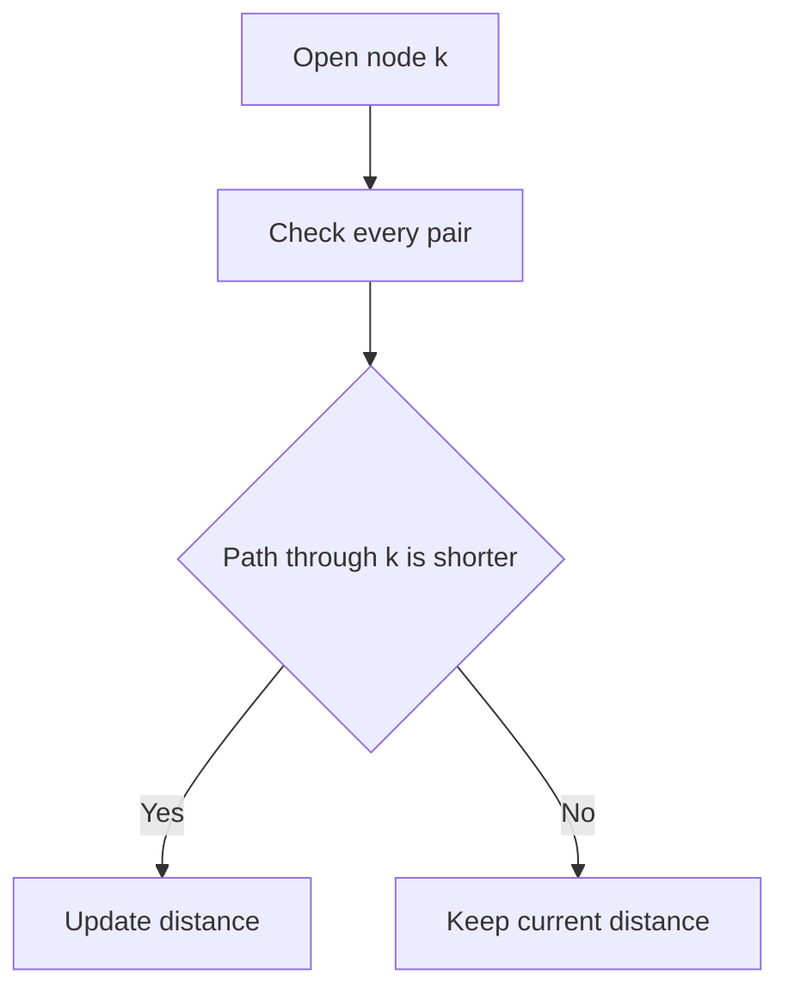
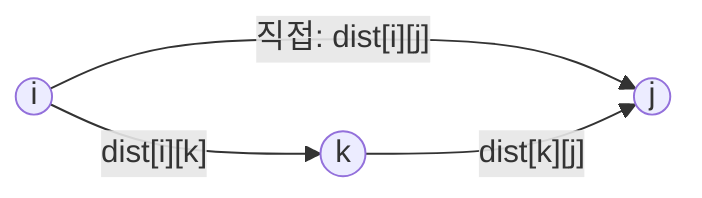

# Floyd-Warshall

Floyd-Warshall 알고리즘은 그래프에서 **모든 정점 쌍 사이의 최단 거리**를 구하는 대표적인 알고리즘이다.

한 줄로 요약하면 다음과 같다.

```text
모든 정점을 경유지로 하나씩 허용하면서
모든 정점 쌍의 최단 거리를 DP 방식으로 갱신하는 알고리즘
```

---

## 1. 언제 쓰는가

문제에서 아래 표현이 보이면 Floyd-Warshall 가능성을 먼저 생각하면 된다.

- 모든 정점 사이의 거리
- 모든 도시 쌍의 최소 비용
- 모든 학생 쌍의 키 비교 가능 여부
- A에서 B로 갈 수 있는가를 모든 쌍에 대해 판단
- 정점 수는 작고, 모든 쌍 정보가 필요함

대표적인 비교는 아래와 같다.

| 알고리즘 | 해결 대상 |
|---|---|
| BFS | 가중치 없는 그래프에서 한 시작점 기준 최단 거리 |
| Dijkstra | 한 시작점에서 모든 정점까지 최단 거리 |
| Bellman-Ford | 음수 간선이 있을 수 있는 한 시작점 최단 거리 |
| Floyd-Warshall | 모든 정점 쌍 사이 최단 거리 |

즉,

- Dijkstra는 `Single Source Shortest Path`
- Floyd-Warshall은 `All Pairs Shortest Path`

문제를 읽었을 때 "시작점이 하나가 아니라 모든 정점이다"라는 느낌이 들면 거의 Floyd-Warshall 쪽이다.

---

## 2. 핵심 아이디어

두 정점 `i`, `j` 사이의 최단 거리를 구한다고 하자.

처음에는 보통 이렇게 생각한다.

- `i -> j`로 직접 가는 비용

하지만 실제 최단 경로는 중간 정점을 거칠 수 있다.

- `i -> k -> j`

그리고 어떤 시점에는 단 하나의 정점만 거치는 것이 아니라 여러 정점을 거칠 수도 있다.

그래서 Floyd-Warshall은 생각을 이렇게 바꾼다.

```text
"중간 정점으로 1번까지만 허용했을 때의 최단 거리"
"중간 정점으로 1, 2번까지만 허용했을 때의 최단 거리"
"중간 정점으로 1, 2, 3번까지만 허용했을 때의 최단 거리"
...
"중간 정점으로 1..N을 모두 허용했을 때의 최단 거리"
```

즉, **경유 가능한 정점의 집합을 조금씩 늘려 가면서** 답을 만든다.

이 점이 Floyd-Warshall의 본질이다.



이 다이어그램처럼 Floyd-Warshall은 "경유지 `k`를 하나 열고, 모든 `(i, j)` 쌍을 검사해서 더 짧아지면 갱신"하는 과정을 반복한다.

---

## 3. DP 관점에서의 정의

개념적으로는 다음 상태를 생각하면 된다.

```text
dp[k][i][j] =
    중간 정점으로 1..k까지만 사용할 수 있을 때
    i에서 j까지 가는 최단 거리
```

그러면 `k`번째 단계에서 가능한 선택은 딱 두 가지다.

1. `k`를 경유하지 않는다.
2. `k`를 경유한다.

그래서 점화식은 다음과 같다.

```text
dp[k][i][j] =
    min(
        dp[k-1][i][j],
        dp[k-1][i][k] + dp[k-1][k][j]
    )
```

이 식이 의미하는 바는 매우 직관적이다.

- 기존에 알고 있던 `i -> j` 최단 거리
- `k`를 새로 경유지로 허용했을 때의 `i -> k -> j` 거리

둘 중 더 짧은 것을 고르는 것이다.

### 핵심 판단 구조



각 `(i, j)` 쌍에 대해 **직접 가는 것** vs **k를 경유하는 것** 중 더 짧은 경로를 선택한다.

실제 구현에서는 `dp[k]` 전체를 따로 들고 있을 필요가 없다.
현재 단계는 이전 단계 정보만 필요하므로 `dist[i][j]` 하나의 2차원 배열로 덮어쓰며 처리할 수 있다.

---

## 4. 핵심 점화식

실전에서 외워야 하는 식은 이것 하나다.

```java
dist[i][j] = Math.min(dist[i][j], dist[i][k] + dist[k][j]);
```

의미:

- 현재 알고 있는 `i -> j` 최단 거리보다
- `i -> k -> j`가 더 짧으면 갱신

이 연산을 모든 `k`, 모든 `i`, 모든 `j`에 대해 반복하면 된다.

---

## 5. 왜 `k`가 가장 바깥 루프인가

Floyd-Warshall에서 루프 순서는 매우 중요하다.

정답 구조는 반드시 아래처럼 간다.

```java
for (int k = 1; k <= n; k++) {
    for (int i = 1; i <= n; i++) {
        for (int j = 1; j <= n; j++) {
            ...
        }
    }
}
```

이유는 `k`번째 반복이 가지는 의미 때문이다.

```text
k = 1  -> 중간 정점으로 1만 허용
k = 2  -> 중간 정점으로 1, 2만 허용
k = 3  -> 중간 정점으로 1, 2, 3만 허용
...
```

즉 `k`는 "이번 단계에서 새로 허용하는 경유지" 역할을 한다.

만약 루프 순서를 바꾸면,

- 어떤 값은 아직 `k`가 허용되지 않은 상태여야 하는데 이미 다른 갱신이 섞여 들어가고
- "1..k까지만 경유 가능"이라는 단계적 의미가 깨진다.

그래서 Floyd-Warshall은 `k -> i -> j` 순서를 사실상 규칙처럼 지켜야 한다.

---

## 6. 초기화

Floyd-Warshall은 보통 인접 행렬 형태의 `dist` 배열을 사용한다.

```java
dist[i][j] = 현재까지 알고 있는 i에서 j까지의 최단 거리
```

초기값은 다음처럼 잡는다.

| 경우 | 초기값 |
|---|---|
| `i == j` | `0` |
| 간선이 존재 | 그 간선의 가중치 |
| 간선이 없음 | `INF` |

예를 들면:

```text
    1    2    3
1 [ 0    4   INF ]
2 [ INF  0    2  ]
3 [ 1   INF   0  ]
```

```java
long INF = 1_000_000_000_000L;
long[][] dist = new long[n + 1][n + 1];

for (int i = 1; i <= n; i++) {
    Arrays.fill(dist[i], INF);
    dist[i][i] = 0;
}
```

간선 입력:

```java
dist[a][b] = Math.min(dist[a][b], cost);
```

여기서 `Math.min`을 쓰는 이유는 **같은 두 정점 사이에 여러 간선이 들어올 수 있기 때문**이다.

예:

- `1 -> 2` 비용 10
- `1 -> 2` 비용 3

이 경우 초기값부터 3으로 잡아야 한다.

무방향 그래프라면 양쪽 모두 갱신한다.

```java
dist[a][b] = Math.min(dist[a][b], cost);
dist[b][a] = Math.min(dist[b][a], cost);
```

---

## 7. `INF`를 잡을 때 주의할 점

Floyd-Warshall에서 가장 흔한 실수 중 하나가 `INF` 처리다.

예를 들어 `dist[i][k]`나 `dist[k][j]`가 도달 불가능이라면 둘을 더하면 안 된다.

왜냐하면:

- 의미적으로는 "갈 수 없는 경로 + 어떤 비용"이기 때문이고
- 구현적으로는 overflow 위험이 있기 때문이다.

그래서 아래 가드를 두는 것이 안전하다.

```java
if (dist[i][k] == INF || dist[k][j] == INF) continue;
dist[i][j] = Math.min(dist[i][j], dist[i][k] + dist[k][j]);
```

특히 `int`를 쓰면서 `INF = Integer.MAX_VALUE`처럼 잡아 두고 더해 버리면 overflow가 매우 쉽게 난다.

실전 팁:

- 거리 합이 커질 수 있으면 `long` 사용
- `INF`는 충분히 크되, 더해도 overflow가 나지 않을 정도로 설정

예:

```java
long INF = 1_000_000_000_000L;
```

---

## 8. 알고리즘 동작을 작은 예시로 이해하기

다음 방향 그래프를 보자.

```text
1 -> 2 (4)
1 -> 3 (15)
1 -> 4 (10)
2 -> 3 (3)
3 -> 4 (2)
```

초기 `dist`는 다음과 같다.

```text
      1    2    3    4
1 [   0    4   15   10 ]
2 [ INF    0    3  INF ]
3 [ INF  INF    0    2 ]
4 [ INF  INF  INF    0 ]
```

### `k = 1`

중간 정점으로 1만 허용한다.

- 다른 정점에서 1로 들어오는 길이 없으므로 거의 변화가 없다.

### `k = 2`

이제 정점 2를 경유지로 쓸 수 있다.

`1 -> 3`을 보자.

- 기존: 15
- `1 -> 2 -> 3`: `4 + 3 = 7`

따라서 갱신:

```text
dist[1][3] = 7
```

행렬은 이렇게 바뀐다.

```text
      1    2    3    4
1 [   0    4    7   10 ]
2 [ INF    0    3  INF ]
3 [ INF  INF    0    2 ]
4 [ INF  INF  INF    0 ]
```

### `k = 3`

이제 정점 3을 경유지로 허용한다.

`1 -> 4`를 보자.

- 기존: 10
- `1 -> 3 -> 4`: `7 + 2 = 9`

갱신:

```text
dist[1][4] = 9
```

또 `2 -> 4`도 갱신된다.

- 기존: INF
- `2 -> 3 -> 4`: `3 + 2 = 5`

갱신 후:

```text
      1    2    3    4
1 [   0    4    7    9 ]
2 [ INF    0    3    5 ]
3 [ INF  INF    0    2 ]
4 [ INF  INF  INF    0 ]
```

이 과정을 통해 "직접 연결보다 우회가 더 짧을 수 있다"는 점이 자연스럽게 반영된다.

---

## 9. 기본 구현

최단 거리만 필요할 때의 가장 기본적인 구현이다.

```java
import java.util.*;

public class Main {
    static final long INF = 1_000_000_000_000L;

    public static void main(String[] args) {
        int n = 5; // 정점 개수
        int m = 7; // 간선 개수

        long[][] dist = new long[n + 1][n + 1];

        // 초기화
        for (int i = 1; i <= n; i++) {
            Arrays.fill(dist[i], INF);
            dist[i][i] = 0;
        }

        // 예시 간선 입력
        int[][] edges = {
            {1, 2, 2},
            {1, 3, 6},
            {2, 3, 3},
            {2, 4, 1},
            {3, 5, 1},
            {4, 5, 2},
            {1, 5, 20}
        };

        for (int[] e : edges) {
            int a = e[0];
            int b = e[1];
            int cost = e[2];
            dist[a][b] = Math.min(dist[a][b], cost);
        }

        // Floyd-Warshall
        for (int k = 1; k <= n; k++) {
            for (int i = 1; i <= n; i++) {
                if (dist[i][k] == INF) continue;
                for (int j = 1; j <= n; j++) {
                    if (dist[k][j] == INF) continue;
                    dist[i][j] = Math.min(dist[i][j], dist[i][k] + dist[k][j]);
                }
            }
        }

        // 결과 출력 예시
        for (int i = 1; i <= n; i++) {
            for (int j = 1; j <= n; j++) {
                if (dist[i][j] == INF) {
                    System.out.print("INF ");
                } else {
                    System.out.print(dist[i][j] + " ");
                }
            }
            System.out.println();
        }
    }
}
```

---

## 10. 시간 복잡도와 메모리 복잡도

Floyd-Warshall의 복잡도는 다음과 같다.

- 시간 복잡도: `O(N^3)`
- 메모리 복잡도: `O(N^2)`

이 의미를 감각적으로 보면:

- 정점이 100개면 매우 가볍다.
- 정점이 200개면 실전에서 자주 나온다.
- 정점이 400개면 언어와 상수에 따라 가능하다.
- 정점이 1000개면 보통 너무 무겁다.

대략적인 판단 기준:

| 정점 수 | 체감 |
|---|---|
| `N <= 100` | 매우 안전 |
| `N <= 200` | 자주 사용 가능 |
| `N <= 400` | 문제와 언어에 따라 가능 |
| `N >= 1000` | 보통 비현실적 |

메모리는 `N x N` 배열이므로 생각보다 빨리 커진다.

예를 들어:

- `N = 500`
- `500 x 500 = 250000`

`long[][]` 하나만 놓고 보면 크게 무리는 없지만,
추가 배열(`next`, `reachable`)까지 쓰면 메모리를 더 고려해야 한다.

---

## 11. Dijkstra와 비교

모든 쌍 최단 거리를 구하는 방법은 꼭 Floyd-Warshall만 있는 것은 아니다.

### 방법 1. Dijkstra를 `N`번 수행

각 정점을 시작점으로 하여 Dijkstra를 한 번씩 돌린다.

장점:

- 희소 그래프에서 유리할 수 있다.
- `E log V` 기반이라 간선이 매우 적으면 효율적이다.

단점:

- 구현이 더 길어질 수 있다.
- 음수 간선을 다룰 수 없다.

### 방법 2. Floyd-Warshall 한 번 수행

장점:

- 구현이 단순하다.
- 모든 쌍 결과가 한 번에 나온다.
- 음수 간선도 처리 가능하다.

단점:

- `O(N^3)`이라 정점 수가 커지면 바로 부담된다.

비교 표:

| 상황 | 추천 |
|---|---|
| 시작점이 하나 | Dijkstra |
| 모든 쌍 필요 | Floyd-Warshall |
| 음수 간선 존재 | Floyd-Warshall 또는 Bellman-Ford 계열 |
| 정점 수 작음 | Floyd-Warshall |
| 간선 수가 매우 적음 | Dijkstra 여러 번 |

---

## 12. 음수 간선과 음수 사이클

Floyd-Warshall의 강점 중 하나는 **음수 간선을 허용한다는 점**이다.

즉, 간선 가중치가 음수여도 알고리즘 자체는 동작한다.

하지만 **음수 사이클**이 있으면 문제가 달라진다.

예:

```text
A -> B = 3
B -> C = -5
C -> A = 1
```

사이클 총합이 음수라면,

```text
A -> B -> C -> A
```

를 반복할수록 비용을 계속 줄일 수 있다.

이 경우 "최단 거리"라는 개념 자체가 무너진다.

### 음수 사이클 판별

Floyd-Warshall 수행 후 아래를 확인한다.

```java
if (dist[i][i] < 0) {
    // i를 포함하는 음수 사이클 존재
}
```

이유:

- 자기 자신으로 돌아오는 비용이 음수라는 뜻
- 즉, 음수 사이클을 이용해 비용을 계속 줄일 수 있다는 뜻

---

## 13. 경로 복원

기본 Floyd-Warshall은 **거리 값만** 구한다.

실제 이동 경로까지 복원하려면 `next` 배열을 함께 관리하면 된다.

### 아이디어

`next[i][j]`를 "i에서 j로 갈 때 첫 번째로 가야 할 정점"으로 정의한다.

그러면 경로를 한 칸씩 따라가며 전체 경로를 복원할 수 있다.

### 초기화

간선이 있을 때:

```java
next[a][b] = b;
```

자기 자신은 필요에 따라:

```java
next[i][i] = i;
```

### 갱신

`i -> k -> j` 경로가 더 좋다면,

```java
dist[i][j] = dist[i][k] + dist[k][j];
next[i][j] = next[i][k];
```

왜 `next[i][k]`를 넣는가?

- `i`에서 `j`로 가는 새 최단 경로의 첫 걸음은
- 결국 `i`에서 `k`로 가는 최단 경로의 첫 걸음과 같기 때문이다.

### 경로 복원

```java
import java.util.*;

public class Main {
    static final long INF = 1_000_000_000_000L;

    static List<Integer> getPath(int start, int end, int[][] next) {
        List<Integer> path = new ArrayList<>();
        if (next[start][end] == 0) return path; // 도달 불가

        int cur = start;
        path.add(cur);

        while (cur != end) {
            cur = next[cur][end];
            path.add(cur);
        }

        return path;
    }

    public static void main(String[] args) {
        int n = 4;
        long[][] dist = new long[n + 1][n + 1];
        int[][] next = new int[n + 1][n + 1];

        for (int i = 1; i <= n; i++) {
            Arrays.fill(dist[i], INF);
            dist[i][i] = 0;
        }

        int[][] edges = {
            {1, 2, 4},
            {2, 3, 3},
            {3, 4, 2},
            {1, 4, 20}
        };

        for (int[] e : edges) {
            int a = e[0];
            int b = e[1];
            int cost = e[2];

            if (cost < dist[a][b]) {
                dist[a][b] = cost;
                next[a][b] = b;
            }
        }

        for (int k = 1; k <= n; k++) {
            for (int i = 1; i <= n; i++) {
                if (dist[i][k] == INF) continue;
                for (int j = 1; j <= n; j++) {
                    if (dist[k][j] == INF) continue;

                    long newCost = dist[i][k] + dist[k][j];
                    if (newCost < dist[i][j]) {
                        dist[i][j] = newCost;
                        next[i][j] = next[i][k];
                    }
                }
            }
        }

        List<Integer> path = getPath(1, 4, next);
        System.out.println(path); // [1, 2, 3, 4]
    }
}
```

---

## 14. 경로 존재 여부 판별: Warshall 형태

Floyd-Warshall은 거리 문제뿐 아니라 **도달 가능 여부**를 구할 때도 자주 쓰인다.

이 경우 `dist` 대신 `reachable` 같은 boolean 배열을 사용하면 된다.

정의:

```java
reachable[i][j] = i에서 j로 갈 수 있는가
```

점화식:

```java
reachable[i][j] =
    reachable[i][j] || (reachable[i][k] && reachable[k][j]);
```

```java
boolean[][] reachable = new boolean[n + 1][n + 1];

// 간선 입력
reachable[a][b] = true;

for (int k = 1; k <= n; k++) {
    for (int i = 1; i <= n; i++) {
        for (int j = 1; j <= n; j++) {
            if (reachable[i][k] && reachable[k][j]) {
                reachable[i][j] = true;
            }
        }
    }
}
```

이 버전은 아래 문제에서 특히 유용하다.

- 순위 비교
- 선후 관계
- A가 B를 이길 수 있는가
- 선수 관계, 키 비교, 감염 가능 여부

대표 예시는 `BOJ 2458` 같은 유형이다.

---

## 15. 최소 사이클 문제에서 주의할 점

여기서 많이 헷갈리는 포인트가 있다.

### 잘못 외우기 쉬운 문장

```text
Floyd-Warshall 후 dist[i][i]의 최솟값이 최소 사이클이다
```

이 말은 **항상 맞지 않다**.

왜냐하면 보통 최단 거리 문제에서는 초기화할 때

```java
dist[i][i] = 0;
```

으로 놓기 때문이다.

이렇게 하면 일반적인 양수 사이클이 있어도 `dist[i][i]`는 계속 0으로 남는다.

즉,

- 최단 거리 문제의 기본 초기화에서는 `dist[i][i]`로 최소 사이클을 바로 구하면 안 된다.
- `dist[i][i] < 0`은 음수 사이클 판별에만 직접적으로 의미가 있다.

### 최소 사이클을 구하는 올바른 방법 1

Floyd-Warshall이 끝난 뒤,

```java
min(dist[i][j] + dist[j][i])   (i != j)
```

를 확인하는 방식이 자주 쓰인다.

즉 `i -> j`로 갔다가 `j -> i`로 돌아오는 비용을 본다.

### 최소 사이클을 구하는 올바른 방법 2

문제 목적이 "사이클 길이" 자체라면,

- 대각선을 `0`이 아니라 `INF`로 두고 시작하는 방식도 가능하다.
- 다만 이 경우는 "최단 거리 기본 구현"과 의미가 달라지므로 문제 의도를 분명히 이해하고 써야 한다.

이 부분은 실전에서 틀리기 쉬우므로 반드시 구분해야 한다.

---

## 16. 자주 나오는 응용 유형

### 1) 모든 쌍 최단 거리

가장 전형적인 문제다.

대표 예시:

```text
BOJ 11404
```

핵심:

- `dist[i][j]` 출력
- 도달 불가일 때 출력 형식 확인
- 같은 간선 여러 개면 최소 비용 저장

### 2) 경로 존재 여부

거리 대신 boolean으로 처리한다.

대표 예시:

- 키 비교
- 승패 관계
- 선수 관계

### 3) 순위 결정 문제

예:

```text
A > B
B > C
```

이면

```text
A > C
```

를 자동으로 유도할 수 있다.

즉 전이 관계를 계산하는 문제다.

### 4) 음수 사이클 탐지

거리 자체보다 "이 그래프에 모순이 있는가"를 묻는 문제에서 쓰인다.

### 5) 경로 복원

최단 거리뿐 아니라 실제 이동 경로까지 출력해야 할 때 사용한다.

---

## 17. 구현할 때 자주 하는 실수

### 1) 같은 간선이 여러 번 들어오는데 마지막 값으로 덮어씀

잘못된 예:

```java
dist[a][b] = cost;
```

권장:

```java
dist[a][b] = Math.min(dist[a][b], cost);
```

### 2) `INF` 가드 없이 더함

잘못된 예:

```java
dist[i][j] = Math.min(dist[i][j], dist[i][k] + dist[k][j]);
```

권장:

```java
if (dist[i][k] == INF || dist[k][j] == INF) continue;
dist[i][j] = Math.min(dist[i][j], dist[i][k] + dist[k][j]);
```

### 3) 루프 순서를 바꿈

Floyd-Warshall은 `k -> i -> j`가 핵심이다.

### 4) 무방향 그래프인데 한 방향만 넣음

무방향이라면:

```java
dist[a][b] = Math.min(dist[a][b], cost);
dist[b][a] = Math.min(dist[b][a], cost);
```

### 5) `int`로 처리하다가 overflow

정점 수와 간선 비용이 크면 `long`을 쓰는 편이 안전하다.

### 6) 경로 복원에서 도달 불가 케이스를 처리하지 않음

`next[start][end] == 0` 같은 조건을 먼저 체크해야 한다.

### 7) 최소 사이클과 음수 사이클 판별을 혼동

- `dist[i][i] < 0`은 음수 사이클 판별
- 최소 양수 사이클은 별도 계산이 필요

---

## 18. 실전 판단 기준

문제에서 아래 조합이 보이면 거의 Floyd-Warshall 쪽이다.

- 정점 수가 작다
- 모든 쌍이 필요하다
- 경유를 여러 번 할 수 있다
- 관계의 전이성을 계산해야 한다

반대로 아래라면 다른 알고리즘을 먼저 본다.

- 시작점이 하나다
- 정점 수가 매우 크다
- 간선 수가 적다
- 최단 거리보다 연결 요소 관리가 중요하다

정리 표:

| 상황 | 추천 알고리즘 |
|---|---|
| 가중치 없음, 한 시작점 | BFS |
| 가중치 있음, 한 시작점 | Dijkstra |
| 음수 간선, 한 시작점 | Bellman-Ford |
| 모든 정점 쌍 최단 거리 | Floyd-Warshall |
| 연결 여부만 빠르게 관리 | Union-Find |

---

## 19. 시험장용 최소 암기 버전

```text
정의:
모든 정점 쌍 최단 거리

점화식:
dist[i][j] = min(dist[i][j], dist[i][k] + dist[k][j])

루프:
for k
  for i
    for j

초기화:
dist[i][i] = 0
간선 있으면 가중치
없으면 INF

복잡도:
O(N^3), O(N^2)

주의:
INF 가드
다중 간선 min 처리
음수 사이클은 dist[i][i] < 0
```

---

## 20. 최종 요약

Floyd-Warshall은 다음 문장으로 정리할 수 있다.

```text
모든 정점을 경유지로 하나씩 열어 보면서,
모든 정점 쌍 사이의 최단 거리를 갱신하는 O(N^3) DP 알고리즘
```

핵심만 다시 압축하면:

- 모든 쌍 최단 거리 문제에 사용
- `k`를 바깥 루프로 둔다
- 점화식은 `dist[i][j] = min(dist[i][j], dist[i][k] + dist[k][j])`
- 초기화는 `자기 자신 0`, `간선 없으면 INF`
- 음수 간선은 가능하지만 음수 사이클은 주의
- 경로 복원은 `next` 배열로 가능
- 경로 존재 여부 판별에도 그대로 응용 가능

실전에서 `N <= 200` 정도이고 "모든 쌍"이 보이면 가장 먼저 떠올릴 알고리즘 중 하나다.
