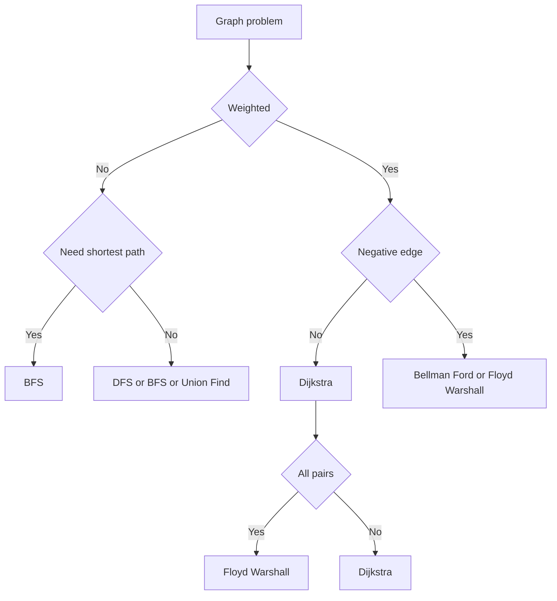
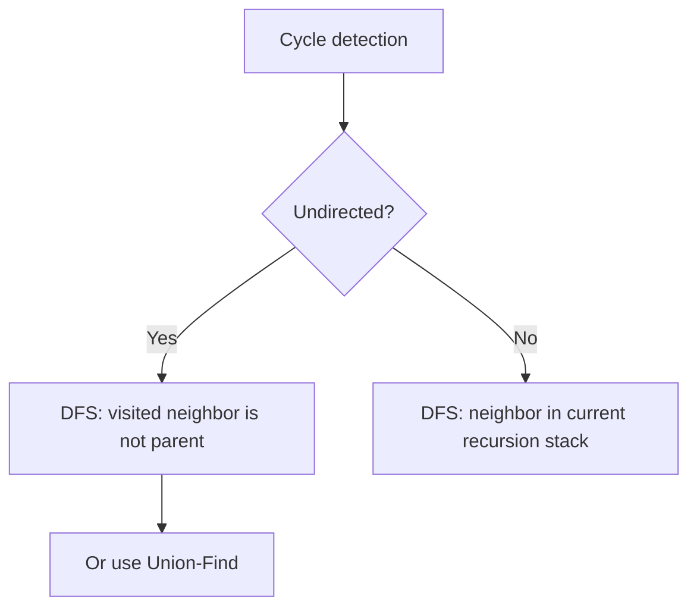

# Graph

그래프(Graph)는 **정점(Vertex)과 간선(Edge)으로 이루어진 자료구조**다.

한 줄로 요약하면 다음과 같다.

```text
정점 사이의 연결 관계를 표현하는 가장 일반적인 구조
```

트리도 그래프의 한 종류이고,
네트워크, 길 찾기, 관계 비교, 순서 제약, 연결 요소, 최단 거리 문제는 대부분 그래프로 모델링할 수 있다.

---

## 1. 언제 그래프 문제인가

문제에서 아래 표현이 보이면 그래프를 먼저 떠올리면 된다.

- 도시와 도로
- 사람과 친구 관계
- 컴퓨터 네트워크 연결
- 노드와 간선
- 이동 가능 여부
- 최단 거리
- 선후 관계
- 연결 요소 개수

즉 대상이 무엇이든,

```text
무언가와 무언가 사이의 관계나 연결
```

을 다루면 그래프일 가능성이 높다.

---

## 2. 핵심 용어

그래프를 이해할 때 꼭 알아야 하는 용어는 다음과 같다.

- 정점 Vertex: 점, 노드
- 간선 Edge: 정점과 정점을 잇는 선
- 인접 Adjacent: 간선으로 직접 연결된 상태
- 경로 Path: 여러 간선을 따라 이동한 순서
- 사이클 Cycle: 다시 자기 자신으로 돌아오는 경로
- 차수 Degree: 정점에 연결된 간선 수
- 연결 요소 Connected Component: 서로 도달 가능한 정점들의 묶음

예를 들어:

```text
1 -- 2 -- 3
|         |
4 ------- 5
```

이 구조 전체가 그래프다.

---

## 3. 그래프의 종류

그래프는 여러 기준으로 나뉜다.

### 1) 무방향 그래프 Undirected Graph

간선에 방향이 없다.

```text
1 -- 2
```

는 1에서 2로도 갈 수 있고, 2에서 1로도 갈 수 있다.

### 2) 방향 그래프 Directed Graph

간선에 방향이 있다.

```text
1 -> 2
```

는 1에서 2로는 갈 수 있지만, 2에서 1로는 못 갈 수 있다.

### 3) 가중치 그래프 Weighted Graph

간선마다 비용이 있다.

```text
1 --(5)--> 2
```

### 4) 비가중치 그래프 Unweighted Graph

간선 비용이 없거나 모두 동일하다.

### 5) 트리 Tree

사이클이 없는 연결 그래프다.

즉 트리는 그래프의 특수한 형태다.

---

## 4. 그래프를 어떻게 모델링할까

그래프 문제의 첫 단계는 그래프를 어떤 자료구조로 표현할지 결정하는 것이다.

대표적으로 두 가지가 있다.

### 1) 인접 행렬 Adjacency Matrix

```java
int[][] graph = new int[n][n];
```

의미:

```java
graph[i][j] == 1   // i와 j가 연결됨
```

장점:

- 연결 여부 확인이 `O(1)`
- 구현이 직관적

단점:

- 메모리가 `O(N^2)`
- 실제 간선이 적어도 모든 칸을 써야 함

즉 정점 수가 작을 때만 적합하다.

### 2) 인접 리스트 Adjacency List

```java
ArrayList<Integer>[] graph = new ArrayList[n + 1];
```

장점:

- 메모리가 `O(N + E)`
- 현재 정점과 연결된 간선만 볼 수 있어서 효율적

단점:

- 두 정점이 직접 연결됐는지 즉시 확인하려면 느릴 수 있음

코테에서는 대부분 인접 리스트가 정석이다.

---

## 5. 인접 행렬 vs 인접 리스트

| 표현 방식 | 장점 | 단점 | 주 사용처 |
|---|---|---|---|
| 인접 행렬 | 연결 여부 `O(1)` | 메모리 많이 사용 | 정점 수가 작고 관계가 조밀할 때 |
| 인접 리스트 | 메모리 효율적, 탐색 효율적 | 직접 연결 여부 확인은 느릴 수 있음 | 대부분의 그래프 문제 |

실전 판단 기준:

- `N`이 작다 -> 인접 행렬도 가능
- `N`이 크고 간선만 주어진다 -> 인접 리스트
- DFS/BFS/Dijkstra -> 인접 리스트 우선

---

## 6. 가중치 그래프의 인접 리스트

가중치가 있는 그래프는 목적지와 비용을 함께 저장해야 한다.


```java
static class Edge {
    int to;
    int weight;

    Edge(int to, int weight) {
        this.to = to;
        this.weight = weight;
    }
}

ArrayList<Edge>[] graph = new ArrayList[n + 1];
```

즉 비가중치 그래프는 `Integer`만 저장하면 되고,
가중치 그래프는 `Edge` 같은 클래스를 따로 둔다.

---

## 7. 그래프 문제 분류를 위한 빠른 기준

그래프 문제를 만나면 먼저 아래처럼 분류하면 된다.



이 다이어그램은 문제를 처음 읽을 때 빠르게 방향을 잡는 기준으로 쓰면 된다.

---

## 8. BFS 너비 우선 탐색

BFS(Breadth-First Search)는 가까운 정점부터 순서대로 탐색하는 알고리즘이다.

핵심 자료구조는 `Queue`다.

### 언제 쓰는가

- 가중치 없는 그래프의 최단 거리
- 연결 요소 탐색
- 레벨 순회
- 최소 이동 횟수

### 기본 흐름

1. 시작점을 큐에 넣는다
2. 큐에서 하나 꺼낸다
3. 인접 정점 중 방문하지 않은 정점을 큐에 넣는다
4. 큐가 빌 때까지 반복한다


```java
void bfs(int start, ArrayList<Integer>[] graph, boolean[] visited) {
    Queue<Integer> q = new LinkedList<>();
    q.offer(start);
    visited[start] = true;

    while (!q.isEmpty()) {
        int cur = q.poll();

        for (int next : graph[cur]) {
            if (visited[next]) continue;
            visited[next] = true;
            q.offer(next);
        }
    }
}
```

---

## 9. BFS는 왜 최단 거리인가

비가중치 그래프에서 BFS가 최단 거리를 구할 수 있는 이유는,
큐가 거리 순서대로 정점을 확장하기 때문이다.

즉:

- 시작점에서 1번 만에 가는 정점들
- 2번 만에 가는 정점들
- 3번 만에 가는 정점들

순서로 탐색이 진행된다.

그래서 처음 도달한 거리가 곧 최단 거리다.

### 거리 배열 기반 BFS

```java
int[] dist = new int[n + 1];
Arrays.fill(dist, -1);

Queue<Integer> q = new LinkedList<>();
q.offer(start);
dist[start] = 0;

while (!q.isEmpty()) {
    int cur = q.poll();

    for (int next : graph[cur]) {
        if (dist[next] != -1) continue;
        dist[next] = dist[cur] + 1;
        q.offer(next);
    }
}
```

---

## 10. DFS 깊이 우선 탐색

DFS(Depth-First Search)는 한 방향으로 끝까지 내려갔다가 돌아오는 탐색이다.

핵심은 재귀 또는 스택이다.

### 언제 쓰는가

- 연결 요소 탐색
- 경로 존재 여부
- 사이클 탐지
- 트리 순회
- 백트래킹 기반 탐색

### 재귀 방식

```java
void dfs(int cur, ArrayList<Integer>[] graph, boolean[] visited) {
    visited[cur] = true;

    for (int next : graph[cur]) {
        if (visited[next]) continue;
        dfs(next, graph, visited);
    }
}
```

DFS는 구조를 깊게 타고 들어가므로,
서브트리 계산이나 재귀적 구조의 문제에서 특히 강하다.

---

## 11. DFS와 BFS의 차이

| 항목 | BFS | DFS |
|---|---|---|
| 자료구조 | Queue | Recursion / Stack |
| 탐색 방식 | 가까운 곳부터 | 한 방향 끝까지 |
| 강점 | 비가중치 최단 거리 | 구조 파악, 백트래킹, 서브트리 계산 |

즉:

- 최단 거리 느낌 -> BFS
- 구조 분해 느낌 -> DFS

로 먼저 떠올리면 된다.

---

## 12. 연결 요소 Connected Components

그래프가 여러 덩어리로 나뉘어 있을 수 있다.

예:

```text
1 -- 2    3 -- 4    5
```

이 경우 연결 요소는 3개다.

연결 요소 개수를 세는 기본 패턴은 다음과 같다.


```java
int countComponents(int n, ArrayList<Integer>[] graph) {
    boolean[] visited = new boolean[n + 1];
    int count = 0;

    for (int i = 1; i <= n; i++) {
        if (visited[i]) continue;
        dfs(i, graph, visited);
        count++;
    }

    return count;
}
```

즉 아직 방문하지 않은 정점에서 탐색을 한 번 시작할 때마다 새로운 연결 요소 하나를 찾은 것이다.

---

## 13. 사이클 탐지

사이클은 그래프 문제의 핵심 개념 중 하나다.

### 무방향 그래프

DFS 중에 방문한 정점을 다시 만났는데 그 정점이 부모가 아니면 사이클이다.

```java
boolean hasCycle = false;

void dfs(int cur, int parent, boolean[] visited, ArrayList<Integer>[] graph) {
    visited[cur] = true;

    for (int next : graph[cur]) {
        if (next == parent) continue;
        if (visited[next]) {
            hasCycle = true;
            return;
        }
        dfs(next, cur, visited, graph);
    }
}
```

### 방향 그래프

현재 재귀 스택에 있는 정점을 다시 만나면 사이클이다.
이를 구분하려면 `visited`만으로는 부족하고, 3색 방문 배열이 필요하다.

```java
// 0: 미방문, 1: 재귀 스택(현재 탐색 중), 2: 완료
int[] state;
boolean hasCycle = false;

void dfs(int cur, ArrayList<Integer>[] graph) {
    state[cur] = 1;

    for (int next : graph[cur]) {
        if (state[next] == 1) {
            hasCycle = true;
            return;
        }
        if (state[next] == 0) {
            dfs(next, graph);
        }
    }

    state[cur] = 2;
}
```

즉 사이클 탐지는 그래프 종류에 따라 방식이 다르다.



---

## 14. 위상 정렬 Topological Sort

위상 정렬은 방향 그래프, 그중에서도 DAG(사이클 없는 방향 그래프)에서만 가능하다.

의미:

```text
선후 관계를 만족하는 순서로 정점을 나열하기
```

예:

- 선수 과목
- 작업 순서
- 빌드 순서

### Kahn 알고리즘 핵심

1. 진입 차수 indegree가 0인 정점을 큐에 넣는다
2. 하나 꺼내며 정답에 넣는다
3. 그 정점에서 나가는 간선을 제거한 효과로 indegree를 줄인다
4. 새로 indegree가 0이 된 정점을 큐에 넣는다


```java
List<Integer> topoSort(int n, ArrayList<Integer>[] graph, int[] indegree) {
    Queue<Integer> q = new LinkedList<>();
    List<Integer> order = new ArrayList<>();

    for (int i = 1; i <= n; i++) {
        if (indegree[i] == 0) q.offer(i);
    }

    while (!q.isEmpty()) {
        int cur = q.poll();
        order.add(cur);

        for (int next : graph[cur]) {
            indegree[next]--;
            if (indegree[next] == 0) q.offer(next);
        }
    }

    return order;
}
```

정점 수만큼 결과가 나오지 않으면 사이클이 있다는 뜻이다.

---

## 15. 최단 경로 문제 분류

그래프 문제에서 가장 중요한 분기 중 하나다.

| 상황 | 알고리즘 |
|---|---|
| 가중치 없음 | BFS |
| 가중치 있음, 음수 없음, 시작점 하나 | Dijkstra |
| 음수 간선 가능 | Bellman-Ford |
| 모든 정점 쌍 최단 거리 | Floyd-Warshall |

즉 최단 경로 문제를 보면 먼저 다음을 확인한다.

1. 가중치가 있는가?
2. 음수 간선이 있는가?
3. 시작점이 하나인가, 모든 정점인가?

---

## 16. Dijkstra는 어떤 그래프에서 쓰는가

Dijkstra는:

- 가중치가 있고
- 음수 간선이 없고
- 한 시작점에서 다른 정점까지의 최단 거리

를 구할 때 사용한다.

핵심 자료구조는 우선순위 큐다.

가중치 그래프는 보통 인접 리스트로 표현한다.

```java
ArrayList<Edge>[] graph = new ArrayList[n + 1];
```

자세한 내용은 `Dijkstra.md`에서 따로 정리하는 것이 맞고,
`Graph.md`에서는 분류 기준만 잡는 것이 핵심이다.

---

## 17. Floyd-Warshall은 어떤 그래프에서 쓰는가

Floyd-Warshall은:

- 모든 정점 쌍의 최단 거리
- 정점 수가 크지 않음
- 경유지를 하나씩 허용하며 갱신

이라는 특징이 있다.

즉 시작점이 하나가 아니라 **모든 쌍**일 때 떠올리면 된다.

이것도 자세한 내용은 `FloydWarshall.md`가 별도 정리 문서다.

---

## 18. Bellman-Ford는 언제 필요한가

Bellman-Ford는 음수 간선이 있을 수 있을 때 쓴다.

속도는 느리지만,
다익스트라와 달리 음수 간선과 음수 사이클 판별을 다룰 수 있다.

즉:

- 음수 간선이 없다 -> Dijkstra 우선
- 음수 간선이 있다 -> Bellman-Ford 검토

---

## 19. Union-Find는 그래프 탐색과 다르다

Union-Find는 그래프를 탐색하는 알고리즘이 아니다.

하지만 그래프 문제에서 매우 자주 쓰인다.

주 사용처:

- 같은 연결 요소인지 판별
- 간선 추가 시 사이클 검사
- Kruskal MST

즉 탐색이 아니라 **집합 병합** 문제일 때 쓰는 도구다.

---

## 20. 최소 스패닝 트리 MST

MST(Minimum Spanning Tree)는 가중치 무방향 그래프에서,
모든 정점을 연결하되 간선 가중치 합이 최소가 되도록 하는 트리다.

대표 알고리즘:

- Kruskal
- Prim

### Kruskal

- 간선을 가중치 순으로 정렬
- 사이클이 생기지 않으면 채택
- Union-Find와 궁합이 매우 좋다

### Prim

- 현재 연결된 정점 집합에서 가장 싼 간선을 하나씩 확장
- 우선순위 큐를 사용

MST 문제는 최단 경로 문제와 헷갈리기 쉽지만 다르다.

- 최단 경로: 한 점에서 다른 점까지 가장 짧은 경로
- MST: 전체 그래프를 가장 싸게 연결

---

## 21. 그래프 입력에서 자주 하는 실수

### 1) 무방향 그래프인데 한 방향만 넣음

```java
graph[u].add(v);
graph[v].add(u);
```

둘 다 넣어야 한다.

### 2) 1-based, 0-based 인덱스를 섞음

문제 입력이 보통 1번 정점부터 시작하므로 주의해야 한다.

### 3) 방문 배열 초기화를 안 함

BFS/DFS를 여러 번 돌릴 때 특히 자주 틀린다.

### 4) 가중치 그래프인데 `int` overflow를 무시함

최단 거리 문제에서는 `long`이 더 안전할 수 있다.

### 5) 인접 행렬과 인접 리스트를 문제 크기에 맞지 않게 선택함

`N = 100000`인데 인접 행렬은 거의 불가능하다.

---

## 22. 그래프 문제를 읽을 때의 체크리스트

문제를 받으면 아래 순서대로 보면 된다.

1. 정점과 간선이 무엇인가?
2. 방향 그래프인가, 무방향 그래프인가?
3. 가중치가 있는가?
4. 연결 여부가 중요한가, 최단 거리가 중요한가?
5. 시작점이 하나인가, 여러 개인가?
6. 선후 관계인가?
7. 그래프가 사실 트리인가?

이렇게 분류하면 대부분 알고리즘이 빠르게 정해진다.

---

## 23. 문제 유형별 빠른 연결

| 문제 표현 | 보통 연결되는 알고리즘 |
|---|---|
| 연결 요소 개수 | DFS / BFS / Union-Find |
| 가중치 없는 최단 거리 | BFS |
| 가중치 있는 최단 거리 | Dijkstra / Bellman-Ford / Floyd-Warshall |
| 선수 관계, 작업 순서 | Topological Sort |
| 모든 노드 연결 최소 비용 | MST |
| 트리 구조 계산 | DFS / Tree DP / LCA |

이 표를 머릿속에 두면 그래프 문제를 훨씬 빨리 읽을 수 있다.

---

## 24. 시험장용 최소 암기 버전

```text
그래프:
정점 + 간선

표현:
인접 행렬 / 인접 리스트

탐색:
BFS = 가중치 없는 최단 거리
DFS = 구조 파악, 서브트리, 백트래킹

최단 경로:
무가중치 -> BFS
가중치, 음수 없음 -> Dijkstra
음수 가능 -> Bellman-Ford
모든 쌍 -> Floyd-Warshall

기타:
DAG -> 위상 정렬
사이클 검사 / MST -> Union-Find, Kruskal
```

---

## 25. 최종 요약

그래프는 다음 문장으로 정리할 수 있다.

```text
정점 사이의 연결 관계를 표현하는 가장 일반적인 자료 구조
```

핵심만 다시 압축하면:

- 그래프 문제는 관계와 연결을 모델링하는 문제다
- 대부분 인접 리스트가 기본 표현이다
- 가중치 없는 탐색은 BFS/DFS
- 최단 경로는 BFS, Dijkstra, Bellman-Ford, Floyd-Warshall로 분기한다
- 선후 관계는 위상 정렬
- 집합 병합은 Union-Find
- 전체 연결 최소 비용은 MST

문제를 보면 먼저 이 질문을 하면 된다.

```text
이 그래프 문제에서 내가 필요한 것은
탐색인가,
최단 거리인가,
순서인가,
집합 병합인가?
```

이 구분이 잡히면 그래프 문제는 절반 이상 풀린다.
