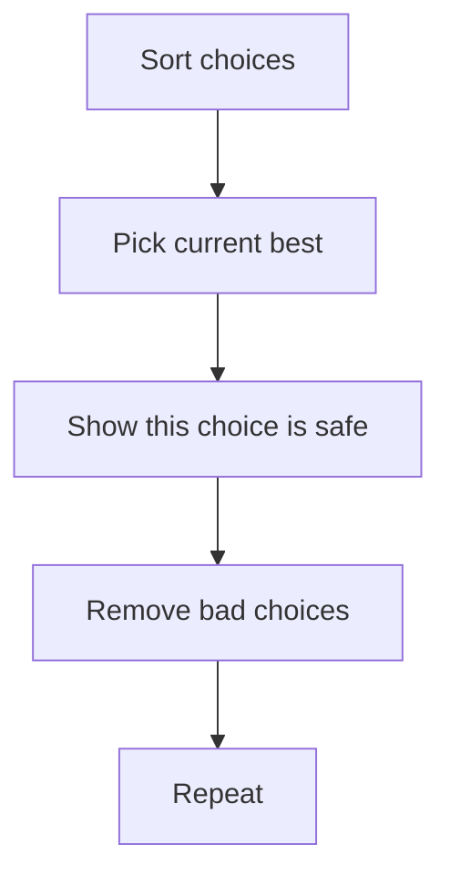

# Greedy

그리디(Greedy)는 **매 순간 가장 좋아 보이는 선택을 하면서 전체 해를 만드는 알고리즘 기법**이다.

한 줄로 요약하면 다음과 같다.

```text
지금 당장 가장 이득인 선택을 반복한다
```

하지만 중요한 점은 이것이다.

```text
그리디는 "규칙을 찾는 것"보다
그 규칙이 왜 항상 맞는지 설명하는 것이 더 중요하다
```

---

## 1. 언제 쓰는가

문제에서 아래 느낌이 나면 그리디를 의심하면 된다.

- 최댓값 / 최솟값을 빠르게 만들어야 함
- 매 순간 하나를 골라 나가는 구조
- 정렬 후 순서대로 처리하는 것이 자연스러움
- 가장 빨리 끝나는 것, 가장 싼 것, 가장 큰 것부터 고르는 규칙이 보임
- 현재 선택이 이후 선택 가능성을 넓혀 줌

대표 문제 유형:

- 회의실 배정
- 동전 거스름돈 일부
- 최소 신장 트리 일부 절차
- 문자열 / 숫자 만들기 최적화
- 스케줄링

---

## 2. 핵심 아이디어

그리디의 핵심은 다음 한 문장이다.

```text
지금 최선인 선택이 전체 최적해를 해치지 않는다
```

즉 현재 단계에서 "제일 좋아 보이는 것"을 골라도,
나중에 후회하지 않는 구조여야 한다.

이 조건이 없으면 그리디는 틀린다.

---

## 3. DP와의 차이

그리디와 DP는 자주 비교된다.

| 항목 | Greedy | DP |
|---|---|---|
| 선택 방식 | 현재 최선 하나만 선택 | 여러 상태를 비교 |
| 필요한 것 | 선택 규칙의 정당성 | 상태 정의와 점화식 |
| 강점 | 빠르고 구현이 단순 | 정답 보장이 강함 |
| 위험 | 규칙이 틀리면 전체가 틀림 | 상태 수가 많으면 무거움 |

즉,

- 현재 선택이 미래에 거의 영향을 안 주거나
- 오히려 미래를 넓혀 주는 구조면 그리디가 가능하다
- 미래 영향이 복잡하면 DP 가능성이 높다

---

## 4. 그리디가 성립하려면

보통 아래 중 하나가 필요하다.

### 1) 교환 논법 Exchange Argument

최적해가 있다고 가정했을 때,
현재 그리디 선택으로 바꿔도 손해가 없음을 보인다.

### 2) 앞서감 유지 Staying Ahead

그리디가 매 단계에서 항상 다른 해보다 뒤처지지 않음을 보인다.

### 3) 정렬 후 규칙 고정

정렬 기준 하나가 전체 선택 규칙을 결정한다.

즉 그리디는 "감"이 아니라 증명이 필요한 알고리즘이다.



많은 그리디 문제는 결국 이 흐름으로 풀린다.

---

## 5. 대표 예시: 회의실 배정

문제:

```text
겹치지 않게 가장 많은 회의를 선택하라
```

회의가 `(start, end)` 형태로 주어진다고 하자.

### 왜 "가장 빨리 끝나는 회의"를 고를까

현재 시점에서 가장 빨리 끝나는 회의를 고르면,
뒤에 더 많은 회의를 넣을 공간이 남는다.

반대로 늦게 끝나는 회의를 먼저 고르면,
뒤의 선택지가 줄어든다.

즉 이 문제의 핵심 규칙은:

```text
끝나는 시간이 빠른 순으로 보자
```

이다.

---

## 6. 손으로 따라가는 예시

회의 목록:

```text
(1, 4)
(2, 3)
(3, 5)
(4, 6)
```

끝나는 시간 기준으로 정렬하면:

```text
(2, 3)
(1, 4)
(3, 5)
(4, 6)
```

이제 순서대로 보자.

1. `(2, 3)` 선택
2. `(1, 4)`는 시작 시간이 3보다 작아서 불가능
3. `(3, 5)`는 가능 -> 선택
4. `(4, 6)`는 시작 시간이 5보다 작아 불가능

정답: 2개

이 예시에서 `(1, 4)`를 먼저 골랐다면 뒤 선택지가 오히려 줄어든다.

### 타임라인 시각화

```text
time:  1   2   3   4   5   6
       [  2,3  ]                ← 선택 ✓
[     1,4      ]                ← 겹침 ✗
           [  3,5  ]            ← 선택 ✓
              [  4,6  ]         ← 겹침 ✗
```

끝나는 시간이 빠른 `(2,3)`을 먼저 선택하면 `(3,5)`까지 총 2개를 배정할 수 있다.

---

## 7. 회의실 배정

```java
import java.util.*;

class Meeting {
    int start;
    int end;

    Meeting(int start, int end) {
        this.start = start;
        this.end = end;
    }
}

int maxMeetings(List<Meeting> meetings) {
    meetings.sort((a, b) -> {
        if (a.end != b.end) return a.end - b.end;
        return a.start - b.start;
    });

    int count = 0;
    int lastEnd = -1;

    for (Meeting m : meetings) {
        if (m.start >= lastEnd) {
            count++;
            lastEnd = m.end;
        }
    }

    return count;
}
```

타이브레이크로 시작 시간도 정렬해 두면 구현이 안정적이다.

---

## 8. 왜 이 규칙이 맞는가: 짧은 증명 감각

최적해 중 첫 번째 회의가 가장 빨리 끝나는 회의가 아니라고 하자.
그 첫 회의를 더 빨리 끝나는 회의로 바꿔도,
뒤에 들어갈 수 있는 회의 수는 줄지 않는다.

왜냐하면 더 빨리 끝나므로 뒤 공간이 더 넓거나 같기 때문이다.

즉 최적해를 그리디 선택으로 바꿔도 손해가 없다.
이게 교환 논법의 전형적인 형태다.

---

## 9. 정렬 기반 그리디

그리디는 정렬과 같이 나오는 경우가 매우 많다.

예:

- 끝나는 시간이 빠른 순
- 마감이 빠른 순
- 가치가 큰 순
- 무게가 작은 순
- 위치가 가까운 순

즉 문제를 보면 먼저 다음을 묻게 된다.

```text
무엇을 기준으로 정렬하면 안전한 선택 순서가 생기는가?
```

---

## 10. 우선순위 큐 기반 그리디

정렬만으로는 안 되고,
현재 선택 가능한 것들 중에서 최선 하나를 계속 골라야 하는 문제도 있다.

이 경우는 우선순위 큐가 붙는다.

대표 예시:

- 최소 강의실 수
- 마감이 있는 작업 선택
- 가장 큰 값 / 가장 작은 값 반복 선택

즉 그리디는 보통 다음 두 도구와 함께 나온다.

- 정렬
- 우선순위 큐

---

## 11. 동전 문제는 왜 때로는 되고 때로는 안 되는가

예:

- `500, 100, 50, 10`원 체계 -> 큰 동전부터 써도 최적
- `1, 3, 4`원 체계에서 6 만들기 -> 큰 동전부터 쓰면 `4 + 1 + 1 = 3개`, 실제 최적은 `3 + 3 = 2개`

즉:

```text
그리디 규칙이 자연스러워 보여도 항상 맞는 것은 아니다
```

동전 문제는 그리디 반례를 배우기 가장 좋은 예다.

### 반례를 먼저 만드는 습관이 중요하다

그리디 규칙 후보가 떠오르면,
증명부터 하기 전에 작은 반례를 먼저 만들어 보는 편이 빠르다.

예를 들어 "항상 가장 큰 동전부터 쓰자"는 규칙은
`1, 3, 4` 체계에서 목표 `6`만 넣어 봐도 바로 깨진다.

실전에서는 다음 순서가 안전하다.

1. 규칙 후보를 한 문장으로 적는다.
2. 작은 입력에서 반례를 만들어 본다.
3. 반례가 안 나오면 교환 논법이나 앞서감 유지로 설명을 붙인다.

그리디는 구현보다
"왜 지금 선택이 틀리지 않는가"를 검증하는 과정이 핵심이다.

---

## 12. 그리디를 의심하는 신호

아래 신호가 보이면 그리디 가능성이 높다.

- 매 단계에서 하나씩 고르는 구조
- 정렬 후 한 번만 훑으면 될 것 같음
- 현재 선택이 뒤 선택의 공간을 넓힘
- 지역 최적이 전역 최적으로 이어질 것 같은 느낌
- 증명은 짧은데 구현은 간단함

---

## 13. 그리디가 아닌 경우의 대표 신호

아래라면 그리디를 조심해야 한다.

- 현재 선택이 미래에 큰 영향을 줌
- 반례가 쉽게 떠오름
- "한 번 잘못 고르면 뒤에서 복구 불가" 구조
- 최댓값 / 최솟값이 상태에 많이 의존함

즉 미래 영향이 복잡하면 DP나 다른 접근이 필요할 가능성이 높다.

---

## 14. 자주 하는 실수

### 1) 증명 없이 감으로 규칙을 정함

그리디는 반례가 생기기 쉬워서 가장 위험한 실수다.

### 2) 정렬 기준을 잘못 잡음

회의실 배정도 시작 시간 기준으로 정렬하면 틀린다.
핵심은 끝나는 시간이다.

### 3) 현재 최선과 전체 최선을 혼동함

지금 좋아 보여도 미래 공간을 좁히면 틀릴 수 있다.

### 4) 사실은 DP 문제인데 그리디로 억지 처리함

반례를 하나만 만들어 봐도 드러나는 경우가 많다.

---

## 15. 시험장용 최소 암기 버전

```text
그리디:
지금 최선 선택 반복

핵심 질문:
왜 지금 선택이 항상 안전한가?

자주 같이 나오는 것:
정렬
우선순위 큐

대표 예시:
회의실 배정
```

---

## 16. 최종 요약

그리디는 다음 문장으로 정리할 수 있다.

```text
매 순간 최선의 선택을 하되,
그 선택이 전체 최적해를 해치지 않는 문제에서 쓰는 기법
```

문제를 보면 먼저 이 질문을 하면 된다.

```text
현재 가장 좋아 보이는 선택을 지금 해도,
나중에 후회하지 않는다고 설명할 수 있는가?
```

설명할 수 있으면 그리디일 가능성이 높다.
