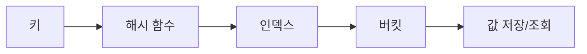
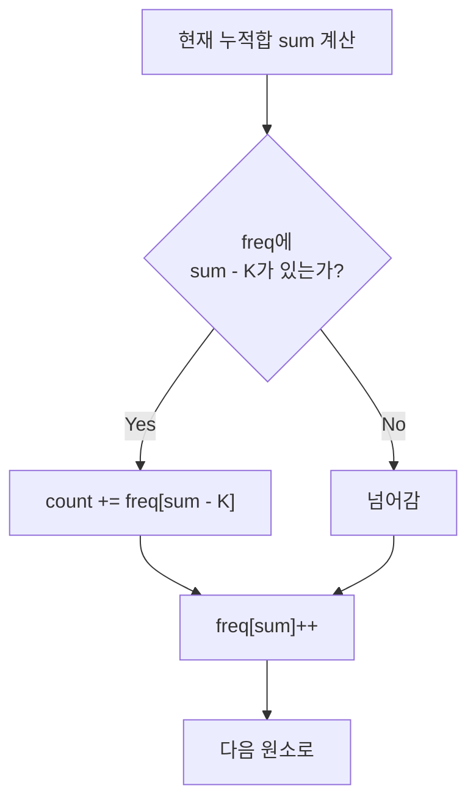

# Hash

해시(Hash)는 **키를 빠르게 저장하고 조회하기 위한 자료구조이자 기법**이다.

한 줄로 요약하면 다음과 같다.

```text
키 → 해시 함수 → 인덱스
O(1)에 저장, 조회, 삭제
```

---

## 1. 언제 쓰는가

문제에서 아래 표현이 보이면 해시를 먼저 떠올리면 된다.

- 특정 값이 존재하는지 빠르게 확인
- 등장 횟수 세기
- 중복 제거
- 두 수의 합
- 문자열/배열에서 특정 패턴 매칭
- 그룹핑

대표 문제 유형:

- 전화번호부 (HashMap)
- 의상 조합 (경우의 수 + HashMap)
- 베스트앨범 (그룹핑 + 정렬)
- 합이 K인 부분 배열 개수

---

## 2. 핵심 자료구조

Java에서 해시 기반 자료구조는 크게 두 가지다.

### HashMap

키-값 쌍을 저장한다.

```java
Map<String, Integer> map = new HashMap<>();
map.put("apple", 3);
map.get("apple");        // 3
map.containsKey("apple"); // true
map.getOrDefault("banana", 0); // 0
```

### HashSet

값의 존재 여부만 저장한다.

```java
Set<String> set = new HashSet<>();
set.add("apple");
set.contains("apple"); // true
set.remove("apple");
```



핵심은 해시 함수가 키를 인덱스로 바꿔서 배열처럼 바로 접근한다는 점이다. 이 덕분에 평균 `O(1)`에 동작한다.

---

## 3. 빈도 세기 패턴

가장 자주 나오는 해시맵 패턴이다.

```java
Map<String, Integer> freq = new HashMap<>();

for (String s : arr) {
    freq.put(s, freq.getOrDefault(s, 0) + 1);
}
```

이 패턴은 다음 문제에서 매우 빈번하게 쓰인다.

- 최빈 원소 찾기
- 중복 확인
- 애너그램 비교
- 문자 종류별 개수

---

## 4. 존재 확인 패턴

배열이나 리스트에서 특정 값이 있는지 `O(1)`에 확인한다.

```java
Set<Integer> seen = new HashSet<>();

for (int x : arr) {
    if (seen.contains(target - x)) {
        // target - x와 x의 합이 target
    }
    seen.add(x);
}
```

이 패턴은 "두 수의 합" 문제의 해시 풀이법이다.

---

## 5. 두 수의 합: 해시 vs 투 포인터

같은 문제를 두 가지로 풀 수 있다.

| 방법 | 전제 조건 | 시간 | 특징 |
|---|---|---|---|
| 해시맵 | 없음 | O(N) | 정렬 불필요 |
| 투 포인터 | 정렬 필요 | O(N log N) | 추가 공간 적음 |

정렬되지 않은 배열이면 해시가 더 자연스럽고,
정렬된 배열이면 투 포인터가 더 자연스럽다.

---

## 6. 그룹핑 패턴

해시맵으로 값을 그룹별로 묶는 패턴이다.

```java
Map<String, List<Integer>> groups = new HashMap<>();

for (int i = 0; i < n; i++) {
    List<Integer> list = groups.get(genre[i]);
    if (list == null) {
        list = new ArrayList<>();
        groups.put(genre[i], list);
    }
    list.add(i);
}
```

이 패턴은 다음 문제에서 자주 나온다.

- 장르별 곡 분류
- 팀별 점수 집계
- 카테고리별 그룹핑

---

## 7. 애너그램 판별

두 문자열이 같은 문자 구성인지 확인하는 문제다.

방법 1: 정렬 비교

```java
char[] a = s1.toCharArray();
char[] b = s2.toCharArray();
Arrays.sort(a);
Arrays.sort(b);
return Arrays.equals(a, b);
```

방법 2: 빈도 배열

```java
int[] count = new int[26];
for (char c : s1.toCharArray()) count[c - 'a']++;
for (char c : s2.toCharArray()) count[c - 'a']--;

for (int c : count) {
    if (c != 0) return false;
}
return true;
```

문자 종류가 적으면 빈도 배열, 유니코드 등 범위가 넓으면 HashMap이 적절하다.

---

## 8. 슬라이딩 윈도우 + 해시맵

윈도우 안의 문자 빈도를 실시간으로 관리하는 패턴이다.

```text
문자열에서 길이 K인 연속 부분에 포함된 문자 종류 수의 최댓값
```

```java
Map<Character, Integer> window = new HashMap<>();

// 초기 윈도우
for (int i = 0; i < k; i++) {
    char ch = s.charAt(i);
    window.put(ch, window.getOrDefault(ch, 0) + 1);
}

int answer = window.size();

for (int i = k; i < s.length(); i++) {
    // 오른쪽 추가
    char in = s.charAt(i);
    window.put(in, window.getOrDefault(in, 0) + 1);

    // 왼쪽 제거
    char out = s.charAt(i - k);
    window.put(out, window.get(out) - 1);
    if (window.get(out) == 0) window.remove(out);

    answer = Math.max(answer, window.size());
}
```

핵심은 **빈도가 0이 되면 키를 삭제**하는 것이다.
그래야 `window.size()`가 정확한 종류 수를 반환한다.

---

## 9. 누적합 + 해시맵

이 조합은 "합이 K인 부분 배열 개수" 문제에서 핵심이다.

```java
Map<Long, Integer> freq = new HashMap<>();
freq.put(0L, 1);

long sum = 0;
int count = 0;

for (int x : arr) {
    sum += x;
    count += freq.getOrDefault(sum - k, 0);
    freq.put(sum, freq.getOrDefault(sum, 0) + 1);
}
```

원리:

```text
sum[0..i] - sum[0..j] = K
→ sum[0..j] = sum[0..i] - K
```

이전에 `sum - K`가 나온 횟수만큼 합이 K인 구간이 존재한다.



이 패턴은 음수가 있는 배열에서도 동작하므로 슬라이딩 윈도우보다 범용적이다.

---

## 10. 해시 충돌 개념

해시 함수가 서로 다른 키를 같은 인덱스로 보내면 충돌이 발생한다.

Java의 HashMap은 내부적으로 체이닝(Linked List / Red-Black Tree)으로 충돌을 처리한다.

실전에서는:

- 충돌이 많아도 보통 문제 없다
- 극단적 입력에서는 `O(N)`까지 느려질 수 있다
- 코테에서는 거의 신경 쓸 필요 없다

다만 직접 해시를 구현해야 하는 경우(문자열 해싱 등)는 충돌을 고려해야 한다.

---

## 11. 문자열 해싱 (Rabin-Karp 방식)

문자열을 정수로 변환하는 해시 기법이다.

```text
hash("abc") = 'a' * p^2 + 'b' * p^1 + 'c' * p^0
```

여기서 `p`는 소수(보통 31), 모든 계산은 큰 소수 `MOD`로 나머지를 취한다.

```java
long hash(String s) {
    long h = 0;
    long p = 1;
    long MOD = 1_000_000_007;

    for (int i = s.length() - 1; i >= 0; i--) {
        h = (h + (s.charAt(i) - 'a' + 1) * p) % MOD;
        p = p * 31 % MOD;
    }

    return h;
}
```

문자열 해싱의 장점:

- 롤링 해시를 쓰면 부분 문자열의 해시값을 `O(1)`에 비교할 수 있다
- 슬라이딩 윈도우와 결합하기 좋다

주의점:

- 해시 충돌이 발생할 수 있으므로, 충돌이 의심되면 이중 해시를 쓴다

---

## 12. LinkedHashMap과 순서 보존

일반 HashMap은 삽입 순서를 보장하지 않는다.

삽입 순서가 중요하면 `LinkedHashMap`을 쓴다.

```java
Map<String, Integer> map = new LinkedHashMap<>();
map.put("b", 2);
map.put("a", 1);
map.put("c", 3);

// 순회하면 b, a, c 순서 보장
for (Map.Entry<String, Integer> entry : map.entrySet()) {
    System.out.println(entry.getKey());
}
```

---

## 13. TreeMap과 정렬된 키

키를 정렬 순서로 유지해야 하면 `TreeMap`을 쓴다.

```java
TreeMap<Integer, String> map = new TreeMap<>();
map.put(3, "c");
map.put(1, "a");
map.put(2, "b");

map.firstKey();  // 1
map.lastKey();   // 3
map.floorKey(2); // 2 이하 중 최대
map.ceilingKey(2); // 2 이상 중 최소
```

TreeMap은 `O(log N)`이므로 HashMap보다 느리지만,
범위 검색이 필요한 문제에서 강력하다.

---

## 14. 자주 하는 실수

### 1) getOrDefault를 안 쓰고 NPE 발생

```java
// 위험
int val = map.get(key); // key가 없으면 NPE

// 안전
int val = map.getOrDefault(key, 0);
```

### 2) 빈도 0인 키를 삭제하지 않음

슬라이딩 윈도우에서 `size()`를 쓸 때 특히 중요하다.

### 3) 해시맵 키로 배열을 씀

Java에서 `int[]`는 `equals` / `hashCode`가 참조 기반이라 HashMap 키로 쓰면 안 된다.
`Arrays.toString(arr)`이나 `List<Integer>`로 변환해야 한다.

### 4) 순서를 기대하면서 HashMap을 씀

순서가 중요하면 `LinkedHashMap`이나 `TreeMap`을 써야 한다.

### 5) 해시맵을 써야 하는데 정렬 후 이분탐색으로 풀어서 복잡도 증가

바로 `O(1)` 조회가 필요한 경우 해시가 더 단순하다.

---

## 15. 실전 판단 기준

아래 상황이면 해시를 먼저 떠올리면 된다.

- 값이 존재하는지 빠르게 확인
- 등장 횟수를 세야 한다
- 두 값의 관계를 빠르게 확인 (합, 차, 짝)
- 윈도우 안의 구성 요소를 실시간 추적
- 누적합과 결합하여 조건 만족 구간 세기

해시가 아닌 경우:

- 순서가 중요하다 → 정렬 / TreeMap
- 범위 쿼리가 중요하다 → TreeMap / 세그먼트 트리
- 데이터가 매우 적다 → 단순 배열로 충분

---

## 16. 시험장용 최소 암기 버전

```text
해시:
키 → 인덱스 → O(1) 접근

주요 패턴:
빈도 세기: getOrDefault + put
존재 확인: HashSet.contains
그룹핑: 없으면 생성 후 add
누적합 결합: freq[sum - K]

자료구조 선택:
HashMap: 기본
LinkedHashMap: 순서 보존
TreeMap: 정렬 + 범위

주의:
배열을 키로 쓰지 말 것
빈도 0이면 remove
```

---

## 17. 최종 요약

해시는 다음 문장으로 정리할 수 있다.

```text
키를 해시 함수로 인덱스로 바꿔
삽입, 조회, 삭제를 평균 O(1)에 처리하는 자료구조
```

핵심만 다시 압축하면:

- HashMap은 코테에서 가장 자주 쓰이는 자료구조 중 하나다
- 빈도 세기, 존재 확인, 그룹핑이 3대 패턴이다
- 누적합 + 해시맵은 "합이 K인 구간 수" 문제의 정석이다
- 슬라이딩 윈도우 + 해시맵은 윈도우 내 상태 관리의 핵심이다

문제를 보면 먼저 이 질문을 하면 된다.

```text
특정 값의 존재나 빈도를 빠르게 알아야 하는가?
```

답이 예라면 해시일 가능성이 높다.
