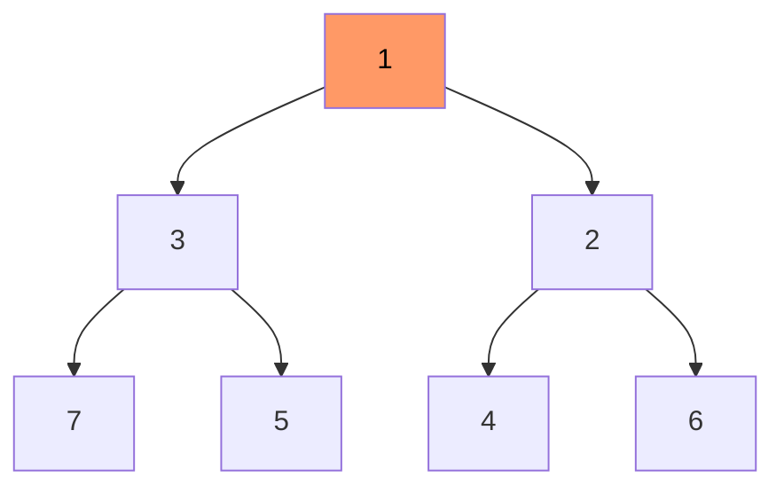
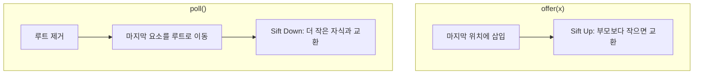
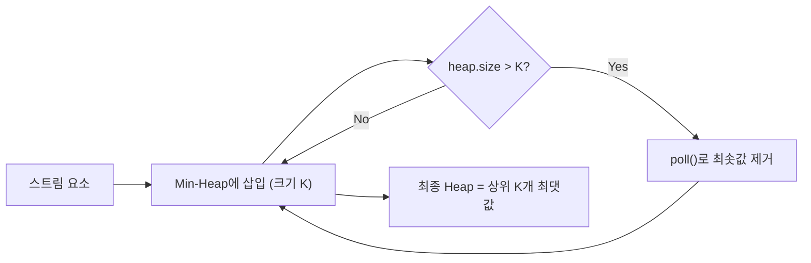
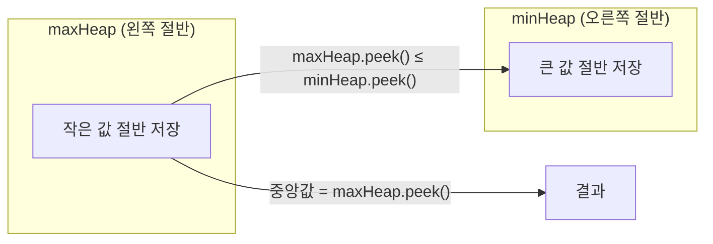

# Heap / Priority Queue

힙(Heap)은 **가장 크거나 작은 원소를 O(log N)에 꺼낼 수 있는 완전 이진 트리 기반 자료구조**다.

한 줄로 요약하면 다음과 같다.

```text
삽입도 O(log N), 최솟값(또는 최댓값) 추출도 O(log N)
```

Java에서는 `PriorityQueue` 클래스가 **최소 힙**으로 구현되어 있다.

---

## 1. 언제 쓰는가

| 상황 | 이유 |
| --- | --- |
| 가장 작은(또는 큰) 원소를 반복적으로 뽑아야 할 때 | 정렬하면 O(N log N) 한 번이지만, 중간에 삽입이 있으면 정렬 반복은 비효율적 |
| Top-K 문제 | K개만 유지하면 O(N log K) |
| 다익스트라 | 최단 거리 노드를 빠르게 추출 |
| 작업 스케줄링 | 우선순위가 높은 작업 먼저 처리 |
| 중앙값 유지 | 최소 힙 + 최대 힙 조합 |

---

## 2. 핵심 아이디어

힙은 **완전 이진 트리**로, 부모와 자식 사이에 대소 관계가 있다.

최소 힙 기준:

```text
부모 ≤ 자식
→ 루트가 항상 최솟값
```



루트(1)가 항상 최솟값이므로 `peek()`은 O(1)이다.

---

## 3. 힙의 핵심 연산

### 삽입 (offer)

1. 완전 이진 트리의 마지막 위치에 삽입
2. 부모와 비교하며 위로 올림 (**Sift Up**)

### 추출 (poll)

1. 루트(최솟값)를 제거
2. 마지막 원소를 루트로 이동
3. 자식과 비교하며 아래로 내림 (**Sift Down**)



즉 삽입은 위로 올리는 과정이고,
삭제는 루트에 올라온 값을 아래로 내리는 과정이라는 비대칭을 기억하면 구현이 덜 헷갈린다.

---

## 4. 배열로 표현하는 힙

힙은 배열로 표현할 수 있다 (0-indexed 기준).

```text
부모 인덱스: (i - 1) / 2
왼쪽 자식: 2 * i + 1
오른쪽 자식: 2 * i + 2
```

```text
인덱스:  0  1  2  3  4  5  6
값:     [1, 3, 2, 7, 5, 4, 6]
```

이 배열이 위의 트리 구조와 동일하다.

---

## 5. Java PriorityQueue 기본 사용법

### 최소 힙 (기본)

```java
PriorityQueue<Integer> minHeap = new PriorityQueue<>();
minHeap.offer(5);
minHeap.offer(1);
minHeap.offer(3);

System.out.println(minHeap.peek());  // 1
System.out.println(minHeap.poll());  // 1
System.out.println(minHeap.poll());  // 3
```

### 최대 힙

```java
PriorityQueue<Integer> maxHeap = new PriorityQueue<>(Collections.reverseOrder());
maxHeap.offer(5);
maxHeap.offer(1);
maxHeap.offer(3);

System.out.println(maxHeap.poll());  // 5
```

### 커스텀 비교 (2차원 배열)

```java
// (비용, 노드) 쌍에서 비용 기준 최소 힙
PriorityQueue<int[]> pq = new PriorityQueue<>((a, b) -> Integer.compare(a[0], b[0]));
pq.offer(new int[]{10, 1});
pq.offer(new int[]{3, 2});
pq.offer(new int[]{7, 3});

int[] min = pq.poll(); // {3, 2}
```

---

## 6. Top-K 문제 패턴

### 가장 큰 K개 → 최소 힙 크기 K 유지

```java
int[] topK(int[] arr, int k) {
    PriorityQueue<Integer> minHeap = new PriorityQueue<>();

    for (int x : arr) {
        minHeap.offer(x);
        if (minHeap.size() > k) {
            minHeap.poll(); // 가장 작은 것 제거
        }
    }

    // minHeap에 가장 큰 K개가 남아 있음
    int[] result = new int[k];
    for (int i = k - 1; i >= 0; i--) {
        result[i] = minHeap.poll();
    }
    return result;
}
```

시간 복잡도: **O(N log K)**

왜 최소 힙인가?

```text
최소 힙에서 항상 가장 작은 값이 위에 있으므로
크기가 K를 넘으면 가장 작은 것을 버리면
결과적으로 큰 K개만 남는다
```



여기서 최소 힙의 루트는
"현재 상위 K개 후보 중 가장 먼저 버려질 값"이라는 의미를 가진다.
그래서 새 값이 들어올 때마다 루트와 비교하면 유지 여부를 빠르게 결정할 수 있다.

---

## 7. 중앙값 유지 패턴

데이터가 계속 추가되면서 중앙값을 유지해야 하는 문제다.

핵심 아이디어:

```text
왼쪽 절반 → 최대 힙 (maxHeap)
오른쪽 절반 → 최소 힙 (minHeap)
maxHeap.peek() ≤ minHeap.peek() 유지
```


```java
PriorityQueue<Integer> maxHeap = new PriorityQueue<>(Collections.reverseOrder()); // 왼쪽
PriorityQueue<Integer> minHeap = new PriorityQueue<>(); // 오른쪽

void addNum(int num) {
    maxHeap.offer(num);
    minHeap.offer(maxHeap.poll()); // 최대 힙의 최대를 최소 힙으로

    // 크기 균형: maxHeap >= minHeap
    if (maxHeap.size() < minHeap.size()) {
        maxHeap.offer(minHeap.poll());
    }
}

int getMedian() {
    return maxHeap.peek(); // 홀수 개 중앙값, 짝수 개라면 lower median
}
```



두 힙의 크기를 `같거나 maxHeap이 1개 더 많게` 유지하면,
홀수 개 입력에서는 `maxHeap.peek()`가 중앙값이 되고
짝수 개 입력에서는 `maxHeap.peek()`가 lower median이 된다.
문제에서 "짝수일 때 두 중앙값 평균"을 요구하면 `maxHeap.peek()`와 `minHeap.peek()`를 함께 써야 한다.

---

## 8. 다익스트라에서의 힙

다익스트라 알고리즘에서 힙은 핵심이다.

```java
PriorityQueue<int[]> pq = new PriorityQueue<>((a, b) -> Integer.compare(a[0], b[0]));
pq.offer(new int[]{0, start}); // {거리, 노드}

while (!pq.isEmpty()) {
    int[] cur = pq.poll();
    int dist = cur[0], node = cur[1];

    if (dist > d[node]) continue; // 이미 더 짧은 경로로 방문됨

    for (int[] edge : graph[node]) {
        int next = edge[0], weight = edge[1];
        if (d[node] + weight < d[next]) {
            d[next] = d[node] + weight;
            pq.offer(new int[]{d[next], next});
        }
    }
}
```

`if (dist > d[node]) continue;` 이 한 줄이 핵심이다.
PQ에 같은 노드가 여러 번 들어갈 수 있으므로 최신이 아닌 것은 건너뛴다.

---

## 9. 작업 스케줄링 패턴

여러 작업이 주어지고, 시간 순서대로 처리하며 우선순위에 따라 선택하는 문제다.

접근법:

```text
1. 작업을 시작 시간 기준으로 정렬
2. 현재 시간까지 시작 가능한 작업을 힙에 넣음
3. 힙에서 우선순위 높은 것을 꺼내서 처리
```

이 패턴은 그리디 + 힙의 조합이다.

---

## 10. PriorityQueue 주의사항

### 1) remove(Object)는 O(N)이다

```java
pq.remove(5); // O(N) 선형 탐색
```

삭제가 잦으면 `TreeMap`이나 lazy deletion을 쓴다.

### 2) Iterator 순서는 정렬 순서가 아니다

```java
// 이렇게 하면 정렬된 순서로 출력되지 않는다
for (int x : pq) {
    System.out.println(x);
}

// poll()을 반복해야 정렬 순서
while (!pq.isEmpty()) {
    System.out.println(pq.poll());
}
```

### 3) null을 넣으면 안 된다

`PriorityQueue`는 `null`을 허용하지 않는다. `NullPointerException`이 발생한다.

---

## 11. 힙을 직접 구현할 때

코테에서는 거의 `PriorityQueue`를 쓰지만,
원리를 이해하기 위해 직접 구현해 보면 좋다.

```java
class MinHeap {
    int[] heap;
    int size;

    MinHeap(int capacity) {
        heap = new int[capacity];
        size = 0;
    }

    void offer(int val) {
        heap[size] = val;
        siftUp(size);
        size++;
    }

    int poll() {
        int min = heap[0];
        size--;
        heap[0] = heap[size];
        siftDown(0);
        return min;
    }

    void siftUp(int i) {
        while (i > 0) {
            int parent = (i - 1) / 2;
            if (heap[parent] <= heap[i]) break;
            swap(parent, i);
            i = parent;
        }
    }

    void siftDown(int i) {
        while (2 * i + 1 < size) {
            int child = 2 * i + 1;
            if (child + 1 < size && heap[child + 1] < heap[child]) {
                child++;
            }
            if (heap[i] <= heap[child]) break;
            swap(i, child);
            i = child;
        }
    }

    void swap(int a, int b) {
        int tmp = heap[a];
        heap[a] = heap[b];
        heap[b] = tmp;
    }
}
```

---

## 12. 자주 하는 실수

### 1) 최소 힙과 최대 힙을 혼동

기본이 최소 힙이다.
최댓값을 꺼내고 싶으면 `Collections.reverseOrder()`를 쓰거나
음수로 넣어서 꺼낼 때 부호를 되돌린다.

```java
pq.offer(-value); // 음수로 넣기
int max = -pq.poll(); // 꺼낼 때 부호 되돌리기
```

### 2) Top-K에서 힙 방향을 잘못 잡음

- 가장 큰 K개 → **최소 힙** 크기 K
- 가장 작은 K개 → **최대 힙** 크기 K

직관과 반대이므로 주의해야 한다.

### 3) Lazy Deletion을 안 함

다익스트라에서 PQ에 같은 노드가 여러 번 들어갈 수 있다.
`if (dist > d[node]) continue;`를 빠뜨리면 TLE가 난다.

---

## 13. 시험장용 최소 암기 버전

```text
최소 힙:
PriorityQueue<Integer> pq = new PriorityQueue<>();

최대 힙:
PriorityQueue<Integer> pq = new PriorityQueue<>(Collections.reverseOrder());

커스텀:
new PriorityQueue<>((a, b) -> Integer.compare(a[0], b[0]));

Top-K 가장 큰 것:
최소 힙 크기 K 유지 → O(N log K)

핵심 메서드:
offer(), poll(), peek(), size(), isEmpty()
```

---

## 14. 최종 요약

힙은 다음 문장으로 정리할 수 있다.

```text
삽입과 최솟값 추출을 모두 O(log N)에 처리하는 자료구조
```

문제를 보면 이 질문을 하면 된다.

```text
"반복적으로 최솟값(또는 최댓값)을 꺼내야 하는가?"
→ 그렇다면 힙이다
```

정렬과의 차이를 기억하면 된다.

```text
정렬: 한 번에 전체를 순서대로 → O(N log N)
힙: 하나씩 반복적으로 최솟값을 꺼냄 → 각각 O(log N)
```
