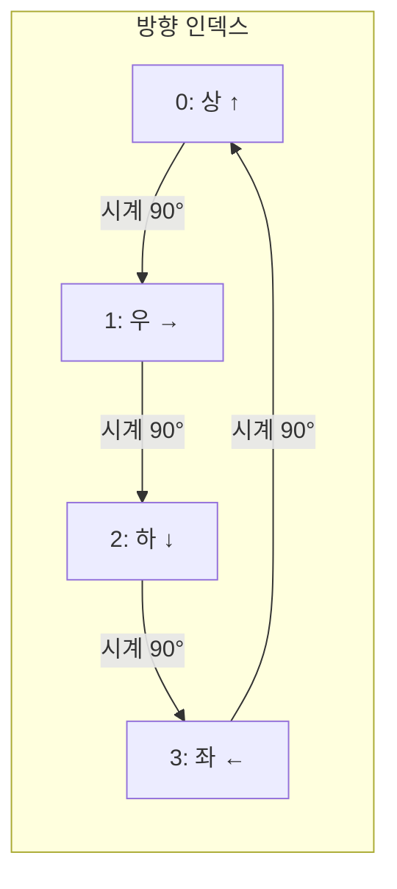
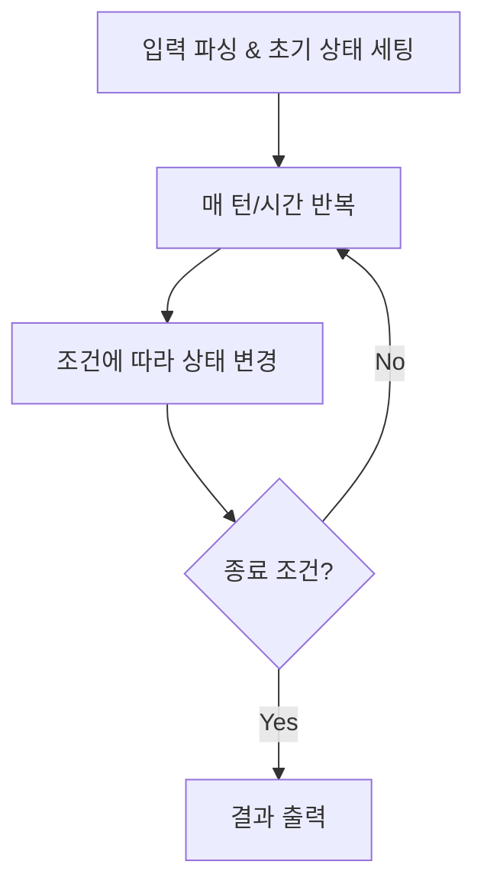

# Implementation & Simulation

구현(Implementation)은 **문제에서 요구하는 동작을 그대로 코드로 옮기는 유형**이다.

한 줄로 요약하면 다음과 같다.

```text
알고리즘보다 정확한 시뮬레이션이 핵심인 문제
```

특별한 자료구조나 알고리즘 없이도 풀 수 있지만,
조건이 많고 실수가 나기 쉬워서 체계적인 접근이 중요하다.

---

## 1. 언제 나오는가

문제에서 아래 표현이 보이면 구현/시뮬레이션을 의심하면 된다.

- 격자 위에서 이동
- 방향 회전
- 주사위, 톱니바퀴, 뱀
- 조건이 많고 복잡함
- "규칙대로 반복"
- 시간 순서대로 처리

대표 출제처:

- 삼성 SW 역량 테스트
- 카카오 1차 구현 문제
- 프로그래머스 Lv2~3 구현

---

## 2. 구현 문제의 핵심 난이도

구현 문제가 어려운 이유는 알고리즘이 아니라 다음 세 가지다.

```text
1. 조건이 많다
2. 예외가 숨어 있다
3. 코드가 길어지면 실수가 쌓인다
```

따라서 구현 문제에서는:

- 문제를 꼼꼼하게 읽고
- 동작을 단계별로 분리하고
- 각 단계를 함수로 나누는 것

이 가장 중요하다.

---

## 3. 격자 이동: 방향 배열

격자 문제에서 가장 먼저 세팅하는 것이 방향 배열이다.

### 4방향 (상하좌우)

```java
int[] dx = {-1, 1, 0, 0};
int[] dy = {0, 0, -1, 1};
```

### 8방향 (대각선 포함)

```java
int[] dx = {-1, -1, -1, 0, 0, 1, 1, 1};
int[] dy = {-1, 0, 1, -1, 1, -1, 0, 1};
```

이동은 항상 다음 형태로 처리한다.

```java
for (int d = 0; d < 4; d++) {
    int nx = x + dx[d];
    int ny = y + dy[d];

    if (nx < 0 || nx >= N || ny < 0 || ny >= M) continue;
    // 범위 안이면 처리
}
```

---

## 4. 방향 회전

시뮬레이션에서 방향을 다루는 문제는 매우 자주 나온다.

### 방향 인덱스 관례

보통 다음처럼 정한다.

```text
0: 상 (북)
1: 우 (동)
2: 하 (남)
3: 좌 (서)
```



### 시계 방향 90도 회전

```java
dir = (dir + 1) % 4;
```

### 반시계 방향 90도 회전

```java
dir = (dir + 3) % 4;
```

### 180도 회전

```java
dir = (dir + 2) % 4;
```

이 패턴은 외워야 한다.
특히 반시계를 `(dir - 1 + 4) % 4`로 써도 맞고, `(dir + 3) % 4`는 읽기가 더 단순하다.

---

## 5. 격자 회전

격자 자체를 90도 회전하는 문제도 자주 나온다.

### 시계 방향 90도

```java
int[][] rotate90(int[][] grid) {
    int n = grid.length;
    int m = grid[0].length;
    int[][] result = new int[m][n];

    for (int i = 0; i < n; i++) {
        for (int j = 0; j < m; j++) {
            result[j][n - 1 - i] = grid[i][j];
        }
    }

    return result;
}
```

핵심 공식:

```text
시계 90도: (i, j) -> (j, N-1-i)
반시계 90도: (i, j) -> (M-1-j, i)
180도: (i, j) -> (N-1-i, M-1-j)
```

---

## 6. 시뮬레이션 문제 접근법

시뮬레이션은 보통 다음 구조를 따른다.



실전 팁:

- 상태를 변수로 명확히 정의한다
- 매 턴의 동작을 함수 하나로 분리한다
- 디버깅할 때 매 턴 상태를 출력해 보면 빠르다

---

## 7. 뱀 게임 같은 시뮬레이션 예시

전형적인 시뮬레이션 구조를 요약하면 다음과 같다.

```text
1. 초기 위치, 방향 설정
2. 매 턴마다:
   a. 현재 방향으로 한 칸 이동
   b. 벽이나 자기 몸이면 종료
   c. 사과가 있으면 먹고 꼬리 유지
   d. 사과가 없으면 꼬리 줄이기
   e. 방향 전환 명령이 있으면 적용
3. 반복
```

이런 문제는 Deque로 뱀의 몸을 관리하면 편하다.

```java
Deque<int[]> snake = new ArrayDeque<>();
snake.offerFirst(new int[]{headX, headY});

// 사과가 없으면 꼬리 제거
if (!apple) {
    int[] tail = snake.pollLast();
    grid[tail[0]][tail[1]] = 0;
}
```

---

## 8. 좌표계 주의

격자 문제에서 가장 많이 실수하는 부분이 좌표계다.

### 배열 인덱스 vs 수학 좌표

```text
배열: (행, 열) = (row, col) → 아래로 갈수록 row 증가
수학: (x, y) → 위로 갈수록 y 증가
```

문제가 "위쪽 이동"이라고 하면:

- 배열 기준이면 `row - 1`
- 수학 좌표 기준이면 `y + 1`

문제를 먼저 읽고 좌표 체계를 확인한 뒤,
`dx`, `dy` 방향 배열을 그에 맞게 설정해야 한다.

---

## 9. 2차원 배열 복사

시뮬레이션에서 상태를 복사해야 하는 경우가 자주 있다.

### 주의: 얕은 복사 함정

```java
// 틀림: 1차원 배열 참조만 복사됨
int[][] copy = grid.clone();
```

### 올바른 깊은 복사

```java
int[][] copy = new int[N][M];
for (int i = 0; i < N; i++) {
    copy[i] = grid[i].clone();
}
```

혹은:

```java
int[][] copy = new int[N][M];
for (int i = 0; i < N; i++) {
    System.arraycopy(grid[i], 0, copy[i], 0, M);
}
```

---

## 10. 구현 문제에서 함수 분리의 중요성

구현 문제에서 코드가 100줄이 넘어가면 실수 확률이 급격히 올라간다.

다음처럼 동작 단위로 함수를 분리하면 디버깅이 훨씬 쉬워진다.

```java
void solve() {
    init();           // 초기 상태 설정

    for (int t = 0; t < T; t++) {
        move();       // 이동
        rotate();     // 회전
        spread();     // 확산
        clean();      // 제거
    }

    print();          // 결과 출력
}
```

각 함수는 하나의 동작만 담당한다.
이렇게 하면:

- 버그가 어느 단계에서 나는지 빠르게 특정할 수 있고
- 단계별로 중간 상태를 출력하기 쉽다

---

## 11. 삼성 스타일 문제 패턴

삼성 코테에서 자주 나오는 시뮬레이션 패턴을 정리하면 다음과 같다.

### 1) 격자 + BFS/DFS

```text
영역을 찾고, 조건에 맞는 영역을 처리
```

### 2) 격자 + 방향 이동 + 조건 분기

```text
로봇이나 물체가 조건에 따라 격자 위를 이동
```

### 3) 격자 + 확산/복사

```text
미세먼지, 바이러스 확산 같은 동시 갱신
```

동시 갱신 문제에서는 반드시:

```text
현재 상태를 읽되 새 상태에 기록한다
```

를 지켜야 한다. 같은 배열에서 읽고 쓰면 틀린다.

```java
int[][] next = deepCopy(grid);

for (int i = 0; i < N; i++) {
    for (int j = 0; j < M; j++) {
        // grid에서 읽고 next에 쓴다
    }
}

grid = next;
```

### 4) 여러 동작의 순서 조합

```text
격자 회전 + 중력 + 폭발 + 또 회전
```

각 동작을 함수로 분리하고 순서대로 호출하면 된다.

---

## 12. 문자열 파싱 구현

카카오 스타일 문제에서 자주 나오는 유형이다.

```text
특정 포맷의 문자열을 파싱해서 조건대로 처리
```

예를 들어 시간 문자열 `"12:30:45"`를 초 단위로 바꾸기:

```java
String[] parts = time.split(":");
int h = Integer.parseInt(parts[0]);
int m = Integer.parseInt(parts[1]);
int s = Integer.parseInt(parts[2]);
int totalSec = h * 3600 + m * 60 + s;
```

파싱 문제는 `split`, `substring`, `charAt`, `StringBuilder` 네 가지만 알면 거의 다 풀린다.

---

## 13. 진법 변환

구현 문제에서 간간이 나오는 유형이다.

### 10진수 -> N진수

```java
String toBaseN(int num, int n) {
    if (num == 0) return "0";

    StringBuilder sb = new StringBuilder();
    while (num > 0) {
        int r = num % n;
        sb.append(r < 10 ? (char)('0' + r) : (char)('A' + r - 10));
        num /= n;
    }

    return sb.reverse().toString();
}
```

### N진수 -> 10진수

```java
int toDecimal(String s, int n) {
    int result = 0;
    for (char c : s.toCharArray()) {
        int digit = Character.isDigit(c) ? c - '0' : c - 'A' + 10;
        result = result * n + digit;
    }
    return result;
}
```

---

## 14. 자주 하는 실수

### 1) 범위 체크를 빼먹음

격자 이동에서 `nx < 0 || nx >= N` 확인은 필수다.

### 2) 방향 인덱스와 dx/dy 매핑 불일치

```text
0이 상인데 dx[0] = 1 로 잘못 넣으면 전체가 틀린다
```

### 3) 동시 갱신을 순차 갱신으로 처리

확산이나 이동에서 읽기/쓰기를 같은 배열에 하면 안 된다.

### 4) 깊은 복사를 안 함

`clone()`만으로는 2차원 배열이 복사되지 않는다.

### 5) 문제 조건을 빠뜨림

구현 문제는 조건이 5~10개 넘는 경우가 많다.
체크리스트를 만들어 두면 좋다.

### 6) 0-indexed와 1-indexed 혼동

문제가 1-based이면 배열도 `N + 1` 크기로 만드는 편이 안전하다.

---

## 15. 실전 판단 기준

아래 신호가 보이면 구현/시뮬레이션이다.

- 격자 위에서 무언가 움직인다
- 시간 순서대로 처리한다
- 알고리즘보다 조건이 많다
- "규칙대로 반복 수행"
- 문제 자체가 게임처럼 생겼다

그리고 이런 문제에서는 다음이 가장 중요하다.

```text
빠르게 풀기보다 정확하게 풀기
```

---

## 16. 시험장용 최소 암기 버전

```text
구현/시뮬레이션:
문제 조건을 그대로 코드로 옮기기

격자 이동:
dx, dy 방향 배열 + 범위 체크

방향 회전:
시계: (dir + 1) % 4
반시계: (dir + 3) % 4

격자 회전:
시계 90도: (i,j) -> (j, N-1-i)

동시 갱신:
읽는 배열과 쓰는 배열을 분리

핵심 습관:
동작 단위로 함수 분리
```

---

## 17. 최종 요약

구현/시뮬레이션은 다음 문장으로 정리할 수 있다.

```text
특별한 알고리즘 없이
문제의 조건과 규칙을 정확하게 코드로 옮기는 유형
```

핵심만 다시 압축하면:

- 방향 배열, 범위 체크, 격자 회전 공식은 외워야 한다
- 동시 갱신 문제는 읽기/쓰기 배열을 반드시 분리한다
- 코드가 길어질수록 함수 분리가 핵심이다
- 문제 조건을 체크리스트로 만들면 실수가 줄어든다

문제를 보면 먼저 이 질문을 하면 된다.

```text
이 문제는 특정 알고리즘이 필요한가,
아니면 규칙을 정확히 옮기면 되는가?
```

규칙을 옮기는 것이 핵심이면 구현 문제다.
