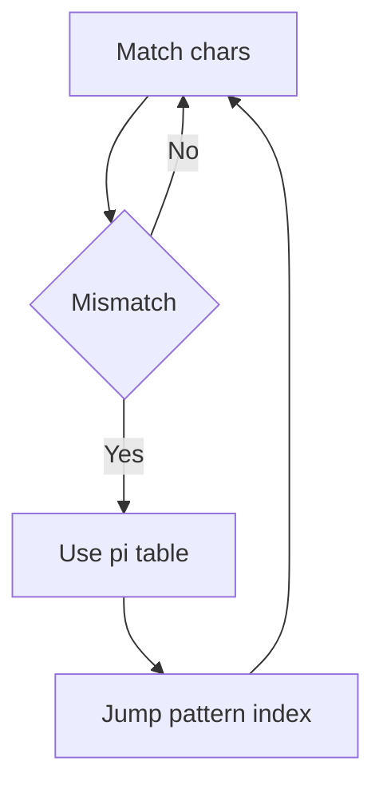
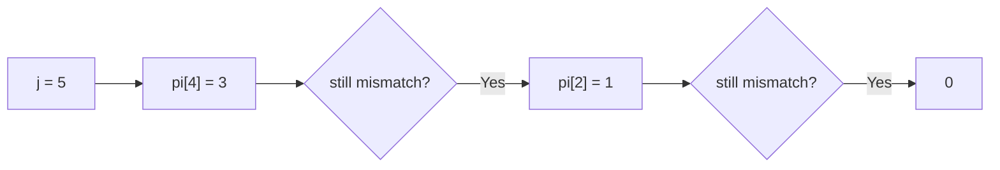

# KMP

KMP는 **문자열에서 패턴을 효율적으로 찾는 알고리즘**이다.

한 줄로 요약하면 다음과 같다.

```text
실패했을 때도 이미 맞춘 접두사 정보를 재사용해서
비교를 다시 하지 않는 문자열 탐색 알고리즘
```

즉 KMP의 핵심은:

```text
다시 처음부터 비교하지 않는다
```

는 점이다.

---

## 1. 언제 쓰는가

아래 상황이면 KMP를 떠올릴 수 있다.

- 문자열에서 패턴 찾기
- 부분 문자열 등장 여부
- 패턴 등장 횟수
- 접두사 / 접미사 정보가 중요함
- 같은 문자열 비교를 반복하면 느림

대표 문제:

- 문자열 내 패턴 출현 위치 찾기
- 반복 패턴 분석
- 광고, 문자열 제곱, 주기 문제 일부

---

## 2. 왜 일반 탐색은 비효율적인가

패턴을 찾다가 중간에 틀리면,
단순 탐색은 시작점을 한 칸 옮기고 다시 비교한다.

즉 이미 맞춘 문자들도 또 비교하게 된다.

예:

- text = `ababababca`
- pattern = `abababca`

이런 경우 앞부분이 많이 겹치므로,
단순 탐색은 중복 비교가 많아진다.

---

## 3. 핵심 아이디어

KMP는 패턴 내부의 접두사 / 접미사 정보를 이용해 점프한다.

즉 현재까지 맞춘 문자 중 일부는,
다음 비교에서도 그대로 활용할 수 있다.



즉 KMP는 불일치가 나도 text 인덱스를 크게 되돌리지 않고,
pattern 쪽 포인터만 효율적으로 이동시킨다.

---

## 4. pi 배열이란 무엇인가

`pi[i]`는 패턴의 `0..i` 구간에서,
접두사이면서 접미사인 것의 최대 길이다.

말이 어려우면 이렇게 보면 된다.

```text
앞부분과 뒷부분이 얼마나 겹치나?
```

예:

```text
pattern = ababa
pi      = 0 0 1 2 3
```

왜냐하면:

- `a` -> 겹침 0
- `ab` -> 겹침 0
- `aba` -> `a` 겹침 -> 1
- `abab` -> `ab` 겹침 -> 2
- `ababa` -> `aba` 겹침 -> 3

이 감각이 가장 중요하다.

---

## 5. pi 배열을 왜 쓰는가

패턴을 맞추다가 `j` 위치에서 실패했다고 하자.
그때 패턴의 앞부분 중 일부는 이미 text와 맞았다는 사실을 알고 있다.

따라서 완전히 처음으로 돌아가지 않고,

```java
j = pi[j - 1]
```

로 점프할 수 있다.

즉 이미 맞춘 접두사 정보를 재사용하는 것이다.

---

## 6. pi 배열 만들기


```java
int[] getPi(String p) {
    int n = p.length();
    int[] pi = new int[n];
    int j = 0;

    for (int i = 1; i < n; i++) {
        while (j > 0 && p.charAt(i) != p.charAt(j)) {
            j = pi[j - 1];
        }

        if (p.charAt(i) == p.charAt(j)) {
            pi[i] = ++j;
        }
    }

    return pi;
}
```

### 해석

- `i`: 새로 확인하는 위치
- `j`: 현재까지 맞춘 접두사 길이
- mismatch가 나면 `j = pi[j - 1]`로 점프
- match가 나면 접두사 길이를 1 늘린다

---

## 7. pi 배열 손으로 만들어 보기

패턴:

```text
ababaca
```

인덱스별로 보면:

- `a` -> 0
- `ab` -> 0
- `aba` -> `a` 겹침 -> 1
- `abab` -> `ab` 겹침 -> 2
- `ababa` -> `aba` 겹침 -> 3
- `ababac` -> 겹침 없음 -> 0으로 떨어짐
- `ababaca` -> `a` 겹침 -> 1

즉:

```text
pi = [0, 0, 1, 2, 3, 0, 1]
```

```text
인덱스:  0  1  2  3  4  5  6
문자:    a  b  a  b  a  c  a
pi:      0  0  1  2  3  0  1
         │        ↗        │
         └──────── 접두사 a와 접미사 a가 겹침 ────────┘

    "abab" → 접두사 "ab" = 접미사 "ab" → pi[3] = 2
    "ababa" → 접두사 "aba" = 접미사 "aba" → pi[4] = 3
```

---

## 8. KMP 탐색

```java
List<Integer> kmp(String text, String pattern) {
    int[] pi = getPi(pattern);
    List<Integer> result = new ArrayList<>();
    int j = 0;

    for (int i = 0; i < text.length(); i++) {
        while (j > 0 && text.charAt(i) != pattern.charAt(j)) {
            j = pi[j - 1];
        }

        if (text.charAt(i) == pattern.charAt(j)) {
            if (j == pattern.length() - 1) {
                result.add(i - pattern.length() + 2); // 1-based index
                j = pi[j];
            } else {
                j++;
            }
        }
    }

    return result;
}
```

이 코드를 읽을 때 핵심은 `i`와 `j`의 역할을 분리해서 보는 것이다.

- `i`: text를 한 번만 왼쪽에서 오른쪽으로 훑는 포인터
- `j`: pattern에서 현재 몇 글자까지 맞았는지 나타내는 포인터

즉 KMP는 text를 다시 읽는 것이 아니라,
pattern 쪽 정렬만 다시 맞춘다고 생각하면 이해가 쉬워진다.

### KMP 매칭 과정 예시

```text
text:    a b a b a c d a b a b a c a
pattern: a b a b a c a
         ↑ ↑ ↑ ↑ ↑ ✓   j=5까지 매치, j=6에서 mismatch (d ≠ a)

→ j = pi[5-1] = pi[4] = 3  (aba 접두사가 겹침)
→ pattern을 2칸 밀어서 다시 비교:

text:    a b a b a c d a b a b a c a
             a b a b a c a
                 ↑ 여기(j=3)부터 이어서 비교
                 이미 매치된 "aba"를 다시 비교하지 않는다
```

이것이 KMP가 O(N + M)인 이유다. text의 `i`는 절대 뒤로 가지 않는다.

---

## 9. 탐색을 어떻게 이해하면 좋은가

`i`는 text를 한 번만 왼쪽에서 오른쪽으로 본다.
`j`는 pattern에서 현재까지 맞춘 길이를 뜻한다.

- match면 `j++`
- mismatch면 `j = pi[j - 1]`
- 완전 매칭이면 정답 기록 후 `j = pi[j]`

즉 text 인덱스를 되돌리지 않고,
pattern 쪽만 효율적으로 재배치한다.

이 점 때문에 KMP는 단순 탐색보다 훨씬 빠르다.
앞에서 힘들게 맞춘 정보를 버리지 않기 때문이다.

### mismatch가 났을 때 `j`가 어떻게 줄어드나

예를 들어 패턴이 `ababaca`이고,
현재 `j = 5`까지 맞춘 상태에서 다음 문자가 틀렸다고 하자.

KMP는 다시 처음으로 가지 않고
`pi`를 따라 "지금까지 맞춘 접두사 중 다음 후보"로 바로 이동한다.



핵심은 text를 다시 읽는 것이 아니라,
패턴 내부의 겹침만 따라 내려간다는 점이다.

그래서 `i`는 뒤로 가지 않고도
다음 유효한 정렬 위치를 곧바로 찾을 수 있다.

---

## 10. 매칭 완료 후 왜 `j = pi[j]`인가

패턴 하나를 찾았다고 끝이 아닐 수 있다.
겹치는 다음 패턴도 찾아야 할 수 있다.

예:

- text = `aaaaa`
- pattern = `aaa`

정답은 시작 위치가 1, 2, 3이다.

이런 겹침 매칭을 놓치지 않으려면,
매칭 완료 후에도 접두사 정보를 이용해 `j`를 옮겨야 한다.

즉 `j = pi[j]`는 단순한 코드 한 줄이 아니라,
"다음 후보 시작점을 접두사 정보로 바로 맞춘다"는 뜻이다.

---

## 11. 시간 복잡도

- pi 배열 생성: `O(M)`
- 탐색: `O(N)`

즉 전체:

```text
O(N + M)
```

이다.

KMP가 강력한 이유는 중복 비교를 제거해 선형 시간에 동작한다는 점이다.

---

## 12. 자주 하는 실수

### 1) mismatch 시 `j = pi[j - 1]`를 안 함

KMP의 핵심을 놓치는 것이다.

### 2) 패턴 매칭 완료 후 `j = pi[j]`를 빼먹음

겹치는 패턴을 놓칠 수 있다.

### 3) 인덱스 0-based / 1-based 혼동

문제 출력 형식에 따라 시작 위치 계산을 주의해야 한다.

### 4) pi 배열 의미를 외우기만 하고 이해하지 못함

접두사 / 접미사 겹침이라는 감각이 있어야 응용이 된다.

---

## 13. 시험장용 최소 암기 버전

```text
KMP:
문자열 패턴 탐색 O(N + M)

핵심:
pi 배열
불일치 시 j = pi[j - 1]

pi 의미:
접두사이면서 접미사인 최대 길이
```

---

## 14. 최종 요약

KMP는 다음 문장으로 정리할 수 있다.

```text
패턴의 접두사 / 접미사 정보를 이용해
중복 비교를 피하는 선형 문자열 탐색 알고리즘
```

문제를 보면 먼저 이 질문을 하면 된다.

```text
문자열 비교 실패 후,
이미 맞춘 정보 중 재사용할 수 있는 부분이 있는가?
```

이 감각이 KMP의 핵심이다.
