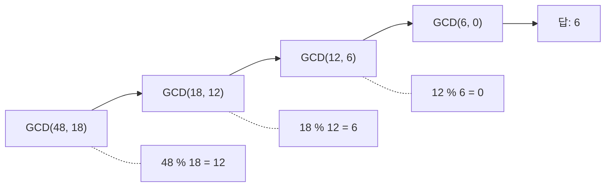
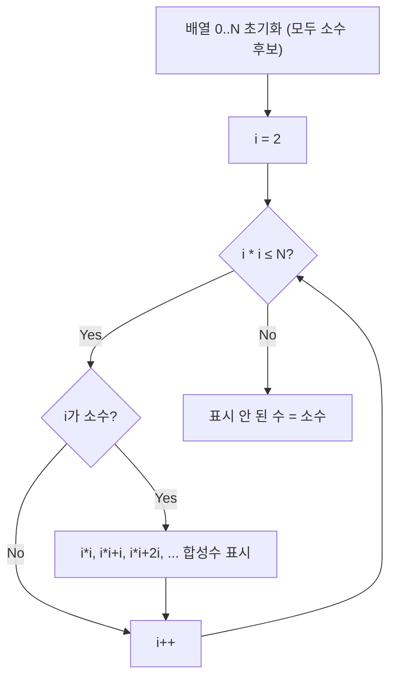
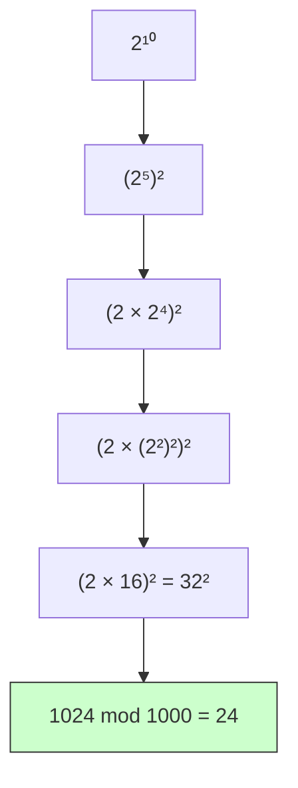

# Math / Number Theory

수학 및 정수론은 코딩테스트에서 **반복적으로 출제되는 기초 수학 개념과 공식**을 다룬다.

한 줄로 요약하면 다음과 같다.

```text
GCD, 소수 판별, 모듈러 연산, 조합론 등
알고리즘의 기반이 되는 수학 도구들
```

---

## 1. 언제 쓰는가

| 상황 | 관련 개념 |
| --- | --- |
| 최대공약수 / 최소공배수 구하기 | 유클리드 호제법 |
| 소수 판별, 소수 목록 생성 | 에라토스테네스의 체 |
| 큰 수의 연산에서 나머지 출력 | 모듈러 연산 |
| 경우의 수 계산 (nCr, nPr) | 조합론 + 모듈러 역원 |
| 거듭제곱 빠르게 계산 | 분할 정복 거듭제곱 |
| 약수 개수, 합 구하기 | 약수 열거 |

---

## 2. 유클리드 호제법 (GCD)

최대공약수를 구하는 가장 효율적인 방법이다.

핵심 아이디어:

```text
GCD(a, b) = GCD(b, a % b)
a % b == 0이면 b가 GCD
```


```java
int gcd(int a, int b) {
    while (b != 0) {
        int temp = b;
        b = a % b;
        a = temp;
    }
    return a;
}
```

### 재귀 버전

```java
int gcd(int a, int b) {
    return b == 0 ? a : gcd(b, a % b);
}
```

### 최소공배수 (LCM)

```java
int lcm(int a, int b) {
    return a / gcd(a, b) * b; // overflow 방지: 나누기를 먼저
}
```

### 손 계산 예시

```text
GCD(48, 18)
= GCD(18, 48 % 18) = GCD(18, 12)
= GCD(12, 18 % 12) = GCD(12, 6)
= GCD(6, 12 % 6)   = GCD(6, 0)
= 6
```



나머지가 0이 되는 순간 계산이 끝나고,
그 직전의 나누는 수가 최대공약수라는 점이 유클리드 호제법의 핵심이다.

---

## 3. 소수 판별

### 단일 수 판별: O(√N)

```java
boolean isPrime(int n) {
    if (n < 2) return false;
    for (int i = 2; i * i <= n; i++) {
        if (n % i == 0) return false;
    }
    return true;
}
```

핵심: `i * i <= n`까지만 확인하면 된다.
N = 36이면 6까지만 보면 되는 이유는,
약수 쌍 (2, 18), (3, 12), (4, 9), (6, 6)에서 한쪽은 반드시 √N 이하이기 때문이다.

---

## 4. 에라토스테네스의 체

범위 내 모든 소수를 구하는 알고리즘이다.

핵심 아이디어:

```text
2부터 시작하여 소수의 배수를 모두 지운다
→ 남은 수가 소수
```


```java
boolean[] sieve(int maxN) {
    boolean[] isComposite = new boolean[maxN + 1];
    isComposite[0] = isComposite[1] = true;

    for (int i = 2; i * i <= maxN; i++) {
        if (!isComposite[i]) {
            for (int j = i * i; j <= maxN; j += i) {
                isComposite[j] = true;
            }
        }
    }
    return isComposite;
}
```

시간 복잡도: **O(N log log N)** ≈ 사실상 O(N)에 가깝다.

### 손 계산 예시 (N = 30)

```text
초기:  2  3  4  5  6  7  8  9 10 11 12 13 14 15 16 17 18 19 20 21 22 23 24 25 26 27 28 29 30

i=2: 4, 6, 8, 10, 12, 14, 16, 18, 20, 22, 24, 26, 28, 30 제거
i=3: 9, 15, 21, 27 제거
i=5: 25 제거

남은 소수: 2, 3, 5, 7, 11, 13, 17, 19, 23, 29
```



여기서 `i * i`부터 시작하는 이유는,
`2i`, `3i`, ..., `(i-1)i` 같은 배수는 이미 더 작은 소수 단계에서 지워졌기 때문이다.

---

## 5. 모듈러 연산

코테에서 `"답을 1,000,000,007로 나눈 나머지를 출력하라"` 같은 문제가 매우 많다.

### 기본 성질

```text
(a + b) % M = ((a % M) + (b % M)) % M
(a - b) % M = ((a % M) - (b % M) + M) % M
(a * b) % M = ((a % M) * (b % M)) % M
```

뺄셈에서 `+ M`하는 이유: 음수 방지.

### 나눗셈은 직접 안 된다

```text
(a / b) % M ≠ ((a % M) / (b % M)) % M
```

대신 **모듈러 역원**을 사용해야 한다.

---

## 6. 분할 정복 거듭제곱

$a^n \mod M$을 O(log N)에 계산한다.

핵심 아이디어:

```text
a^n = (a^(n/2))^2          (n이 짝수)
a^n = a * (a^(n/2))^2      (n이 홀수)
```


```java
long power(long base, long exp, long mod) {
    long result = 1;
    base %= mod;

    while (exp > 0) {
        if ((exp & 1) == 1) {
            result = result * base % mod;
        }
        base = base * base % mod;
        exp >>= 1;
    }
    return result;
}
```

### 손 계산 예시

```text
2^10 mod 1000
= (2^5)^2 mod 1000
= (2 * (2^2)^2)^2 mod 1000
= (2 * 16)^2 mod 1000
= 32^2 mod 1000
= 1024 mod 1000
= 24
```



이렇게 지수를 반씩 줄이므로 곱셈 횟수가 O(log N)이 된다.

---

## 7. 모듈러 역원

$\frac{a}{b} \mod M$을 계산하려면 $b$의 모듈러 역원 $b^{-1}$을 구해야 한다.

**페르마 소정리**: M이 소수이면

$$b^{-1} \equiv b^{M-2} \pmod{M}$$

왜 이게 성립하는가? 페르마 소정리에 의해 $b^{M-1} \equiv 1 \pmod{M}$이다.
양변을 $b$로 나누면 $b^{M-2} \equiv b^{-1} \pmod{M}$이 된다.
즉 $b \times b^{M-2} \equiv 1 \pmod{M}$이므로 $b^{M-2}$가 곱셈의 역원이다.

```java
long modInverse(long b, long mod) {
    return power(b, mod - 2, mod);
}

// a / b mod M
long divMod(long a, long b, long mod) {
    return a % mod * modInverse(b, mod) % mod;
}
```

---

## 8. 조합론 (nCr)

### 파스칼의 삼각형: O(N²)

```java
long[][] comb = new long[N + 1][N + 1];
for (int i = 0; i <= N; i++) {
    comb[i][0] = 1;
    for (int j = 1; j <= i; j++) {
        comb[i][j] = (comb[i - 1][j - 1] + comb[i - 1][j]) % MOD;
    }
}
```

점화식: $\binom{n}{r} = \binom{n-1}{r-1} + \binom{n-1}{r}$

```text
파스칼 삼각형 (n=0~4):

         1              C(0,0) = 1
        1 1              C(1,0)=1  C(1,1)=1
       1 2 1             C(2,1) = C(1,0)+C(1,1) = 2
      1 3 3 1            C(3,2) = C(2,1)+C(2,2) = 3
     1 4 6 4 1           C(4,2) = C(3,1)+C(3,2) = 6
```

이 방법은 N이 작을 때 (N ≤ 2000 정도) 사용한다.

### 팩토리얼 + 역원: O(N)

N이 큰 경우 (N ≤ 10^6) 팩토리얼을 전처리해서 사용한다.

$$\binom{n}{r} = \frac{n!}{r! \cdot (n-r)!} \mod M$$

```java
static final long MOD = 1_000_000_007;
long[] fact, invFact;

void precompute(int n) {
    fact = new long[n + 1];
    invFact = new long[n + 1];
    fact[0] = 1;
    for (int i = 1; i <= n; i++) {
        fact[i] = fact[i - 1] * i % MOD;
    }
    invFact[n] = power(fact[n], MOD - 2, MOD);
    for (int i = n - 1; i >= 0; i--) {
        invFact[i] = invFact[i + 1] * (i + 1) % MOD;
    }
}

long nCr(int n, int r) {
    if (r < 0 || r > n) return 0;
    return fact[n] % MOD * invFact[r] % MOD * invFact[n - r] % MOD;
}
```

핵심 트릭: 역팩토리얼을 뒤에서부터 채운다.

```text
invFact[n] = (n!)^(M-2)
invFact[i] = invFact[i+1] * (i+1)  (왜? invFact[i] = 1/i! = (i+1)/((i+1)!) = (i+1) * invFact[i+1])
```

---

## 9. 약수 열거

N의 모든 약수를 구하는 방법이다.

```java
List<Integer> getDivisors(int n) {
    List<Integer> divisors = new ArrayList<>();
    for (int i = 1; i * i <= n; i++) {
        if (n % i == 0) {
            divisors.add(i);
            if (i != n / i) {
                divisors.add(n / i);
            }
        }
    }
    return divisors;
}
```

시간 복잡도: **O(√N)**

---

## 10. 소인수분해

```java
Map<Integer, Integer> factorize(int n) {
    Map<Integer, Integer> factors = new HashMap<>();
    for (int i = 2; i * i <= n; i++) {
        while (n % i == 0) {
            factors.merge(i, 1, Integer::sum);
            n /= i;
        }
    }
    if (n > 1) {
        factors.put(n, 1);
    }
    return factors;
}
```

이것도 O(√N)이다.

---

## 11. 자주 출제되는 수학 패턴

### 1) 두 수의 GCD/LCM

직접 유클리드 호제법 적용.

### 2) N개 수의 GCD/LCM

```java
int gcdAll = arr[0];
long lcmAll = arr[0];
for (int i = 1; i < n; i++) {
    gcdAll = gcd(gcdAll, arr[i]);
    lcmAll = lcm(lcmAll, arr[i]); // overflow 주의
}
```

### 3) 경우의 수 mod 출력

팩토리얼 전처리 + nCr 사용.

### 4) "나누어 떨어지는 수의 개수"

약수 열거 또는 에라토스테네스 응용.

### 5) 거듭제곱 mod

분할 정복 거듭제곱.

---

## 12. 주의사항

### 1) `int` overflow

GCD는 괜찮지만, LCM은 쉽게 overflow된다.
`long`을 쓰자.

```java
long lcm = (long) a / gcd(a, b) * b;
```

### 2) 모듈러 연산에서 뺄셈

```java
(a - b) % MOD  // 음수 가능!
((a - b) % MOD + MOD) % MOD  // 안전
```

### 3) nCr에서 r > n 체크

r > n이면 0이다. 이걸 안 하면 배열 인덱스 오류가 난다.

### 4) 나눗셈에 모듈러 직접 적용

나눗셈은 모듈러 역원을 써야 한다. 직접 나누면 틀린다.

---

## 13. 자주 하는 실수

### 1) `a * b % MOD`에서 중간 곱셈 overflow

`a`와 `b`가 둘 다 int 범위이면 곱셈이 long 범위를 넘을 수 있다.
`long`으로 캐스팅하자.

```java
long result = (long) a * b % MOD;
```

### 2) 체를 칠 때 `j = i * 2`가 아니라 `j = i * i`

`i * (i-1)` 이하는 이미 이전 소수에서 지워졌다.
`j = i * i`부터 시작해야 효율적이다.

### 3) GCD에 음수를 넣음

`Math.abs()`로 양수를 보장하자.

---

## 14. 시험장용 최소 암기 버전

```text
GCD:
int gcd(int a, int b) { return b == 0 ? a : gcd(b, a % b); }

LCM:
a / gcd(a,b) * b  (나누기 먼저)

소수 판별:
for (i = 2; i*i <= n; i++)

에라토스테네스:
for (i = 2; i*i <= n) → for (j = i*i; j <= n; j += i)

거듭제곱 mod:
while (exp > 0) { if (odd) result *= base; base *= base; exp >>= 1; }

모듈러 역원 (M이 소수):
b^(M-2) mod M

nCr mod:
fact[] 전처리 + invFact[] 역순 구성

모듈러 뺄셈:
(a - b % MOD + MOD) % MOD
```

---

## 15. 최종 요약

수학/정수론은 다음 문장으로 정리할 수 있다.

```text
GCD, 소수, 모듈러 연산, 조합론은
코테에서 반복 출제되는 필수 수학 도구
```

문제에서 `"답을 10^9 + 7로 나눈 나머지"`, `"약수"`, `"소수"`, `"경우의 수"` 같은 키워드가 나오면
이 도구들을 떠올리면 된다.
