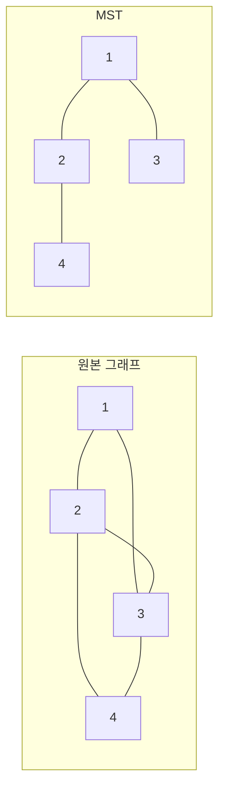
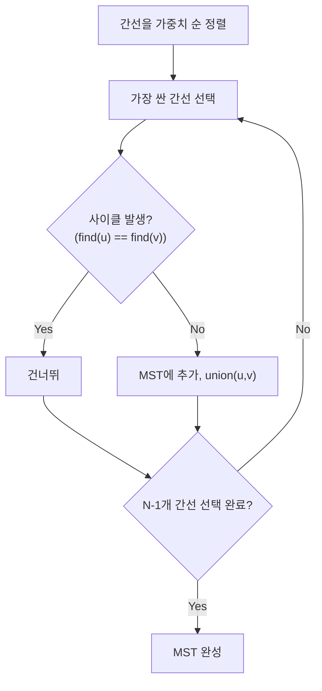
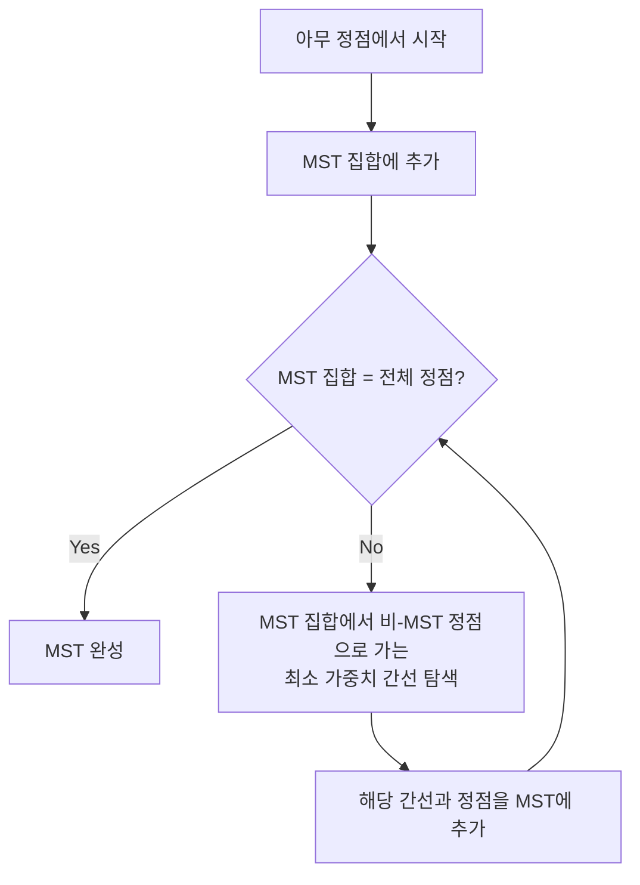

# MST (Minimum Spanning Tree)

최소 신장 트리(MST)는 **그래프의 모든 정점을 연결하면서 간선 가중치의 합이 최소인 트리**다.

한 줄로 요약하면 다음과 같다.

```text
N개 정점을 N-1개 간선으로 연결하는
가중치 합 최소의 트리
```

---

## 1. 언제 쓰는가

| 상황 | 이유 |
| --- | --- |
| 모든 도시를 최소 비용으로 연결 | 전형적인 MST |
| 네트워크 케이블 최소 비용 | 연결 비용 최소화 |
| 간선을 제거하며 최소 비용 유지 | MST 성질 활용 |
| 클러스터링 | 가장 비싼 간선 K-1개 제거 → K개 그룹 |

---

## 2. 신장 트리란

신장 트리(Spanning Tree)는:

```text
1. 그래프의 모든 정점을 포함하고
2. 사이클이 없으며
3. 연결되어 있는 부분 그래프
```

정점이 N개면 간선은 정확히 **N-1개**다.



왼쪽 그래프는 연결은 되어 있지만 사이클이 있고,
오른쪽은 모든 정점을 유지하면서 불필요한 간선만 제거한 최소 연결 구조다.

---

## 3. Kruskal 알고리즘

Kruskal은 **간선을 가중치 기준 오름차순 정렬한 뒤, 사이클을 만들지 않는 간선만 선택**하는 그리디 알고리즘이다.

### 핵심 아이디어

```text
1. 모든 간선을 가중치 기준 오름차순 정렬
2. 가장 가벼운 간선부터 선택
3. 사이클이 생기면 건너뜀 (Union-Find로 판단)
4. N-1개 간선을 선택하면 종료
```


```java
static int[] parent, rank;

int find(int x) {
    if (parent[x] != x) parent[x] = find(parent[x]);
    return parent[x];
}

boolean union(int a, int b) {
    a = find(a);
    b = find(b);
    if (a == b) return false;
    if (rank[a] < rank[b]) { int t = a; a = b; b = t; }
    parent[b] = a;
    if (rank[a] == rank[b]) rank[a]++;
    return true;
}

long kruskal(int n, int[][] edges) {
    // edges[i] = {u, v, weight}
    Arrays.sort(edges, (a, b) -> Integer.compare(a[2], b[2]));

    parent = new int[n + 1];
    rank = new int[n + 1];
    for (int i = 1; i <= n; i++) parent[i] = i;

    long totalWeight = 0;
    int edgeCount = 0;

    for (int[] edge : edges) {
        int u = edge[0], v = edge[1], w = edge[2];
        if (union(u, v)) {
            totalWeight += w;
            edgeCount++;
            if (edgeCount == n - 1) break;
        }
    }

    return totalWeight;
}
```

시간 복잡도: **O(E log E)** (정렬이 지배적)

### 손 계산 예시

```text
정점: {1, 2, 3, 4}
간선 (정렬 후):
  (1,2,1)  (1,3,2)  (2,4,3)  (3,4,4)  (2,3,5)

1단계: (1,2,1) → 선택, union(1,2) ✓
2단계: (1,3,2) → 선택, union(1,3) ✓
3단계: (2,4,3) → 선택, union(2,4) ✓
4단계: 3개 간선 선택 완료 (N-1 = 3)

MST 가중치 합 = 1 + 2 + 3 = 6
```



Kruskal의 핵심은 매번 가장 싼 간선을 보더라도
사이클만 만들지 않으면 전체 최적해를 해치지 않는다는 점이다.

---

## 4. Prim 알고리즘

Prim은 **하나의 정점에서 시작하여, 현재 트리에 연결된 간선 중 가장 가벼운 것을 선택**하는 알고리즘이다.

### 핵심 아이디어

```text
1. 시작 정점을 트리에 포함
2. 트리에 연결된 간선 중 가장 가벼운 것을 선택
3. 선택한 간선의 반대 쪽 정점을 트리에 포함
4. N-1개 간선을 선택하면 종료
```

### PriorityQueue 방식

```java
long prim(int n, List<int[]>[] graph) {
    // graph[u] = list of {v, weight}
    boolean[] visited = new boolean[n + 1];
    PriorityQueue<int[]> pq = new PriorityQueue<>((a, b) -> Integer.compare(a[1], b[1]));

    visited[1] = true;
    for (int[] edge : graph[1]) {
        pq.offer(edge);
    }

    long totalWeight = 0;
    int edgeCount = 0;

    while (!pq.isEmpty() && edgeCount < n - 1) {
        int[] cur = pq.poll();
        int v = cur[0], w = cur[1];

        if (visited[v]) continue;

        visited[v] = true;
        totalWeight += w;
        edgeCount++;

        for (int[] edge : graph[v]) {
            if (!visited[edge[0]]) {
                pq.offer(edge);
            }
        }
    }

    return totalWeight;
}
```

시간 복잡도: **O(E log V)** (PriorityQueue 사용 시)

### Prim 알고리즘 흐름도



Prim은 "간선 전체를 정렬해 놓고 고르는 방식"이 아니라,
현재까지 만든 트리의 바깥으로 나가는 간선 중 가장 싼 것만 계속 확장해 나가는 방식이다.

### 손 계산 예시

```text
정점: {1, 2, 3, 4}
인접 리스트:
  1: (2,1), (3,2)
  2: (1,1), (3,5), (4,3)
  3: (1,2), (2,5), (4,4)
  4: (2,3), (3,4)

시작: 정점 1
PQ: [(2,1), (3,2)]

1단계: poll (2,1) → 정점 2 방문, PQ에 (3,5),(4,3) 추가
       totalWeight = 1
2단계: poll (3,2) → 정점 3 방문, PQ에 (4,4) 추가
       totalWeight = 3
3단계: poll (4,3) → 정점 4 방문
       totalWeight = 6
4단계: 3개 간선 선택 완료

MST 가중치 합 = 6
```

---

## 5. Kruskal vs Prim 비교

| | Kruskal | Prim |
| --- | --- | --- |
| 접근 방식 | 간선 기반 (전체 정렬) | 정점 기반 (확장) |
| 자료구조 | Union-Find | PriorityQueue |
| 시간 복잡도 | O(E log E) | O(E log V) |
| 유리한 경우 | 간선이 적은 희소 그래프 | 간선이 많은 밀집 그래프 |
| 구현 난이도 | Union-Find만 있으면 쉬움 | 약간 더 복잡 |

코테에서는 **Kruskal이 더 자주 쓰인다**. Union-Find 구현이 단순하고 재활용할 수 있기 때문이다.

---

## 6. MST의 핵심 성질

### 1) Cut Property

임의의 컷(두 그룹으로 나누기)에서
가중치가 **유일하게 가장 작은 간선**은 모든 MST에 포함된다.

동률이 있다면 최소 간선들 중 적어도 하나는 어떤 MST에 포함된다.

### 2) Cycle Property

임의의 사이클에서
가중치가 **유일하게 가장 큰 간선**은 어떤 MST에도 포함되지 않는다.

동률이 있다면 그 최대 간선 중 일부는 MST에 들어갈 수도 있다.

### 3) 유일성

모든 간선 가중치가 다르면 MST는 유일하다.

---

## 7. 클러스터링 문제에의 응용

N개 점을 K개 그룹으로 나누되, 그룹 간 거리가 최대가 되게 하려면:

```text
1. MST를 구한다
2. MST에서 가장 비싼 간선 K-1개를 제거한다
3. K개의 연결 컴포넌트가 클러스터가 된다
```

이것은 **Kruskal을 변형**하면 된다.
N-1개가 아니라 **N-K개 간선만 선택**하면 된다.

```java
// K개 클러스터: N-K개 간선만 선택
for (int[] edge : edges) {
    int u = edge[0], v = edge[1], w = edge[2];
    if (union(u, v)) {
        edgeCount++;
        if (edgeCount == n - k) break; // K개 그룹
    }
}
```

---

## 8. 간선 가중치가 같을 때

가중치가 같은 간선이 있으면 MST가 여러 개 존재할 수 있다.
문제에서 "MST의 가중치 합"을 물으면 어떤 MST든 합은 같으므로 상관없다.
그러나 "MST의 개수"를 물으면 별도의 분석이 필요하다.

---

## 9. BOJ/코테 빈출 유형

| 유형 | 설명 |
| --- | --- |
| 기본 MST | 주어진 그래프에서 MST 가중치 합 구하기 |
| 조건부 MST | 특정 간선을 반드시 포함/제외하는 MST |
| 클러스터링 | MST 변형으로 K개 그룹 나누기 |
| 네트워크 연결 | 이미 연결된 간선이 있는 상태에서 추가 연결 |
| 좌표 MST | 2차원 좌표점들의 MST (보통 맨해튼 거리) |

---

## 10. 자주 하는 실수

### 1) Union-Find 초기화를 안 함

```java
for (int i = 1; i <= n; i++) parent[i] = i;
```

이걸 빠뜨리면 전부 0으로 같은 그룹 취급된다.

### 2) 간선 개수 체크를 안 함

N-1개 간선이 선택되지 않으면 그래프가 비연결이다.
이때 MST는 존재하지 않는다.

```java
if (edgeCount < n - 1) {
    // 그래프가 연결되지 않음
}
```

### 3) 양방향 간선을 한 번만 넣음

Kruskal에서는 간선 리스트 기반이므로 (u, v, w) 한 번만 넣으면 된다.
Prim에서는 인접 리스트에 양방향으로 넣어야 한다.

### 4) 1-indexed vs 0-indexed 혼동

정점 번호가 1부터 시작하면 배열도 n+1로 만들자.

---

## 11. 시험장용 최소 암기 버전

```text
Kruskal:
1. 간선 가중치 정렬
2. Union-Find로 사이클 체크
3. N-1개 간선 선택

Prim:
1. 시작 정점 방문
2. PQ에서 최소 가중치 간선 poll
3. 미방문 정점이면 추가

Union-Find:
find(x): 경로 압축
union(a,b): 랭크 기준 합치기

클러스터링:
Kruskal에서 N-K개만 선택
```

---

## 12. 최종 요약

MST는 다음 문장으로 정리할 수 있다.

```text
모든 정점을 최소 비용으로 연결하는 트리
Kruskal = 간선 정렬 + Union-Find
Prim = PQ로 확장
```

문제를 보면 이 질문을 하면 된다.

```text
"모든 정점을 연결하되 비용을 최소로 해야 하는가?"
→ 그렇다면 MST다
```

Kruskal이 Union-Find만 있으면 구현이 간단하므로,
코테에서는 Kruskal을 기본으로 준비하면 된다.
