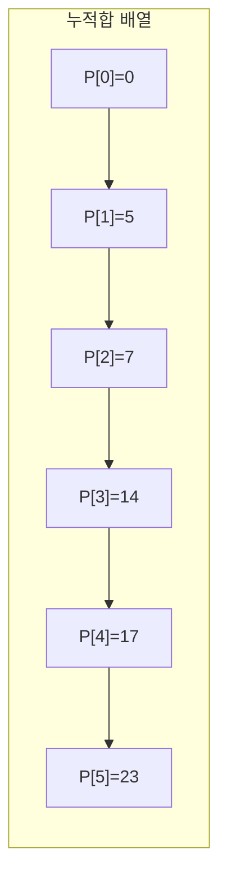
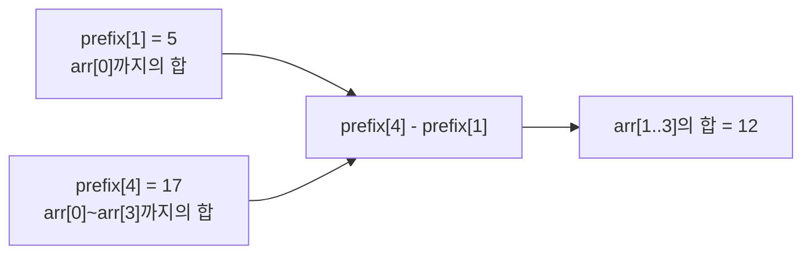
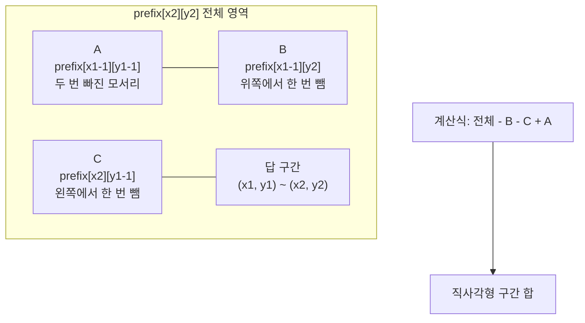

# Prefix Sum

누적합(Prefix Sum)은 **배열의 앞에서부터 합을 미리 저장해 두고, 구간 합을 빠르게 계산하는 기법**이다.

한 줄로 요약하면 다음과 같다.

```text
한 번 미리 더해 두고
여러 번 빠르게 꺼내 쓰는 기법
```

---

## 1. 언제 쓰는가

문제에서 아래 표현이 보이면 누적합을 먼저 떠올리면 된다.

- 구간 합
- 연속 부분 배열의 합
- 여러 번의 합 쿼리
- 2차원 직사각형 합
- 부분합 개수 세기
- 합이 K인 구간 수
- 나머지가 같은 부분합

누적합은 특히 다음 상황에서 강력하다.

```text
구간 합을 여러 번 물어보는데
매번 처음부터 더하면 너무 느릴 때
```

---

## 2. 핵심 아이디어

배열이 다음과 같다고 하자.

```text
arr = [5, 2, 7, 3, 6]
```

이때 `prefix[i]`를:

```text
arr의 처음부터 i개 원소의 합
```

으로 정의하자.

그러면:

```text
prefix[0] = 0
prefix[1] = 5
prefix[2] = 7
prefix[3] = 14
prefix[4] = 17
prefix[5] = 23
```

이제 구간 합 `arr[l..r]`은 다음처럼 한 번에 구할 수 있다.

```text
prefix[r + 1] - prefix[l]
```

즉 매번 구간을 다시 더하지 않아도 된다.



누적합은 이 그림처럼 앞에서부터 합을 쌓아 두고, 필요한 구간은 두 누적합의 차이로 꺼내는 구조다.

예를 들어 `arr[1..3]`의 합은 `prefix[4] - prefix[1] = 17 - 5 = 12`다.

---

## 3. 왜 빠른가

예를 들어 길이 `N` 배열에서 구간 합 질문이 `M`번 들어온다고 하자.

매번 직접 더하면:

```text
O(N) x M
```

이 걸릴 수 있다.

하지만 누적합을 한 번 만들면:

- 전처리: `O(N)`
- 각 구간 합: `O(1)`

이 된다.

즉 전체가:

```text
O(N + M)
```

수준으로 줄어든다.

---

## 4. 1차원 누적합 기본 정의

실전에서 가장 많이 쓰는 정의는 다음이다.

```java
prefix[i] = arr[0] + arr[1] + ... + arr[i - 1]
```

즉 `prefix`를 한 칸 더 크게 만들어:

- `prefix[0] = 0`
- `prefix[1] = arr[0]`
- `prefix[2] = arr[0] + arr[1]`

처럼 관리한다.

이 방식이 좋은 이유는 구간 합 공식이 깔끔해지기 때문이다.

```java
sum(l, r) = prefix[r + 1] - prefix[l]
```

---

## 5. 1차원 누적합 구현


```java
int[] arr = {5, 2, 7, 3, 6};
int n = arr.length;
long[] prefix = new long[n + 1];

for (int i = 0; i < n; i++) {
    prefix[i + 1] = prefix[i] + arr[i];
}

int l = 1;
int r = 3;
long sum = prefix[r + 1] - prefix[l]; // arr[1] + arr[2] + arr[3]
```

`long`을 쓰는 이유는 합이 커질 수 있기 때문이다.

---

## 6. 작은 예시로 이해하기

배열:

```text
arr = [5, 2, 7, 3, 6]
```

누적합:

```text
prefix = [0, 5, 7, 14, 17, 23]
```

이제 구간 `[1, 3]`의 합을 구해 보자.

```text
arr[1] + arr[2] + arr[3] = 2 + 7 + 3 = 12
```

공식으로는:

```text
prefix[4] - prefix[1] = 17 - 5 = 12
```

즉 앞부분을 한 번에 빼는 방식이다.



즉 `prefix[4]` 안에는 필요한 구간과 필요 없는 앞부분이 함께 들어 있고,
`prefix[1]`을 빼는 순간 앞부분만 정확히 제거된다.

---

## 7. 누적합 문제를 푸는 기본 사고

누적합 문제를 만나면 먼저 아래를 확인하면 된다.

1. 여러 구간 합을 반복해서 묻는가?
2. 부분 배열의 합 자체가 중요하거나, 그 합의 패턴이 중요한가?
3. 매 쿼리를 직접 계산하면 느린가?

이 질문들의 답이 예라면 누적합 가능성이 높다.

---

## 8. 구간 합 쿼리 문제

가장 기본적인 누적합 문제다.

문제 예시:

```text
배열이 주어지고, 여러 개의 [l, r] 구간 합을 구하라
```


```java
import java.util.*;

class Solution {
    long[] buildPrefix(int[] arr) {
        int n = arr.length;
        long[] prefix = new long[n + 1];

        for (int i = 0; i < n; i++) {
            prefix[i + 1] = prefix[i] + arr[i];
        }

        return prefix;
    }

    long rangeSum(long[] prefix, int l, int r) {
        return prefix[r + 1] - prefix[l];
    }
}
```

이 유형은 `BOJ 11659` 같은 기본 문제에서 바로 나온다.

---

## 9. 고정 길이 부분 배열의 합

길이가 `K`인 모든 연속 부분 배열의 합을 구하는 문제도 누적합으로 쉽게 처리할 수 있다.

예를 들어 길이 `K`의 구간 `[i, i + K - 1]` 합은:

```text
prefix[i + K] - prefix[i]
```

이다.


```java
int maxFixedLengthSum(int[] arr, int k) {
    int n = arr.length;
    long[] prefix = new long[n + 1];

    for (int i = 0; i < n; i++) {
        prefix[i + 1] = prefix[i] + arr[i];
    }

    long answer = Long.MIN_VALUE;
    for (int i = 0; i + k <= n; i++) {
        answer = Math.max(answer, prefix[i + k] - prefix[i]);
    }

    return (int) answer;
}
```

이 문제는 슬라이딩 윈도우로도 풀 수 있다.

- 구간 길이가 고정되어 있으면 슬라이딩 윈도우가 자연스럽고
- 여러 구간 합을 식으로 처리하고 싶으면 누적합이 자연스럽다

---

## 10. 부분합 자체를 저장하면 무엇이 좋은가

누적합의 진짜 힘은 단순 합 계산을 넘어서,
**부분합의 성질을 분석하는 문제**로 확장된다는 점이다.

예를 들어 구간 합 `arr[l..r]`은:

```text
prefix[r + 1] - prefix[l]
```

이므로,

```text
구간 합 = K
```

라는 조건은 곧:

```text
prefix[r + 1] - prefix[l] = K
```

즉,

```text
prefix[l] = prefix[r + 1] - K
```

로 바뀐다.

이 관점이 중요하다.

즉 "구간 문제"가 "부분합 값들의 관계 문제"로 바뀐다.

---

## 11. 합이 K인 부분 배열 개수

이제 누적합 + 해시맵의 대표 문제를 보자.

문제:

```text
합이 K인 연속 부분 배열의 개수를 구하라
```

현재 위치까지의 누적합을 `sum`이라고 하자.
그러면 이전에 `sum - K`가 나온 적이 있다면,
그 지점부터 현재까지의 구간 합은 `K`다.


```java
import java.util.*;

class Solution {
    int countSubarraysSumK(int[] arr, int k) {
        Map<Long, Integer> freq = new HashMap<>();
        freq.put(0L, 1);

        long sum = 0;
        int count = 0;

        for (int x : arr) {
            sum += x;
            count += freq.getOrDefault(sum - k, 0);
            freq.put(sum, freq.getOrDefault(sum, 0) + 1);
        }

        return count;
    }
}
```

이 방식은 음수가 있어도 된다.
즉 슬라이딩 윈도우로 풀기 어려운 문제를 누적합으로 해결하는 대표 사례다.

---

## 12. 나머지와 누적합

누적합은 나머지 문제와 결합해도 매우 강력하다.

예를 들어:

```text
합이 M으로 나누어떨어지는 부분 배열 개수
```

를 구한다고 하자.

구간 합 `arr[l..r]`는:

```text
prefix[r + 1] - prefix[l]
```

이고 이것이 `M`으로 나누어떨어진다는 것은:

```text
prefix[r + 1] % M == prefix[l] % M
```

과 같다.

즉 **같은 나머지를 가진 누적합 두 개를 고르는 문제**가 된다.

대표 예시:

- `BOJ 10986 나머지 합`

---

## 13. 2차원 누적합

누적합은 2차원 배열에서도 매우 중요하다.

문제 예시:

```text
격자에서 직사각형 구간의 합을 여러 번 구하라
```

2차원 누적합 `prefix[i][j]`를 다음처럼 정의한다.

```text
(1,1)부터 (i,j)까지의 직사각형 합
```

그러면 직사각형 `(x1, y1) ~ (x2, y2)`의 합은:

```text
prefix[x2][y2]
- prefix[x1 - 1][y2]
- prefix[x2][y1 - 1]
+ prefix[x1 - 1][y1 - 1]
```

이다.

마지막 `+`가 들어가는 이유는 두 번 뺀 영역을 다시 더해 주기 위해서다.

이건 **포함-배제 원리(Inclusion-Exclusion)**다. 그림으로 보면 바로 이해된다.



즉 `B`와 `C`를 빼면 원하는 직사각형만 남을 것 같지만,
왼쪽 위 모서리 `A`가 두 번 빠지므로 한 번 다시 더해 줘야 한다.

---

## 14. 2차원 누적합 구현


```java
int n = 4;
int m = 5;
int[][] arr = new int[n + 1][m + 1];
long[][] prefix = new long[n + 1][m + 1];

for (int i = 1; i <= n; i++) {
    for (int j = 1; j <= m; j++) {
        prefix[i][j] = arr[i][j]
                     + prefix[i - 1][j]
                     + prefix[i][j - 1]
                     - prefix[i - 1][j - 1];
    }
}

long sum(int x1, int y1, int x2, int y2) {
    return prefix[x2][y2]
         - prefix[x1 - 1][y2]
         - prefix[x2][y1 - 1]
         + prefix[x1 - 1][y1 - 1];
}
```

대표 문제:

- `BOJ 11660 구간 합 구하기 5`

---

## 15. 누적합과 차분 배열의 관계

차분 배열(Difference Array)은 누적합과 자주 짝을 이룬다.

누적합이:

```text
많은 구간 합 조회를 빠르게 만드는 기법
```

이라면,
차분 배열은:

```text
많은 구간 업데이트를 빠르게 기록하는 기법
```

이다.

예를 들어 구간 `[L, R]`에 `val`을 더하고 싶다면,
배열 전체를 다 바꾸지 않고:

```text
diff[L] += val
diff[R + 1] -= val
```

만 기록한다.

그 뒤 마지막에 한 번 누적합을 취하면 실제 값이 복원된다.

즉 차분 배열은 누적합의 역방향 느낌으로 이해할 수 있다.

```text
예: 길이 6 배열에서 [2,4]에 +3, [3,5]에 +2

diff:  0  0  +3  0   0  -3  0
                +2   0   0  -2

합산:  0  0  +3 +2   0  -3 -2

누적합: 0  0   3  5   5   2  0
→ 인덱스: 1  2  3  4   5  6
→ 원래 의도: [2,4]에 3 더하고, [3,5]에 2 더한 결과
```

---

## 16. 차분 배열 구현


```java
int n = 10;
long[] diff = new long[n + 2];

void rangeAdd(int l, int r, int val) {
    diff[l] += val;
    diff[r + 1] -= val;
}

long[] buildArray() {
    long[] arr = new long[n + 1];
    for (int i = 1; i <= n; i++) {
        arr[i] = arr[i - 1] + diff[i];
    }
    return arr;
}
```

이 기법은 다음 문제에서 자주 보인다.

- 구간 덧셈 쿼리
- 동시 접속자 수
- 구간별 이벤트 누적
- imos법

---

## 17. 도수 분포 배열도 함께 알아두면 좋다

현재 메모에 있던 확장 주제라 같이 정리한다.

도수 분포 배열(Frequency Array)은:

```text
값 x가 몇 번 등장했는지를 배열에 저장하는 방식
```

이다.

예:

```java
cnt[x] = 값 x의 등장 횟수
```

이 방식은 다음 상황에서 강력하다.

- 데이터 개수는 많지만 값의 범위는 작다
- 정렬 대신 개수만 세면 된다
- 합 분포를 만들고 싶다

즉 누적합과 직접 같은 개념은 아니지만,
배열 기반 카운팅 문제에서 자주 함께 나온다.

---

## 18. 합성곱(Convolution)은 어디서 연결되는가

이것도 현재 메모에 있던 확장 주제다.

두 분포 `A`, `B`가 있을 때,
`A`에서 하나, `B`에서 하나 골라 합이 `s`가 되는 경우의 수는:

```text
result[s] = sum(A[i] * B[s - i])
```

처럼 계산된다.

이게 합성곱이다.

이 개념은 누적합 자체는 아니지만,
도수 분포 배열과 결합하여 다음 문제로 자주 이어진다.

- 두 수의 합 분포
- 구간 시작점/끝점 분포
- FFT/NTT로 확장되는 문제

즉 학습 흐름은 보통:

```text
누적합 -> 차분 배열 -> 도수 분포 -> 합성곱
```

처럼 넓어질 수 있다.

---

## 19. 자주 하는 실수

### 1) `prefix[0] = 0`을 안 둠

이 한 칸이 빠지면 인덱스가 매우 불편해진다.

### 2) 구간 합 공식을 헷갈림

```java
prefix[r + 1] - prefix[l]
```

를 기준으로 통일하면 덜 헷갈린다.

### 3) `int` overflow

누적합은 금방 커진다.
그래서 보통 `long`을 쓰는 편이 안전하다.

### 4) 2차원에서 포함-배제 부호를 틀림

```text
+ - - +
```

형태를 반드시 기억해야 한다.

### 5) 차분 배열에서 `r + 1` 처리를 빼먹음

구간 종료 지점 다음 칸에서 영향을 끊어야 한다.

---

## 20. 실전 판단 기준

아래와 같은 상황이면 누적합을 먼저 떠올리면 된다.

- 구간 합 쿼리가 많다
- 부분 배열의 합에 대한 조건이 있다
- 연속 구간의 합을 빠르게 반복 계산해야 한다
- 2차원 직사각형 합을 물어본다
- 부분합의 나머지나 빈도를 세는 문제다

그리고 다음도 같이 연결해서 생각하면 좋다.

- 구간 업데이트가 많다 -> 차분 배열
- 값 범위가 작다 -> 도수 분포 배열
- 두 분포의 합 결과가 중요하다 -> 합성곱

---

## 21. 시험장용 최소 암기 버전

```text
누적합:
prefix[i] = 앞에서부터 누적한 합

1차원 구간 합:
prefix[r + 1] - prefix[l]

2차원 구간 합:
P[x2][y2] - P[x1-1][y2] - P[x2][y1-1] + P[x1-1][y1-1]

장점:
전처리 O(N)
구간 합 O(1)

확장:
누적합 + HashMap
누적합 + 나머지
차분 배열
```

---

## 22. 최종 요약

누적합은 다음 문장으로 정리할 수 있다.

```text
앞에서부터의 합을 미리 저장해 두고
구간 합을 빠르게 계산하는 기법
```

핵심만 다시 압축하면:

- 여러 구간 합 쿼리를 빠르게 처리할 수 있다
- `prefix[0] = 0` 형태가 가장 실전적이다
- 1차원, 2차원 모두 매우 자주 나온다
- 부분합의 관계로 바꾸면 개수 세기 문제까지 확장된다
- 차분 배열은 구간 업데이트 쪽의 짝 개념이다

문제를 보면 먼저 이 질문을 하면 된다.

```text
이 구간 합을 매번 다시 더하지 않고
미리 저장해 둔 정보로 바로 계산할 수 있는가?
```

답이 예라면 누적합일 가능성이 높다.
