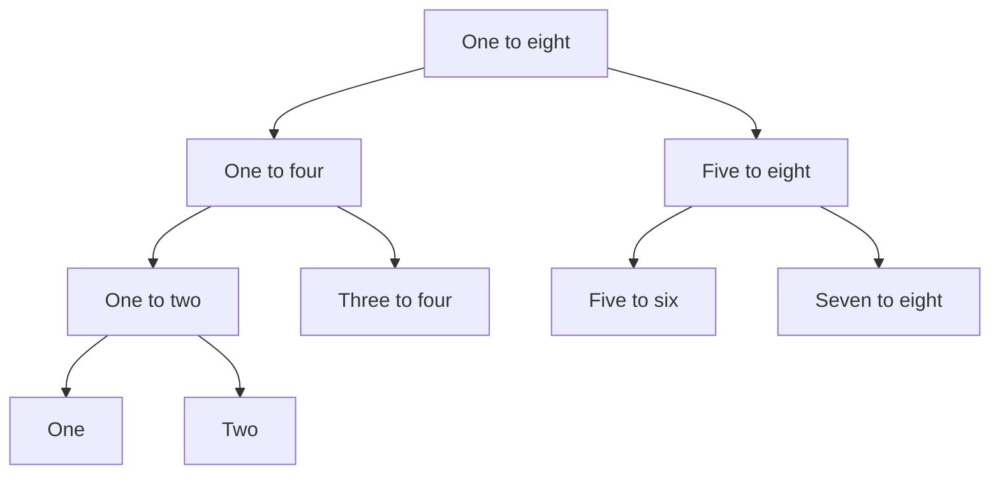
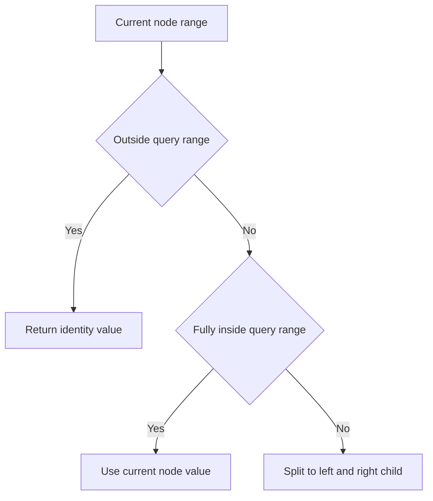
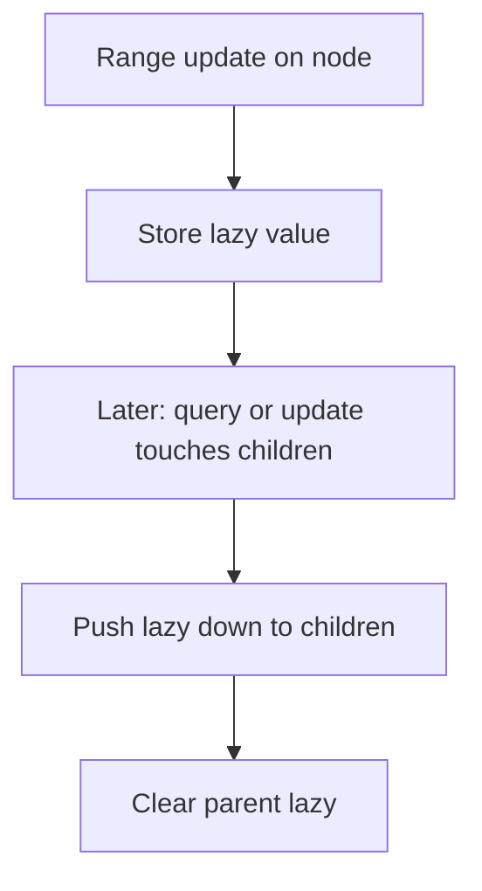

# Segment Tree

세그먼트 트리(Segment Tree)는 **구간 정보를 빠르게 질의하고 갱신하기 위한 트리 기반 자료구조**다.

한 줄로 요약하면 다음과 같다.

```text
배열 구간을 트리로 나눠서
구간 합 / 최솟값 / 최댓값을 빠르게 처리한다
```

누적합은 구간 합 조회에는 강하지만 값이 자주 바뀌는 상황에 약하다.
세그먼트 트리는 이 부분을 해결한다.

---

## 1. 언제 쓰는가

문제에서 아래 조합이 보이면 세그먼트 트리를 떠올리면 된다.

- 구간 합 / 구간 최솟값 / 구간 최댓값
- 배열 값이 계속 바뀜
- 쿼리 수가 많음
- 업데이트와 질의가 섞여 있음

즉:

```text
구간 쿼리 + 업데이트
```

이 같이 나오면 대표 후보다.

---

## 2. 왜 누적합만으로 안 되는가

예를 들어 배열이 있고 구간 합 쿼리가 많다면 누적합으로 충분하다.

하지만 배열 값이 바뀌면 누적합 전체를 다시 계산해야 할 수 있다.

예:

- `arr[3]` 값이 바뀜
- 그 뒤의 모든 누적합이 영향을 받음

즉 업데이트가 많으면 비효율적이다.

세그먼트 트리는 이 문제를 로그 시간으로 줄인다.

---

## 3. 핵심 아이디어

배열 구간을 반씩 쪼개며 트리로 저장한다.

예를 들어 길이 8 배열이면:

```text
[1..8]
 -> [1..4], [5..8]
 -> [1..2], [3..4], [5..6], [7..8]
```



각 노드는 자기 구간의 정보를 저장한다.

예를 들어 구간 합 세그트리라면:

- 루트는 전체 구간 합
- 왼쪽 자식은 왼쪽 절반 구간 합
- 오른쪽 자식은 오른쪽 절반 구간 합

을 저장한다.

---

## 4. 작은 예시로 이해하기

배열:

```text
index: 1 2 3 4
value: 5 8 6 3
```

그럼 구간 합 세그트리는 다음 의미를 가진다.

- `[1..4]` 합 = 22
- `[1..2]` 합 = 13
- `[3..4]` 합 = 9
- `[1..1]` = 5
- `[2..2]` = 8
- `[3..3]` = 6
- `[4..4]` = 3

즉 트리의 각 노드가 배열 일부를 대표하는 셈이다.

이 예시에서 실제 저장값을 그림처럼 보면 더 쉽다.

```text
                [1..4] = 22
              /              \
        [1..2] = 13       [3..4] = 9
         /       \          /      \
    [1]=5     [2]=8    [3]=6    [4]=3
```

즉 리프는 원본 배열 값이고,
내부 노드는 자식 둘을 합쳐 만든 값이다.

---

## 5. 왜 `O(log N)`인가

구간을 매번 반으로 나누므로,
트리 높이는 대략 `log N`이다.

그래서:

- 점 업데이트는 루트에서 리프까지 한 경로만 보면 된다
- 구간 쿼리도 필요한 노드만 골라 보면 된다

즉 둘 다 `O(log N)` 수준으로 처리된다.

정확히는 쿼리에서 한 층마다 많아야 몇 개의 노드만 실질적으로 방문하게 된다.
구간이 반씩 쪼개지므로 높이는 `log N`이고,
불필요한 가지는 \"완전히 밖\" 판정으로 바로 잘린다.

---

## 6. 구간 쿼리의 3가지 경우

구간 `[left, right]`를 물을 때,
현재 노드가 담당하는 구간 `[start, end]`와의 관계는 세 가지다.

### 1) 완전히 밖

겹치지 않으면 무시

### 2) 완전히 안

현재 노드 값을 그대로 사용

### 3) 일부만 겹침

왼쪽 자식, 오른쪽 자식으로 내려가서 합친다

이 3가지 분기가 세그트리 쿼리의 핵심이다.



여기서 `identity value`는 연산에 따라 달라진다.

- 구간 합이면 `0`
- 구간 최솟값이면 아주 큰 값 `INF`
- 구간 최댓값이면 아주 작은 값

즉 \"겹치지 않는 경우 무엇을 돌려줘야 합치는 데 문제가 없는가\"를 항상 먼저 생각해야 한다.

---

## 7. 구간 합 세그먼트 트리 구현

```java
static class SegmentTree {
    long[] tree;
    int n;

    SegmentTree(long[] arr) {
        n = arr.length - 1; // 1-based input
        tree = new long[4 * n];
        build(arr, 1, 1, n);
    }

    long build(long[] arr, int node, int start, int end) {
        if (start == end) {
            return tree[node] = arr[start];
        }

        int mid = (start + end) / 2;
        long left = build(arr, node * 2, start, mid);
        long right = build(arr, node * 2 + 1, mid + 1, end);
        return tree[node] = left + right;
    }

    long query(int node, int start, int end, int left, int right) {
        if (right < start || end < left) return 0;
        if (left <= start && end <= right) return tree[node];

        int mid = (start + end) / 2;
        return query(node * 2, start, mid, left, right)
             + query(node * 2 + 1, mid + 1, end, left, right);
    }

    void update(int node, int start, int end, int idx, long diff) {
        if (idx < start || idx > end) return;

        tree[node] += diff;
        if (start == end) return;

        int mid = (start + end) / 2;
        update(node * 2, start, mid, idx, diff);
        update(node * 2 + 1, mid + 1, end, idx, diff);
    }
}
```

이 방식은 `diff`를 더하는 방식이다.
즉 `arr[idx]`가 `old`에서 `new`로 바뀌었다면:

```java
long diff = newValue - oldValue;
update(1, 1, n, idx, diff);
```

처럼 호출한다.

실전에서는 이 점을 자주 놓친다.
세그트리는 보통 \"새 값을 직접 넣는 것\"이 아니라
\"변화량을 전파하는 것\"부터 떠올리는 편이 구현이 단순하다.

---

## 8. 쿼리를 손으로 따라가 보기

예를 들어 `[2..3]` 합을 구하고 싶다고 하자.

배열:

```text
[1..4] = [5, 8, 6, 3]
```

루트 `[1..4]`는 일부만 겹친다.
따라서 자식 둘로 내려간다.

- `[1..2]`는 일부 겹침 -> 더 내려감
- `[3..4]`도 일부 겹침 -> 더 내려감

결국 필요한 것은:

- `[2..2] = 8`
- `[3..3] = 6`

두 개만 더하면 된다.

즉 전체를 다 보지 않고 필요한 구간만 내려간다.

---

## 9. 점 업데이트는 어떻게 되나

예를 들어 `arr[3]`이 `6 -> 10`으로 바뀌었다고 하자.
차이는 `+4`다.

그러면 `3`을 포함하는 구간의 노드들만 갱신하면 된다.

즉:

- `[3..3]`
- `[3..4]`
- `[1..4]`

이런 경로만 바뀐다.

이게 점 업데이트가 `O(log N)`인 이유다.

즉 업데이트도 결국:

```text
루트에서 리프까지 한 줄만 고친다
```

고 이해하면 된다.

---

## 10. 합이 아닌 다른 연산도 가능한가

가능하다.

세그먼트 트리는 구간 정보만 잘 합칠 수 있으면 된다.

예:

- 구간 합
- 구간 최솟값
- 구간 최댓값
- 구간 gcd
- 구간 xor

즉 merge 연산만 바꾸면 다양한 문제에 적용된다.

다만 모든 연산이 되는 것은 아니다.
세그트리는 \"두 구간 결과를 합쳐서 부모 결과를 만들 수 있는가\"가 핵심이다.

예를 들어 합, 최소, 최대, gcd, xor는 잘 맞지만,
문제에 따라서는 추가 정보가 더 필요할 수 있다.

---

## 11. Lazy Propagation은 언제 필요한가

기본 세그트리는 점 업데이트에 강하다.

하지만 아래처럼 구간 업데이트가 많으면 비효율적일 수 있다.

```text
[2..100000]에 모두 +5 하라
```

이런 경우 Lazy Propagation을 쓴다.

즉:

- 점 업데이트만 많다 -> 기본 세그트리
- 구간 업데이트도 많다 -> Lazy 세그트리

이 차이를 꼭 구분해야 한다.

- `arr[5] = 10` 같은 한 점 변경이면 기본 세그트리
- `[2..100000]` 전체에 `+5`면 Lazy 필요 가능성 큼

즉 업데이트의 범위를 먼저 보고 자료구조 난이도를 결정하면 된다.

### Lazy의 핵심 아이디어

구간 업데이트를 노드마다 미리 기록해 두고,
실제로 필요할 때(쿼리나 하위 업데이트 시)만 자식에게 전파한다.



즉 "게으르게" 전파하기 때문에 Lazy라고 부른다.
매 업데이트마다 리프까지 내려가지 않고,
필요한 시점까지 미루는 것이 핵심이다.

---

## 12. 왜 배열 크기를 `4 * n` 정도로 잡는가

세그트리를 배열로 구현할 때는 보통:

```java
tree = new long[4 * n];
```

처럼 잡는다.

이유는 트리 구조를 안전하게 담기 위한 여유 공간 때문이다.

엄밀히 딱 맞는 크기를 계산할 수도 있지만,
코테에서는 `4 * n`이 구현이 가장 간단하고 실수가 적다.

---

## 13. 펜윅 트리와 비교

| 항목 | Segment Tree | Fenwick Tree |
|---|---|---|
| 구현 | 더 복잡 | 더 단순 |
| 지원 연산 | 더 다양 | 주로 prefix sum |
| 유연성 | 높음 | 중간 |

즉 합 전용이면 펜윅이 편하고,
범용 구간 자료구조가 필요하면 세그트리가 더 좋다.

---

## 14. 자주 하는 실수

### 1) 구간 범위 `[start, end]`를 헷갈림

세그트리는 인덱스 실수가 매우 자주 난다.

### 2) 구간 밖 return 값을 잘못 둠

구간 합이면 `0`, 최소값이면 `INF`처럼 연산에 맞는 항등값을 줘야 한다.

### 3) 1-based / 0-based 혼동

입력 배열과 세그트리 범위 기준을 통일해야 한다.

### 4) 합이 큰데 `int` 사용

합 문제는 `long`이 더 안전하다.

---

## 15. 시험장용 최소 암기 버전

```text
세그트리:
구간을 반씩 쪼개는 트리

가능한 것:
구간 합 / 최소 / 최대
점 업데이트
구간 쿼리

핵심 분기:
완전 밖 -> 버림
완전 안 -> 현재 노드 사용
일부 겹침 -> 자식으로 내려감

복잡도:
O(log N)
```

---

## 16. 최종 요약

세그먼트 트리는 다음 문장으로 정리할 수 있다.

```text
배열 구간을 반씩 쪼개어 저장해서
구간 쿼리와 업데이트를 로그 시간에 처리하는 자료구조
```

문제를 보면 먼저 이 질문을 하면 된다.

```text
값이 바뀌는 배열에서
구간 정보를 여러 번 빠르게 구해야 하는가?
```

그렇다면 세그트리 가능성이 높다.
