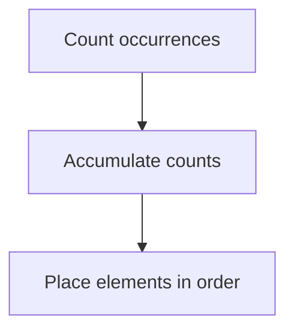
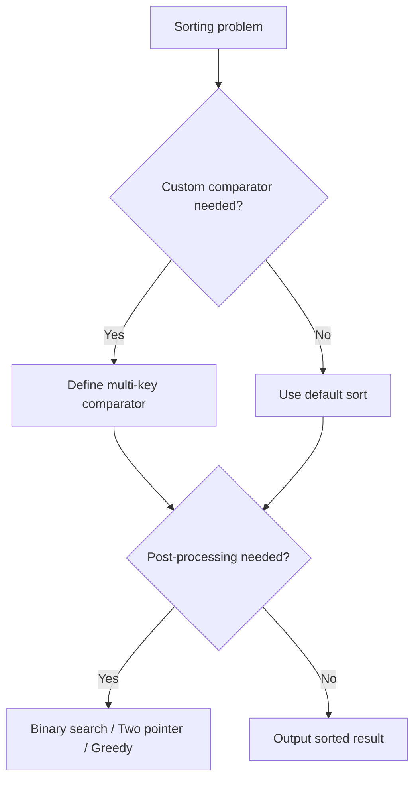

# Sorting

정렬(Sorting)은 **데이터를 특정 기준에 따라 순서대로 재배치하는 알고리즘**이다.

한 줄로 요약하면 다음과 같다.

```text
원소를 비교 기준에 맞게 줄 세우는 작업
```

정렬은 거의 모든 알고리즘의 기초이면서,
이분 탐색, 투 포인터, 그리디, 좌표 압축 등 다른 기법의 전제 조건이 되는 경우가 매우 많다.

---

## 1. 왜 중요한가

코딩테스트에서 정렬 자체를 직접 구현하는 문제는 많지 않다.
하지만 정렬이 중요한 이유는 다음과 같다.

- 이분 탐색의 전제: 배열이 정렬되어야 함
- 투 포인터의 전제: 양끝 투 포인터는 정렬 필요
- 그리디의 핵심: 대부분 정렬 후 순서대로 처리
- 좌표 압축의 기반: 좌표를 정렬한 뒤 인덱싱
- 중복 제거: 정렬 후 인접 비교

즉 정렬 자체가 답인 경우보다,
정렬이 다른 알고리즘의 **전처리**로 쓰이는 경우가 훨씬 많다.

---

## 2. 정렬 알고리즘 분류

| 알고리즘 | 시간 복잡도 (평균) | 안정성 | 특징 |
| --- | --- | --- | --- |
| 버블 정렬 | O(N²) | 안정 | 느림, 거의 안 씀 |
| 선택 정렬 | O(N²) | 불안정 | 단순하지만 느림 |
| 삽입 정렬 | O(N²) | 안정 | 거의 정렬된 데이터에 강함 |
| 병합 정렬 | O(N log N) | 안정 | 추가 메모리 필요 |
| 퀵 정렬 | O(N log N) | 불안정 | 실전에서 가장 빠른 편 |
| 힙 정렬 | O(N log N) | 불안정 | 추가 메모리 없음 |
| 계수 정렬 | O(N + K) | 안정 | 값 범위 K가 작을 때 |

코테에서는 보통 `Arrays.sort()`나 `Collections.sort()`를 쓰므로,
직접 구현보다는 각 알고리즘의 **특징과 쓰임새**를 이해하는 것이 더 중요하다.

---

## 3. 안정 정렬이란 무엇인가

안정 정렬(Stable Sort)은 다음을 보장한다.

```text
값이 같은 두 원소의 원래 순서가 정렬 후에도 유지된다
```

예를 들어 학생을 점수로 정렬할 때,
같은 점수인 학생들은 원래 입력 순서가 유지되어야 하는 경우가 있다.

Java에서:

- `Arrays.sort(int[])` → Dual-Pivot Quicksort → **불안정**
- `Arrays.sort(Object[])` → TimSort → **안정**
- `Collections.sort()` → TimSort → **안정**

즉 객체 배열이나 리스트를 정렬하면 안정 정렬이고,
기본형 배열(`int[]`)은 불안정 정렬이다.

---

## 4. Java 기본 정렬

### 배열 정렬

```java
int[] arr = {5, 2, 8, 1, 3};
Arrays.sort(arr);
```

### 역순 정렬

기본형 배열은 역순 정렬이 바로 안 된다.
`Integer[]`를 쓰거나 직접 뒤집어야 한다.

```java
Integer[] arr = {5, 2, 8, 1, 3};
Arrays.sort(arr, Collections.reverseOrder());
```

### 리스트 정렬

```java
List<Integer> list = new ArrayList<>(Arrays.asList(5, 2, 8, 1, 3));
Collections.sort(list);
```

---

## 5. 커스텀 정렬이 핵심이다

코테에서 가장 자주 나오는 정렬 문제는 **비교 기준을 직접 정하는 문제**다.

예를 들어:

- 끝나는 시간 기준 정렬
- 길이 기준, 같으면 사전순
- x좌표 기준, 같으면 y좌표 기준

### Comparator 람다

```java
Arrays.sort(arr, (a, b) -> {
    if (a[0] != b[0]) return Integer.compare(a[0], b[0]);
    return Integer.compare(a[1], b[1]);
});
```

### 객체 정렬 예시

```java
static class Student {
    String name;
    int score;

    Student(String name, int score) {
        this.name = name;
        this.score = score;
    }
}

List<Student> students = ...;
students.sort((a, b) -> {
    if (a.score != b.score) return Integer.compare(b.score, a.score); // 내림차순
    return a.name.compareTo(b.name); // 이름 오름차순
});
```

---

## 6. 정렬 기준 실수 주의

### `a - b` 대신 `Integer.compare(a, b)`를 쓰자

```java
// 위험: overflow 가능
Arrays.sort(arr, (a, b) -> a - b);

// 안전
Arrays.sort(arr, (a, b) -> Integer.compare(a, b));
```

`a - b`는 값이 매우 크거나 음수일 때 overflow가 발생할 수 있다.

---

## 7. 계수 정렬 Counting Sort

값의 범위가 작을 때 매우 빠르다.

핵심 아이디어:

```text
각 값의 등장 횟수를 세고
그 횟수대로 순서대로 배치한다
```


```java
void countingSort(int[] arr, int maxVal) {
    int[] count = new int[maxVal + 1];

    for (int x : arr) {
        count[x]++;
    }

    int idx = 0;
    for (int val = 0; val <= maxVal; val++) {
        while (count[val] > 0) {
            arr[idx++] = val;
            count[val]--;
        }
    }
}
```

언제 쓰는가:

- 값의 범위가 작고 정수일 때
- 비교 기반 정렬보다 빨라야 할 때
- 빈도 분석이 함께 필요할 때



---

## 8. 좌표 압축

좌표 압축(Coordinate Compression)은 정렬의 대표적인 응용이다.

핵심 아이디어:

```text
큰 범위의 값을 작은 인덱스로 변환한다
```

예를 들어 값이 `{100, 5000, 200, 5000, 300}`이면,
정렬 후 중복 제거하면 `{100, 200, 300, 5000}`이고,
각 값을 `0, 1, 2, 3`으로 바꿀 수 있다.


```java
int[] compress(int[] arr) {
    int n = arr.length;
    int[] sorted = arr.clone();
    Arrays.sort(sorted);

    // 중복 제거
    int[] unique = Arrays.stream(sorted).distinct().toArray();

    Map<Integer, Integer> map = new HashMap<>();
    for (int i = 0; i < unique.length; i++) {
        map.put(unique[i], i);
    }

    int[] result = new int[n];
    for (int i = 0; i < n; i++) {
        result[i] = map.get(arr[i]);
    }

    return result;
}
```

좌표 압축이 자주 쓰이는 곳:

- 세그먼트 트리에 좌표 범위가 너무 클 때
- 값은 크지만 실제 종류는 적을 때
- 순서 관계만 중요하고 절대값은 중요하지 않을 때

---

## 9. 위상 정렬과의 관계

숫자를 크기 순으로 정렬하는 것은 일반 정렬이고,
선후 관계를 지키며 정렬하는 것은 위상 정렬이다.

즉 정렬은 넓게 보면:

- 일반 정렬: 값 비교 기반
- 위상 정렬: 관계(간선) 기반

으로 나뉜다.

---

## 10. 정렬 문제 접근 순서

정렬 문제를 보면 아래 순서로 생각하면 된다.

```text
1. 무엇을 기준으로 정렬하는가?
2. 기준이 여러 개면 우선순위는?
3. 안정 정렬이 필요한가?
4. 정렬 후 다른 알고리즘(이분 탐색, 투 포인터 등)이 이어지는가?
```



---

## 11. 자주 하는 실수

### 1) `a - b` overflow

`Integer.compare`를 쓰는 습관을 들이자.

### 2) 정렬 기준을 잘못 세움

문제를 정확히 읽지 않으면 1차 기준과 2차 기준을 혼동하기 쉽다.

### 3) 기본형 배열과 객체 배열의 정렬 방식 차이를 모름

`int[]`는 `Comparator`를 바로 넣을 수 없다.
`Integer[]`이나 `List<Integer>`를 써야 한다.

### 4) 안정 정렬이 필요한 문제인데 불안정 정렬을 씀

같은 값의 순서가 문제 조건에 영향을 줄 수 있다.

---

## 12. 시험장용 최소 암기 버전

```text
정렬:
Arrays.sort() / Collections.sort()

커스텀 정렬:
Comparator 람다

안정 정렬:
Collections.sort() → TimSort

좌표 압축:
정렬 → 중복 제거 → 인덱싱

주의:
a - b overflow
기본형 역순 정렬 불가
```

---

## 13. 최종 요약

정렬은 다음 문장으로 정리할 수 있다.

```text
데이터를 기준에 따라 순서대로 재배치하는 기본 알고리즘이자,
다른 알고리즘의 전처리로 가장 많이 쓰이는 기법
```

문제를 보면 먼저 이 질문을 하면 된다.

```text
이 데이터를 어떤 기준으로 줄 세우면
문제가 단순해지는가?
```

정렬은 문제를 단순하게 만드는 첫 번째 도구다.
