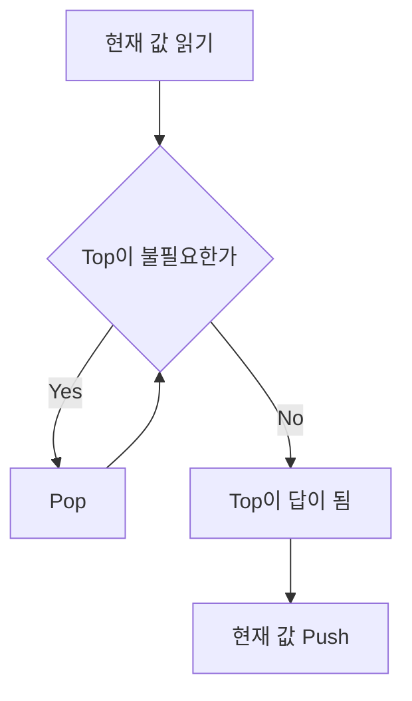

# Stack

스택(Stack)은 **가장 나중에 넣은 값을 가장 먼저 꺼내는 자료구조**다.

한 줄로 요약하면 다음과 같다.

```text
마지막에 들어온 데이터가 먼저 나간다
Last In First Out, LIFO
```

---

## 1. 언제 쓰는가

문제에서 아래 표현이 보이면 스택을 먼저 떠올리면 된다.

- 가장 최근 것부터 처리
- 되돌아가기
- 괄호 짝 맞추기
- 직전 상태 추적
- 현재 값보다 큰 값/작은 값 중 가장 가까운 것
- 수식을 왼쪽에서 오른쪽으로 처리하면서 중간 결과 보관

특히 코테에서는 아래 두 가지가 가장 자주 나온다.

- 기본 스택: 괄호, 문자열 제거, 되돌리기
- 단조 스택: 오큰수, 탑, 히스토그램, 보이는 빌딩

---

## 2. 스택의 핵심 개념

스택은 입구가 하나뿐인 상자처럼 생각하면 된다.

```text
push  : 맨 위에 넣기
pop   : 맨 위에서 꺼내기
peek  : 맨 위 값 보기
```

예를 들어:

```text
push(3)
push(7)
push(2)
```

상태:

```text
bottom [3, 7, 2] top
```

이때 `pop()`을 하면 2가 나온다.
그 다음 `pop()`을 하면 7이 나온다.

즉 가장 최근 값부터 처리된다.

---

## 3. 왜 필요한가

배열이나 리스트만으로도 많은 문제를 풀 수 있지만,
스택은 특히 **최근 상태 하나를 빠르게 확인하고 제거하는 상황**에 강하다.

예를 들어 괄호 문제를 생각해 보자.

```text
(()())
```

문자를 왼쪽부터 보면서:

- 여는 괄호 `(` 는 넣어 두고
- 닫는 괄호 `)` 를 만나면 가장 최근의 `(` 와 짝을 맞춘다

이 동작은 "가장 최근에 열렸고 아직 닫히지 않은 괄호"를 찾아야 하므로 스택과 정확히 맞아떨어진다.

---

## 4. 기본 연산

### 1) push

스택 맨 위에 원소를 넣는다.

### 2) pop

스택 맨 위 원소를 꺼내면서 제거한다.

### 3) peek

스택 맨 위 원소를 제거하지 않고 확인한다.

### 4) isEmpty

스택이 비어 있는지 확인한다.

이 네 개가 사실상 전부다.

---

## 5. Java에서는 무엇을 쓰는가

Java에서 스택 문제를 풀 때는 보통 `Stack` 클래스보다 `ArrayDeque`를 더 많이 쓴다.

이유:

- 더 빠른 편이다
- 메서드가 명확하다
- 단조 스택 구현에도 잘 맞는다

권장 패턴:

```java
ArrayDeque<Integer> stack = new ArrayDeque<>();

stack.push(10);      // 맨 위에 넣기
int top = stack.peek();
int x = stack.pop();
boolean empty = stack.isEmpty();
```

주의:

- `ArrayDeque`에는 `null`을 넣지 않는 것이 좋다
- 스택처럼 쓸 때는 `push`, `pop`, `peek`를 일관되게 쓰는 편이 안전하다

---

## 6. 가장 기본적인 예시: 괄호 문자열 검사

문제:

```text
문자열이 올바른 괄호 문자열인지 판별하라
```

아이디어:

- `(` 를 보면 push
- `)` 를 보면 pop
- 그런데 pop할 것이 없으면 잘못된 문자열
- 마지막에 스택이 비어 있어야 올바른 문자열

```java
import java.util.*;

class Solution {
    boolean isValid(String s) {
        ArrayDeque<Character> stack = new ArrayDeque<>();

        for (int i = 0; i < s.length(); i++) {
            char ch = s.charAt(i);

            if (ch == '(') {
                stack.push(ch);
            } else {
                if (stack.isEmpty()) return false;
                stack.pop();
            }
        }

        return stack.isEmpty();
    }
}
```

이 문제의 본질은 다음과 같다.

```text
가장 최근에 열린 괄호와 현재 닫는 괄호를 매칭한다
```

즉 LIFO 구조가 그대로 쓰인다.

---

## 7. 스택으로 보는 "직전 상태 관리"

스택은 단순히 괄호만 푸는 도구가 아니다.

아래처럼 "방금 전 상태"를 계속 기억해야 하는 문제에서 자주 나온다.

- 문자열 폭발
- 백스페이스 처리
- Undo 기능
- 브라우저 뒤로 가기
- 연산 중간 상태 보관

예를 들어 문자열에서 `abc`를 지우는 문제라면,
문자를 하나씩 스택에 넣고 뒤에서 패턴이 맞는지 확인하는 식으로 처리할 수 있다.

즉 스택은 "온라인으로 처리하면서 뒤쪽만 빠르게 건드리는 구조"에 강하다.

---

## 8. 코테에서 진짜 중요한 것: 단조 스택

실전에서 스택 문제의 핵심은 대부분 **단조 스택(Monotonic Stack)** 이다.

단조 스택은 말 그대로:

```text
스택 안의 값이 항상 증가하거나 감소하는 형태를 유지하는 스택
```

이다.

왜 이런 구조가 필요할까?

많은 문제에서 필요한 것은 모든 후보가 아니다.
오직 **아직 의미가 남아 있는 후보들만** 유지하면 된다.

대표 문제:

- BOJ 2493 탑
- BOJ 17298 오큰수
- BOJ 6198 옥상 정원 꾸미기
- BOJ 3015 오아시스 재결합
- BOJ 6549 히스토그램에서 가장 큰 직사각형

---

## 9. 단조 스택의 핵심 아이디어

다음 문제를 생각해 보자.

```text
각 위치 i에 대해
오른쪽에서 처음 만나는 나보다 큰 수를 구하라
```

이게 오큰수(Next Greater Element)다.

배열을 오른쪽에서 왼쪽으로 보자.
현재 값이 `cur`일 때,
스택 위에 `cur`보다 작거나 같은 값들이 있다면 그 값들은 앞으로 쓸모가 없다.

왜냐하면:

- 그 값들은 `cur`보다 작거나 같고
- `cur`가 더 왼쪽에 있으면서 더 가깝기 때문에
- 미래의 어떤 원소 입장에서도 그 값들보다 `cur`가 더 좋은 후보가 된다

즉, 쓸모 없어진 후보는 즉시 제거해도 된다.

이게 단조 스택의 본질이다.



단조 스택은 이 그림처럼 현재 값이 들어왔을 때 쓸모 없는 후보를 먼저 제거하고, 남은 top만 답 후보로 쓰는 구조다.

---

## 10. 왜 `O(n)`이 되는가

단조 스택이 강력한 이유는 시간 복잡도 때문이다.

겉보기에는 while문 때문에 느려 보일 수 있다.
하지만 각 원소는:

- 스택에 한 번 push
- 많아야 한 번 pop

된다.

즉 전체적으로 보면 각 원소가 최대 두 번만 스택과 상호작용한다.

그래서 전체 시간 복잡도는:

```text
O(n)
```

이다.

이게 단순 이중 반복문 `O(n^2)`과 결정적으로 다르다.

---

## 11. 단조 스택의 4가지 대표 패턴

문제를 보면 결국 아래 4개 중 하나인 경우가 많다.

| 유형 | 의미 |
|---|---|
| Previous Greater | 왼쪽에서 가장 가까운 더 큰 값 |
| Previous Smaller | 왼쪽에서 가장 가까운 더 작은 값 |
| Next Greater | 오른쪽에서 가장 가까운 더 큰 값 |
| Next Smaller | 오른쪽에서 가장 가까운 더 작은 값 |

예:

- 탑: `Previous Greater`
- 오큰수: `Next Greater`
- 히스토그램: `Previous Smaller`, `Next Smaller`

이 표를 머릿속에 넣어 두면 문제를 많이 빨리 분류할 수 있다.

---

## 12. BOJ 2493 탑으로 이해하는 단조 스택

문제 핵심:

```text
각 탑에서 왼쪽으로 레이저를 쐈을 때
처음 만나는 자신보다 높거나 같은 탑의 번호를 구하라
```

이 말은 곧:

```text
왼쪽에서 가장 가까운 더 크거나 같은 값 찾기
```

즉 `Previous Greater` 패턴이다.

### 핵심 관찰

현재 탑 높이가 `h`일 때,
왼쪽 후보들 중 `h`보다 낮은 탑은 더 이상 의미가 없다.

왜냐하면 지금 `h`가 등장한 순간,
그 낮은 탑들은 앞으로 나올 오른쪽 탑들의 입장에서:

- 더 낮고
- 더 멀기 때문

즉 후보 자격을 잃는다.

### 구현 흐름

왼쪽에서 오른쪽으로 진행하면서:

1. 현재 높이보다 낮은 탑들을 pop
2. 남아 있는 top이 정답
3. 현재 탑을 push


```java
import java.util.*;

class Solution {
    static class Tower {
        int height;
        int idx;

        Tower(int height, int idx) {
            this.height = height;
            this.idx = idx;
        }
    }

    int[] solve(int[] arr) {
        int n = arr.length;
        int[] ans = new int[n];
        ArrayDeque<Tower> stack = new ArrayDeque<>();

        for (int i = 0; i < n; i++) {
            int h = arr[i];

            while (!stack.isEmpty() && stack.peek().height < h) {
                stack.pop();
            }

            if (stack.isEmpty()) ans[i] = 0;
            else ans[i] = stack.peek().idx + 1;

            stack.push(new Tower(h, i));
        }

        return ans;
    }
}
```

여기서 비교가 `<` 인 이유는 문제에서 "나보다 높거나 같은 탑"도 정답이기 때문이다.

---

## 13. BOJ 17298 오큰수로 이해하는 단조 스택

문제 핵심:

```text
각 원소에 대해
오른쪽에서 처음 만나는 자신보다 큰 수를 구하라
```

즉 `Next Greater` 패턴이다.

### 왜 오른쪽에서 왼쪽으로 순회하는가

현재 원소의 오른쪽 정보가 필요하기 때문이다.
오른쪽에서 왼쪽으로 오면 스택에는 이미 오른쪽 후보들이 쌓여 있다.

### 구현 흐름

현재 값 `cur`에 대해:

1. `cur`보다 작거나 같은 값들을 pop
2. 남은 top이 오큰수
3. 현재 값을 push


```java
import java.util.*;

class Solution {
    int[] nextGreater(int[] arr) {
        int n = arr.length;
        int[] ans = new int[n];
        ArrayDeque<Integer> stack = new ArrayDeque<>();

        for (int i = n - 1; i >= 0; i--) {
            int cur = arr[i];

            while (!stack.isEmpty() && stack.peek() <= cur) {
                stack.pop();
            }

            ans[i] = stack.isEmpty() ? -1 : stack.peek();
            stack.push(cur);
        }

        return ans;
    }
}
```

여기서는 비교가 `<=` 인 이유가 중요하다.

- 오큰수는 "엄Strictly greater" 즉 진짜 더 큰 수가 필요하다
- 같은 값은 정답 후보가 될 수 없다

---

## 14. 값이 아니라 인덱스를 넣는 이유

단조 스택에서는 값을 넣을 수도 있고 인덱스를 넣을 수도 있다.
실전에서는 **인덱스를 넣는 경우가 더 많다**.

이유:

- 정답이 위치인 경우가 많다
- 거리 계산이 필요할 수 있다
- 실제 값은 `arr[idx]`로 다시 접근하면 된다

예:

```java
ArrayDeque<Integer> stack = new ArrayDeque<>(); // index stack

while (!stack.isEmpty() && arr[stack.peek()] <= arr[i]) {
    stack.pop();
}
```

이 방식은 다음 문제에서 특히 유용하다.

- 탑 번호 출력
- 며칠 뒤 더 따뜻한 날인지 거리 계산
- 히스토그램 폭 계산

---

## 15. `<` 와 `<=` 가 왜 중요한가

단조 스택에서 가장 자주 틀리는 부분이다.

예를 들어 "나보다 큰 값"을 찾는 문제라면,
같은 값은 후보가 아니므로 pop 조건에 `<=` 가 들어간다.

반대로 "나보다 크거나 같은 값"을 찾는 문제라면,
같은 값은 후보가 될 수 있으므로 pop 조건이 `<` 가 된다.

즉 기준은 다음과 같다.

- 정답 조건이 `>` 이면 pop 조건에 `<=`
- 정답 조건이 `>=` 이면 pop 조건에 `<`
- 정답 조건이 `<` 이면 pop 조건에 `>=`
- 정답 조건이 `<=` 이면 pop 조건에 `>`

비교 연산자 하나 차이로 정답이 통째로 틀릴 수 있으므로 반드시 문제 문장을 정확히 읽어야 한다.

---

## 16. 히스토그램 문제에서 왜 더 어려운가

`BOJ 6549` 같은 히스토그램 최대 직사각형 문제는 스택 문제 중 대표적인 상급 문제다.

핵심은 각 막대에 대해:

- 왼쪽으로 어디까지 확장 가능한가
- 오른쪽으로 어디까지 확장 가능한가

를 찾아서 폭을 구하는 것이다.

즉 단순히 "가장 가까운 큰 값" 하나를 찾는 문제가 아니라,
경계 전체를 찾아야 한다.

보통은 **단조 증가 스택**을 써서,
현재 높이보다 작은 높이를 만났을 때 이전 막대들의 직사각형 넓이를 계산한다.

이 문제는 단조 스택의 확장형으로 생각하면 된다.

---

## 17. 스택과 큐의 차이

헷갈리기 쉬우므로 같이 정리해 두자.

| 자료구조 | 꺼내는 순서 |
|---|---|
| Stack | 가장 나중에 넣은 것부터 |
| Queue | 가장 먼저 넣은 것부터 |

즉:

- 스택은 최근 상태 중심
- 큐는 들어온 순서 중심

BFS는 큐,
단조 스택 문제는 스택이 기본이다.

---

## 18. 자주 하는 실수

### 1) 방향을 잘못 잡음

- 오른쪽 정보가 필요하면 보통 오른쪽에서 왼쪽
- 왼쪽 정보가 필요하면 보통 왼쪽에서 오른쪽

### 2) 비교 연산자를 잘못 씀

`<`, `<=`, `>`, `>=` 중 어떤 것이 맞는지 문제 문장을 기준으로 결정해야 한다.

### 3) 값이 필요한데 인덱스를 넣거나, 인덱스가 필요한데 값만 넣음

정답이 무엇인지 먼저 정해야 한다.

- 값이 필요한가
- 위치가 필요한가
- 거리까지 필요한가

### 4) `Stack` 클래스를 쓰다가 성능/코드 스타일이 꼬임

실전에서는 `ArrayDeque`가 더 깔끔하다.

### 5) 단조 스택인데 while이 아니라 if만 사용

현재 값보다 작거나 큰 후보를 **연속해서 제거**해야 하므로 대부분 `while`이 맞다.

---

## 19. 실전 판단 기준

문제에서 아래 표현이 보이면 거의 단조 스택을 의심하면 된다.

- 가장 가까운
- 처음 만나는
- 왼쪽 / 오른쪽
- 나보다 큰 / 작은
- 신호를 받는 첫 번째 탑
- 볼 수 있는 건물
- 다음 더 따뜻한 날

그리고 입력 크기가 커서:

```text
N이 100000 이상인데
가까운 큰/작은 값을 구하라
```

처럼 나오면 이중 반복문 `O(n^2)`은 거의 불가능하므로 단조 스택일 가능성이 높다.

---

## 20. 시험장용 최소 암기 버전

```text
스택:
LIFO
push / pop / peek

코테 핵심:
단조 스택

단조 스택 본질:
쓸모 없어진 후보를 즉시 제거

패턴:
Previous Greater
Previous Smaller
Next Greater
Next Smaller

복잡도:
각 원소는 push 1번, pop 1번 -> O(n)

주의:
방향
비교 연산자
값 vs 인덱스
```

---

## 21. 최종 요약

스택은 다음 문장으로 정리할 수 있다.

```text
가장 최근에 넣은 데이터를 먼저 처리하는 자료구조
```

그리고 코테에서의 핵심은 다음이다.

```text
단조 스택은
불필요해진 후보를 즉시 제거해서
가장 가까운 큰 값/작은 값을 O(n)에 찾는 기법이다
```

핵심만 다시 압축하면:

- 기본 스택은 괄호, 되돌리기, 문자열 처리에 사용
- 실전 핵심은 단조 스택
- 단조 스택은 가까운 큰/작은 값 문제를 `O(n)`에 해결
- `while`로 의미 없는 후보를 제거
- 문제 문장에 따라 비교 연산자를 정확히 선택
- 필요에 따라 값 대신 인덱스를 스택에 저장

스택 문제를 풀 때는 항상 먼저 물어보면 된다.

```text
내가 유지해야 하는 것은 모든 값인가,
아니면 아직 의미 있는 후보들만인가?
```

이 질문의 답이 "후보들만"이라면 단조 스택일 가능성이 높다.
