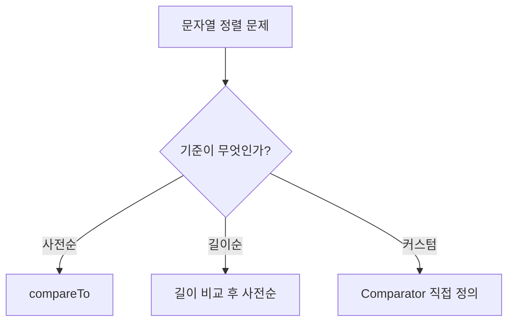

# String

문자열(String)은 **코테에서 가장 자주 나오는 데이터 형태** 중 하나다.

한 줄로 요약하면 다음과 같다.

```text
문자의 배열을 다루는 다양한 기법
```

KMP 같은 고급 알고리즘은 별도 문서에서 다루고,
여기서는 코테에서 자주 필요한 문자열 기본기와 패턴을 정리한다.

---

## 1. Java 문자열 기본

### String은 불변이다

```java
String s = "hello";
s.charAt(0);     // 'h'
s.length();      // 5
s.substring(1, 3); // "el"
```

`String`은 한 번 만들어지면 내용을 바꿀 수 없다.
문자열을 이어 붙일 때마다 새 객체가 생긴다.

### StringBuilder는 가변이다

```java
StringBuilder sb = new StringBuilder();
sb.append("hello");
sb.append(" world");
sb.reverse();
sb.toString();   // "dlrow olleh"
```

문자열을 반복적으로 조작할 때는 반드시 `StringBuilder`를 쓴다.
`String` 연결을 루프 안에서 반복하면 `O(N²)`이 된다.

---

## 2. 왜 StringBuilder가 중요한가

```java
// 느림: O(N²)
String result = "";
for (int i = 0; i < n; i++) {
    result += arr[i];
}

// 빠름: O(N)
StringBuilder sb = new StringBuilder();
for (int i = 0; i < n; i++) {
    sb.append(arr[i]);
}
String result = sb.toString();
```

코테에서는 `N`이 10만 이상이면 이 차이가 시간 초과를 만든다.

---

## 3. 문자열 비교

### equals를 써야 한다

```java
String a = "hello";
String b = "hello";
a == b;       // 참일 수도, 아닐 수도 (참조 비교)
a.equals(b);  // 항상 정확 (내용 비교)
```

`==`는 참조를 비교하므로 내용 비교에는 반드시 `equals`를 쓴다.

### compareTo: 사전순 비교

```java
"abc".compareTo("abd"); // 음수 (abc < abd)
"abd".compareTo("abc"); // 양수 (abd > abc)
"abc".compareTo("abc"); // 0
```

---

## 4. 자주 쓰는 메서드 정리

```java
s.charAt(i)          // i번째 문자
s.length()           // 길이
s.substring(i, j)    // i부터 j-1까지
s.indexOf("ab")      // "ab"가 처음 나타나는 위치 (-1이면 없음)
s.contains("ab")     // 포함 여부
s.startsWith("he")   // 접두사 확인
s.endsWith("lo")     // 접미사 확인
s.toCharArray()      // char 배열로 변환
s.split(",")         // 구분자로 분할
s.trim()             // 앞뒤 공백 제거
s.toLowerCase()      // 소문자로
s.toUpperCase()      // 대문자로
s.replace("a", "b")  // 모든 "a"를 "b"로
String.valueOf(123)  // 숫자 -> 문자열
Integer.parseInt("123") // 문자열 -> 숫자
```

---

## 5. char 다루기

### 문자 종류 판별

```java
Character.isDigit(c)       // 숫자?
Character.isLetter(c)      // 문자?
Character.isLetterOrDigit(c)
Character.isUpperCase(c)
Character.isLowerCase(c)
Character.toLowerCase(c)
Character.toUpperCase(c)
```

### 문자 -> 숫자 변환

```java
int digit = c - '0';       // '3' -> 3
int index = c - 'a';       // 'c' -> 2
char ch = (char)('a' + 2); // 2 -> 'c'
```

이 변환은 빈도 배열을 만들 때 핵심이다.

```java
int[] count = new int[26];
for (char c : s.toCharArray()) {
    count[c - 'a']++;
}
```

---

## 6. 팰린드롬 판별

```text
앞에서 읽으나 뒤에서 읽으나 같은 문자열
```

```java
boolean isPalindrome(String s) {
    int left = 0;
    int right = s.length() - 1;

    while (left < right) {
        if (s.charAt(left) != s.charAt(right)) return false;
        left++;
        right--;
    }

    return true;
}
```

투 포인터로 양 끝을 비교하면 `O(N)`에 판별할 수 있다.

---

## 7. 문자열 뒤집기

### StringBuilder 활용

```java
String reversed = new StringBuilder(s).reverse().toString();
```

### 직접 구현

```java
char[] arr = s.toCharArray();
int left = 0, right = arr.length - 1;

while (left < right) {
    char tmp = arr[left];
    arr[left] = arr[right];
    arr[right] = tmp;
    left++;
    right--;
}

String reversed = new String(arr);
```

---

## 8. 부분 문자열 탐색

### 단순 탐색

```java
int idx = s.indexOf("pattern");
```

`indexOf`는 내부적으로 `O(N * M)` 시간이 걸릴 수 있다.

### 모든 등장 위치 찾기

```java
List<Integer> positions = new ArrayList<>();
int idx = 0;

while ((idx = s.indexOf(pattern, idx)) != -1) {
    positions.add(idx);
    idx++;
}
```

패턴 길이가 길거나 텍스트가 크면 KMP나 해싱을 고려한다.

---

## 9. 문자열 파싱

코테에서 자주 나오는 파싱 패턴들이다.

### split으로 분할

```java
String[] tokens = "2026-03-07".split("-");
// ["2026", "03", "07"]
```

### 정규식 split

```java
String[] words = "hello  world".split("\\s+");
// ["hello", "world"]
```

### 한 글자씩 처리

```java
for (char c : s.toCharArray()) {
    if (c == '(') stack.push(c);
    else if (c == ')') stack.pop();
}
```

---

## 10. 숫자-문자열 변환

### 숫자 → 문자열

```java
String s = String.valueOf(123);
String s = Integer.toString(123);
String s = "" + 123; // 간단하지만 느림
```

### 문자열 → 숫자

```java
int n = Integer.parseInt("123");
long n = Long.parseLong("123456789");
```

### 진법 변환

```java
String binary = Integer.toBinaryString(10); // "1010"
String hex = Integer.toHexString(255);      // "ff"
int n = Integer.parseInt("1010", 2);        // 10
```

---

## 11. 문자열 정렬



### 사전순 정렬

```java
String[] arr = {"banana", "apple", "cherry"};
Arrays.sort(arr);
// ["apple", "banana", "cherry"]
```

### 길이 기준, 같으면 사전순

```java
Arrays.sort(arr, (a, b) -> {
    if (a.length() != b.length()) return a.length() - b.length();
    return a.compareTo(b);
});
```

### 숫자 문자열을 크기 순으로

문자열 `"9"`, `"30"`, `"34"`, `"5"`, `"3"`을 조합해서 가장 큰 수를 만드는 문제:

```java
Arrays.sort(arr, (a, b) -> (b + a).compareTo(a + b));
```

이 트릭은 프로그래머스 "가장 큰 수" 문제의 핵심이다.

---

## 12. 괄호 문자열

스택 + 문자열의 대표 조합이다.

```java
boolean isValid(String s) {
    Deque<Character> stack = new ArrayDeque<>();

    for (char c : s.toCharArray()) {
        if (c == '(' || c == '{' || c == '[') {
            stack.push(c);
        } else {
            if (stack.isEmpty()) return false;

            char top = stack.pop();
            if (c == ')' && top != '(') return false;
            if (c == '}' && top != '{') return false;
            if (c == ']' && top != '[') return false;
        }
    }

    return stack.isEmpty();
}
```

---

## 13. 문자열 압축

연속된 같은 문자를 묶어 표현하는 문제다.

```text
"aaabbc" → "a3b2c1" 또는 "3a2b1c"
```

```java
String compress(String s) {
    StringBuilder sb = new StringBuilder();
    int i = 0;

    while (i < s.length()) {
        char c = s.charAt(i);
        int count = 0;

        while (i < s.length() && s.charAt(i) == c) {
            count++;
            i++;
        }

        sb.append(c).append(count);
    }

    return sb.toString();
}
```

카카오 "문자열 압축" 문제는 이 아이디어를 단위 길이별로 확장한 것이다.

---

## 14. 사전순 최소/최대

문자열에서 특정 조건을 만족하는 사전순 최소/최대를 구하는 문제가 있다.

핵심은 보통 **스택(그리디)** 이다.

예: "주어진 문자열에서 K개를 제거해서 사전순 최소 만들기"

```java
String removeK(String s, int k) {
    Deque<Character> stack = new ArrayDeque<>();
    int removed = 0;

    for (char c : s.toCharArray()) {
        while (!stack.isEmpty() && removed < k && stack.peek() > c) {
            stack.pop();
            removed++;
        }
        stack.push(c);
    }

    while (removed < k) {
        stack.pop();
        removed++;
    }

    StringBuilder sb = new StringBuilder();
    for (char c : stack) sb.append(c);
    return sb.reverse().toString();
}
```

---

## 15. 자주 하는 실수

### 1) String을 루프에서 + 연결

```java
// O(N²) — 절대 금지
for (...) result += s;
```

`StringBuilder`를 쓰자.

### 2) == 로 문자열 비교

내용 비교에는 반드시 `equals`를 써야 한다.

### 3) substring 인덱스 실수

`substring(start, end)`에서 `end`는 포함되지 않는다.

### 4) charAt으로 바로 연산할 때 형 변환 실수

```java
char c = '9';
int n = c;      // 57 (ASCII 값)
int n = c - '0'; // 9 (올바른 변환)
```

### 5) split 인자에 특수문자

```java
s.split(".");   // 정규식이라 모든 문자에 매칭됨
s.split("\\.");  // 올바른 마침표 분할
```

`|`, `*`, `+`, `.` 등은 정규식 특수문자이므로 이스케이프가 필요하다.

---

## 16. 실전 판단 기준

문자열 문제를 만나면 다음을 먼저 판단하면 된다.

```text
1. 단순 조작인가? → 기본 메서드 활용
2. 패턴 매칭인가? → KMP, 해싱
3. 빈도/구성인가? → 해시맵, 빈도 배열
4. 순서/정렬인가? → Comparator
5. 괄호/짝인가? → 스택
6. 최적 선택인가? → 그리디 + 스택
```

---

## 17. 시험장용 최소 암기 버전

```text
문자열 기본:
StringBuilder 필수 (루프 연결 금지)
equals로 비교
c - 'a' / c - '0' 변환

핵심 패턴:
빈도: int[26] 또는 HashMap
팰린드롬: 양끝 투 포인터
괄호: 스택
압축: 연속 카운팅
사전순 최소: 스택 + 그리디

주의:
substring end 미포함
split 정규식 이스케이프
String 불변 → StringBuilder 가변
```

---

## 18. 최종 요약

문자열은 다음 문장으로 정리할 수 있다.

```text
문자의 배열을 효율적으로 조작하기 위해
기본 메서드, 빈도 배열, 스택, 해시 등을 적절히 조합하는 유형
```

핵심만 다시 압축하면:

- `StringBuilder`는 문자열 조작의 필수 도구다
- `char - 'a'` 변환은 빈도 배열의 기본이다
- 괄호 문제는 스택, 팰린드롬은 투 포인터가 정석이다
- 정렬 기준이 복잡하면 `Comparator`를 직접 정의한다
- 롤링 해시와 전처리를 쓰면 부분 문자열의 해시값을 `O(1)`에 비교할 수 있다

문제를 보면 먼저 이 질문을 하면 된다.

```text
이 문자열을 어떤 단위로 쪼개고,
어떤 자료구조로 관리하면 조건을 효율적으로 처리할 수 있는가?
```
