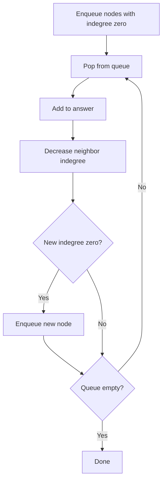

# Topological Sort

위상 정렬(Topological Sort)은 **방향 그래프에서 선후 관계를 지키며 정점을 나열하는 알고리즘**이다.

한 줄로 요약하면 다음과 같다.

```text
앞서야 하는 정점을 먼저 배치하는 정렬
```

즉 숫자를 오름차순으로 정렬하는 것이 아니라,

```text
A를 먼저 해야 B를 할 수 있다
```

같은 제약을 만족하는 순서를 만드는 것이다.

---

## 1. 언제 쓰는가

문제에서 아래 표현이 보이면 위상 정렬을 떠올리면 된다.

- 선수 과목
- 작업 순서
- 빌드 순서
- 먼저 해야 하는 일
- 순서 제약
- A를 한 뒤에야 B 가능

대표 문제 상황:

- 과목 수강 순서
- 공정 작업 순서
- 선행 관계 정렬

---

## 2. 전제 조건: DAG

위상 정렬은 **DAG(Directed Acyclic Graph)** 에서만 가능하다.

즉:

- 방향 그래프여야 하고
- 사이클이 없어야 한다

예를 들어:

```text
A -> B -> C -> A
```

같은 사이클이 있으면,
A보다 먼저 B가 와야 하고,
B보다 먼저 C가 와야 하고,
C보다 먼저 A가 와야 하므로 순서를 만들 수 없다.

---

## 3. 핵심 개념: indegree

Kahn 알고리즘에서 가장 중요한 것은 `indegree`다.

```text
indegree[v] = v로 들어오는 간선 수
```

즉 아직 끝나지 않은 선행 작업 개수라고 생각해도 된다.

- indegree가 0이면 지금 바로 시작 가능
- indegree가 1 이상이면 아직 기다려야 함

이 해석이 핵심이다.

---

## 4. Kahn 알고리즘 핵심 흐름

1. indegree가 0인 정점을 모두 큐에 넣는다
2. 큐에서 하나 꺼내 정답에 넣는다
3. 그 정점에서 나가는 간선을 제거한 효과로 이웃 indegree를 줄인다
4. 새로 indegree가 0이 된 정점을 큐에 넣는다
5. 큐가 빌 때까지 반복한다



즉 "지금 당장 할 수 있는 일"을 하나씩 꺼내는 구조다.

---

## 5. 작은 예시로 이해하기

그래프:

```text
1 -> 3
2 -> 3
3 -> 4
```

초기 indegree:

- 1: 0
- 2: 0
- 3: 2
- 4: 1

초기 큐:

```text
[1, 2]
```

### 1단계

1을 꺼낸다.
정답: `[1]`

1에서 3으로 가는 간선을 제거한 효과:

- indegree[3] = 1

아직 0이 아니므로 큐에 안 들어간다.

### 2단계

2를 꺼낸다.
정답: `[1, 2]`

2에서 3으로 가는 간선을 제거한 효과:

- indegree[3] = 0

이제 3을 큐에 넣는다.

### 3단계

3을 꺼낸다.
정답: `[1, 2, 3]`

3에서 4로 가는 간선을 제거:

- indegree[4] = 0

4를 큐에 넣는다.

### 4단계

4를 꺼낸다.
정답: `[1, 2, 3, 4]`

즉 선행 관계가 지켜진 순서를 얻는다.

---

## 6. Kahn's Algorithm 구현

```java
List<Integer> topoSort(int n, ArrayList<Integer>[] graph, int[] indegree) {
    Queue<Integer> q = new LinkedList<>();
    List<Integer> order = new ArrayList<>();

    for (int i = 1; i <= n; i++) {
        if (indegree[i] == 0) q.offer(i);
    }

    while (!q.isEmpty()) {
        int cur = q.poll();
        order.add(cur);

        for (int next : graph[cur]) {
            indegree[next]--;
            if (indegree[next] == 0) {
                q.offer(next);
            }
        }
    }

    return order;
}
```

---

## 7. 사이클 판별

위상 정렬 결과 길이가 `N`보다 작으면 사이클이 있다는 뜻이다.

왜냐하면 사이클 안의 정점들은 indegree가 끝까지 0이 되지 못하기 때문이다.

즉 다음으로 판별 가능하다.

```java
if (order.size() != n) {
    // cycle exists
}
```

---

## 8. 위상 정렬 결과는 하나가 아닐 수 있다

예를 들어 indegree가 0인 정점이 여러 개면,
그중 어떤 것을 먼저 꺼내느냐에 따라 결과가 달라질 수 있다.

즉 위상 정렬은 보통:

```text
유일한 순서가 아니라 가능한 순서 중 하나
```

를 구하는 알고리즘이다.

만약 사전순으로 가장 작은 결과가 필요하면,
큐 대신 우선순위 큐를 쓰면 된다.

예를 들어 indegree가 0인 정점이 `2`, `5`, `7` 세 개라면,
일반 큐는 입력이나 삽입 순서에 따라 결과가 달라질 수 있다.

반면 우선순위 큐를 쓰면 항상 가장 작은 정점부터 꺼내므로,
"가능한 위상 정렬 중 사전순 최소"를 만들 수 있다.

---

## 9. 우선순위 큐 버전

```java
PriorityQueue<Integer> pq = new PriorityQueue<>();
```

를 써서 indegree 0 정점 중 가장 작은 번호를 먼저 꺼내면,
사전순으로 가장 앞선 위상 정렬 결과를 만들 수 있다.

이 패턴은 BOJ 문제에서 자주 나온다.

---

## 10. DFS 방식도 있다

위상 정렬은 DFS 후위 순회 기반으로도 가능하다.

핵심은:

- 자식들을 먼저 방문
- 현재 노드를 스택이나 리스트 뒤에 넣음

이 방식은 재귀적이라 직관적일 수 있다.
하지만 코테에서는 Kahn 알고리즘이 더 명확하고,
indegree 기반 해석이 쉬워서 더 많이 쓴다.

실전에서는:

- 순서를 실제로 만들고 싶다 -> Kahn
- DFS 기반 사이클 판별과 같이 묶고 싶다 -> DFS 방식

처럼 구분해도 된다.

### DFS 후위 순회

```java
void dfs(int cur, ArrayList<Integer>[] graph, boolean[] visited, List<Integer> order) {
    visited[cur] = true;

    for (int next : graph[cur]) {
        if (!visited[next]) dfs(next, graph, visited, order);
    }

    order.add(cur);
}
```

모든 정점에 대해 DFS를 돌고 마지막에 `order`를 뒤집으면 위상 정렬 순서가 된다.
다만 방향 그래프에서 사이클 여부까지 엄밀히 보려면
`visited`만으로는 부족하고 `inStack` 또는 3색 방문 배열이 추가로 필요하다.

### 순서가 유일한지 판단하는 법

Kahn 알고리즘에서는 어떤 시점이든 큐에 indegree 0 정점이 두 개 이상 있으면,
그 순간 서로 다른 선택지가 존재하므로 결과가 유일하지 않다.

즉:

- 큐 크기가 항상 1이었다 -> 현재 그래프에서는 순서가 유일
- 어느 순간 큐 크기가 2 이상이었다 -> 가능한 위상 정렬이 여러 개

문제에서 "순서가 하나로 정해지는가"를 묻는 경우
이 조건을 그대로 써먹을 수 있다.

---

## 11. 자주 하는 실수

### 1) 무방향 그래프에 위상 정렬 적용

위상 정렬은 방향 그래프 전용이다.

### 2) indegree 초기화 실수

간선 `u -> v`가 있으면 `indegree[v]++`다.

### 3) 사이클 검사를 안 함

결과 크기가 `N`인지 확인해야 한다.

### 4) 큐에 처음 indegree 0 정점을 다 안 넣음

시작이 잘못되면 전체 순서가 틀린다.

---

## 12. 시험장용 최소 암기 버전

```text
위상 정렬:
선후 관계를 만족하는 순서 만들기

전제:
DAG

Kahn:
indegree 0을 큐에 넣고 시작
꺼내면서 이웃 indegree 감소
새로 0 되면 큐 삽입

사이클 판별:
결과 길이 < N
```

---

## 13. 최종 요약

위상 정렬은 다음 문장으로 정리할 수 있다.

```text
사이클 없는 방향 그래프에서
선후 관계를 지키는 순서를 만드는 알고리즘
```

문제를 보면 먼저 이 질문을 하면 된다.

```text
이 문제는
무엇을 먼저 해야 무엇을 나중에 할 수 있는가?
```

이 관계가 핵심이면 위상 정렬일 가능성이 높다.
