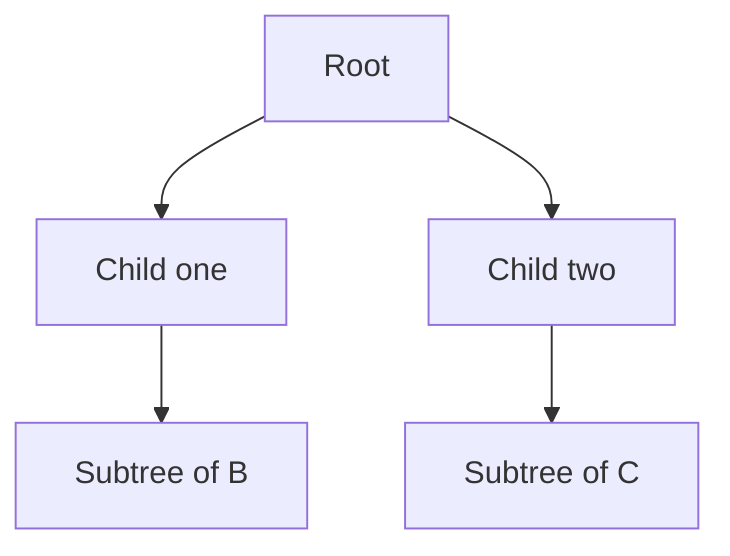
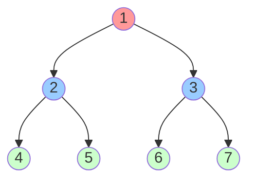
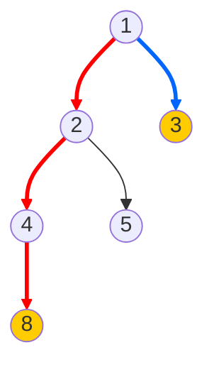
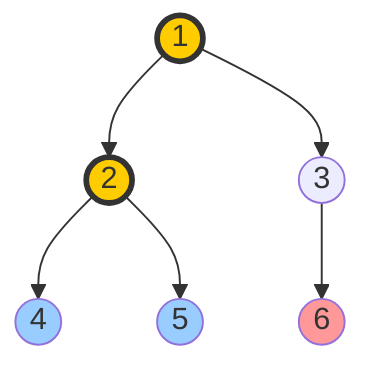
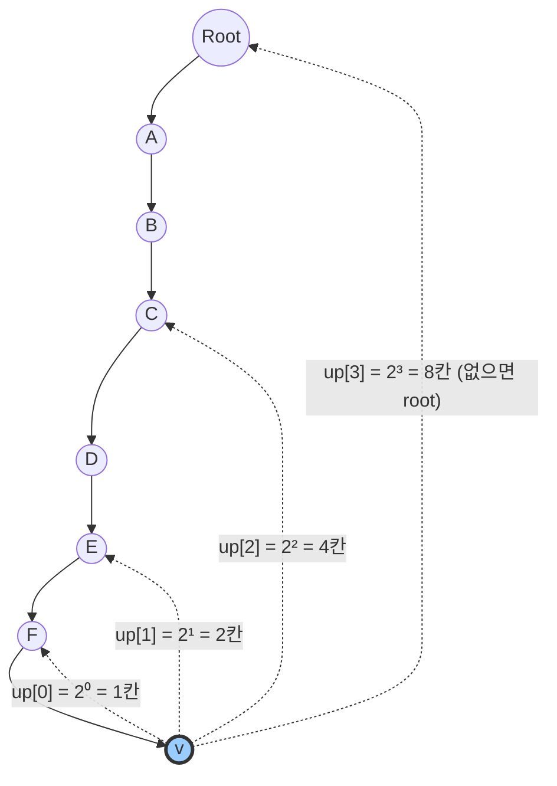

# Tree

트리(Tree)는 **사이클이 없는 연결 그래프**다.

한 줄로 요약하면 다음과 같다.

```text
노드들이 계층 구조를 이루며 연결된 그래프
```

코테에서 트리는 매우 자주 나오고,
그래프 문제 중에서도 성질이 특별해서 더 쉽게 다룰 수 있는 경우가 많다.

---

## 1. 트리의 가장 중요한 성질

정점 수가 `N`인 트리는 다음을 만족한다.

- 간선 수는 항상 `N - 1`
- 연결되어 있다
- 사이클이 없다
- 임의의 두 정점 사이의 경로가 정확히 하나다

이 마지막 성질이 매우 중요하다.

```text
두 정점 사이 경로가 하나뿐이다
```

그래서 일반 그래프보다 훨씬 단순한 논리로 많은 문제를 풀 수 있다.

---

## 2. 핵심 용어

아래 트리를 보자.

```text
        1
       / \
      2   3
     / \   \
    4   5   6
```

용어 정리:

- `1`: 루트(root)
- `2, 3`: 1의 자식(children)
- `1`: 2와 3의 부모(parent)
- `2, 3`: 서로 형제(sibling)
- `4, 5, 6`: 리프(leaf), 즉 자식이 없는 노드
- 서브트리(subtree): 어떤 노드를 루트로 하는 부분 트리

추가로 꼭 알아야 하는 개념:

- 깊이(depth): 루트에서 현재 노드까지의 거리
- 높이(height): 현재 노드에서 가장 먼 리프까지의 거리
- 레벨(level): 깊이와 거의 같은 의미로 쓰이는 경우가 많음

보통 코테에서는:

- 루트 깊이 = 0

으로 두는 경우가 많다.

---

## 3. 왜 트리가 특별한가

일반 그래프에서는 같은 정점으로 가는 경로가 여러 개일 수 있다.
그래서 방문 처리, 사이클 처리, 최단 거리, 중복 경로를 모두 고려해야 한다.

하지만 트리는:

- 경로가 하나뿐이고
- 사이클이 없고
- 부모 하나만 조심하면 다시 되돌아가지 않는다

그래서 DFS나 BFS가 매우 깔끔해진다.

특히 트리 문제에서 자주 쓰는 패턴은 다음이다.

```text
dfs(node, parent)
```

즉 현재 노드와 부모만 들고 다니면 역방향 방문을 쉽게 막을 수 있다.



트리 문제는 이렇게 루트에서 자식 방향으로 내려가며 각 서브트리를 따로 계산한다고 생각하면 훨씬 이해가 쉽다.

---

## 4. 트리의 표현 방법

트리는 상황에 따라 두 가지 방식으로 많이 표현한다.

### 1) 이진 트리 노드 클래스

LeetCode 스타일 문제에서 자주 보인다.

```java
class TreeNode {
    int val;
    TreeNode left;
    TreeNode right;

    TreeNode(int val) {
        this.val = val;
    }
}
```

이 방식은:

- 이진 트리 문제
- BST 문제
- 재귀 순회 문제

에서 자주 등장한다.

### 2) 인접 리스트

백준, 프로그래머스, 일반 코테에서는 보통 이쪽이 더 중요하다.

```java
ArrayList<Integer>[] tree = new ArrayList[n + 1];
for (int i = 1; i <= n; i++) {
    tree[i] = new ArrayList<>();
}

for (int i = 0; i < n - 1; i++) {
    int u = ...;
    int v = ...;
    tree[u].add(v);
    tree[v].add(u);
}
```

트리 입력은 보통 무방향 간선 `N - 1`개로 들어온다.
그래서 부모-자식 관계는 DFS/BFS를 돌려 직접 정해야 한다.

---

## 5. 트리 순회

### 1) 이진 트리 순회

#### 전위 순회 Preorder

```text
루트 -> 왼쪽 -> 오른쪽
```

```java
void preorder(TreeNode node) {
    if (node == null) return;
    System.out.print(node.val + " ");
    preorder(node.left);
    preorder(node.right);
}
```

루트를 먼저 처리해야 할 때 쓴다.

#### 중위 순회 Inorder

```text
왼쪽 -> 루트 -> 오른쪽
```

```java
void inorder(TreeNode node) {
    if (node == null) return;
    inorder(node.left);
    System.out.print(node.val + " ");
    inorder(node.right);
}
```

BST에서는 중위 순회 결과가 정렬 순서가 된다.

#### 순회 비교 예시

아래 이진 트리로 세 가지 순회를 비교하면 확실히 이해된다.



```text
Preorder  (루트→왼→오): 1 2 4 5 3 6 7
Inorder   (왼→루트→오): 4 2 5 1 6 3 7
Postorder (왼→오→루트): 4 5 2 6 7 3 1
Level     (층별 왼→오) : 1 2 3 4 5 6 7
```

#### 후위 순회 Postorder

```text
왼쪽 -> 오른쪽 -> 루트
```

```java
void postorder(TreeNode node) {
    if (node == null) return;
    postorder(node.left);
    postorder(node.right);
    System.out.print(node.val + " ");
}
```

자식 결과를 먼저 계산하고 부모에서 합칠 때 핵심이다.
트리 DP의 기본 순서가 사실상 후위 순회다.

#### 레벨 순회 Level Order

```text
위에서 아래로, 깊이 순서대로 순회
```

```java
void levelOrder(TreeNode root) {
    if (root == null) return;

    Queue<TreeNode> q = new LinkedList<>();
    q.offer(root);

    while (!q.isEmpty()) {
        TreeNode cur = q.poll();
        System.out.print(cur.val + " ");

        if (cur.left != null) q.offer(cur.left);
        if (cur.right != null) q.offer(cur.right);
    }
}
```

---

## 6. 일반 트리에서 가장 중요한 DFS 패턴

코테에서 트리 문제는 대부분 일반 트리 + 인접 리스트 형태다.
이때 가장 중요한 패턴은 다음이다.

```java
void dfs(int node, int parent) {
    for (int next : tree[node]) {
        if (next == parent) continue;
        dfs(next, node);
    }
}
```

왜 `parent`를 들고 다니는가?

트리는 무방향 그래프로 입력되므로,
현재 노드에서 인접 정점을 보면 부모도 같이 들어 있다.

따라서 부모를 건너뛰지 않으면:

- 자식으로 갔다가
- 다시 부모로 돌아오고
- 무한 재귀가 발생한다

즉 `parent` 체크는 트리 DFS의 핵심이다.

---

## 7. 부모와 깊이 구하기

가장 기본적인 트리 전처리다.

```java
int[] parent;
int[] depth;

void dfs(int node, int par, int dep) {
    parent[node] = par;
    depth[node] = dep;

    for (int next : tree[node]) {
        if (next == par) continue;
        dfs(next, node, dep + 1);
    }
}
```

이렇게 해 두면 다음이 가능하다.

- 각 노드의 부모 확인
- 루트로부터의 깊이 계산
- LCA 준비
- 거리 계산

---

## 8. 서브트리 크기 구하기

트리 문제에서 가장 자주 나오는 기본 DP다.

정의:

```text
size[node] = node를 루트로 하는 서브트리의 노드 수
```

점화:

```text
size[node] = 1 + 모든 자식 size의 합
```


```java
int[] size;

void calcSize(int node, int parent) {
    size[node] = 1;

    for (int next : tree[node]) {
        if (next == parent) continue;
        calcSize(next, node);
        size[node] += size[next];
    }
}
```

왜 후위 순회인가?

자식들의 `size`를 먼저 알아야 부모 `size`를 계산할 수 있기 때문이다.

---

## 9. 높이와 가장 깊은 자손 구하기

트리의 높이도 매우 자주 나온다.

정의:

```text
height[node] = node에서 가장 먼 리프까지의 거리
```


```java
int height(int node, int parent) {
    int h = 0;

    for (int next : tree[node]) {
        if (next == parent) continue;
        h = Math.max(h, height(next, node) + 1);
    }

    return h;
}
```

이 역시 자식 결과를 부모에서 합치므로 후위 순회 구조다.

---

## 10. 트리의 지름

트리의 지름은:

```text
트리에서 가장 멀리 떨어진 두 노드 사이의 거리
```

이다.

대표 풀이가 두 가지 있다.

### 방법 1. DFS/BFS 두 번

1. 임의의 노드에서 가장 먼 노드 `A`를 찾는다.
2. `A`에서 가장 먼 노드 `B`를 찾는다.
3. `A-B` 거리가 지름이다.

이 방법은 구현이 단순하고 자주 쓰인다.

### 방법 2. 한 번의 DFS로 계산

각 노드에서:

- 자식 방향 최대 깊이 두 개를 구한 뒤
- 그 합의 최댓값을 전체 지름으로 관리한다


```java
int diameter = 0;

int dfs(int node, int parent) {
    int first = 0;
    int second = 0;

    for (int next : tree[node]) {
        if (next == parent) continue;

        int d = dfs(next, node) + 1;
        if (d > first) {
            second = first;
            first = d;
        } else if (d > second) {
            second = d;
        }
    }

    diameter = Math.max(diameter, first + second);
    return first;
}
```

핵심은 어떤 노드를 꼭대기로 하는 최장 경로는
그 노드의 자식 방향 최대 깊이 두 개를 합친 것이라는 점이다.



```text
노드 2에서: first = depth(8) = 2, second = depth(5) = 1
→ first + second = 3

하지만 노드 1에서: first = depth(8 via 2) = 3, second = depth(3) = 1
→ first + second = 4 ← 이것이 지름

지름 경로: 8 → 4 → 2 → 1 → 3 (거리 4)
```

---

## 11. LCA 최소 공통 조상

LCA(Lowest Common Ancestor)는 두 노드의 가장 가까운 공통 조상이다.

예를 들어:

- 4와 5의 LCA는 2
- 4와 6의 LCA는 1

트리 쿼리 문제에서 매우 자주 나온다.



```text
LCA(4, 5) = 2  ← 같은 부모
LCA(4, 6) = 1  ← 루트까지 올라가야 만남
LCA(4, 2) = 2  ← 한쪽이 조상이면 그 자체가 LCA
```

---

## 12. LCA 기본 풀이: 깊이 맞추고 같이 올리기

먼저 각 노드의 부모와 깊이를 알고 있다고 하자.

그럼 방법은 다음과 같다.

1. 더 깊은 노드를 위로 올려 깊이를 맞춘다.
2. 두 노드가 같아질 때까지 같이 올린다.
3. 처음 만난 노드가 LCA다.


```java
int lca(int u, int v) {
    while (depth[u] > depth[v]) u = parent[u];
    while (depth[v] > depth[u]) v = parent[v];

    while (u != v) {
        u = parent[u];
        v = parent[v];
    }

    return u;
}
```

이 방식은 직관적이지만,
쿼리가 많으면 느릴 수 있다.

---

## 13. LCA 고급 풀이: Binary Lifting

쿼리가 많다면 이진 리프팅을 쓴다.

아이디어:

```text
2^k번째 조상을 미리 저장해 두자
```

즉 `up[k][v]`를 다음처럼 정의한다.

```text
v의 2^k번째 조상
```

그러면 깊이 차이를 빠르게 줄이고,
두 노드를 `O(log N)`에 동시에 올릴 수 있다.



깊이 차이가 5면 `5 = 4 + 1 = 2² + 2⁰`이므로 점프 2번이면 된다.

### 전처리

```java
int LOG = 20;
int[][] up;

void build(int n) {
    up = new int[LOG][n + 1];

    for (int v = 1; v <= n; v++) {
        up[0][v] = parent[v];
    }

    for (int k = 1; k < LOG; k++) {
        for (int v = 1; v <= n; v++) {
            up[k][v] = up[k - 1][up[k - 1][v]];
        }
    }
}
```

### 쿼리

```java
int lca(int u, int v) {
    if (depth[u] < depth[v]) {
        int tmp = u;
        u = v;
        v = tmp;
    }

    int diff = depth[u] - depth[v];
    for (int k = 0; k < LOG; k++) {
        if (((diff >> k) & 1) == 1) {
            u = up[k][u];
        }
    }

    if (u == v) return u;

    for (int k = LOG - 1; k >= 0; k--) {
        if (up[k][u] != up[k][v]) {
            u = up[k][u];
            v = up[k][v];
        }
    }

    return up[0][u];
}
```

---

## 14. 트리 DP의 본질

트리 DP는 트리 문제의 핵심 파트다.

사고 순서는 늘 비슷하다.

```text
1. dp[node]가 무엇을 의미하는가?
2. 자식들의 dp로 부모 dp를 어떻게 만들 것인가?
3. 계산 순서는 자식 먼저인가, 부모 먼저인가?
```

대부분의 트리 DP는 **후위 순회**다.

왜냐하면 부모 값이 자식 값들에 의존하는 경우가 많기 때문이다.

---

## 15. 트리 DP 예제 1: 서브트리 합

정의:

```text
dp[node] = node를 루트로 하는 서브트리의 값 합
```

점화:

```text
dp[node] = value[node] + 자식들의 dp 합
```


```java
int[] value;
long[] dp;

void dfs(int node, int parent) {
    dp[node] = value[node];

    for (int next : tree[node]) {
        if (next == parent) continue;
        dfs(next, node);
        dp[node] += dp[next];
    }
}
```

이 문제는 트리 DP의 가장 기본 형태다.

---

## 16. 트리 DP 예제 2: 선택/비선택 DP

대표 문제:

```text
인접한 노드를 동시에 선택할 수 없을 때
가치 합의 최댓값을 구하라
```

정의:

- `dp[node][0]`: 현재 노드를 선택하지 않았을 때 최댓값
- `dp[node][1]`: 현재 노드를 선택했을 때 최댓값

점화:

- 내가 선택되지 않으면 자식은 선택해도 되고 안 해도 된다
- 내가 선택되면 자식은 선택되면 안 된다


```java
int[] value;
long[][] dp;

void dfs(int node, int parent) {
    dp[node][0] = 0;
    dp[node][1] = value[node];

    for (int next : tree[node]) {
        if (next == parent) continue;
        dfs(next, node);

        dp[node][0] += Math.max(dp[next][0], dp[next][1]);
        dp[node][1] += dp[next][0];
    }
}
```

답:

```java
Math.max(dp[root][0], dp[root][1])
```

이 패턴은 매우 중요하다.

---

## 17. 리루팅 Rerooting

어떤 문제는 루트를 1개 정해서 계산한 결과만으로는 부족하다.

예:

```text
모든 노드에 대해
자기에서 가장 먼 노드까지의 거리를 구하라
```

이런 문제는 각 노드를 루트로 본 결과가 필요하므로,
한 번의 단순 DFS만으로는 안 된다.

이때 쓰는 기법이 리루팅이다.

핵심 아이디어:

- 한 번은 아래 방향 정보 계산
- 한 번은 위 방향 정보 전달

즉 루트를 바꿔 가는 효과를 선형 시간 안에 만든다.

구체적인 과정은 다음과 같다.

```text
1단계 (Down-pass): 루트에서 DFS로 자식 방향 정보 계산
   → dp_down[v] = v의 서브트리 기준 결과

2단계 (Up-pass): 루트에서 다시 DFS로 부모 방향 정보 전달
   → dp_up[v] = v를 제외한 나머지 트리 기준 결과

최종 답: ans[v] = dp_down[v] + dp_up[v]
```

리루팅은 트리 DP의 확장형으로 이해하면 된다.

---

## 18. 오일러 투어 Euler Tour

서브트리 문제를 배열 문제로 바꾸는 기법이다.

DFS 순서로 트리를 펼치면,
한 노드의 서브트리가 배열의 연속 구간이 된다.


```java
int[] in;
int[] out;
int timer = 0;

void euler(int node, int parent) {
    in[node] = ++timer;

    for (int next : tree[node]) {
        if (next == parent) continue;
        euler(next, node);
    }

    out[node] = timer;
}
```

그러면:

```text
node의 서브트리 = [in[node], out[node]]
```

가 된다.

이 위에 세그먼트 트리, 펜윅 트리, 누적합 등을 얹으면 서브트리 쿼리를 빠르게 처리할 수 있다.

---

## 19. BFS도 트리에서 자주 쓴다

트리는 DFS가 대표적이지만 BFS도 자주 쓰인다.

예:

- 레벨별 탐색
- 최단 거리 계산
- 부모/깊이 구하기
- 트리의 지름을 구하기 위한 BFS


```java
void bfs(int start, int n) {
    Queue<Integer> q = new LinkedList<>();
    boolean[] visited = new boolean[n + 1];

    q.offer(start);
    visited[start] = true;

    while (!q.isEmpty()) {
        int cur = q.poll();

        for (int next : tree[cur]) {
            if (visited[next]) continue;
            visited[next] = true;
            q.offer(next);
        }
    }
}
```

트리는 간선 가중치가 없으면 BFS 한 번으로 깊이와 거리를 깔끔하게 계산할 수 있다.

---

## 20. 자주 하는 실수

### 1) 부모 체크를 안 함

트리 입력은 보통 무방향 그래프다.
`parent` 체크나 `visited` 체크 없이 DFS를 돌리면 무한 루프가 난다.

### 2) 루트 개념을 혼동함

입력 자체는 방향이 없는 경우가 많다.
루트는 DFS/BFS를 돌리기 위해 우리가 정하는 경우가 많다.

### 3) 깊이와 높이를 혼동함

- 깊이: 루트에서 현재 노드까지
- 높이: 현재 노드에서 가장 먼 리프까지

### 4) 트리 DP에서 전이보다 먼저 순회를 돌림

먼저 `dp[node]` 정의를 정해야 한다.
정의 없이 코드를 쓰면 거의 꼬인다.

### 5) 재귀 깊이 문제를 무시함

Java에서 노드 수가 매우 크면 재귀가 위험할 수 있다.
이 경우:

- 스택 크기 이슈를 확인하거나
- 반복 DFS/BFS로 바꾸는 판단이 필요하다

### 6) LCA에서 깊이 맞추기 전에 바로 동시에 올림

깊이가 다르면 먼저 깊이를 맞춰야 한다.

---

## 21. 실전 판단 기준

문제에서 아래 키워드가 보이면 트리 기본기를 떠올리면 된다.

- 부모, 자식, 루트
- 서브트리
- 조상, 공통 조상
- 리프
- 트리의 지름
- 모든 노드에 대한 값 계산
- 트리 DP

그리고 문제를 보면 먼저 다음을 확인하면 된다.

1. 입력이 인접 리스트형 트리인가?
2. 루트가 주어졌는가?
3. 서브트리 정보를 구하는가?
4. 두 노드 관계를 구하는가?
5. 모든 노드에 대한 답이 필요한가?

이 질문에 따라:

- 서브트리 -> 후위 DFS, 트리 DP
- 두 노드 관계 -> 부모/깊이/LCA
- 모든 노드 답 -> 리루팅
- 서브트리 쿼리 -> 오일러 투어

로 이어진다.

---

## 22. 시험장용 최소 암기 버전

```text
트리:
사이클 없는 연결 그래프
간선 수 = N - 1
경로 유일

기본 패턴:
dfs(node, parent)

자주 구하는 것:
parent
depth
subtree size
height
diameter
LCA

트리 DP 핵심:
dp[node] 정의
자식 -> 부모로 전이
대부분 후위 순회

고급:
LCA binary lifting
rerooting
euler tour
```

---

## 23. 최종 요약

트리는 다음 문장으로 정리할 수 있다.

```text
사이클이 없고 경로가 유일한 그래프라서
부모-자식 구조를 이용한 DFS, DP, 쿼리가 매우 잘 맞는 자료 구조
```

핵심만 다시 압축하면:

- 트리는 `N - 1`개의 간선을 가진 연결 그래프
- 일반 트리에서는 `dfs(node, parent)` 패턴이 핵심
- 서브트리 계산은 후위 순회가 기본
- 두 노드 관계는 깊이와 LCA가 중요
- 모든 노드 답이 필요하면 리루팅을 생각
- 서브트리 쿼리는 오일러 투어로 배열화 가능

트리 문제를 보면 항상 먼저 이 질문을 하면 된다.

```text
이 문제는
서브트리 문제인가,
두 노드 문제인가,
아니면 모든 노드 문제인가?
```

이 구분이 잡히면 풀이 방향이 훨씬 빨리 정해진다.
