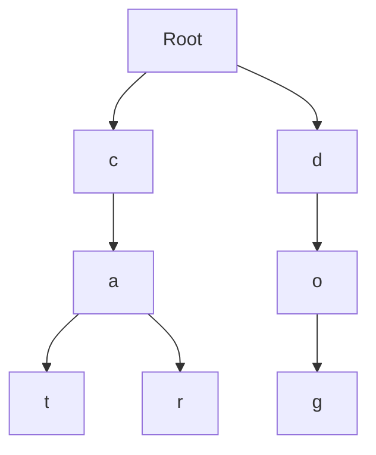
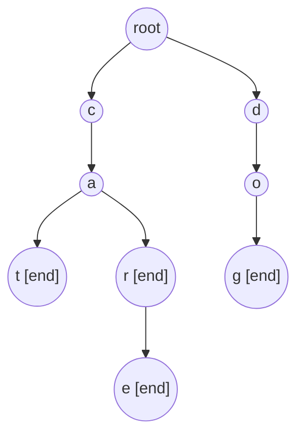

# Trie

트라이(Trie)는 **문자열 집합을 문자 단위로 나눠 저장하는 트리 자료구조**다.

한 줄로 요약하면 다음과 같다.

```text
문자열의 공통 접두사를 공유해서 저장하는 자료구조
```

즉 문자열을 통째로 저장하는 것이 아니라,
앞 글자부터 경로처럼 저장한다.

---

## 1. 언제 쓰는가

아래 상황이면 트라이를 떠올릴 수 있다.

- 문자열 집합 저장
- 접두사 검색
- 자동 완성
- 사전 순 탐색
- 문자열 삽입 / 검색을 많이 반복
- 어떤 문자열이 다른 문자열의 접두사인지 판별

대표 문제:

- 전화번호 목록
- 문자열 집합
- 자동 완성

---

## 2. 왜 해시셋만으로는 부족한가

해시셋은 특정 문자열이 존재하는지 찾는 데 강하다.
하지만 접두사 검색은 직접적이지 않다.

예:

- `cat`, `car`, `care`, `dog`

이 있을 때,
`ca`로 시작하는 문자열이 있는지 빠르게 확인하고 싶다면,
트라이가 훨씬 자연스럽다.

왜냐하면 `c -> a` 경로만 따라가 보면 되기 때문이다.

---

## 3. 핵심 아이디어

예를 들어 `cat`, `car`, `dog`를 저장하면,
`ca` 부분은 같이 공유된다.

즉 공통 접두사를 묶어서 저장하므로,
문자열 검색이 길이에 비례해서 가능하다.



이 다이어그램에서 `cat`과 `car`가 `c -> a`를 공유하는 것이 핵심이다.

---

## 4. 기본 구조

### 배열 기반 노드

```java
static class Node {
    Node[] child = new Node[26];
    boolean end;
}
```

- `child[i]`: 다음 문자로 가는 포인터
- `end`: 이 노드에서 단어가 끝나는지 여부

보통 소문자 영어만 다루면 길이 26 배열로 충분하다.

문자 종류가 다양하면:

```java
Map<Character, Node> child = new HashMap<>();
```

처럼 구현하기도 한다.

---

## 5. `end`가 왜 필요한가

예를 들어 `car`를 넣고 `care`도 넣었다고 하자.
그러면 `r` 노드까지는 공통이다.

이때 `car` 자체가 단어인지 알기 위해서는,
문자 경로만으로는 부족하고 "여기서 끝나는 단어가 있는가" 표시가 필요하다.

즉:

```text
경로 존재 여부 != 단어 존재 여부
```

이 차이를 구분하기 위해 `end`가 필요하다.

---

## 6. 삽입 Insert


```java
Node root = new Node();

void insert(String s) {
    Node cur = root;

    for (char ch : s.toCharArray()) {
        int idx = ch - 'a';
        if (cur.child[idx] == null) {
            cur.child[idx] = new Node();
        }
        cur = cur.child[idx];
    }

    cur.end = true;
}
```

의미:

- 글자를 하나씩 따라 내려가고
- 없으면 새 노드를 만들고
- 마지막 글자 노드에 `end = true`

---

## 7. 검색 Search


```java
boolean search(String s) {
    Node cur = root;

    for (char ch : s.toCharArray()) {
        int idx = ch - 'a';
        if (cur.child[idx] == null) return false;
        cur = cur.child[idx];
    }

    return cur.end;
}
```

중요한 점:

- 경로만 있다고 끝이 아니다
- 마지막에 `cur.end`가 `true`여야 실제 단어다

예:

- `care`가 들어 있고
- `car`는 안 들어 있으면

`c -> a -> r` 경로는 존재해도 `search("car")`는 `false`일 수 있다.

---

## 8. 접두사 확인 StartsWith


```java
boolean startsWith(String s) {
    Node cur = root;

    for (char ch : s.toCharArray()) {
        int idx = ch - 'a';
        if (cur.child[idx] == null) return false;
        cur = cur.child[idx];
    }

    return true;
}
```

이 함수는 단어의 끝 여부가 아니라,
그 접두사를 가진 문자열이 존재하는지만 본다.

---

## 9. 작은 예시로 따라가기

문자열을 다음 순서로 넣는다고 하자.

```text
cat
car
care
dog
```

### `insert("cat")`

- root -> c -> a -> t 생성
- `t.end = true`

### `insert("car")`

- root -> c -> a 는 이미 있음
- `r`만 새로 생성
- `r.end = true`

### `insert("care")`

- root -> c -> a -> r 까지 이미 있음
- `e`만 새로 생성
- `e.end = true`

이 과정을 보면 접두사가 공유되는 이유가 보인다.

특히 `car`와 `care`를 같이 보면 `end`의 의미가 분명해진다.

- `r.end = true`면 `car`가 단어라는 뜻
- `e.end = true`면 `care`도 단어라는 뜻

즉 같은 경로를 공유하더라도 어디서 단어가 끝나는지는 별도로 기록해야 한다.

### 완성된 트라이 구조

`cat`, `car`, `care`, `dog` 네 단어를 모두 삽입한 뒤의 트라이:



`[end]` 표시가 있는 노드에서 단어가 끝난다.
같은 접두사 `ca`를 `cat`, `car`, `care`가 공유하고 있는 것이 핵심이다.

---

## 10. 시간 복잡도

문자열 길이를 `L`이라 하면:

- 삽입: `O(L)`
- 검색: `O(L)`
- 접두사 확인: `O(L)`

즉 데이터 개수가 많아도,
한 번의 연산은 문자열 길이에 비례한다.

이 점 때문에 문자열 개수가 매우 많아도,
한 번의 삽입과 검색은 문자열 길이만큼만 보면 된다는 장점이 있다.

---

## 11. 메모리 관점에서의 주의점

트라이는 빠르지만 메모리를 많이 쓸 수 있다.

특히:

- 문자 종류가 많고
- 문자열 개수가 많고
- 배열 기반 자식 포인터를 쓰면

빈 칸이 많이 생길 수 있다.

그래서 문자 종류가 많은 경우는 `HashMap<Character, Node>` 기반이 더 유리할 수 있다.

반대로 문자 종류가 적고 고정되어 있으면 배열 기반이 더 빠르고 단순하다.

즉 트라이는:

- 속도를 우선하면 배열 기반
- 메모리를 아끼고 문자 종류가 다양하면 맵 기반

으로 생각하면 된다.

### 삭제나 prefix 개수까지 필요하면 `pass`를 둔다

실전에서는 단순 `search`만이 아니라:

- 어떤 접두사를 가진 단어 수
- 문자열 삭제
- 같은 단어가 몇 번 들어왔는지

까지 묻는 경우가 많다.

이때는 각 노드에 `pass`와 `endCount`를 두면 편하다.

```java
static class Node {
    Map<Character, Node> child = new HashMap<>();
    int pass;
    int endCount;
}
```

- `pass`: 이 노드를 지나는 단어 수
- `endCount`: 이 노드에서 끝나는 단어 수

삽입할 때는 경로를 따라 `pass++`,
삭제할 때는 `pass--` 하면서 내려가고,
`pass == 0`인 노드는 정리할 수 있다.

이 패턴을 알고 있으면
전화번호 목록, 자동완성, 문자열 멀티셋 문제까지 같은 구조로 확장할 수 있다.

---

## 12. 자주 하는 실수

### 1) `end` 표시를 안 함

단어 존재와 접두사 존재를 구분 못 하게 된다.

### 2) 문자 인덱스 변환 실수

```java
int idx = ch - 'a';
```

를 정확히 맞춰야 한다.

### 3) 문자 종류가 많은데 배열만 고집함

메모리가 과하게 커질 수 있다.

### 4) 루트 처리 혼동

루트는 보통 빈 문자열 시작점이다.
문자를 직접 들고 있지 않아도 된다.

---

## 13. 시험장용 최소 암기 버전

```text
Trie:
문자열 접두사 공유 저장

핵심:
insert / search / startsWith

구조:
child[] or Map
end flag

복잡도:
문자열 길이 L에 대해 O(L)
```

---

## 14. 최종 요약

트라이는 다음 문장으로 정리할 수 있다.

```text
문자열을 접두사 단위로 공유 저장해서
삽입과 검색을 문자열 길이만큼 처리하는 자료구조
```

문제를 보면 먼저 이 질문을 하면 된다.

```text
문자열 전체 일치만 필요한가,
아니면 접두사 구조 자체가 중요한가?
```

접두사가 핵심이면 트라이 가능성이 높다.
