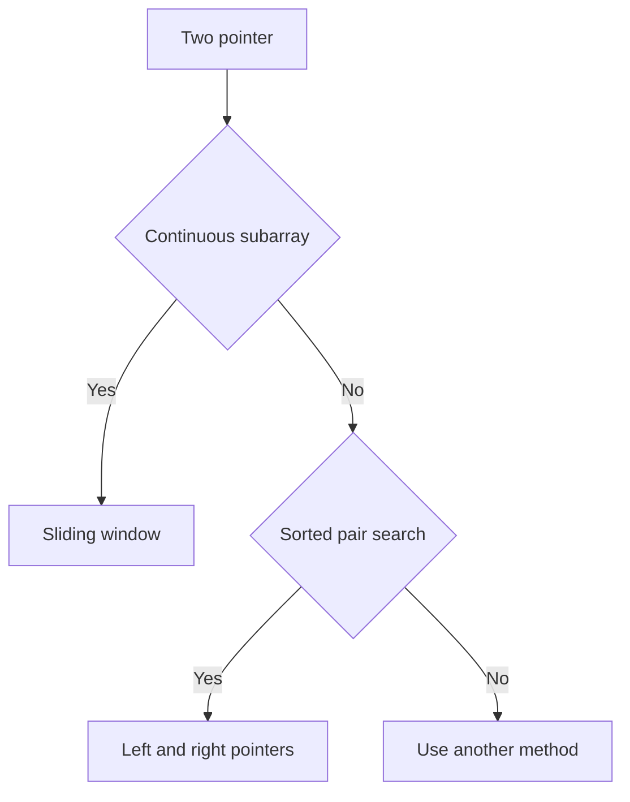

# Two Pointer

투 포인터(Two Pointer)는 **배열이나 문자열에서 두 개의 위치를 움직이며 조건을 만족하는 구간이나 쌍을 찾는 기법**이다.

한 줄로 요약하면 다음과 같다.

```text
두 개의 포인터를 적절히 움직여
불필요한 중복 탐색을 줄이는 선형 시간 기법
```

---

## 1. 언제 쓰는가

문제에서 아래 표현이 보이면 투 포인터를 의심하면 된다.

- 연속된 부분 배열
- 구간 합
- 합이 M인 두 수
- 양끝에서 좁혀 오기
- 정렬된 배열에서 조건을 만족하는 쌍 찾기
- 최소 길이 구간, 최대 길이 구간

투 포인터는 크게 두 종류로 나뉜다.

| 유형 | 포인터 움직임 | 대표 문제 |
|---|---|---|
| 슬라이딩 윈도우 | 같은 방향 | 연속 부분합, 최소 길이 구간 |
| 양끝 투 포인터 | 서로 반대 방향 | 정렬된 배열의 두 수의 합 |

즉,

- 둘 다 왼쪽에서 오른쪽으로 밀리면 슬라이딩 윈도우
- 하나는 왼쪽, 하나는 오른쪽에서 오면 양끝 투 포인터

---

## 2. 핵심 아이디어

투 포인터의 핵심은 다음과 같다.

```text
한 번 확인한 구간 정보를 버리지 않고
포인터를 조금씩 움직이며 다음 상태를 만든다
```

예를 들어 구간 `[start, end]`의 합을 알고 있는데,
다음 구간이 `[start, end + 1]`이라면 처음부터 다시 더할 필요가 없다.

```java
sum += arr[end + 1];
```

만 하면 된다.

즉 투 포인터는:

- 이전 계산 결과를 재활용하고
- 포인터를 단조롭게 이동시켜
- 전체를 `O(n)` 또는 `O(n log n)` 수준으로 줄이는 기법

이다.

---

## 3. 슬라이딩 윈도우와 투 포인터의 관계

실전에서는 둘을 넓게 묶어서 모두 투 포인터라고 부르기도 한다.

하지만 학습할 때는 구분해 두는 편이 좋다.

### 1) 슬라이딩 윈도우

- 보통 연속된 구간을 다룬다
- `start`, `end`가 둘 다 오른쪽으로만 이동한다
- 구간 합, 구간 길이, 구간 내 조건 유지 문제에 자주 나온다

### 2) 양끝 투 포인터

- 보통 정렬된 배열에서 쌍을 찾는다
- `left`는 오른쪽으로, `right`는 왼쪽으로 이동한다
- 두 수의 합, 차이, 조건 만족 쌍 개수 문제에 자주 나온다

이 둘은 포인터를 움직인다는 점은 같지만,
문제를 보는 관점은 꽤 다르다.



즉 투 포인터를 쓸지 판단할 때는 먼저 "연속 구간 문제인가"와 "정렬된 쌍 문제인가"를 구분하는 것이 가장 빠르다.

---

## 4. 슬라이딩 윈도우의 핵심 조건

슬라이딩 윈도우는 아무 문제에나 되는 것이 아니다.

가장 중요한 전제는 다음이다.

```text
포인터를 움직일 때 구간의 상태가 예측 가능해야 한다
```

특히 구간 합 문제에서 많이 쓰이는 전제는:

```text
배열 원소가 음수가 없을 때
```

이다.

왜냐하면:

- `end`를 오른쪽으로 늘리면 합이 커지거나 같아지고
- `start`를 오른쪽으로 줄이면 합이 작아지거나 같아진다

즉 합의 변화 방향이 예측 가능하다.

반대로 음수가 섞이면:

- 구간을 늘렸는데 합이 줄 수도 있고
- 줄였는데 합이 커질 수도 있다

그래서 일반적인 슬라이딩 윈도우 논리가 깨진다.

```text
반례: arr = [3, -2, 5], target ≥ 4
윈도우 [3,-2] → sum=1 < 4 → end 확장
윈도우 [3,-2,5] → sum=6 ≥ 4 → start 줄임
윈도우 [-2,5] → sum=3 < 4 → end 이동 불가
→ 정답 구간 [5] (sum=5) 를 놓침!

음수 때문에 start를 줄이면 합이 커지는 상황 발생
→ 단조성이 깨져서 투 포인터 불가
```

이 부분이 가장 중요하다.

---

## 5. 고정 길이 슬라이딩 윈도우

가장 쉬운 형태다.

문제 예시:

```text
길이가 K인 연속 부분 배열의 합 중 최댓값을 구하라
```

아이디어:

- 첫 구간 합을 구한다
- 한 칸 옮길 때마다
  - 왼쪽 값 하나 빼고
  - 오른쪽 값 하나 더한다


```java
int maxWindowSum(int[] arr, int k) {
    int n = arr.length;
    int sum = 0;

    for (int i = 0; i < k; i++) {
        sum += arr[i];
    }

    int answer = sum;

    for (int i = k; i < n; i++) {
        sum += arr[i];
        sum -= arr[i - k];
        answer = Math.max(answer, sum);
    }

    return answer;
}
```

이 방식은 길이가 고정이므로 가장 단순하다.

---

## 6. 가변 길이 슬라이딩 윈도우

이번에는 구간 길이가 고정되지 않은 경우다.

문제 예시:

```text
합이 M 이상이 되는 가장 짧은 연속 부분 배열 길이
```

이 경우는 보통:

- `end`를 늘리면서 조건을 만족시킨 뒤
- 조건을 만족하는 동안 `start`를 줄여 최소 길이를 갱신

하는 구조가 된다.

```text
가변 윈도우 동작:
arr = [2, 3, 1, 2, 4, 3],  target ≥ 7

step 1: [2]                 sum=2  < 7  → end 확장
step 2: [2,3]               sum=5  < 7  → end 확장
step 3: [2,3,1]             sum=6  < 7  → end 확장
step 4: [2,3,1,2]           sum=8  ≥ 7  → 길이 4 기록, start 줄임
step 5:   [3,1,2]           sum=6  < 7  → end 확장
step 6:   [3,1,2,4]         sum=10 ≥ 7  → 길이 4 기록, start 줄임
step 7:     [1,2,4]         sum=7  ≥ 7  → 길이 3 기록, start 줄임
step 8:       [2,4]         sum=6  < 7  → end 확장
step 9:       [2,4,3]       sum=9  ≥ 7  → 길이 3, start 줄임
step10:         [4,3]       sum=7  ≥ 7  → 길이 2 기록 ← 최솟값
```


```java
int minLengthAtLeastS(int[] arr, int s) {
    int n = arr.length;
    int start = 0;
    int sum = 0;
    int answer = Integer.MAX_VALUE;

    for (int end = 0; end < n; end++) {
        sum += arr[end];

        while (sum >= s) {
            answer = Math.min(answer, end - start + 1);
            sum -= arr[start++];
        }
    }

    return answer == Integer.MAX_VALUE ? 0 : answer;
}
```

핵심은 다음과 같다.

```text
조건을 만족하지 않으면 end를 늘리고
조건을 만족하면 start를 줄인다
```

---

## 7. 합이 정확히 M인 연속 부분 배열 개수

배열 원소가 모두 양수일 때 자주 나오는 문제다.

아이디어:

- `end`를 늘리며 합을 키운다
- 합이 너무 크거나 같아지면 `start`를 줄이며 조정한다
- 합이 정확히 `M`일 때 개수를 센다


```java
int countSubarraysSumM(int[] arr, int m) {
    int n = arr.length;
    int start = 0;
    int sum = 0;
    int count = 0;

    for (int end = 0; end < n; end++) {
        sum += arr[end];

        while (sum >= m) {
            if (sum == m) count++;
            sum -= arr[start++];
        }
    }

    return count;
}
```

주의:

이 방식은 **배열 원소가 양수일 때**만 자연스럽게 성립한다.
음수가 있으면 보통 `Prefix Sum + HashMap` 쪽으로 가야 한다.

---

## 8. 양끝 투 포인터의 핵심

이번에는 포인터가 서로 반대 방향으로 움직이는 경우다.

대표 문제:

```text
정렬된 배열에서 합이 M이 되는 두 수를 찾아라
```

배열이 정렬되어 있다고 하자.

- 합이 작으면 더 큰 값이 필요하므로 `left++`
- 합이 크면 더 작은 값이 필요하므로 `right--`

이렇게 하면 모든 쌍을 다 보지 않고도 답을 찾을 수 있다.

---

## 9. 왜 정렬이 중요할까

양끝 투 포인터는 **정렬**이 핵심 전제다.

정렬되어 있어야:

- 왼쪽 포인터를 오른쪽으로 옮기면 값이 커지고
- 오른쪽 포인터를 왼쪽으로 옮기면 값이 작아진다

즉 포인터를 어떻게 움직여야 하는지가 논리적으로 결정된다.

정렬이 안 되어 있으면:

- `left++`가 값을 키운다는 보장이 없고
- `right--`가 값을 줄인다는 보장이 없다

그래서 일반적인 양끝 투 포인터는 성립하지 않는다.

---

## 10. 두 수의 합


```java
import java.util.*;

class Solution {
    int countPairs(int[] arr, int target) {
        Arrays.sort(arr);

        int left = 0;
        int right = arr.length - 1;
        int count = 0;

        while (left < right) {
            int sum = arr[left] + arr[right];

            if (sum == target) {
                count++;
                left++;
                right--;
            } else if (sum < target) {
                left++;
            } else {
                right--;
            }
        }

        return count;
    }
}
```

이 코드는 가장 기본형이다.

다만 중복 값 처리 방식은 문제에 따라 달라질 수 있다.
예를 들어:

- 서로 다른 인덱스 쌍 개수를 세는지
- 중복 수를 어떻게 세는지
- 한 쌍만 찾으면 되는지

를 반드시 확인해야 한다.

---

## 11. 작은 예시로 이해하기

배열:

```text
1 2 4 7 11 15
```

목표 합:

```text
15
```

초기:

- `left = 0` -> 1
- `right = 5` -> 15
- 합 = 16

합이 크므로 `right--`

- `left = 0` -> 1
- `right = 4` -> 11
- 합 = 12

합이 작으므로 `left++`

- `left = 1` -> 2
- `right = 4` -> 11
- 합 = 13

합이 작으므로 `left++`

- `left = 2` -> 4
- `right = 4` -> 11
- 합 = 15

정답 발견.

이 과정에서 모든 조합을 다 보지 않았다는 점이 핵심이다.

---

## 12. 슬라이딩 윈도우와 누적합의 차이

둘 다 구간 합 문제에 자주 나온다.
하지만 쓰이는 상황이 조금 다르다.

### 누적합이 더 자연스러운 경우

- 여러 개의 구간 합 쿼리
- 구간 합을 빠르게 반복 조회
- 음수가 있어도 상관없음

### 슬라이딩 윈도우가 더 자연스러운 경우

- 포인터를 움직이며 한 번에 답을 찾음
- 양수 배열의 최소 길이/개수 문제
- 연속 구간의 상태를 실시간 유지

예를 들어:

- "구간 [L, R] 합을 많이 물어본다" -> 누적합
- "조건을 만족하는 가장 짧은 연속 구간" -> 슬라이딩 윈도우

---

## 13. 음수가 있으면 왜 위험한가

예를 들어 배열이 다음과 같다고 하자.

```text
3 -2 5
```

현재 합이 크다고 해서 왼쪽을 줄이면 합이 무조건 감소하는가?
그렇지 않다.

현재 합이 작다고 해서 오른쪽을 늘리면 합이 무조건 증가하는가?
그렇지도 않다.

즉,

```text
포인터 이동 -> 합의 방향 변화
```

가 단조롭지 않다.

그래서 음수가 섞인 구간 합 문제에서는 보통:

- 누적합
- 해시맵
- 이분 탐색
- 덱

같은 다른 기법을 생각해야 한다.

---

## 14. 투 포인터가 `O(n)`인 이유

슬라이딩 윈도우에서 `start`, `end`는 둘 다 오른쪽으로만 이동한다.

즉 각 포인터는 배열 끝까지 최대 한 번씩만 간다.

그래서 전체 이동 횟수는 많아야 `2n` 정도다.

양끝 투 포인터도 마찬가지다.

- `left`는 오른쪽으로만 이동
- `right`는 왼쪽으로만 이동

따라서 전체가 선형 시간에 가깝게 끝난다.

이게 모든 쌍을 다 보는 `O(n^2)`와 가장 큰 차이다.

---

## 15. fast/slow 포인터도 넓게는 투 포인터다

연결 리스트 문제에서는 투 포인터가 또 다른 모습으로 나온다.

대표 예시:

- 중간 노드 찾기
- 사이클 판별

여기서는 보통:

- slow는 한 칸씩
- fast는 두 칸씩

움직인다.

이것도 포인터 두 개를 움직이는 기법이므로 넓게 보면 투 포인터다.

다만 배열 문제에서 말하는 투 포인터와는 목적이 다르므로,
코테 알고리즘 노트에서는 보통 분리해서 이해해도 된다.

---

## 16. 자주 하는 실수

### 1) 슬라이딩 윈도우를 음수 배열에 그대로 적용

가장 흔한 실수다.
합의 단조성이 깨지면 논리가 무너진다.

### 2) 양끝 투 포인터에서 정렬을 안 함

정렬이 안 되어 있으면 포인터 이동 근거가 없다.

### 3) `while` 조건을 잘못 둠

예를 들어 `left < right`인지, `left <= right`인지에 따라 중복 세기나 종료 조건이 달라진다.

### 4) 구간 길이 계산 실수

```java
end - start + 1
```

를 자주 틀린다.

### 5) 조건을 만족했을 때 어떤 포인터를 움직일지 애매하게 처리

문제에 따라 다르다.

- 한 쌍만 찾는가
- 모든 쌍을 세는가
- 중복을 허용하는가

를 먼저 분명히 해야 한다.

---

## 17. 실전 판단 기준

문제에서 아래 조건 조합이 보이면 투 포인터일 가능성이 높다.

### 슬라이딩 윈도우 쪽

- 연속 부분 배열
- 합, 길이, 조건 만족 여부
- 원소가 양수 또는 비음수
- 최솟값/최댓값/개수

### 양끝 투 포인터 쪽

- 정렬된 배열
- 두 수의 합 / 차이
- 쌍 찾기
- 양끝에서 줄여 나가기

---

## 18. 시험장용 최소 암기 버전

```text
투 포인터:
포인터 두 개를 움직여 중복 탐색 줄이기

분류:
1) 슬라이딩 윈도우
   - 같은 방향
   - 연속 구간
2) 양끝 투 포인터
   - 반대 방향
   - 정렬된 배열의 쌍

슬라이딩 윈도우 핵심:
조건 안 되면 end++
조건 되면 start++

양끝 투 포인터 핵심:
sum < target -> left++
sum > target -> right--

주의:
음수 배열
정렬 여부
중복 처리
```

---

## 19. 최종 요약

투 포인터는 다음 문장으로 정리할 수 있다.

```text
두 개의 포인터를 단조롭게 움직이며
구간이나 쌍을 선형 시간에 처리하는 기법
```

핵심만 다시 압축하면:

- 슬라이딩 윈도우는 연속 구간 문제에 사용
- 양끝 투 포인터는 정렬된 배열의 쌍 문제에 사용
- 한 번 계산한 정보를 재활용해 중복 탐색을 줄인다
- 슬라이딩 윈도우는 보통 양수 배열에서 특히 강력하다
- 양끝 투 포인터는 정렬이 핵심 전제다

문제를 보면 먼저 이 질문을 하면 된다.

```text
포인터를 한 방향 또는 양끝에서 움직이면
이전 계산을 재활용할 수 있는가?
```

이 질문의 답이 예라면 투 포인터일 가능성이 높다.
