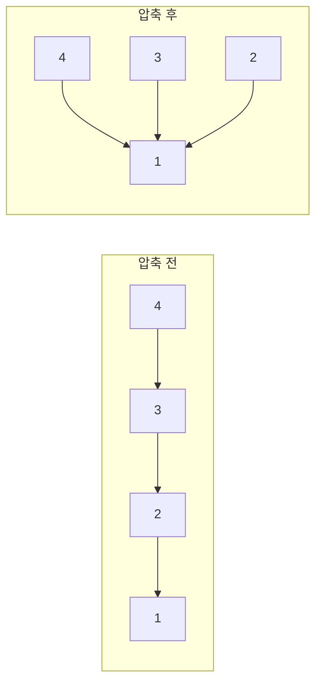
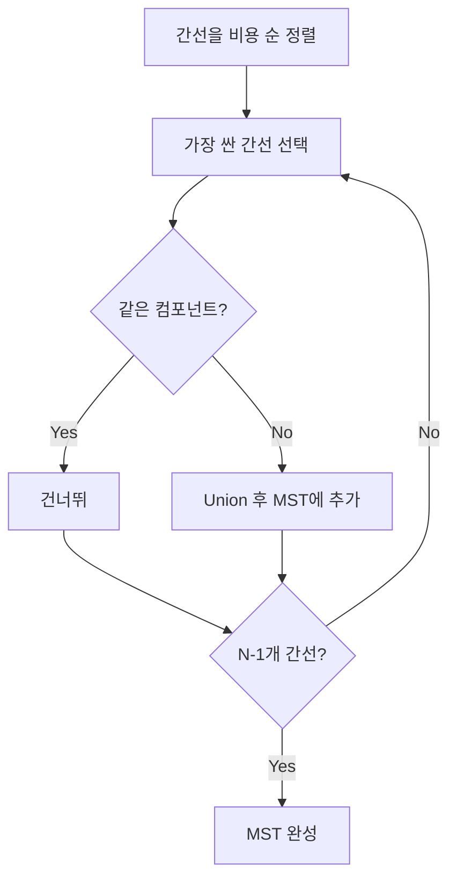

# Union-Find

Union-Find(Disjoint Set Union, DSU)는 **원소들이 어떤 집합에 속해 있는지 빠르게 관리하는 자료구조**다.

한 줄로 요약하면 다음과 같다.

```text
합칠 집합은 합치고
같은 집합인지 빠르게 확인하는 자료구조
```

---

## 1. 언제 쓰는가

문제에서 아래 표현이 보이면 Union-Find를 먼저 떠올리면 된다.

- 같은 그룹인가?
- 네트워크 연결 여부
- 친구 관계 묶기
- 간선이 추가될 때 연결 상태 관리
- 사이클 판별
- 최소 스패닝 트리 Kruskal

Union-Find는 그래프 자체를 탐색하는 자료구조가 아니라,
**연결 요소를 빠르게 합치고 대표를 찾는 자료구조**다.

즉 DFS/BFS처럼 경로를 따라가는 도구가 아니라,
집합 구조를 관리하는 도구다.

---

## 2. 핵심 연산은 두 개뿐이다

### 1) `find(x)`

`x`가 속한 집합의 대표(root)를 찾는다.

### 2) `union(a, b)`

`a`와 `b`가 속한 두 집합을 하나로 합친다.

이 두 개만 있으면 다음이 가능하다.

```java
find(a) == find(b)
```

이면 같은 집합,
아니면 다른 집합이다.

---

## 3. 자료구조 핵심 아이디어

`parent[i]` 배열 하나로 집합을 트리처럼 표현한다.

초기에는 각 원소가 자기 자신을 부모로 가진다.

```text
1   2   3   4   5
```

초기 상태:

```text
parent[1] = 1
parent[2] = 2
parent[3] = 3
parent[4] = 4
parent[5] = 5
```

즉 모두 서로 다른 집합이다.

만약 `union(1, 2)`를 하면,
예를 들어 2의 부모를 1로 둬서:

```text
1 <- 2
```

처럼 묶을 수 있다.

또 `union(2, 3)`을 하면 3도 결국 1 쪽 집합으로 들어간다.

핵심은:

```text
같은 집합의 원소들은 결국 같은 루트를 가진다
```

는 점이다.

---

## 4. makeSet 초기화

모든 원소를 독립된 집합으로 시작한다.


```java
int[] parent = new int[n + 1];

for (int i = 1; i <= n; i++) {
    parent[i] = i;
}
```

즉 처음에는 각 원소가 자기 집합의 대표다.

---

## 5. find 연산

가장 단순한 `find`는 루트가 나올 때까지 부모를 타고 올라가는 것이다.

### 기본형

```java
int find(int x) {
    if (parent[x] == x) return x;
    return find(parent[x]);
}
```

예를 들어:

```text
parent[3] = 2
parent[2] = 1
parent[1] = 1
```

이면 `find(3)`은 `1`을 반환한다.

즉 3이 속한 집합의 대표는 1이다.

---

## 6. union 연산

`union(a, b)`는 다음 순서로 생각하면 된다.

1. `a`의 루트를 찾는다
2. `b`의 루트를 찾는다
3. 루트가 다르면 한쪽 루트를 다른 쪽 루트 밑에 붙인다

### 기본형

```java
boolean union(int a, int b) {
    int ra = find(a);
    int rb = find(b);

    if (ra == rb) return false;

    parent[rb] = ra;
    return true;
}
```

반환값을 `boolean`으로 두는 이유는 실전에서 매우 편하기 때문이다.

- 이미 같은 집합이면 `false`
- 실제로 합쳐졌으면 `true`

이렇게 하면 Kruskal이나 사이클 판별에서 바로 쓸 수 있다.

---

## 7. 왜 느려질 수 있는가

기본형 그대로만 쓰면 트리가 한쪽으로 길게 늘어질 수 있다.

예:

```text
1 <- 2 <- 3 <- 4 <- 5 <- 6
```

이런 구조가 되면 `find(6)`은 루트를 찾기 위해 계속 타고 올라가야 한다.
즉 거의 선형 시간이 걸릴 수 있다.

그래서 실전에서는 반드시 최적화를 넣는다.

---

## 8. 경로 압축 Path Compression

경로 압축은 `find`를 하면서 지나간 노드들을 루트에 직접 연결하는 기법이다.

### 최적화된 find

```java
int find(int x) {
    if (parent[x] == x) return x;
    return parent[x] = find(parent[x]);
}
```

예를 들어:

```text
1 <- 2 <- 3 <- 4
```

에서 `find(4)`를 한 번 수행하면,
이후에는 다음처럼 압축된다.

```text
1 <- 2
1 <- 3
1 <- 4
```

즉 나중부터는 `find`가 훨씬 빨라진다.



이 다이어그램이 경로 압축의 핵심이다. 한 번 `find`를 하고 나면 이후 탐색이 루트에 거의 바로 닿게 된다.

---

## 9. Union by Size / Rank

또 하나의 최적화는 트리를 합칠 때 아무렇게나 붙이지 않는 것이다.

핵심 아이디어:

```text
작은 트리를 큰 트리 밑으로 붙이자
```

이렇게 하면 트리 높이가 크게 늘어나는 것을 막을 수 있다.

보통 두 가지 기준을 쓴다.

- size: 집합 크기
- rank: 트리 높이에 대한 근사값

실전에서는 size 기준이 직관적이라 많이 쓴다.

---

## 10. 실전용 DSU


```java
static class DSU {
    int[] parent;
    int[] size;

    DSU(int n) {
        parent = new int[n + 1];
        size = new int[n + 1];

        for (int i = 1; i <= n; i++) {
            parent[i] = i;
            size[i] = 1;
        }
    }

    int find(int x) {
        if (parent[x] == x) return x;
        return parent[x] = find(parent[x]);
    }

    boolean union(int a, int b) {
        int ra = find(a);
        int rb = find(b);

        if (ra == rb) return false;

        if (size[ra] < size[rb]) {
            int tmp = ra;
            ra = rb;
            rb = tmp;
        }

        parent[rb] = ra;
        size[ra] += size[rb];
        return true;
    }
}
```

이 버전이 실전 표준에 가깝다.

---

## 11. 시간 복잡도는 왜 거의 `O(1)`처럼 느껴지는가

경로 압축 + union by size/rank를 함께 쓰면,
각 연산의 시간 복잡도는 엄밀히는:

```text
O(alpha(n))
```

이다.

여기서 `alpha(n)`은 아커만 역함수인데,
실전에서는 거의 상수처럼 생각해도 된다.

즉 Union-Find는 매우 빠르다.

---

## 12. 사이클 판별에 어떻게 쓰는가

무방향 그래프에서 간선을 하나씩 볼 때,
간선 `(u, v)`를 추가하려고 하는데 이미 `u`와 `v`가 같은 집합이면 사이클이 생긴다.

왜냐하면:

- 이미 두 정점이 연결되어 있는데
- 거기에 다시 간선을 추가하면
- 닫힌 경로가 생기기 때문이다

### Java 예시

```java
if (find(u) == find(v)) {
    // 사이클 발생
} else {
    union(u, v);
}
```

이 패턴은 아주 중요하다.

---

## 13. Kruskal 알고리즘에서의 역할

Union-Find가 가장 유명하게 쓰이는 곳이 Kruskal MST다.

Kruskal은 간선을 가중치 순으로 보면서:

- 사이클이 생기지 않으면 선택
- 사이클이 생기면 버린다

이때 사이클 여부를 빠르게 판별하는 도구가 Union-Find다.

### 흐름

1. 간선을 비용 오름차순으로 정렬
2. 간선을 하나씩 확인
3. 두 정점이 다른 집합이면 union하고 채택
4. 같은 집합이면 버림

즉 Kruskal에서 Union-Find는 사실상 필수다.

### Kruskal MST 구현

```java
import java.util.*;

class Edge implements Comparable<Edge> {
    int from, to, cost;

    Edge(int from, int to, int cost) {
        this.from = from;
        this.to = to;
        this.cost = cost;
    }

    public int compareTo(Edge o) {
        return Integer.compare(this.cost, o.cost);
    }
}

long kruskal(int n, List<Edge> edges) {
    Collections.sort(edges);
    DSU dsu = new DSU(n);
    long totalCost = 0;
    int edgeCount = 0;

    for (Edge e : edges) {
        if (dsu.union(e.from, e.to)) {
            totalCost += e.cost;
            edgeCount++;
            if (edgeCount == n - 1) break;
        }
    }

    return totalCost;
}
```

핵심 포인트:

- 간선을 비용순 정렬
- `union` 성공 시 채택
- `N - 1`개 간선이 채택되면 MST 완성



Union-Find가 빠른 이유는,
Kruskal이 매 간선마다 해야 하는 "이미 같은 집합인가?" 판별을 거의 상수 시간에 처리해 주기 때문이다.

---

## 14. 연결 요소 개수 관리

Union-Find로 연결 요소 개수도 쉽게 관리할 수 있다.

처음에는 노드 수만큼 집합이 있고,
성공적으로 union할 때마다 연결 요소 개수를 1 줄이면 된다.

### 예시

```java
int components = n;

if (union(a, b)) {
    components--;
}
```

이 방식은:

- 네트워크 개수
- 섬 개수 병합
- 그룹 수 계산

문제에서 자주 쓰인다.

---

## 15. 집합에 추가 정보도 같이 저장할 수 있다

Union-Find의 강점은 단순 연결 여부만이 아니다.
루트에 집합 정보를 같이 저장하면 다양한 응용이 가능하다.

예:

- 집합 크기
- 최소 비용
- 최대값
- 합계
- 루트 대표의 특수 정보

예를 들어 최소 비용을 루트에 저장하면,
"각 그룹의 최소 비용 합" 같은 문제를 쉽게 풀 수 있다.

---

## 16. 그룹별 최소 비용 예시

정의:

```java
int[] minCost;
```

각 루트가 자기 집합의 최소 비용을 들고 있다고 하자.

### Java 예시

```java
boolean union(int a, int b) {
    int ra = find(a);
    int rb = find(b);
    if (ra == rb) return false;

    if (size[ra] < size[rb]) {
        int tmp = ra;
        ra = rb;
        rb = tmp;
    }

    parent[rb] = ra;
    size[ra] += size[rb];
    minCost[ra] = Math.min(minCost[ra], minCost[rb]);
    return true;
}
```

이렇게 하면 각 집합이 합쳐질 때 정보도 함께 갱신된다.

중요한 점:

```text
집계값은 루트 기준으로만 믿는다
```

즉 루트가 아닌 노드의 값은 의미가 없을 수 있다.

---

## 17. DFS/BFS와 언제 다르게 쓰는가

Union-Find와 DFS/BFS는 비슷해 보이지만 목적이 다르다.

### DFS/BFS가 더 자연스러운 경우

- 실제 경로를 따라가야 한다
- 연결된 정점을 모두 방문해야 한다
- 탐색 순서가 중요하다
- 최단 거리나 순회가 필요하다

### Union-Find가 더 자연스러운 경우

- 같은 그룹인지 빠르게 판단해야 한다
- 간선 추가가 계속 일어난다
- 집합 병합만 중요하다
- 사이클 여부만 빠르게 확인하면 된다

즉 Union-Find는 탐색이 아니라 **집합 관리**다.

---

## 18. 자주 하는 실수

### 1) union 전에 find를 안 함

`a`, `b` 자체를 바로 붙이면 안 된다.
항상 루트끼리 붙여야 한다.

### 2) 경로 압축을 안 넣음

입력 크기가 크면 시간 차이가 크게 난다.

### 3) 루트가 아닌 노드의 집계값을 사용함

크기, 최소값, 합계 같은 값은 루트 기준으로만 관리하는 경우가 많다.

### 4) 0-based와 1-based 인덱스를 섞음

코테에서 매우 자주 나는 실수다.

### 5) 방향 그래프 문제에 무작정 사용함

Union-Find는 보통 무방향 연결성 관리에 쓰인다.
방향 그래프의 도달 가능성 문제와는 다르다.

### 6) 이미 같은 집합인데 또 union한 뒤 정보 갱신을 해 버림

`ra == rb`면 바로 종료해야 한다.

---

## 19. 실전 판단 기준

문제에서 아래 표현이 보이면 거의 DSU를 의심하면 된다.

- 그룹을 합친다
- 친구 관계를 묶는다
- 네트워크를 연결한다
- 간선을 추가할 때 사이클을 검사한다
- 같은 팀인가 확인한다
- 최소 스패닝 트리

그리고 다음 질문을 해 보면 된다.

```text
내가 필요한 것은 경로 탐색인가,
아니면 같은 집합인지 빠르게 판단하는 것인가?
```

답이 후자라면 Union-Find일 가능성이 높다.

---

## 20. 시험장용 최소 암기 버전

```text
Union-Find:
find(x) = 루트 찾기
union(a, b) = 집합 합치기

핵심:
같은 집합인지 빠르게 확인

기본 판별:
find(a) == find(b)

최적화:
경로 압축
union by size/rank

대표 사용처:
사이클 판별
Kruskal
연결 요소 관리
```

---

## 21. 최종 요약

Union-Find는 다음 문장으로 정리할 수 있다.

```text
원소들이 어떤 집합에 속해 있는지를 빠르게 관리하면서
집합 병합과 같은 집합 판별을 효율적으로 처리하는 자료구조
```

핵심만 다시 압축하면:

- `find`로 루트를 찾고 `union`으로 집합을 합친다
- 같은 집합 여부는 루트가 같은지로 판별한다
- 경로 압축과 union by size/rank가 핵심 최적화다
- 사이클 판별, Kruskal, 연결 요소 관리에서 매우 자주 쓴다
- 집합 크기, 최소 비용 같은 정보도 루트에 함께 저장할 수 있다

문제를 보면 먼저 이 질문을 하면 된다.

```text
경로를 알아야 하는가,
아니면 같은 그룹인지 빠르게만 알면 되는가?
```

후자라면 DSU가 정답일 가능성이 높다.
