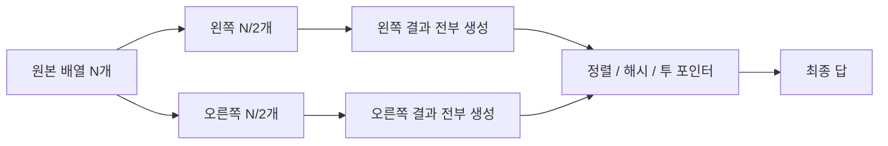
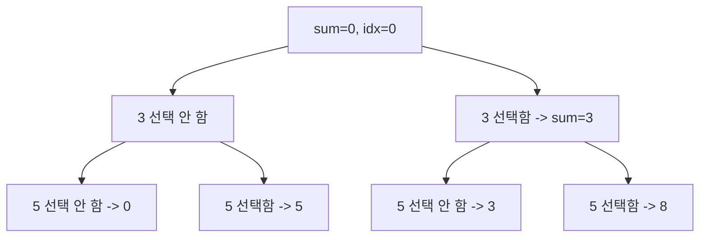
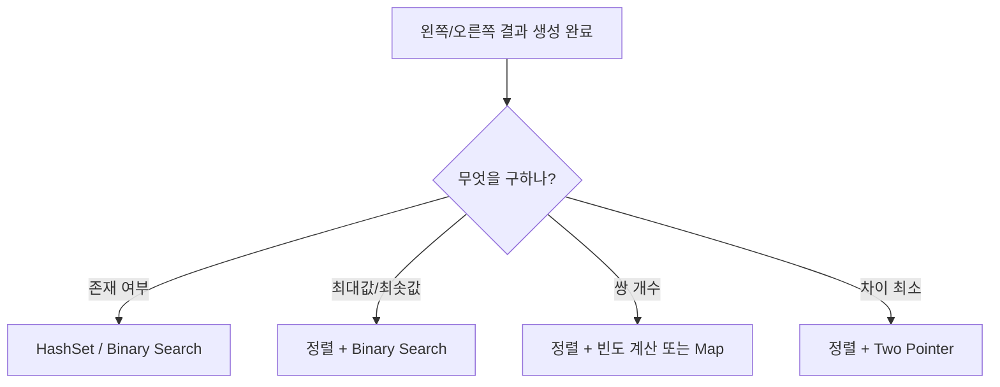

# Meet in the Middle

Meet in the Middle은 **완전탐색을 반으로 쪼개서 지수 시간을 줄이는 기법**이다.

한 줄로 요약하면 다음과 같다.

```text
N개를 한 번에 보지 말고 N/2씩 나눠서 합친다
```

---

## 1. 언제 쓰는가

문제에서 아래 조건 조합이 보이면 강하게 의심할 수 있다.

- 원소 수가 `N <= 40` 정도
- 부분집합 / 부분수열 / 선택 여부
- 완전탐색 `2^N`은 너무 큼
- DP를 쓰기엔 값 범위가 너무 큼
- 합, 차이, 무게 제한, 최대값

대표 문제:

- 부분수열 합
- 냅색 변형
- 부분집합 합이 K인지 판별
- `<= C`인 최대 부분합

---

## 2. 왜 필요한가

`N = 40`이면 전체 부분집합 수는:

```text
2^40 ≈ 1조
```

라서 완전탐색이 불가능하다.

하지만 반으로 나누면:

```text
왼쪽 20개 -> 2^20 ≈ 100만
오른쪽 20개 -> 2^20 ≈ 100만
```

이 정도는 계산 가능하다.

즉 핵심은:

```text
2^N -> 2^(N/2) + 2^(N/2)
```

로 줄이는 데 있다.

---

## 3. 핵심 아이디어

배열을 왼쪽 절반, 오른쪽 절반으로 나눈다.

그리고:

1. 왼쪽 절반에서 만들 수 있는 모든 결과를 구한다
2. 오른쪽 절반에서도 모든 결과를 구한다
3. 두 리스트를 정렬 / 이분 탐색 / 투 포인터 / 해시로 결합한다

이렇게 하면 원래의 큰 탐색을 두 개의 작은 탐색으로 바꿀 수 있다.



핵심은 "탐색 자체를 없애는 것"이 아니라
"큰 탐색 1번을 작은 탐색 2번 + 결합"으로 바꾸는 것이다.

---

## 4. 가장 대표적인 형태: 부분집합 합

예를 들어 배열이 있고:

```text
합이 C 이하인 부분집합 중 최대 합
```

을 구한다고 하자.

왼쪽 절반 부분합 리스트를 `A`,
오른쪽 절반 부분합 리스트를 `B`라고 하자.

그러면 답은:

```text
A의 어떤 합 + B의 어떤 합 <= C
```

를 만족하는 최댓값이다.

예를 들어:

```text
arr = [3, 5, 6, 7], C = 10
```

라고 하자.

절반으로 나누면:

- 왼쪽 `[3, 5]`
- 오른쪽 `[6, 7]`

이다.

왼쪽 부분합은:

```text
0, 3, 5, 8
```

오른쪽 부분합은:

```text
0, 6, 7, 13
```

이제 왼쪽의 각 값에 대해 오른쪽에서 최대한 큰 값을 붙인다.

- `0`에는 `10 이하`인 오른쪽 최대 `7` -> 합 `7`
- `3`에는 `7 이하`인 오른쪽 최대 `7` -> 합 `10`
- `5`에는 `5 이하`인 오른쪽 최대 `0` -> 합 `5`
- `8`에는 `2 이하`인 오른쪽 최대 `0` -> 합 `8`

정답은 `10`이다.

원래 `2^4 = 16`개 부분집합을 다 봐도 되지만,
`N`이 커지면 이 방식을 절반 분할로 일반화해야 한다.

---

## 5. 부분합 생성

재귀나 비트마스크로 만들 수 있다.

```java
void generateSums(int[] arr, int idx, int end, long sum, List<Long> out) {
    if (idx == end) {
        out.add(sum);
        return;
    }

    generateSums(arr, idx + 1, end, sum, out);
    generateSums(arr, idx + 1, end, sum + arr[idx], out);
}
```

`[idx, end)` 구간의 모든 부분집합 합이 `out`에 들어간다.

### 생성 과정을 트리로 보면

왼쪽 절반 `[3, 5]`의 부분합 생성은 다음처럼 볼 수 있다.



즉 각 원소마다:

- 선택 안 함
- 선택함

두 갈래로 분기하고,
리프에 도달했을 때의 합을 리스트에 넣는다.

이 때문에 절반 길이가 `m`이면 결과 개수는 정확히 `2^m`개다.

---

## 6. 최대 부분합 `<= C` 구현

```java
import java.util.*;

class MeetInTheMiddle {
    void generateSums(int[] arr, int idx, int end, long sum, List<Long> out) {
        if (idx == end) {
            out.add(sum);
            return;
        }

        generateSums(arr, idx + 1, end, sum, out);
        generateSums(arr, idx + 1, end, sum + arr[idx], out);
    }

    long maxSubsetSumAtMostC(int[] arr, long c) {
        int n = arr.length;
        int mid = n / 2;

        List<Long> left = new ArrayList<>();
        List<Long> right = new ArrayList<>();

        generateSums(arr, 0, mid, 0, left);
        generateSums(arr, mid, n, 0, right);

        Collections.sort(right);

        long answer = 0;
        for (long x : left) {
            if (x > c) continue;

            long remain = c - x;
            int idx = upperBound(right, remain) - 1;
            if (idx >= 0) {
                answer = Math.max(answer, x + right.get(idx));
            }
        }

        return answer;
    }

    int upperBound(List<Long> list, long target) {
        int left = 0;
        int right = list.size();

        while (left < right) {
            int mid = left + (right - left) / 2;
            if (list.get(mid) > target) right = mid;
            else left = mid + 1;
        }

        return left;
    }
}
```

시간 복잡도는 대략:

```text
O(2^(N/2) log 2^(N/2))
```

이다.

더 정확히 보면:

- 왼쪽 부분합 생성: `O(2^(N/2))`
- 오른쪽 부분합 생성: `O(2^(N/2))`
- 오른쪽 정렬: `O(2^(N/2) log 2^(N/2))`
- 왼쪽 각 합마다 이분 탐색: `O(2^(N/2) log 2^(N/2))`

그래서 전체는 결국 같은 차수다.

메모리도 왼쪽/오른쪽 부분합을 들고 있어야 하므로:

```text
O(2^(N/2))
```

가 필요하다.

### `answer = 0`으로 두면 안 되는 경우

Meet in the Middle에서 자주 나오는 실수다.

```java
long answer = 0;
```

로 시작하면 다음 상황에서 틀릴 수 있다.

- 공집합 선택이 허용되지 않는 문제
- `C`가 음수일 수 있는 문제
- 원소에 음수가 섞여 있어서 최적합이 음수일 수 있는 문제

즉 `0`은 "아직 답을 못 찾음"이 아니라
"이미 합 0을 만드는 유효한 해를 찾음"이라는 의미가 되어 버릴 수 있다.

보다 안전하게는 `found` 플래그를 두고,
문제의 불가능 처리 규칙에 맞춰 반환하는 편이 낫다.

```java
long answer = Long.MIN_VALUE;
boolean found = false;

for (long x : left) {
    long remain = c - x;
    int idx = upperBound(right, remain) - 1;
    if (idx >= 0) {
        answer = Math.max(answer, x + right.get(idx));
        found = true;
    }
}

if (!found) {
    // 문제 조건에 맞춰 처리:
    // 예) 불가능 표시, 예외, 별도 sentinel 반환
}
```

반대로 "공집합 허용 + 모든 원소 비음수 + `C >= 0`"이 보장되면
`answer = 0` 초기화도 자연스럽다.

---

## 7. 왜 이분 탐색을 쓰는가

왼쪽 부분합 `x`를 하나 고르면,
오른쪽에서는:

```text
<= C - x
```

인 값 중 가장 큰 것을 고르면 된다.

그래서 오른쪽 부분합을 정렬해 두고 upper bound를 찾는다.

### 손으로 따라가기

오른쪽 부분합이 정렬되어 있다고 하자.

```text
right = [0, 6, 7, 13]
```

왼쪽에서 `x = 3`을 골랐다면:

```text
remain = 10 - 3 = 7
```

이제 오른쪽에서 `<= 7`인 가장 큰 값을 찾으면 되므로
`upperBound(7)`의 바로 왼쪽 원소를 고르면 된다.

```text
upperBound(7) = 3
-> index 2
-> right[2] = 7
```

즉:

```text
3 + 7 = 10
```

이 된다.

이렇게 "왼쪽 하나 고정 + 오른쪽 최선 찾기" 구조가 되기 때문에
정렬 + 이분 탐색이 자연스럽다.

---

## 8. 정확히 K를 만드는가, 개수를 세는가

Meet in the Middle은 최댓값만 구하는 데 쓰는 것이 아니다.

다음에도 자주 나온다.

### 1) 합이 정확히 K인 경우 존재 여부

- 한쪽 부분합을 해시셋에 넣고
- 다른 쪽에서 `K - x`를 찾는다

### 2) 합이 정확히 K인 부분집합 개수

- 한쪽 부분합 빈도를 정렬/맵으로 관리하고
- 다른 쪽과 결합한다

중요한 점은 **존재 여부**와 **개수 세기**가 다르다는 것이다.

- 존재 여부만 필요하면 `HashSet`으로 충분할 수 있다
- 개수를 세야 하면 같은 부분합이 몇 번 나오는지까지 반영해야 한다

정렬된 리스트를 쓴다면 `lowerBound`, `upperBound` 차이로 개수를 셀 수 있다.

```java
long count = 0;
for (long x : left) {
    long target = k - x;
    int lo = lowerBound(right, target);
    int hi = upperBound(right, target);
    count += (hi - lo);
}
```

즉 exact count 문제에서 `HashSet`만 쓰면
중복 부분합 개수를 잃어버려 오답이 될 수 있다.

### 3) 모든 쌍의 차이 최소화

- 두 리스트를 정렬한 뒤 투 포인터를 쓸 수 있다

즉 Meet in the Middle은
"반으로 나누고, 결합은 문제 성질에 맞는 도구로 한다"가 핵심이다.

### 결합 도구를 고르는 기준



즉 Meet in the Middle은 하나의 완성 알고리즘이라기보다,
"탐색 공간 절반 분할"이라는 프레임이라고 보는 편이 정확하다.

---

## 9. DP와 비교

부분합 문제라고 해서 항상 DP는 아니다.

예:

- `N`은 작고 값 범위가 매우 큼 -> Meet in the Middle
- 값 범위가 작고 `N`이 큼 -> DP 가능

즉 판단 기준은 보통 이렇다.

```text
N이 작고 값 범위가 크다 -> Meet in the Middle
N이 크고 합 범위가 작다 -> DP
```

예를 들어:

- `N = 40`, 값이 최대 `10^9` -> 합 범위 DP는 거의 불가능, Meet in the Middle 유리
- `N = 100`, 합 한도가 `100000` -> 배낭 DP 가능

즉 `N`과 값 범위를 같이 봐야 한다.

---

## 10. 자주 하는 실수

- 절반을 나눴는데 한쪽만 정렬하고 결합 논리를 안 세움
- 부분합 개수가 `2^(N/2)`라는 점을 무시하고 메모리를 과소평가함
- `int`로 합을 저장하다 overflow
- 공집합 포함 여부를 문제 조건과 다르게 처리함
- "정확히 K" 문제에서 중복 부분합 개수 처리를 빠뜨림

특히 공집합은 정말 자주 틀린다.

예를 들어 "원소를 하나 이상 선택" 조건이 있는데
기본 부분합 생성이 `0`을 포함하면,
답이 1개 더 세지거나 잘못된 최댓값이 나올 수 있다.

---

## 11. 시험장용 최소 암기 버전

```text
Meet in the Middle:
완전탐색을 반으로 나눠 줄이는 기법

언제:
N <= 40
부분집합 / 선택 문제
2^N은 너무 큼

흐름:
1. 절반씩 나눔
2. 각 절반의 모든 결과 생성
3. 정렬 / 이분 탐색 / 해시 / 투 포인터로 결합
```

---

## 12. 최종 요약

Meet in the Middle은 다음 문장으로 정리할 수 있다.

```text
완전탐색을 정면으로 하지 않고,
반으로 쪼개서 결합 비용으로 바꾸는 지수 탐색 최적화 기법
```
