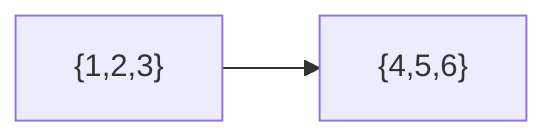
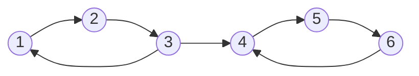
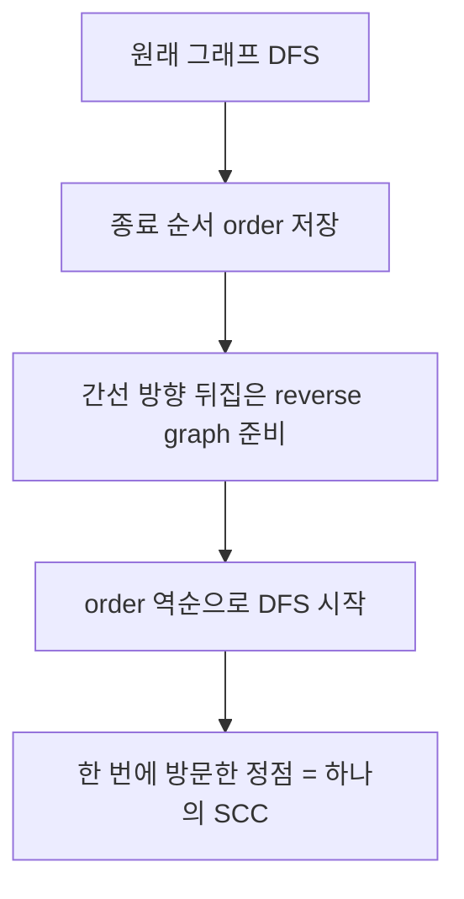
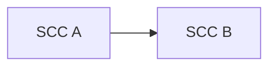
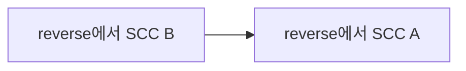
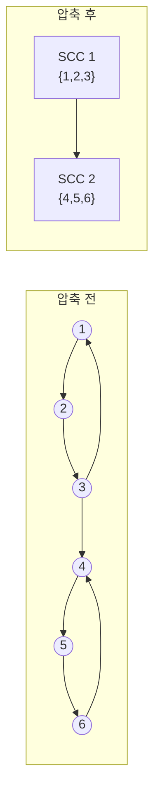

# SCC

SCC(Strongly Connected Component, 강한 연결 요소)는 **방향 그래프에서 서로 왕복 도달 가능한 정점들의 최대 묶음**이다.

한 줄로 요약하면 다음과 같다.

```text
방향 그래프를 "서로 돌아올 수 있는 덩어리"로 압축하는 개념
```

---

## 1. 언제 쓰는가

문제에서 아래 느낌이 보이면 SCC를 떠올릴 수 있다.

- 방향 그래프
- A에서 B로 가고, B에서 A로도 갈 수 있는가
- 서로 영향을 주고받는 그룹
- 순환 의존성 묶기
- 2-SAT
- 그래프를 DAG로 압축해서 보고 싶음

대표 문제:

- BOJ SCC 기본 문제
- 도미노
- 2-SAT
- ATM / 경찰서 / 축구 전술 같은 SCC 압축 DAG 문제

---

## 2. 정확한 정의

방향 그래프에서 정점 집합 `C`가 SCC라는 뜻은:

- `C` 안의 임의의 두 정점 `u`, `v`에 대해
- `u -> v` 경로가 있고
- `v -> u` 경로도 있다는 뜻이다

그리고 더 큰 집합으로 확장할 수 없어야 한다.

즉 SCC는 "서로 왔다 갔다 할 수 있는 최대 덩어리"다.

---

## 3. 왜 중요한가

SCC를 하나의 노드로 압축하면 그래프가 DAG가 된다.

이것이 핵심이다.

```text
복잡한 방향 그래프
-> SCC로 묶기
-> 압축 DAG에서 다시 DP / 위상 정렬 / 진입차수 분석
```

즉 SCC는 종종 최종 답이 아니라,
문제를 한 단계 단순화하는 전처리 역할을 한다.

---

## 4. 작은 예시

그래프:

```text
1 -> 2 -> 3 -> 1
3 -> 4
4 -> 5 -> 6 -> 4
```

이 그래프의 SCC는:

- `{1, 2, 3}`
- `{4, 5, 6}`

두 묶음이다.

압축하면:

```text
{1,2,3} -> {4,5,6}
```

라는 DAG가 된다.



원래 그래프를 정점 단위로 그리면 다음 느낌이다.



여기서 중요한 관찰은:

- `1, 2, 3` 사이에서는 어디서 시작해도 서로 돌아올 수 있다
- `4, 5, 6`도 마찬가지다
- 하지만 `4, 5, 6`에서 다시 `1, 2, 3`으로 돌아오는 길은 없다

그래서 두 묶음은 같은 SCC가 될 수 없다.

### 왜 `{1,2,3,4,5,6}` 전체가 하나가 아닌가

`1 -> 5`는 가능하다.

```text
1 -> 2 -> 3 -> 4 -> 5
```

하지만 `5 -> 1`은 불가능하다.
즉 "한쪽 방향으로 갈 수 있다"와 "같은 SCC다"는 전혀 다르다.

SCC에서는 항상 다음 두 방향을 모두 확인해야 한다.

```text
u -> v 가능
v -> u 가능
```

---

## 5. Kosaraju 알고리즘 핵심

코테에서는 Kosaraju나 Tarjan을 쓴다.
학습용으로는 Kosaraju가 더 직관적이다.

핵심 흐름:

1. 원래 그래프에서 DFS를 돌며 종료 순서를 기록
2. 간선을 모두 뒤집은 그래프에서 종료 순서 역순으로 DFS
3. 한 번의 DFS에서 방문한 정점들이 하나의 SCC

왜 되나?

- 먼저 끝난 정점부터가 아니라
- **가장 나중에 끝난 정점부터 역그래프에서 탐색**해야
- SCC 단위로 깔끔하게 묶인다

### 흐름을 그림으로 보면



핵심 감각은 이렇다.

- 첫 번째 DFS는 "어디부터 꺼내야 SCC가 안 섞이는가"를 정하는 단계
- 두 번째 DFS는 "실제로 SCC를 뽑아내는 단계"

즉 첫 번째 DFS만으로 SCC를 구하는 것이 아니라,
**두 번째 DFS를 위한 시작 순서를 만드는 것**이 핵심 역할이다.

### 왜 역순이 중요한가

압축 DAG를 생각해 보자.

```text
SCC A -> SCC B
```

이때 원래 그래프 DFS에서는 보통 `A` 쪽이 더 늦게 끝난다.
그래서 종료 순서 역순으로 역그래프를 보면 `A`부터 시작하게 되고,
역그래프에서는 `B -> A`가 되므로 `A`에서 출발해도 `B`로 새지 않는다.

이 성질 덕분에 SCC가 정확히 한 덩어리씩 잘린다.





즉 "원래 그래프 종료 순서 역순 + 역그래프"가 짝으로 묶여야 한다.

---

## 6. Kosaraju를 손으로 따라가기

아까 예시 그래프를 다시 보자.

```text
1 -> 2 -> 3 -> 1
3 -> 4
4 -> 5 -> 6 -> 4
```

### 1단계: 원래 그래프 DFS

예를 들어 1부터 DFS를 시작하면 대략:

```text
1 -> 2 -> 3 -> 4 -> 5 -> 6
```

순으로 깊게 들어간다.

DFS가 끝나는 순서는 안쪽부터이므로:

```text
6, 5, 4, 3, 2, 1
```

이런 식으로 `order`에 쌓인다.

즉 `order`의 뒤쪽, 다시 말해 역순으로 꺼낼 때는:

```text
1, 2, 3, 4, 5, 6
```

순서가 된다.

### 2단계: 역그래프에서 역순 DFS

역그래프에서는 간선 방향이 뒤집혀서:

```text
1 <- 2 <- 3 <- 1
4 <- 3
4 <- 5 <- 6 <- 4
```

가 된다.

이제 역순의 첫 정점 `1`에서 DFS를 하면:

```text
1, 3, 2
```

만 방문하고 `4, 5, 6` 쪽으로는 못 간다.

그래서 첫 SCC는:

```text
{1, 2, 3}
```

그 다음 아직 방문하지 않은 `4`에서 시작하면:

```text
4, 6, 5
```

가 묶여서 두 번째 SCC:

```text
{4, 5, 6}
```

이 된다.

이 손추적을 한 번 해 보면,
"왜 역그래프에서 역순으로 해야 하는가"가 훨씬 덜 추상적으로 느껴진다.

---

## 7. Kosaraju 구현

```java
import java.util.*;

class SCCKosaraju {
    int n;
    ArrayList<Integer>[] graph;
    ArrayList<Integer>[] reverse;
    boolean[] visited;
    List<Integer> order = new ArrayList<>();
    int[] sccId;
    List<List<Integer>> components = new ArrayList<>();

    SCCKosaraju(int n) {
        this.n = n;
        graph = new ArrayList[n + 1];
        reverse = new ArrayList[n + 1];
        visited = new boolean[n + 1];
        sccId = new int[n + 1];

        for (int i = 1; i <= n; i++) {
            graph[i] = new ArrayList<>();
            reverse[i] = new ArrayList<>();
        }
    }

    void addEdge(int u, int v) {
        graph[u].add(v);
        reverse[v].add(u);
    }

    void dfs1(int cur) {
        visited[cur] = true;
        for (int next : graph[cur]) {
            if (!visited[next]) dfs1(next);
        }
        order.add(cur);
    }

    void dfs2(int cur, int id, List<Integer> component) {
        visited[cur] = true;
        sccId[cur] = id;
        component.add(cur);

        for (int next : reverse[cur]) {
            if (!visited[next]) dfs2(next, id, component);
        }
    }

    List<List<Integer>> build() {
        for (int i = 1; i <= n; i++) {
            if (!visited[i]) dfs1(i);
        }

        Arrays.fill(visited, false);

        int id = 0;
        for (int i = order.size() - 1; i >= 0; i--) {
            int v = order.get(i);
            if (visited[v]) continue;

            List<Integer> component = new ArrayList<>();
            dfs2(v, ++id, component);
            components.add(component);
        }

        return components;
    }
}
```

시간 복잡도: `O(V + E)`

원래 그래프와 역그래프를 한 번씩 DFS하므로 선형 시간이다.

---

## 8. 압축 DAG 만들기

SCC를 구한 뒤에는 서로 다른 SCC 사이의 간선만 모으면 된다.

```java
Set<Long> edgeSet = new HashSet<>();
ArrayList<Integer>[] dag = new ArrayList[sccCount + 1];
for (int i = 1; i <= sccCount; i++) dag[i] = new ArrayList<>();

for (int u = 1; u <= n; u++) {
    for (int v : graph[u]) {
        int a = sccId[u];
        int b = sccId[v];
        if (a == b) continue;

        long key = ((long) a << 32) | b;
        if (edgeSet.add(key)) {
            dag[a].add(b);
        }
    }
}
```

이제 `dag`는 사이클이 없는 그래프이므로:

- 위상 정렬
- DP
- 진입 차수 분석

을 바로 적용할 수 있다.

### 압축 전과 후



그래프 문제가 SCC 이후 अचानक 쉬워지는 이유가 여기 있다.
원래는 사이클 때문에 위상 정렬이나 DAG DP를 못 하지만,
SCC로 묶고 나면 압축 그래프는 항상 DAG가 된다.

---

## 9. Tarjan 알고리즘은 무엇이 다른가

Tarjan은 DFS 한 번으로 SCC를 구한다.

핵심 개념:

- 방문 순서 `disc`
- 되돌아갈 수 있는 가장 빠른 번호 `low`
- 현재 DFS 스택에 있는 정점 관리

실전에서는:

- 구현 직관성 -> Kosaraju
- 그래프를 한 번만 돌고 싶음 -> Tarjan

정도로 기억해도 충분하다.

---

## 10. 자주 쓰는 응용

### 1) 사이클이 있는 그룹 묶기

순환 의존 관계를 하나의 묶음으로 본다.

### 2) SCC DAG 위 DP

각 SCC의 가중치를 합친 뒤 DAG에서 최댓값/최솟값을 구한다.

### 3) 2-SAT

변수와 부정 변수를 노드로 두고 SCC로 모순 여부를 판별한다.

핵심 규칙:

```text
x와 not x가 같은 SCC에 있으면 모순
```

---

## 11. 자주 하는 실수

- 방향 그래프가 아닌데 SCC를 적용하려고 함
- Kosaraju에서 역그래프를 안 만듦
- 첫 번째 DFS의 종료 순서와 두 번째 DFS 순서를 헷갈림
- SCC 압축 후 중복 간선을 제거하지 않아 DAG가 지저분해짐
- 재귀 DFS에서 스택 깊이 문제를 무시함

---

## 12. 시험장용 최소 암기 버전

```text
SCC:
서로 왕복 도달 가능한 정점들의 최대 묶음

핵심:
SCC로 압축하면 DAG

Kosaraju:
1. 원래 그래프 DFS -> 종료 순서 저장
2. 역그래프 DFS -> 역순으로 SCC 추출

응용:
압축 DAG DP
2-SAT
사이클 그룹 묶기
```

---

## 13. 최종 요약

SCC는 다음 문장으로 정리할 수 있다.

```text
방향 그래프를 서로 왕복 가능한 묶음으로 압축해
사이클을 DAG 구조로 정리하는 핵심 도구
```
