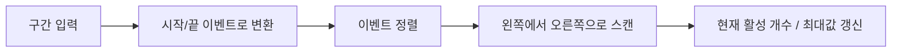
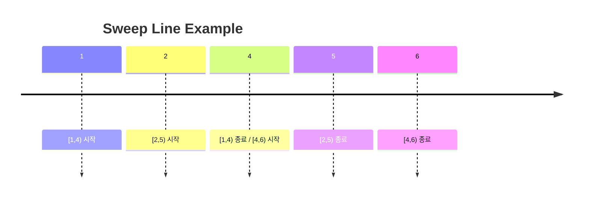
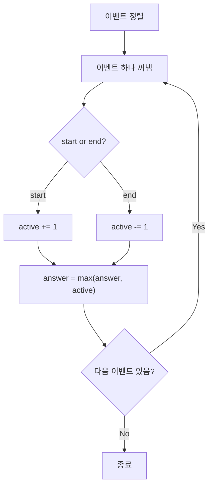

# Sweep Line

Sweep Line은 **이벤트를 한 축 위에 정렬해 두고, 한 방향으로 훑으면서 상태를 갱신하는 기법**이다.

한 줄로 요약하면 다음과 같다.

```text
시작점과 끝점을 이벤트로 바꿔 정렬한 뒤 차례대로 처리한다
```

---

## 1. 언제 쓰는가

문제에서 아래 표현이 보이면 sweep line을 떠올릴 수 있다.

- 구간 시작 / 종료
- 겹치는 구간 수
- 동시에 열려 있는 회의 수
- 선분 교차 여부의 단순화 버전
- 좌표축 위 이벤트 처리
- 시간 순으로 상태 변화를 추적

대표 문제:

- 최대 동시 접속자 수
- 필요한 최소 회의실 수
- 겹치는 구간 개수
- 직사각형/구간 커버 여부

---

## 2. 핵심 아이디어

구간 `[l, r]`이 있으면 이것을:

- 시작 이벤트 `+1`
- 종료 이벤트 `-1`

로 바꾼다.

그 다음 모든 이벤트를 좌표순으로 정렬해서 보면서
현재 활성 구간 수를 관리한다.



---

## 3. 가장 기본 예시: 최대 겹침 수

문제:

```text
구간들이 주어질 때 동시에 겹치는 구간의 최대 개수는?
```

예:

```text
[1,4], [2,5], [4,6]
```

이벤트로 바꾸면:

```text
(1, 시작)
(4, 끝)
(2, 시작)
(5, 끝)
(4, 시작)
(6, 끝)
```

정렬 후 순서대로 보면서 현재 개수를 갱신하면 된다.

### 손으로 따라가기

반열린 구간 `[l, r)`라고 하자.
그러면 같은 좌표에서는 끝 이벤트를 먼저 처리한다.

정렬된 이벤트는:

```text
(1, +1)
(2, +1)
(4, -1)
(4, +1)
(5, -1)
(6, -1)
```

이제 왼쪽에서 오른쪽으로 훑어 보자.

```text
x=1: active = 1
x=2: active = 2
x=4: active = 1   // [1,4) 종료
x=4: active = 2   // [4,6) 시작
x=5: active = 1
x=6: active = 0
```

따라서 최대 겹침 수는 `2`다.



이 예시에서 `x = 4`가 가장 중요하다.
끝을 먼저 처리하느냐, 시작을 먼저 처리하느냐에 따라
`4`에서의 active 값이 달라질 수 있기 때문이다.

---

## 4. 끝점 포함 규칙이 가장 중요하다

Sweep line에서 가장 자주 틀리는 부분은
같은 좌표에서 시작과 끝이 동시에 있을 때의 처리 순서다.

예를 들어 구간을:

- 닫힌 구간 `[l, r]`
- 반열린 구간 `[l, r)`

중 무엇으로 해석하는지에 따라 정렬 기준이 달라진다.

보통 코테에서는 다음처럼 많이 처리한다.

### 1) `[l, r)`로 볼 때

같은 좌표라면 **끝 이벤트를 먼저** 처리한다.

이 경우:

```text
[1,4) 와 [4,6)
```

는 겹치지 않는다.

### 2) `[l, r]`로 볼 때

같은 좌표라면 **시작 이벤트를 먼저** 처리해야
끝점도 겹침으로 셀 수 있다.

즉 문제의 "겹친다" 정의를 먼저 확인해야 한다.

### 같은 예시를 닫힌 구간으로 보면

만약 `[1,4]`, `[4,6]`을 닫힌 구간으로 보면
좌표 `4`에서 실제로 겹친다.

그래서 이 경우에는:

```text
같은 x에서는 시작 이벤트를 먼저 처리
```

해야 `x = 4`에서 active가 2가 된다.

즉 sweep line은 자료구조보다도
**문제의 포함 규칙을 코드 정렬 기준으로 옮기는 작업**이 핵심이다.

---

## 5. 최대 동시 구간 수 구현

아래 코드는 반열린 구간 `[start, end)` 기준이다.
따라서 같은 좌표에서는 끝 이벤트를 먼저 처리한다.

```java
import java.util.*;

class SweepLine {
    static class Event {
        int x;
        int type; // -1: end, +1: start

        Event(int x, int type) {
            this.x = x;
            this.type = type;
        }
    }

    int maxOverlap(int[][] intervals) {
        List<Event> events = new ArrayList<>();

        for (int[] interval : intervals) {
            int start = interval[0];
            int end = interval[1];
            events.add(new Event(start, +1));
            events.add(new Event(end, -1));
        }

        events.sort((a, b) -> {
            if (a.x != b.x) return Integer.compare(a.x, b.x);
            return Integer.compare(a.type, b.type); // end(-1) 먼저
        });

        int active = 0;
        int answer = 0;

        for (Event e : events) {
            active += e.type;
            answer = Math.max(answer, active);
        }

        return answer;
    }
}
```

### 왜 이 코드가 맞는가

이 코드는 어떤 좌표 `x`를 지날 때마다:

- 시작 이벤트면 활성 구간 수를 1 증가
- 종료 이벤트면 활성 구간 수를 1 감소

시키고 있다.

즉 `active`는 "현재 sweep line이 지나가고 있는 지점에서 살아 있는 구간 수"를 의미한다.



이 관점으로 보면 sweep line은
"이벤트 시점에서 상태가 어떻게 변하는가"를 구현한 것뿐이다.

---

## 6. 회의실 배정과의 관계

"최소 몇 개의 회의실이 필요한가?"도 사실 같은 문제다.

아이디어:

- 회의 시작 -> 방 하나 필요
- 회의 종료 -> 방 하나 반환

즉 최대 동시 활성 회의 수가 곧 정답이다.

이 문제는 다음 두 방법 모두 가능하다.

- sweep line 이벤트 정렬
- 시작 시간 정렬 + 종료 시간 최소 힙

둘 다 정답은 같고, 구현 취향 차이다.

### 회의실 예시

회의가 다음과 같다고 하자.

```text
[10,20), [15,25), [18,30), [30,40)
```

활성 회의 수를 세면:

- `10` 직후: 1개
- `15` 직후: 2개
- `18` 직후: 3개
- `20` 직후: 2개
- `25` 직후: 1개
- `30` 직후: 1개 (`[18,30)` 종료 후 `[30,40)` 시작)

최대 동시 개수는 `3`이고,
필요한 최소 회의실 수도 `3`이다.

---

## 7. 차분 배열과의 관계

좌표 범위가 작고 정수 축이면
sweep line을 차분 배열로 바꿀 수도 있다.

예:

```text
diff[start] += 1
diff[end]   -= 1
```

그리고 누적합을 취하면 각 좌표의 활성 개수를 알 수 있다.

즉:

- 좌표 범위가 작다 -> 차분 배열
- 좌표가 크거나 실수다 -> 이벤트 정렬 sweep line

처럼 생각하면 된다.

즉 차분 배열은 sweep line을
"모든 좌표를 직접 순회하는 버전"이라고 볼 수 있다.

---

## 8. 2차원에서도 쓰이는가

쓴다.

대표적으로:

- 직사각형 넓이
- 교차 개수
- 최근접 이벤트 갱신

같은 문제에서 x축으로 sweep 하면서,
현재 y축 상태를 세그먼트 트리나 Fenwick Tree로 관리하기도 한다.

다만 코테에서는 보통 1차원 이벤트 정렬 형태가 더 자주 나온다.

그래서 학습 순서는 보통:

1. 1차원 구간 이벤트
2. 차분 배열과 연결
3. 필요하면 2차원 sweep

으로 잡는 편이 좋다.

---

## 9. 자주 하는 실수

- 시작/끝이 같은 좌표일 때 tie-break를 잘못 둠
- 닫힌 구간과 반열린 구간 해석을 섞음
- 이벤트 정렬 후 갱신 순서를 잘못 둠
- 좌표가 큰데 배열로 직접 처리하려고 함
- `active`는 맞는데 최대값 갱신 시점을 틀림

---

## 10. 시험장용 최소 암기 버전

```text
Sweep Line:
구간을 시작/끝 이벤트로 바꿔 정렬 후 스캔

핵심:
현재 활성 개수 관리
최대/최소/변화 시점 계산

주의:
같은 좌표에서 시작과 끝 처리 순서
구간 포함 규칙 [l,r] / [l,r)
```

---

## 11. 최종 요약

Sweep line은 다음 문장으로 정리할 수 있다.

```text
시간이나 좌표축 위의 변화를 이벤트로 바꿔
정렬 한 번과 선형 스캔으로 상태를 관리하는 기법
```
