# 한눈에 보는 Effective Java

Effective Java 3판의 90개 아이템을 장별로 정리한 글이다. 각 아이템의 핵심 원리와 실전 코드를 담았다.

---

## 2장. 객체 생성과 파괴

객체를 만들어야 할 때와 만들지 말아야 할 때, 올바른 파괴 방법, 그리고 생성 전 처리를 다룬다.

### Item 1. 생성자 대신 static factory method를 고려하라

클래스의 인스턴스를 얻는 수단이 꼭 public 생성자일 필요는 없다. static factory method는 다섯 가지 장점이 있다.

**이름을 가질 수 있다.** `BigInteger.probablePrime()`처럼 반환될 객체의 특성을 이름으로 표현할 수 있다. 같은 시그니처의 생성자가 여러 개 필요하면 정적 팩터리로 바꾸고 이름을 붙여라.

**호출할 때마다 새 인스턴스를 만들지 않아도 된다.** `Boolean.valueOf(boolean)`은 객체를 새로 만들지 않고 미리 만든 상수를 반환한다. 플라이웨이트 패턴과 같은 맥락이다.

**반환 타입의 하위 타입 객체를 돌려줄 수 있다.** `Collections.unmodifiableList()`처럼 구현 클래스를 숨기고 인터페이스만 노출한다. API가 작아지고, 사용자는 구현이 아닌 인터페이스에 의존하게 된다.

**입력 매개변수에 따라 매번 다른 클래스의 객체를 반환할 수 있다.** 반환 타입의 하위 타입이기만 하면 어떤 클래스의 객체든 반환할 수 있다. `EnumSet`은 원소 수에 따라 `RegularEnumSet` 또는 `JumboEnumSet`을 반환한다. 클라이언트는 이 두 클래스의 존재를 모르며, 알 필요도 없다.

```java
// 입력에 따라 다른 하위 타입 반환
public static <E extends Enum<E>> EnumSet<E> noneOf(Class<E> elementType) {
    if (universe.length <= 64)
        return new RegularEnumSet<>(elementType, universe);
    else
        return new JumboEnumSet<>(elementType, universe);
}
```

**정적 팩터리 메서드를 작성하는 시점에는 반환할 객체의 클래스가 존재하지 않아도 된다.** 이 유연함이 서비스 제공자 프레임워크(service provider framework)의 근간이다. JDBC가 대표적인 예로, `DriverManager.getConnection()`은 각 DB 벤더가 제공하는 `Driver` 구현체를 런타임에 로딩한다. Java 6부터는 `ServiceLoader`가 범용 서비스 제공자 프레임워크 역할을 한다.

**정적 팩터리 명명 규칙:**

| 이름 | 용도 | 예시 |
|------|------|------|
| `from` | 매개변수 하나, 형변환 | `Date.from(instant)` |
| `of` | 매개변수 여러 개, 집계 | `EnumSet.of(JACK, QUEEN)` |
| `valueOf` | from/of의 자세한 버전 | `BigInteger.valueOf(42L)` |
| `instance` / `getInstance` | 인스턴스 반환 (같을 수 있음) | `StackWalker.getInstance(opt)` |
| `create` / `newInstance` | 항상 새 인스턴스 | `Array.newInstance(cls, 10)` |

단점도 있다. 하위 클래스를 만들려면 public/protected 생성자가 있어야 하고, 프로그래머가 찾기 어렵다. API 문서에 명확히 드러나지 않기 때문이다. 명명 규칙(`from`, `of`, `valueOf` 등)을 지키면 이 문제를 완화할 수 있다.

실무에서 정적 팩터리가 많이 쓰이는 예로 `List.of()`, `Map.of()`, `Optional.of()`, `Collections.unmodifiableList()` 등이 있다. Spring 프레임워크의 `BeanFactory`가 정적 팩터리 패턴의 확장된 형태라 볼 수 있다.

---

### Item 2. 생성자에 매개변수가 많다면 Builder를 고려하라

매개변수가 많으면 점층적 생성자(telescoping constructor)나 JavaBeans 패턴은 한계가 있다. Builder 패턴은 둘의 장점을 결합한다.

```java
NutritionFacts cocaCola = new NutritionFacts.Builder(240, 8)  // 필수
    .calories(100)       // 선택
    .sodium(35)          // 선택
    .carbohydrate(27)    // 선택
    .build();
```

빌더 패턴의 흐름을 도식화하면 이렇다.

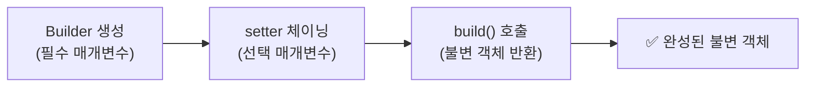

빌더 패턴은 계층 구조에서 특히 빛난다. 추상 빌더의 하위에 구체 빌더를 두고, 재귀적 타입 파라미터 `Builder<T extends Builder<T>>`와 공변 반환 타이핑(covariant return typing)을 결합하면 하위 클래스의 빌더가 상위 빌더 타입을 반환하지 않아도 된다.

```java
// 계층적 빌더 패턴
public abstract class Pizza {
    public enum Topping { HAM, MUSHROOM, ONION, PEPPER, SAUSAGE }
    final Set<Topping> toppings;

    abstract static class Builder<T extends Builder<T>> {
        EnumSet<Topping> toppings = EnumSet.noneOf(Topping.class);
        public T addTopping(Topping topping) {
            toppings.add(Objects.requireNonNull(topping));
            return self();
        }
        abstract Pizza build();
        protected abstract T self(); // 하위 클래스가 this를 반환
    }

    Pizza(Builder<?> builder) {
        toppings = builder.toppings.clone();
    }
}

public class NyPizza extends Pizza {
    public enum Size { SMALL, MEDIUM, LARGE }
    private final Size size;

    public static class Builder extends Pizza.Builder<Builder> {
        private final Size size;
        public Builder(Size size) { this.size = Objects.requireNonNull(size); }
        @Override public NyPizza build() { return new NyPizza(this); }
        @Override protected Builder self() { return this; }
    }
    private NyPizza(Builder builder) { super(builder); size = builder.size; }
}

// 사용: 하위 타입 그대로 반환 → 캐스팅 불필요
NyPizza pizza = new NyPizza.Builder(SMALL)
    .addTopping(SAUSAGE)
    .addTopping(ONION)
    .build();
```

매개변수가 4개를 넘기기 시작하면 빌더를 고려하라. 처음부터 빌더로 시작하는 편이 나을 때가 많다.

---

### Item 3. private 생성자나 열거 타입으로 singleton임을 보증하라

싱글턴을 만드는 세 가지 방법이 있다.

```java
// 방식 1: public static final 필드
public class Elvis {
    public static final Elvis INSTANCE = new Elvis();
    private Elvis() { }
}

// 방식 2: 정적 팩터리
public class Elvis {
    private static final Elvis INSTANCE = new Elvis();
    public static Elvis getInstance() { return INSTANCE; }
    private Elvis() { }
}

// 방식 3: 열거 타입 — 가장 좋은 방법
public enum Elvis {
    INSTANCE;
    public void leaveTheBuilding() { ... }
}
```

열거 타입 방식은 직렬화와 리플렉션 공격을 완벽히 방어한다. 다만 Enum 이외의 클래스를 상속해야 하면 사용할 수 없다.

방식 1, 2는 리플렉션으로 private 생성자를 호출할 수 있으므로 생성자에서 두 번째 호출을 차단해야 한다. 직렬화 시에는 `readResolve()` 메서드를 제공하지 않으면 역직렬화 때마다 새 인스턴스가 만들어진다.

실무에서 싱글턴 선택 가이드:

| 상황 | 추천 방식 |
|------|----------|
| 가장 간단하고 안전 | 열거 타입 (Item 3 방식 3) |
| API 변경 유연성 우선 | 정적 팩터리 (Item 3 방식 2) |
| Enum 외 상속 필요 | 방식 1 또는 2 + readResolve |

---

### Item 4. 인스턴스화를 막으려거든 private 생성자를 사용하라

`java.lang.Math`, `java.util.Collections`처럼 정적 멤버만 모아둔 유틸리티 클래스는 인스턴스를 만들 이유가 없다.

```java
public class UtilityClass {
    private UtilityClass() {
        throw new AssertionError(); // 실수로라도 내부 호출 방지
    }
}
```

생성자를 명시하지 않으면 컴파일러가 기본 생성자를 만들어버린다. 추상 클래스로는 인스턴스화를 막을 수 없다 — 하위 클래스를 만들면 그만이다. private 생성자는 상속까지 차단하는 부수효과가 있다.

---

### Item 5. 자원을 직접 명시하지 말고 의존 객체 주입을 사용하라

사용하는 자원에 따라 동작이 달라지는 클래스에는 정적 유틸리티나 싱글턴이 맞지 않는다.

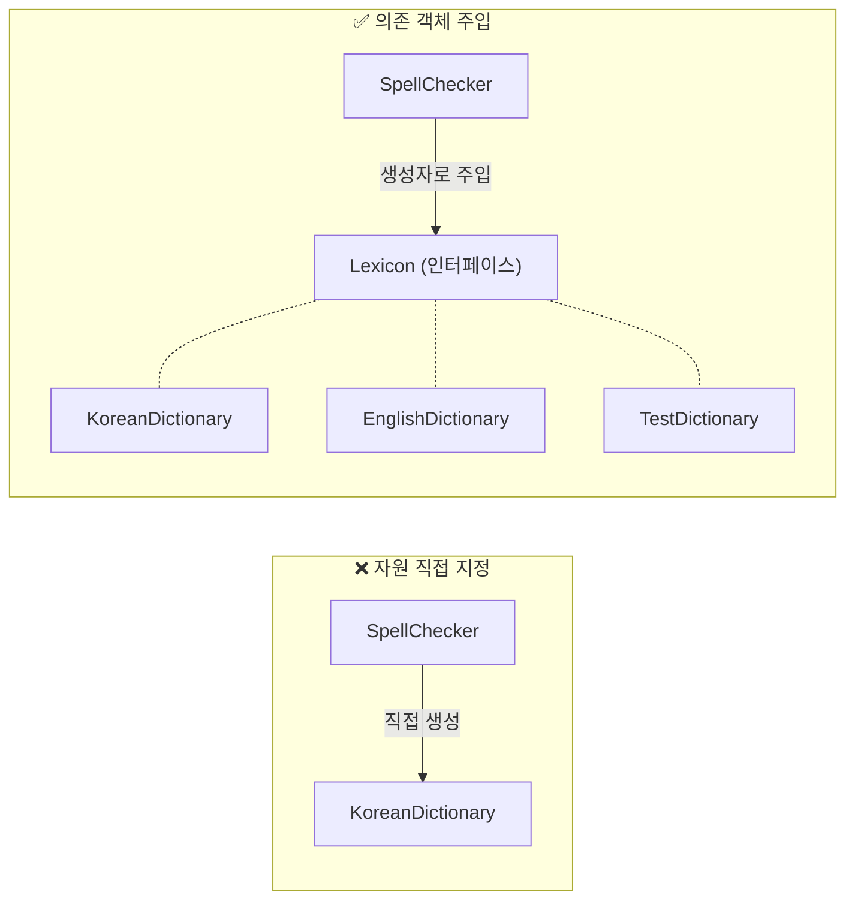

```java
// 나쁜 예: 자원을 직접 명시
public class SpellChecker {
    private static final Lexicon dictionary = new KoreanDictionary();
    // 다른 사전으로 교체 불가, 테스트 어려움
}

// 좋은 예: 의존 객체 주입
public class SpellChecker {
    private final Lexicon dictionary;

    public SpellChecker(Lexicon dictionary) {
        this.dictionary = Objects.requireNonNull(dictionary);
    }
}
```

이 패턴의 변형으로 생성자에 자원 팩터리를 넘길 수 있다. `Supplier<? extends Tile>`처럼 한정적 와일드카드 타입으로 팩터리의 타입 매개변수를 제한하면 된다. 의존성이 많으면 Spring, Guice 같은 DI 프레임워크를 쓰자.

---

### Item 6. 불필요한 객체 생성을 피하라

같은 기능의 객체를 매번 생성하는 대신 하나를 재사용하는 편이 낫다.

```java
// 매번 Pattern 컴파일 — 성능 병목
static boolean isRomanSlow(String s) {
    return s.matches("^(?=.)M*(C[MD]|D?C{0,3})...");
}

// Pattern 캐싱 — 반복 호출에서 눈에 띄는 비용 절감
private static final Pattern ROMAN = Pattern.compile("^(?=.)M*(C[MD]|D?C{0,3})...");
static boolean isRomanFast(String s) {
    return ROMAN.matcher(s).matches();
}
```

오토박싱도 주의해야 한다.

```java
Long sum = 0L;   // Long → 반복 덧셈마다 불필요한 박싱 객체 생성
long sum = 0L;   // long → 장기 루프에서 훨씬 안정적이고 효율적
```

"**객체 생성은 비싸니 무조건 피하라**"는 뜻이 아니다. 방어적 복사가 필요한 곳에서 객체 재사용은 버그와 보안 구멍으로 이어진다. 반대로 불필요한 객체 생성은 코드 형태와 성능에만 영향을 준다.

특히 주의할 실수 패턴:

```java
// 1. String 생성자 사용 — 절대 하지 말 것
new String("hello");  // 새 인스턴스 생성
"hello";              // 문자열 풀에서 재사용

// 2. Boolean 생성자 — Java 9에서 마침내 deprecated
new Boolean("true");       // 매번 새 객체
Boolean.valueOf("true");   // 캐시된 인스턴스 재사용

// 3. Map.keySet() — 매번 같은 객체 반환 (재생성 없음)
```

---

### Item 7. 다 쓴 객체 참조를 해제하라

GC가 있어도 메모리 누수는 일어난다. 대표적인 예가 Stack이다.

```java
public Object pop() {
    if (size == 0) throw new EmptyStackException();
    Object result = elements[--size];
    elements[size] = null;  // 다 쓴 참조 해제
    return result;
}
```

`null` 처리를 안 하면 `elements` 배열의 비활성 영역이 그대로 참조를 유지하여 GC가 회수하지 못한다.

메모리 누수의 주범 세 가지:

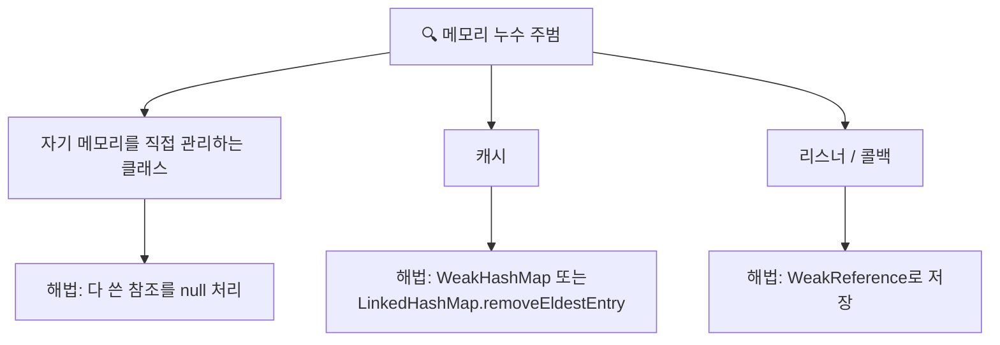

자기 메모리를 직접 관리하는 클래스란, 원소를 담은 배열의 '활성 영역'과 '비활성 영역'을 GC가 알 수 없는 경우를 말한다. Stack 예시처럼 비활성 영역의 원소를 null로 밀어야 GC가 회수할 수 있다.

캐시 메모리 누수는 엔트리의 유효 기간이 명확하지 않은 경우에 발생한다. 키를 외부에서 참조하는 동안만 엔트리가 유효하다면 `WeakHashMap`을 쓰라. 키에 대한 강한 참조가 사라져 GC 대상이 되면, 이후 Map의 내장 메서드(`get`, `put` 등)가 호출될 때 내부적으로 해당 엔트리를 제거한다. 백그라운드 스레드(`ScheduledThreadPoolExecutor`) 또는 새 엔트리 추가 시 부수 작업으로 정리하는 방식도 있다.

null 처리는 예외적 상황에서만 하고, 가장 좋은 방법은 변수의 유효 범위를 최소화하는 것이다(Item 57).

---

### Item 8. finalizer와 cleaner 사용을 피하라

finalizer는 예측 불가능하고, 느리고, 위험하다. cleaner는 낫지만 여전히 예측 불가능하고 느리다.

- 즉시 수행을 보장하지 않는다 — GC 알고리즘에 전적으로 의존
- 심각한 성능 문제 — 명시적 자원 해제보다 훨씬 느리고 예측하기 어렵다
- finalizer 공격 — 생성자에서 예외가 발생해도 악의적 하위 클래스의 finalizer가 수행될 수 있음

대안은 `AutoCloseable`을 구현하고 `try-with-resources`를 쓰는 것이다. cleaner는 close 호출을 잊었을 때의 안전망이나 네이티브 피어(native peer) 회수 정도에만 쓴다.

finalizer 공격의 원리: 생성자에서 예외가 발생하면 객체가 완전히 생성되지 않지만, 악의적 하위 클래스의 finalizer가 수행될 수 있다. 이 finalizer에서 자신의 참조를 정적 필드에 저장하면 GC가 수거하지 못하게 되어 객체가 되살아날 수 있다.

```java
// finalizer 공격 방어: final 클래스로 만들거나, 빈 finalize() 메서드를 final로 선언
public class Foo {
    // 하위 클래스가 finalize를 재정의하지 못하게 방어
    @Override
    protected final void finalize() { }
}
```

---

### Item 9. try-finally보다는 try-with-resources를 사용하라

`AutoCloseable` 인터페이스를 구현한 자원을 회수할 때는 예외 없이(반드시) try-with-resources를 쓰라.

```java
// try-finally: 자원이 둘이면 중첩이 필요하고 예외가 삼켜질 수 있음
static void copy(String src, String dst) throws IOException {
    InputStream in = new FileInputStream(src);
    try {
        OutputStream out = new FileOutputStream(dst);
        try {
            byte[] buf = new byte[BUFFER_SIZE];
            int n;
            while ((n = in.read(buf)) >= 0) out.write(buf, 0, n);
        } finally { out.close(); }
    } finally { in.close(); }
}

// try-with-resources: 짧고, 예외 정보가 정확하고, 안전함
static void copy(String src, String dst) throws IOException {
    try (InputStream in = new FileInputStream(src);
         OutputStream out = new FileOutputStream(dst)) {
        byte[] buf = new byte[BUFFER_SIZE];
        int n;
        while ((n = in.read(buf)) >= 0) out.write(buf, 0, n);
    }
}
```

try 블록과 close 양쪽에서 예외가 발생하면, try-with-resources는 close의 예외를 suppressed로 기록하고 try의 예외를 상위로 전파한다. `Throwable.getSuppressed()`로 꺼내볼 수 있다.

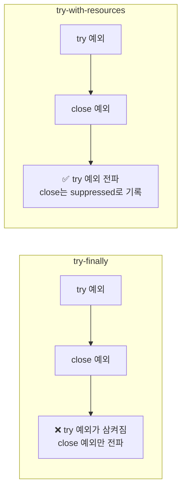

`catch` 절도 함께 쓸 수 있어서, 다수의 예외를 우아하게 처리할 수 있다.

```java
static String firstLineOfFile(String path, String defaultVal) {
    try (BufferedReader br = new BufferedReader(new FileReader(path))) {
        return br.readLine();
    } catch (IOException e) {
        return defaultVal;  // 예외 시 기본값 반환
    }
}
```

---

## 3장. 모든 객체의 공통 메서드

`Object`의 `equals`, `hashCode`, `toString`, `clone`, `compareTo`를 올바르게 재정의하는 방법이다.

### Item 10. equals는 일반 규약을 지켜 재정의하라

equals를 재정의하지 않는 게 최선인 경우가 많다. 각 인스턴스가 본질적으로 고유하거나, 논리적 동치성 검사가 필요 없거나, 상위 클래스의 equals가 이미 적절하면 재정의하지 마라.

재정의할 때는 다섯 가지 규약을 반드시 지켜야 한다.

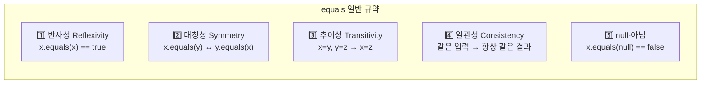

**대칭성 위반의 대표 사례:** `CaseInsensitiveString`이 `String`과의 비교를 지원하면, 반대쪽 `String.equals()`는 `CaseInsensitiveString`을 모르기 때문에 대칭성이 깨진다.

```java
// 대칭성 위반 예시
CaseInsensitiveString cis = new CaseInsensitiveString("Polish");
String s = "polish";
cis.equals(s);  // true — CaseInsensitiveString 쪽은 String 비교를 허용
s.equals(cis);  // false — 대칭성 위반!
```

**추이성 위반의 핵심:** 구체 클래스를 확장해 새 값 컴포넌트(필드)를 추가하면 equals 규약을 만족시키는 방법이 존재하지 않는다. `Point`를 상속한 `ColorPoint`가 대표적인 사례다. `instanceof` 검사를 `getClass()` 검사로 바꾸면 추이성은 지키지만 리스코프 치환 원칙을 위배한다.

**구체 클래스를 확장해 새 값 컴포넌트를 추가하면서 equals 규약을 만족시킬 방법은 없다.** 이 문제의 해법은 상속 대신 컴포지션을 쓰는 것이다(Item 18).

올바른 equals 구현 레시피:

```java
@Override
public boolean equals(Object o) {
    if (this == o) return true;                          // 1. 참조 비교
    if (!(o instanceof PhoneNumber)) return false;       // 2. 타입 검사 + null 검사
    PhoneNumber pn = (PhoneNumber) o;                    // 3. 형변환
    return pn.lineNum == lineNum                         // 4. 핵심 필드 비교
        && pn.prefix == prefix
        && pn.areaCode == areaCode;
}
```

float/double은 `Float.compare()`, `Double.compare()`로 비교하고, 배열은 `Arrays.equals()`를 쓴다. 비교 비용이 싼 필드부터 먼저 비교하면 성능이 좋아진다.

Java 7+에서는 `Objects.equals(a, b)`를 활용하면 null 검사를 간결하게 처리할 수 있다. IDE(예: IntelliJ)나 AutoValue, Lombok이 생성하는 equals가 사람이 직접 작성한 것보다 대체로 더 안전하다. Java 16+의 Record를 쓰면 `equals`, `hashCode`, `toString`이 자동 생성된다.

---

### Item 11. equals를 재정의하려거든 hashCode도 재정의하라

equals가 같은 두 객체는 반드시 같은 hashCode를 반환해야 한다. 이를 어기면 HashMap, HashSet이 오동작한다.

```java
// 끔찍한 구현 — 합법이지만 모든 객체가 같은 해시 버킷에 들어감
@Override public int hashCode() { return 42; }

// 올바른 구현
@Override
public int hashCode() {
    int result = Short.hashCode(areaCode);
    result = 31 * result + Short.hashCode(prefix);
    result = 31 * result + Short.hashCode(lineNum);
    return result;
}
```

31을 곱하는 이유는 홀수인 소수이며 `31 * i == (i << 5) - i`로 JVM이 최적화할 수 있기 때문이다.

**hashCode를 제대로 구현하지 않으면 어떤 일이 벌어지는가:**

```java
Map<PhoneNumber, String> map = new HashMap<>();
map.put(new PhoneNumber(707, 867, 5309), "Jenny");
map.get(new PhoneNumber(707, 867, 5309));  // hashCode 미구현 시 null 반환!
// put할 때의 객체와 get할 때의 객체가 다른 해시 버킷에 들어감
```

`Objects.hash(areaCode, prefix, lineNum)`를 쓰면 한 줄로 끝나지만, 성능이 민감하면 직접 계산하라 — `Objects.hash`는 내부에서 배열을 만들고 오토박싱이 발생한다.

성능이 민감하면 해시값을 캐싱하라. 지연 초기화(lazy initialization)도 가능하다.

```java
private int hashCode; // 기본값 0

@Override
public int hashCode() {
    int result = hashCode;
    if (result == 0) {
        result = Short.hashCode(areaCode);
        result = 31 * result + Short.hashCode(prefix);
        result = 31 * result + Short.hashCode(lineNum);
        hashCode = result;
    }
    return result;
}
```

equals에 사용하지 않는 필드는 hashCode 계산에서도 반드시 제외해야 한다.

---

### Item 12. toString을 항상 재정의하라

기본 `Object.toString()`은 `클래스명@16진수해시코드`를 반환한다. 이는 디버깅과 로깅에서 쓸모가 없다.

toString은 그 객체가 가진 주요 정보를 모두 반환해야 한다. 포맷을 명시했든 아니든, 의도를 명확히 문서화하라.

```java
// 포맷 명시
@Override
public String toString() {
    return String.format("%03d-%04d-%04d", areaCode, prefix, lineNum);
}

// 포맷 비명시
@Override
public String toString() {
    return "PhoneNumber{areaCode=" + areaCode + ", prefix=" + prefix + ", lineNum=" + lineNum + "}";
}
```

순환 참조가 있는 객체(A → B → A)에서 상대를 `toString()`에 포함하면 `StackOverflowError`가 발생한다. 주의하라.

실무 팁: 로그에서 `toString()`은 매우 자주 호출된다. 비밀번호 같은 민감 정보는 절대 포함하지 마라. Lombok의 `@ToString(exclude = "password")`나 직접 제어로 해결한다.

---

### Item 13. clone 재정의는 주의해서 진행하라

`Cloneable`은 문제가 많은 인터페이스다. `clone()`의 규약은 허술하고, 가변 객체를 참조하면 원본과 복제본이 같은 내부 상태를 공유하게 된다.

```java
// 가변 상태가 있는 클래스의 clone
@Override
public Stack clone() {
    try {
        Stack result = (Stack) super.clone();
        result.elements = elements.clone();  // 배열의 clone은 권장되는 유일한 용법
        return result;
    } catch (CloneNotSupportedException e) {
        throw new AssertionError();
    }
}
```

연결 리스트 같은 깊은 구조는 재귀적 clone으로 stack overflow가 날 수 있으므로 반복문으로 깊은 복사를 해야 한다.

**더 나은 대안은 복사 생성자와 복사 팩터리다.**

```java
public Yum(Yum yum) { ... }                    // 복사 생성자
public static Yum newInstance(Yum yum) { ... }  // 복사 팩터리
```

이 방식은 Cloneable/clone의 모든 문제에서 자유롭고, 인터페이스 타입의 인스턴스도 인수로 받을 수 있다. 예: `new TreeSet<>(hashSet)`.

---

### Item 14. Comparable을 구현할지 고려하라

자연적 순서가 있는 값 클래스를 작성한다면 `Comparable`을 구현하라. `TreeSet`, `TreeMap`, `Collections.sort()`가 바로 동작한다.

```java
// 기본 비교
@Override
public int compareTo(PhoneNumber pn) {
    int result = Short.compare(areaCode, pn.areaCode);
    if (result == 0) {
        result = Short.compare(prefix, pn.prefix);
        if (result == 0)
            result = Short.compare(lineNum, pn.lineNum);
    }
    return result;
}

// Comparator 빌더 — 더 깔끔함
private static final Comparator<PhoneNumber> COMPARATOR =
    comparingInt((PhoneNumber pn) -> pn.areaCode)
        .thenComparingInt(pn -> pn.prefix)
        .thenComparingInt(pn -> pn.lineNum);

@Override
public int compareTo(PhoneNumber pn) {
    return COMPARATOR.compare(this, pn);
}
```

절대로 `return o1.hashCode() - o2.hashCode()` 같은 뺄셈 기반 비교를 하지 마라. 정수 오버플로가 발생한다. `Integer.compare()`나 `Comparator.comparingInt()`를 써라.

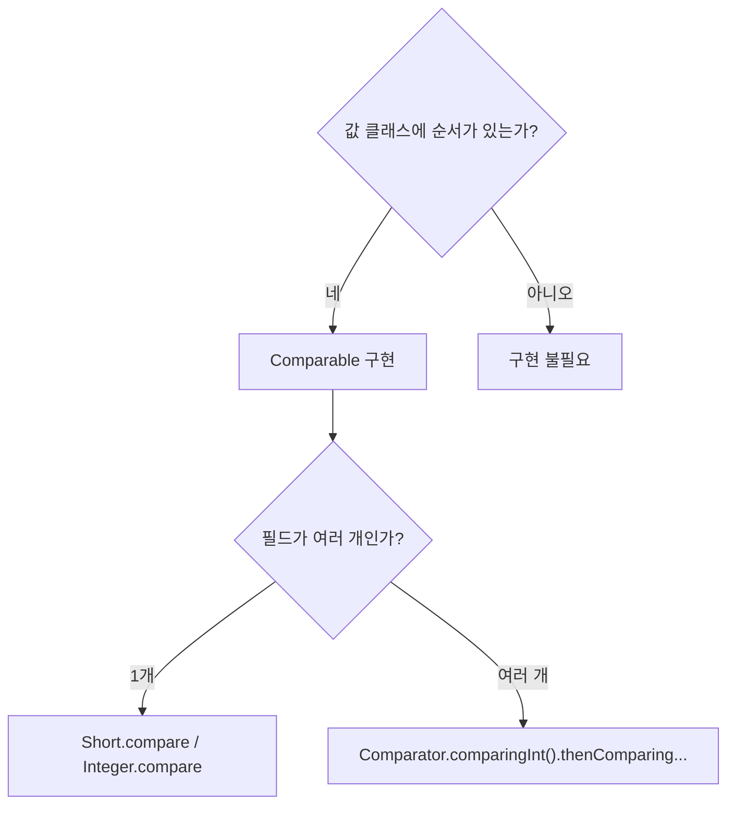

핵심: `compareTo`의 반환값이 0인 두 객체는 `equals`도 true여야 한다(권장). `BigDecimal`은 이 권장을 어겨서 `new BigDecimal("1.0")`과 `new BigDecimal("1.00")`이 `compareTo`는 0이지만 `equals`는 false다. `HashSet`에는 둘 다 들어가지만 `TreeSet`에는 하나만 들어간다.

---

## 4장. 클래스와 인터페이스

### Item 15. 클래스와 멤버의 접근 권한을 최소화하라

잘 설계된 컴포넌트는 내부 구현을 완벽히 숨기고, API와 구현을 깔끔히 분리한다. 이것이 **정보 은닉(information hiding)**이자 **캡슐화(encapsulation)**다.

원칙은 단순하다: 모든 클래스와 멤버의 접근성을 가능한 한 좁혀라.

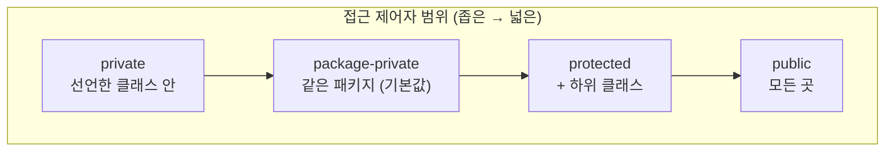

**접근성을 좁혀야 하는 이유:** 내부 구현을 숨기면 시스템을 구성하는 컴포넌트를 독립적으로 개발·테스트·최적화·교체할 수 있다. 이를 정보 은닉(information hiding)이라 하며, 소프트웨어 설계의 근간이다.

멤버 접근성을 좁히지 못하게 방해하는 제약이 하나 있다. 상위 클래스의 메서드를 재정의할 때, 접근 수준을 상위 클래스보다 좁게 설정할 수 없다(리스코프 치환 원칙). 이 제약 때문에 인터페이스를 구현하는 클래스는 인터페이스의 메서드를 모두 public으로 선언해야 한다.

public 클래스의 인스턴스 필드는 되도록 public이 아니어야 한다. `public static final` 상수만 예외이며, 이 경우도 기본 타입이나 불변 객체만 참조해야 한다. 가변 객체를 참조하는 `public static final` 필드는 보안 구멍이다.

```java
// 나쁜 예 — 배열은 가변이라 외부에서 수정 가능
public static final Thing[] VALUES = { ... };

// 해결 1: 불변 리스트
public static final List<Thing> VALUES = Collections.unmodifiableList(Arrays.asList(PRIVATE_VALUES));

// 해결 2: 방어적 복사
public static final Thing[] values() { return PRIVATE_VALUES.clone(); }
```

---

### Item 16. public 클래스에서는 public 필드가 아닌 접근자 메서드를 사용하라

패키지 바깥에서 접근할 수 있는 클래스라면 접근자(getter)를 제공하라. 필드를 직접 노출하면 내부 표현을 바꿀 수 없고, 불변식을 보장할 수 없다.

package-private 클래스나 private 중첩 클래스에서는 필드를 직접 노출해도 무방하다 — 수정 범위가 한정되기 때문이다.

---

### Item 17. 변경 가능성을 최소화하라

불변 클래스를 만드는 다섯 가지 규칙:

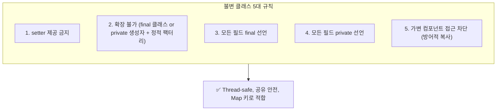

불변 객체의 장점: 단순하고, thread-safe하며(동기화 불필요), 안심하고 공유할 수 있고, Map 키와 Set 원소로 안전하다.

단점은 값이 다르면 반드시 독립된 객체를 만들어야 한다는 것이다. 이를 가변 동반 클래스(companion class)로 보완한다. `String`의 가변 동반이 `StringBuilder`다.

```java
public final class Complex {
    private final double re;
    private final double im;

    public Complex plus(Complex c) {
        return new Complex(re + c.re, im + c.im);  // 새 객체 반환, this 불변
    }
}
```

함수형 프로그래밍 스타일로, 값을 변경하는 메서드 이름은 `add` 대신 `plus`처럼 전치사를 사용한다.

불변 객체의 성능 이슈로 다단계 연산(multistep operation)이 많으면 가변 동반 클래스를 제공하라:

| 불변 클래스 | 가변 동반 클래스 | 용도 |
|----------|-------------|------|
| `String` | `StringBuilder` | 문자열 조합 |
| `BigInteger` | (package-private) | 다단계 산술 |
| `ImmutableList` (Guava) | `ImmutableList.Builder` | 리스트 조립 |

불변 클래스를 `final`로 만드는 대신, 모든 생성자를 `private` 또는 `package-private`으로 만들고 `public` 정적 팩터리를 제공하는 방식이 더 유연하다. 나중에 캐싱을 추가하거나 하위 클래스를 만들 수 있기 때문이다.

---

### Item 18. 상속보다는 컴포지션을 사용하라

패키지 경계를 넘어 다른 구체 클래스를 상속하는 '구현 상속(Implementation Inheritance)'은 캡슐화를 깨뜨릴 수 있다. 상위 클래스가 내부 구현을 바꾸면 하위 클래스가 오동작할 수 있다.

```java
// 상속의 문제 — addAll이 내부에서 add를 호출하므로 addCount가 두 배가 됨
public class InstrumentedHashSet<E> extends HashSet<E> {
    private int addCount = 0;

    @Override public boolean add(E e) {
        addCount++;
        return super.add(e);
    }

    @Override public boolean addAll(Collection<? extends E> c) {
        addCount += c.size();
        return super.addAll(c);  // 내부에서 this.add()를 호출 → addCount 또 증가
    }
}
```

해법은 **컴포지션 + 전달(forwarding)**이다. 기존 클래스를 private 필드로 참조하고 메서드를 위임한다.

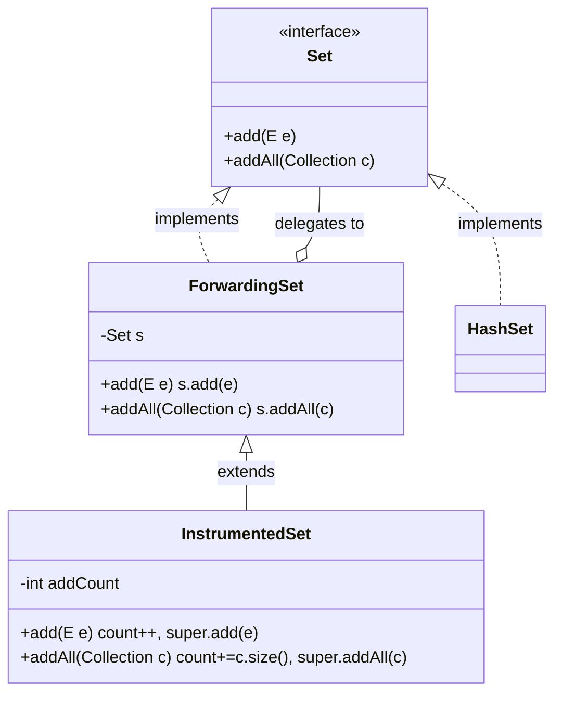

```java
// 전달 클래스 (재사용 가능)
public class ForwardingSet<E> implements Set<E> {
    private final Set<E> s;
    public ForwardingSet(Set<E> s) { this.s = s; }
    public boolean add(E e) { return s.add(e); }
    public boolean addAll(Collection<? extends E> c) { return s.addAll(c); }
    // ... 나머지 Set 메서드도 위임
}

// 래퍼 클래스 (데코레이터)
public class InstrumentedSet<E> extends ForwardingSet<E> {
    private int addCount = 0;
    public InstrumentedSet(Set<E> s) { super(s); }

    @Override public boolean add(E e) { addCount++; return super.add(e); }
    @Override public boolean addAll(Collection<? extends E> c) {
        addCount += c.size();
        return super.addAll(c);  // ForwardingSet.addAll → s.addAll → 정확
    }
}
```

상속은 is-a 관계일 때만, 그리고 상위 클래스의 API에 결함이 없을 때만 써라.

실제 JDK에서의 위반 사례: `Stack extends Vector`, `Properties extends Hashtable`는 모두 is-a 관계가 아닌데 상속을 사용한 경우다. `Properties`의 `getProperty(key)`는 `Hashtable`의 `get(key)`과 다른 결과를 낼 수 있어 혼란을 준다.

---

### Item 19. 상속을 고려해 설계하고 문서화하라. 그러지 않았다면 상속을 금지하라

상속용 클래스는 재정의 가능 메서드의 자기사용(self-use) 패턴을 문서화해야 한다. 생성자에서 재정의 가능 메서드를 호출하면 안 된다.

```java
public class Super {
    public Super() { overrideMe(); }  // 위험!
    public void overrideMe() { }
}

public final class Sub extends Super {
    private final Instant instant;
    Sub() { instant = Instant.now(); }
    @Override public void overrideMe() {
        System.out.println(instant);  // 첫 호출 시 null — 아직 Sub 생성자 실행 전
    }
}
```

상속용으로 설계하지 않은 클래스는 `final`로 선언하거나, 생성자를 private으로 만들고 정적 팩터리를 제공하여 상속을 금지하라.

---

### Item 20. 추상 클래스보다는 인터페이스를 우선하라

인터페이스의 강점 세 가지:

1. **기존 클래스에 쉽게 끼워 넣을 수 있다** — `implements Comparable`만 추가하면 됨
2. **믹스인(mixin) 정의에 적합하다** — 주된 기능 외에 `Comparable`, `Serializable` 같은 선택적 기능을 혼합
3. **계층 없는 타입 프레임워크를 만들 수 있다** — 가수이면서 작곡가인 `SingerSongwriter`

둘의 장점을 결합하려면 인터페이스 + 추상 골격 구현(skeletal implementation) 클래스를 함께 제공하라. 관례적으로 `Abstract~`로 이름 짓는다.

```java
public interface Vending {
    void start(); void process(); void stop();
}

public abstract class AbstractVending implements Vending {
    @Override public void start() { System.out.println("전원 On"); }
    @Override public void stop() { System.out.println("전원 Off"); }
    @Override public void process() { start(); operate(); stop(); }
    abstract void operate();  // 하위 클래스가 구현
}
```

---

### Item 21. 인터페이스는 구현하는 쪽을 생각해 설계하라

Java 8의 default 메서드는 기존 구현체를 깨뜨릴 수 있다. `Collection.removeIf()`는 범용적이지만, `SynchronizedCollection`에 대해서는 동기화를 해주지 않아 `ConcurrentModificationException`이 발생할 수 있다.

새 인터페이스는 릴리스 전에 최소 세 가지 다른 구현을 만들어 테스트하라.

---

### Item 22. 인터페이스는 타입을 정의하는 용도로만 사용하라

상수 인터페이스 안티패턴 — 메서드 없이 상수만 선언한 인터페이스 — 은 내부 구현을 클래스의 API로 노출하는 행위다.

```java
// 안티패턴: 상수 인터페이스
public interface PhysicalConstants {
    double AVOGADROS_NUMBER = 6.022_140_857e23;  // 구현체에 불필요한 상수 노출
}

// 올바른 방법: 유틸리티 클래스
public final class PhysicalConstants {
    private PhysicalConstants() { }  // 인스턴스화 방지
    public static final double AVOGADROS_NUMBER = 6.022_140_857e23;
}
// 사용: import static com.example.PhysicalConstants.AVOGADROS_NUMBER;
```

상수를 공개하려면 관련 클래스/인터페이스에 직접 추가하거나, 열거 타입으로 만들거나, 인스턴스화 불가한 유틸리티 클래스에 담아라.

---

### Item 23. 태그 달린 클래스보다는 클래스 계층구조를 활용하라

태그 필드(`shape` 같은 enum)로 여러 의미를 표현하는 클래스는 장황하고 오류 내기 쉽다.

```java
// 나쁜 예: 태그 달린 클래스
class Figure {
    enum Shape { RECTANGLE, CIRCLE }
    final Shape shape;
    double length, width;  // RECTANGLE 전용
    double radius;         // CIRCLE 전용
    // ...
}

// 좋은 예: 클래스 계층구조
abstract class Figure { abstract double area(); }
class Circle extends Figure {
    final double radius;
    @Override double area() { return Math.PI * radius * radius; }
}
class Rectangle extends Figure {
    final double length, width;
    @Override double area() { return length * width; }
}
```

---

### Item 24. 멤버 클래스는 되도록 static으로 만들라

중첩 클래스가 바깥 인스턴스에 접근할 일이 없으면 무조건 static으로 선언하라. 비정적 멤버 클래스는 바깥 인스턴스로의 숨은 외부 참조를 갖게 되어 GC가 바깥 인스턴스를 수거하지 못하는 메모리 누수가 발생할 수 있다.

| 종류 | 바깥 참조 | 대표 용례 |
|------|-----------|-----------|
| 정적 멤버 클래스 | 없음 | `Map.Entry` |
| 비정적 멤버 클래스 | 있음 | `Adapter` (뷰 제공) |
| 익명 클래스 | 있음 | 람다 이전의 함수 객체 |
| 지역 클래스 | 있음 | 거의 안 씀 |

---

### Item 25. 톱레벨 클래스는 한 파일에 하나만 담으라

한 소스 파일에 톱레벨 클래스를 여러 개 넣으면 컴파일 순서에 따라 동작이 달라질 수 있다. 정적 멤버 클래스(Item 24)로 대체하면 된다.

---

## 5장. 제네릭

### Item 26. Raw Type은 사용하지 말라

Raw Type(`List`)을 쓰면 제네릭의 안전성과 표현력을 모두 잃는다.

```java
// Raw Type: 런타임에 ClassCastException
private final Collection stamps = ...;
stamps.add(new Coin(...));  // 경고만 발생

// 제네릭: 컴파일 타임에 차단
private final Collection<Stamp> stamps = ...;
stamps.add(new Coin(...));  // 컴파일 에러
```

타입을 모르거나 신경 쓰고 싶지 않을 때는 `Set<?>` (비한정적 와일드카드 타입)을 쓰라. Raw Type과 달리 null 외에 아무것도 넣을 수 없어 타입 안전하다.

예외: class 리터럴(`List.class`)과 instanceof 연산자에서는 Raw Type을 쓴다. 런타임에 제네릭 정보가 소거되기 때문이다.

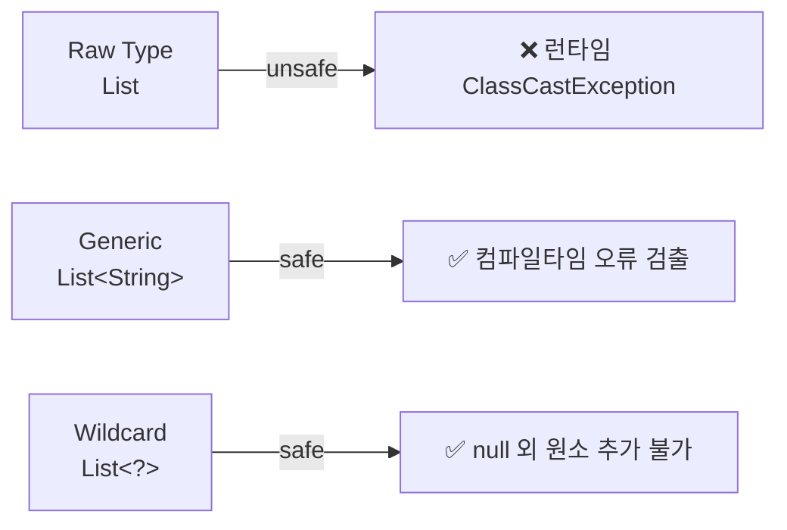

실무에서 자주 겠는 실수: 레거시 코드에서 `List`로 받아 어딜가에서 `(String) list.get(0)` 캐스팅. 이런 코드는 `List<String>` 또는 `List<?>`로 리팩터링해야 한다.

---

### Item 27. 비검사 경고를 제거하라

제네릭을 쓰면 수많은 unchecked 경고가 뜬다. 할 수 있는 한 모두 제거하라. 경고를 하나도 남기지 않으면 런타임에 `ClassCastException`이 발생하지 않음을 보장한다.

경고를 제거할 수 없지만 코드가 타입 안전하다고 확신하면 `@SuppressWarnings("unchecked")`를 최대한 좁은 범위에 붙이고, 그 이유를 주석으로 남겨라.

---

### Item 28. 배열보다는 리스트를 사용하라

배열과 제네릭에는 중요한 차이 두 가지가 있다.

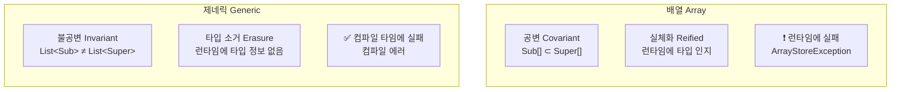

| | 배열 | 제네릭 |
|---|---|---|
| 공변성 | 공변 — `Sub[]`은 `Super[]`의 하위 타입 | 불공변 — `List<Sub>` ≠ `List<Super>` |
| 실체화 | 런타임에 타입 인지 | 런타임에 타입 소거 |

```java
// 배열: 런타임에 실패
Object[] objectArray = new Long[1];
objectArray[0] = "문자열";  // ArrayStoreException

// 리스트: 컴파일 타임에 실패
List<Object> ol = new ArrayList<Long>();  // 컴파일 에러
```

배열은 런타임에 타입 안전하지만 컴파일 타임에는 아니다. 제네릭은 그 반대다. 배열과 제네릭을 섞어 쓰다 경고를 받으면 배열을 리스트로 대체하라.

---

### Item 29. 이왕이면 제네릭 타입으로 만들라

클라이언트에서 직접 형변환하는 코드가 있다면 제네릭으로 만들어야 한다는 신호다.

`Object` 기반 컬렉션을 제네릭으로 전환할 때 `new E[]`를 쓸 수 없는 문제는 두 가지로 해결한다.

```java
// 방법 1 (선호): 배열을 E[]로 캐스팅, @SuppressWarnings
@SuppressWarnings("unchecked")
public Stack() { elements = (E[]) new Object[DEFAULT_SIZE]; }

// 방법 2: 배열은 Object[], 꺼낼 때마다 캐스팅
public E pop() {
    @SuppressWarnings("unchecked") E result = (E) elements[--size];
    return result;
}
```

---

### Item 30. 이왕이면 제네릭 메서드로 만들라

메서드도 형변환 없이 사용할 수 있도록 제네릭으로 만들라.

```java
// Raw Type → type-unsafe
public static Set union(Set s1, Set s2) { ... }

// 제네릭 메서드 → type-safe
public static <E> Set<E> union(Set<E> s1, Set<E> s2) {
    Set<E> result = new HashSet<>(s1);
    result.addAll(s2);
    return result;
}
```

재귀적 타입 한정(recursive type bound)은 주로 `Comparable`과 함께 쓴다. `<E extends Comparable<E>>`는 "자기 자신과 비교할 수 있는 모든 타입 E"를 뜻한다.

---

### Item 31. 한정적 와일드카드를 사용해 API 유연성을 높이라

매개변수화 타입은 불공변이므로, 유연성을 위해 한정적 와일드카드가 필요하다. 핵심 공식은 **PECS: Producer-Extends, Consumer-Super**다.

```java
// 생산자: src에서 꺼내 push → extends
public void pushAll(Iterable<? extends E> src) {
    for (E e : src) push(e);
}

// 소비자: pop하여 dst에 넣음 → super
public void popAll(Collection<? super E> dst) {
    while (!isEmpty()) dst.add(pop());
}
```

반환 타입에는 와일드카드를 쓰지 마라 — 클라이언트 코드까지 와일드카드를 신경 써야 한다.

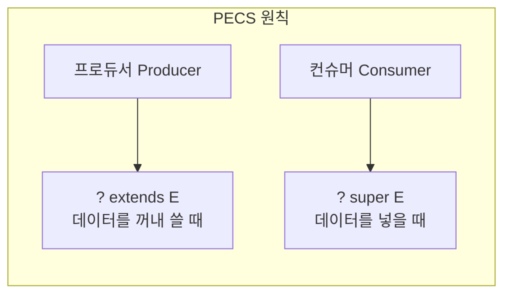

타입 매개변수가 한 번만 등장하면 와일드카드로 대체하라.

```java
public static void swap(List<?> list, int i, int j);  // 좋음
public static <E> void swap(List<E> list, int i, int j);  // 불필요하게 복잡
```

---

### Item 32. 제네릭과 가변인수를 함께 쓸 때는 신중하라

가변인수 메서드를 호출하면 배열이 만들어지는데, 이 배열이 클라이언트에게 노출되면 타입 안전성이 깨진다.

`@SafeVarargs`는 두 조건을 만족할 때만 달라.
1. 가변인수 배열에 아무것도 저장하지 않는다
2. 그 배열(또는 복제본)을 신뢰할 수 없는 코드에 노출하지 않는다

안전한 대안은 가변인수를 `List`로 대체하는 것이다.

```java
// 위험: 배열 반환
static <T> T[] toArray(T... args) { return args; }

// 안전: List 반환
@SafeVarargs
static <T> List<T> flatten(List<? extends T>... lists) {
    List<T> result = new ArrayList<>();
    for (List<? extends T> list : lists) result.addAll(list);
    return result;
}
```

---

### Item 33. 타입 안전 이종 컨테이너를 고려하라

일반적인 `Map<K, V>`나 `Set<E>`는 타입 매개변수의 수가 고정되어 있다. 더 유연하게 쓰려면 컨테이너 대신 **키를 매개변수화**하라.

```java
public class Favorites {
    private Map<Class<?>, Object> favorites = new HashMap<>();

    public <T> void putFavorite(Class<T> type, T instance) {
        favorites.put(Objects.requireNonNull(type), type.cast(instance));
    }

    public <T> T getFavorite(Class<T> type) {
        return type.cast(favorites.get(type));
    }
}

// 사용
Favorites f = new Favorites();
f.putFavorite(String.class, "Java");
f.putFavorite(Integer.class, 0xcafebabe);
String s = f.getFavorite(String.class);  // "Java"
```

`Class<T>`를 키로 쓰면 컴파일 타임과 런타임의 타입 정보를 연결할 수 있다. 이런 Class 객체를 **타입 토큰(type token)**이라 한다. 제약: `List<String>.class` 같은 실체화 불가 타입은 키로 쓸 수 없다.

---

## 6장. 열거 타입과 애너테이션

### Item 34. int 상수 대신 열거 타입을 사용하라

정수 열거 패턴(`public static final int`)은 타입 안전을 보장하지 못하고, 네임스페이스가 없으며, 디버깅 시 의미 없는 숫자만 보인다.

열거 타입은 완전한 클래스다. 상수마다 하나의 인스턴스를 보장하고, 컴파일타임 타입 안전성을 제공한다.

```java
public enum Operation {
    PLUS("+")   { public double apply(double x, double y) { return x + y; } },
    MINUS("-")  { public double apply(double x, double y) { return x - y; } },
    TIMES("*")  { public double apply(double x, double y) { return x * y; } },
    DIVIDE("/") { public double apply(double x, double y) { return x / y; } };

    private final String symbol;
    Operation(String symbol) { this.symbol = symbol; }
    @Override public String toString() { return symbol; }
    public abstract double apply(double x, double y);
}
```

분기별 로직이 필요하면 switch 대신 **상수별 메서드 구현(constant-specific method implementation)**을 써라. 여러 상수에 같은 동작을 공유해야 하면 **전략 열거 타입 패턴**을 쓰라.

```java
// 전략 열거 타입 패턴 — 급여 유형별 잔업 수당 계산
enum PayrollDay {
    MONDAY(PayType.WEEKDAY), TUESDAY(PayType.WEEKDAY),
    SATURDAY(PayType.WEEKEND), SUNDAY(PayType.WEEKEND);

    private final PayType payType;
    PayrollDay(PayType payType) { this.payType = payType; }

    int pay(int minsWorked, int payRate) {
        return payType.pay(minsWorked, payRate);
    }

    // 전략 열거 타입
    enum PayType {
        WEEKDAY { int overtimePay(int mins, int rate) { return mins <= 480 ? 0 : (mins - 480) * rate / 2; } },
        WEEKEND { int overtimePay(int mins, int rate) { return mins * rate / 2; } };
        abstract int overtimePay(int mins, int rate);
        int pay(int minsWorked, int payRate) {
            int basePay = minsWorked * payRate;
            return basePay + overtimePay(minsWorked, payRate);
        }
    }
}
```

enum에 `fromString` 팩터리 메서드를 제공하면 문자열에서 enum으로 변환하기 편리하다.

```java
private static final Map<String, Operation> stringToEnum =
    Stream.of(values()).collect(toMap(Object::toString, e -> e));

public static Optional<Operation> fromString(String symbol) {
    return Optional.ofNullable(stringToEnum.get(symbol));
}
```

---

### Item 35. ordinal 메서드 대신 인스턴스 필드를 사용하라

`ordinal()`은 상수 선언 순서에 의존하므로 상수를 추가하거나 순서를 바꾸면 깨진다.

```java
// 나쁜 예
public enum Ensemble {
    SOLO, DUET, TRIO; // ordinal이 0, 1, 2
    public int numberOfMusicians() { return ordinal() + 1; }
}

// 좋은 예
public enum Ensemble {
    SOLO(1), DUET(2), TRIO(3), OCTET(8);
    private final int numberOfMusicians;
    Ensemble(int size) { this.numberOfMusicians = size; }
}
```

JPA에서 `@Enumerated(EnumType.ORDINAL)` 역시 같은 이유로 위험하다. `EnumType.STRING`을 쓰라.

enum 상수에 연관된 숫자 값이 필요하면 인스턴스 필드로 저장하라. `ordinal()`의 용도는 `EnumSet`, `EnumMap` 같은 범용 데이터 구조에 쓰기 위한 것이지, 프로그래머가 직접 쓰라고 있는 것이 아니다.

---

### Item 36. 비트 필드 대신 EnumSet을 사용하라

EnumSet은 내부적으로 비트 벡터로 구현되어 비트 필드에 필적하는 성능을 내면서, Set 인터페이스를 완벽히 구현한다.

```java
// 비트 필드 (나쁜 예)
public static final int STYLE_BOLD      = 1 << 0;  // 1
public static final int STYLE_ITALIC    = 1 << 1;  // 2
text.applyStyles(STYLE_BOLD | STYLE_ITALIC);  // 3 — 의미 파악 어려움

// EnumSet (좋은 예)
public enum Style { BOLD, ITALIC, UNDERLINE, STRIKETHROUGH }
text.applyStyles(EnumSet.of(Style.BOLD, Style.ITALIC));  // 타입 안전, 명확
```

---

### Item 37. ordinal 인덱싱 대신 EnumMap을 사용하라

`ordinal()`로 배열 인덱스를 매기면 타입 안전하지 않고, 출력 시 직접 레이블을 달아야 한다. EnumMap은 내부에서 배열을 쓰면서도 Map 인터페이스를 제공한다.

```java
// EnumMap 사용
Map<Plant.LifeCycle, Set<Plant>> plantsByLifeCycle = new EnumMap<>(Plant.LifeCycle.class);
for (Plant.LifeCycle lc : Plant.LifeCycle.values())
    plantsByLifeCycle.put(lc, new HashSet<>());

// Stream + EnumMap
Arrays.stream(garden)
    .collect(groupingBy(p -> p.lifeCycle,
        () -> new EnumMap<>(LifeCycle.class), toSet()));
```

---

### Item 38. 확장할 수 있는 열거 타입이 필요하면 인터페이스를 사용하라

열거 타입은 확장할 수 없지만, 인터페이스를 구현하여 같은 효과를 낼 수 있다.

```java
public interface Operation {
    double apply(double x, double y);
}

public enum BasicOperation implements Operation {
    PLUS("+") { public double apply(double x, double y) { return x + y; } },
    MINUS("-") { public double apply(double x, double y) { return x - y; } };
    // ...
}

// 확장
public enum ExtendedOperation implements Operation {
    EXP("^") { public double apply(double x, double y) { return Math.pow(x, y); } },
    REMAINDER("%") { public double apply(double x, double y) { return x % y; } };
    // ...
}
```

---

### Item 39. 명명 패턴보다 애너테이션을 사용하라

JUnit 3의 `test`로 시작하는 명명 패턴은 오타에 취약하고, 매개변수를 전달할 방법이 없다. 애너테이션(`@Test`)이 이 모든 문제를 해결한다.

애너테이션은 이 타입의 프로그램 요소에 아무런 영향을 주지 않고 단지 관심 있는 도구(테스트 프레임워크 등)에 정보를 제공할 뿐이다.

---

### Item 40. @Override 애너테이션을 일관되게 사용하라

`@Override`를 빠뜨리면 재정의(overriding)가 아니라 다중정의(overloading)가 되는 미묘한 버그가 발생한다.

```java
// 버그: Object.equals(Object)를 재정의한 게 아니라 다중정의
public boolean equals(Bigram other) { ... }  // 매개변수 타입이 Object가 아님

// @Override를 붙이면 컴파일러가 잡아줌
@Override
public boolean equals(Object o) { ... }  // 올바른 시그니처
```

상위 클래스의 메서드를 재정의하는 모든 메서드에 `@Override`를 달라. 구체 클래스에서 추상 메서드를 구현할 때도 붙이는 습관을 들이면 안전하다.

---

### Item 41. 정의하려는 것이 타입이라면 마커 인터페이스를 사용하라

| 비교 | 마커 인터페이스 | 마커 애너테이션 |
|------|----------------|----------------|
| 타입으로 사용 | O (컴파일타임 오류 검출) | X (런타임에야 검출) |
| 적용 대상 정밀도 | 특정 인터페이스의 하위 타입에 제한 가능 | `@Target(TYPE)` 수준 |
| 클래스 외 프로그램 요소에 적용 | X | O |

마킹된 객체를 매개변수로 받는 메서드를 작성할 일이 있으면 → 마커 인터페이스. 프레임워크에서 애너테이션을 적극 활용하고 있으면 → 마커 애너테이션.

---

## 7장. 람다와 스트림

### Item 42. 익명 클래스보다는 람다를 사용하라

Java 8부터 추상 메서드 하나인 인터페이스(함수형 인터페이스)는 람다로 대체할 수 있다.

```java
// 익명 클래스 — 장황
Collections.sort(words, new Comparator<String>() {
    public int compare(String s1, String s2) {
        return Integer.compare(s1.length(), s2.length());
    }
});

// 람다 — 간결
Collections.sort(words, (s1, s2) -> Integer.compare(s1.length(), s2.length()));

// 메서드 참조 — 더 간결
words.sort(comparingInt(String::length));
```

람다에서 `this`는 바깥 인스턴스를 가리킨다. 자기 자신을 참조해야 하면 익명 클래스를 써야 한다. 람다는 직렬화하지 마라.

람다 사용 시 주의점:
- 람다는 이름이 없고 문서화도 못한다. 3줄이 넘거나, 읽기 어려워지면 람다를 쓰지 마라.
- 람다 안의 변수는 사실상 final이다. 바깥 지역 변수를 수정해야 하면 람다 대신 일반 반복문을 쓰라.

---

### Item 43. 람다보다는 메서드 참조를 사용하라

메서드 참조가 람다보다 간결하면 메서드 참조를 쓰고, 아니면 람다를 쓰라.

| 유형 | 메서드 참조 | 동등한 람다 |
|------|------------|-------------|
| 정적 | `Integer::parseInt` | `str -> Integer.parseInt(str)` |
| 한정적 인스턴스 | `inst::isAfter` | `t -> inst.isAfter(t)` |
| 비한정적 인스턴스 | `String::toLowerCase` | `str -> str.toLowerCase()` |
| 클래스 생성자 | `TreeMap<K,V>::new` | `() -> new TreeMap<>()` |
| 배열 생성자 | `int[]::new` | `len -> new int[len]` |

---

### Item 44. 표준 함수형 인터페이스를 사용하라

`java.util.function`에 43개 인터페이스가 있지만, 기본 6개만 기억하면 나머지는 유추할 수 있다.

| 인터페이스 | 시그니처 | 예시 |
|-----------|----------|------|
| `UnaryOperator<T>` | `T → T` | `String::toLowerCase` |
| `BinaryOperator<T>` | `(T, T) → T` | `BigInteger::add` |
| `Predicate<T>` | `T → boolean` | `Collection::isEmpty` |
| `Function<T, R>` | `T → R` | `Arrays::asList` |
| `Supplier<T>` | `() → T` | `Instant::now` |
| `Consumer<T>` | `T → void` | `System.out::println` |

기본 타입 전용 변형(`IntFunction`, `LongToDoubleFunction` 등)이 있으니 박싱 타입을 넣어 사용하지 마라.

직접 만든 함수형 인터페이스에는 반드시 `@FunctionalInterface`를 달라.

---

### Item 45. 스트림은 주의해서 사용하라

스트림 파이프라인은 지연 평가(lazy evaluation)된다. 종단 연산이 없으면 아무 일도 하지 않는다.

스트림을 과용하면 읽기 어렵고 유지보수가 힘들다. 반복문이 더 알맞는 경우도 있다.

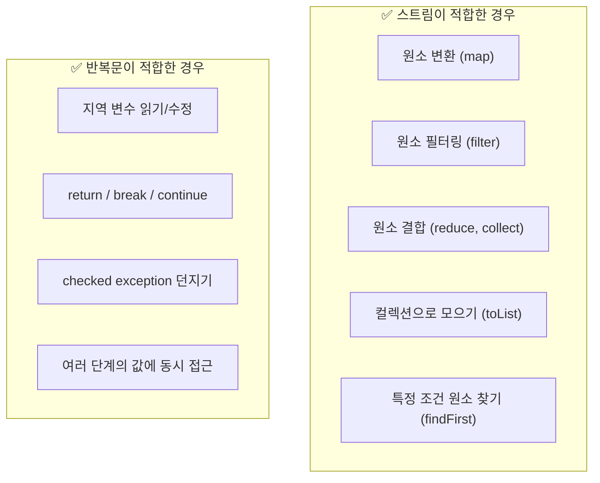

확신이 없으면 둘 다 해보고 더 나은 쪽을 택하라. 스트림 파이프라인은 되풀이되는 계산을 일급 함수 객체로 표현하고, 반복문은 코드 블록으로 표현한다. 코드 블록에서는 범위 안의 지역 변수를 읽고 수정할 수 있지만, 람다에서는 사실상 final인 변수만 읽을 수 있다.

---

### Item 46. 스트림에서는 부작용 없는 함수를 사용하라

스트림 패러다임의 핵심은 각 변환 단계가 순수 함수(pure function)여야 한다는 것이다.

```java
// 나쁜 예: forEach에서 외부 상태 수정
Map<String, Long> freq = new HashMap<>();
words.forEach(word -> freq.merge(word, 1L, Long::sum));  // 스트림 API의 형태를 빌린 반복문

// 좋은 예: Collector 사용
Map<String, Long> freq = words.collect(groupingBy(String::toLowerCase, counting()));
```

`forEach`는 스트림 계산 결과를 보고할 때만 쓰고, 계산 자체에는 쓰지 마라.

핵심 Collector 활용법:

```java
// 리스트로 모으기
List<String> topTen = freq.keySet().stream()
    .sorted(comparing(freq::get).reversed())
    .limit(10)
    .collect(toList());

// Map으로 모으기 (충돌 시 마지막 값 유지)
Map<Artist, Album> topHits = albums.collect(
    toMap(Album::artist, a -> a, maxBy(comparing(Album::sales))));

// 분류후 다운스트림
 Map<Boolean, List<Integer>> partition = numbers.stream()
    .collect(partitioningBy(n -> n % 2 == 0));
```

핵심 Collector: `toList()`, `toSet()`, `toMap()`, `groupingBy()`, `joining()`.

---

### Item 47. 반환 타입으로는 스트림보다 컬렉션이 낫다

`Stream`은 `Iterable`을 확장하지 않아 for-each로 순회할 수 없다. 원소 시퀀스를 반환하는 공개 API의 반환 타입으로는 `Collection`이나 그 하위 타입을 쓰는 게 최선이다. 반복과 스트림 양쪽을 모두 지원할 수 있기 때문이다.

컬렉션이 너무 크면 전용 컬렉션(`AbstractList` 등)을 구현하여 메모리를 아끼자.

---

### Item 48. 스트림 병렬화는 주의해서 적용하라

`parallel()`을 호출하면 무조건 빨라지는 게 아니다. 잘못 적용하면 성능 저하, 오작동, 응답 불가가 생긴다.

병렬화 효과가 좋은 조건:
- 소스가 `ArrayList`, `HashMap`, `int[]`, `long[]` 등 **쪼개기 좋은** 자료구조
- 종단 연산이 축소(`reduce`, `min`, `max`, `count`, `sum`) 또는 단락 평가(`anyMatch`, `allMatch`)
- 참조 지역성(locality of reference)이 뛰어남

`Stream.iterate`나 `limit`이 포함된 파이프라인은 병렬화해도 나아지지 않는다.

병렬 스트림에서 난수가 필요하면 `SplittableRandom`을 우선 검토하라. 병렬 분할에 맞춰 설계되어 있어 공유형 난수 생성기보다 다루기 쉽다.

---

## 8장. 메서드

### Item 49. 매개변수가 유효한지 검사하라

메서드 바디 실행 전에 매개변수를 검증하라. 오류는 가능한 빨리, 발생한 곳에서 잡아야 한다.

```java
// public 메서드: @throws로 문서화
/**
 * @throws ArithmeticException m이 0 이하일 때
 */
public BigInteger mod(BigInteger m) {
    if (m.signum() <= 0)
        throw new ArithmeticException("modulus must be positive: " + m);
    // ...
}

// private 메서드: assert로 검증
private static void sort(long[] a, int offset, int length) {
    assert a != null;
    assert offset >= 0 && offset <= a.length;
    // ...
}
```

Java 7+에서는 `Objects.requireNonNull()`을, Java 9+에서는 `checkFromIndexSize()` 등을 활용하라.

---

### Item 50. 적시에 방어적 복사본을 만들라

클라이언트가 불변식을 깨뜨리려 한다고 가정하고 방어적으로 프로그래밍하라.

```java
public Period(Date start, Date end) {
    this.start = new Date(start.getTime());  // 방어적 복사 먼저
    this.end = new Date(end.getTime());
    if (this.start.compareTo(this.end) > 0)   // 유효성 검사 나중에 (TOCTOU 방지)
        throw new IllegalArgumentException(start + " > " + end);
}

public Date getStart() {
    return new Date(start.getTime());  // 접근자에서도 방어적 복사
}
```

복사에 `clone()`을 쓰면 안 된다 — 매개변수 타입이 확장 가능하면 하위 클래스가 clone을 악의적으로 재정의할 수 있다. `Date` 대신 불변인 `Instant`, `LocalDateTime`을 쓰면 방어적 복사 자체가 불필요하다.

---

### Item 51. 메서드 시그니처를 신중히 설계하라

다섯 가지 지침:

1. 메서드 이름을 신중히 짓고 표준 명명 규칙을 따르라
2. 편의 메서드를 너무 많이 만들지 마라
3. 매개변수 목록은 4개 이하로 유지하라 — 메서드 쪼개기, 도우미 클래스, 빌더 패턴 활용
4. 매개변수 타입은 클래스보다 인터페이스가 낫다 (`HashMap` → `Map`)
5. boolean보다 원소 2개짜리 열거 타입이 낫다 (`TemperatureScale.CELSIUS` vs `true`)

---

### Item 52. 다중정의(overloading)는 신중히 사용하라

다중정의된 메서드 중 어느 것이 호출될지는 **컴파일 시점**에 결정된다. 재정의(overriding)는 런타임에 결정된다. 이 차이가 혼란을 만든다.

```java
// List.remove의 함정
List<Integer> list = new ArrayList<>(Arrays.asList(-3, -2, -1, 0, 1, 2));
for (int i = 0; i < 3; i++) list.remove(i);
// 결과: [-2, 0, 2]  (인덱스 기반 삭제)
// 의도: list.remove((Integer) i)  (값 기반 삭제)
```

안전한 규칙: **같은 수의 매개변수를 갖는 다중정의를 두 개 이상 만들지 마라.** 가변인수 메서드는 아예 다중정의하지 마라. 이름을 다르게 지어라 (`writeInt`, `writeLong`처럼).

특히 `ObjectOutputStream`은 `write`와 `writeObject` 두 가지 메서드를 모두 제공하지만, 다중정의 없이 이름 자체로 구분한 좋은 예다.

Java 5에서 오토박싱이 도입되면서 `List.remove(int)` vs `List.remove(Object)`의 혼란이 생겼다. `List<Integer>`에서 `remove(3)`은 인덱스 3의 원소를 제거하는지, 값 3을 제거하는지 모호해진다.

---

### Item 53. 가변인수는 신중히 사용하라

가변인수 호출마다 배열이 새로 할당된다. 성능에 민감하면 자주 쓰는 인수 개수별로 오버로딩하라.

```java
// 인수가 최소 1개 필요하면: 첫 번째를 분리
static int min(int firstArg, int... remainingArgs) {
    int min = firstArg;
    for (int arg : remainingArgs)
        if (arg < min) min = arg;
    return min;
}
```

`EnumSet.of(E first, E... rest)`가 이 패턴의 좋은 예다.

---

### Item 54. null이 아닌, 빈 컬렉션이나 배열을 반환하라

null을 반환하면 클라이언트에 null 검사 코드가 강제된다. 빈 컬렉션이나 빈 배열을 반환하라. 할당이 걱정되면 `Collections.emptyList()` 같은 불변 빈 컬렉션을 재사용하라.

비어있는지 확인하지 않고 바로 반환하는 것도 가능하다:

```java
// 더 간결한 방식 — 어떨 때든 새 리스트 생성
public List<Cheese> getCheeses() {
    return new ArrayList<>(cheesesInStock);
}

// 배열 버전: 빈 배열 상수 재사용
private static final Cheese[] EMPTY_CHEESE_ARRAY = new Cheese[0];
public Cheese[] getCheeses() {
    return cheesesInStock.toArray(EMPTY_CHEESE_ARRAY);
}
```

```java
public List<Cheese> getCheeses() {
    return cheesesInStock.isEmpty()
        ? Collections.emptyList()
        : new ArrayList<>(cheesesInStock);
}
```

---

### Item 55. Optional 반환은 신중히 하라

반환값이 없을 수 있음을 API에서 명시하는 것이 Optional의 존재 이유다.

```java
public static <E extends Comparable<E>> Optional<E> max(Collection<E> c) {
    if (c.isEmpty()) return Optional.empty();
    // ...
    return Optional.of(result);
}

// 사용
String lastWord = max(words).orElse("단어 없음");
String lastWord = max(words).orElseThrow(NoSuchElementException::new);
```

- 컨테이너 타입(Collection, Stream, 배열)을 Optional로 감싸지 마라 — 빈 컬렉션을 반환하라
- 기본 타입에는 `OptionalInt`, `OptionalLong`, `OptionalDouble`을 쓰라
- Optional을 Map의 값으로 쓰지 마라
- `orElse()`는 값이 있어도 기본값을 생성하므로 비싼 연산이면 `orElseGet()`을 써라

---

### Item 56. 공개된 API 요소에는 항상 문서화 주석을 작성하라

공개된 모든 클래스, 인터페이스, 메서드, 필드 선언에 문서화 주석을 달라. 메서드는 **무엇을** 하는지(what) 기술하고, 어떻게(how) 동작하는지는 기술하지 않는다.

모든 매개변수에 `@param`, 반환값에 `@return`, 발생 가능한 예외에 `@throws`를 달라. 스레드 안전성과 직렬화 가능 여부도 문서화하라.

---

## 9장. 일반적인 프로그래밍 원칙

### Item 57. 지역변수의 범위를 최소화하라

가장 처음 쓰일 때 선언하고, 선언과 동시에 초기화하라. for 문이 while 문보다 낫다 — 반복 변수의 유효 범위가 for 블록 안으로 제한되어 복사/붙여넣기 버그를 컴파일러가 잡아준다.

```java
// while: i가 여전히 유효 → 복사/붙여넣기 시 버그 가능
Iterator<Integer> i = c.iterator();
while (i.hasNext()) { doSomething(i.next()); }
// i는 여전히 접근 가능

// for: i의 범위가 for 블록 안으로 제한
for (Iterator<Integer> i = c.iterator(); i.hasNext(); ) {
    doSomething(i.next());
}
// i에 접근하면 컴파일 에러
```

---

### Item 58. 전통적인 for 문보다는 for-each 문을 사용하라

for-each는 반복자(iterator)와 인덱스 변수를 숨겨 코드를 깔끔하게 만들고 오류를 줄인다.

for-each를 쓸 수 없는 세 가지 상황:
1. **파괴적 필터링** — 순회 중 원소 제거 시 (`Collection.removeIf()` 또는 `iterator.remove()`)
2. **변형** — 원소 값 교체 시 인덱스 필요
3. **병렬 반복** — 여러 컬렉션을 동시에 순회

---

### Item 59. 라이브러리를 익히고 사용하라

바퀴를 재발명하지 마라. `java.lang`, `java.util`, `java.io`와 하위 패키지는 반드시 숙지하라.

랜덤 수 생성: `Random.nextInt(n)` → Java 7+ `ThreadLocalRandom` → 병렬: `SplittableRandom`.

---

### Item 60. 정확한 답이 필요하다면 float와 double은 피하라

float/double은 이진 부동소수점 연산을 위해 설계되었다. 금융 계산처럼 정확한 결과가 필요하면 `BigDecimal`, `int`, `long`을 쓰라.

```java
// 부정확
1.03 - 0.42  // → 0.6100000000000001

// BigDecimal로 해결
new BigDecimal("1.03").subtract(new BigDecimal("0.42"))  // → 0.61
```

소수점 이하 자릿수가 정해져 있으면 정수로 환산하여 계산하는 것이 가장 빠르다 (예: 달러 → 센트).

| 방법 | 성능 | 편의성 | 소수점 자릿수 |
|------|------|---------|----------|
| `int`/`long` | 최고 | 낮음 | 직접 관리 |
| `BigDecimal` | 낮음 | 높음 | 자동 관리 |

9자리 이하면 `int`, 18자리 이하면 `long`, 그 이상이면 `BigDecimal`을 쓰라.

`BigDecimal` 사용 시 `new BigDecimal(0.1)`은 정확히 0.1이 아니다. `new BigDecimal("0.1")` 또는 `BigDecimal.valueOf(0.1)`을 쓰라.

---

### Item 61. 박싱된 기본 타입보다는 기본 타입을 사용하라

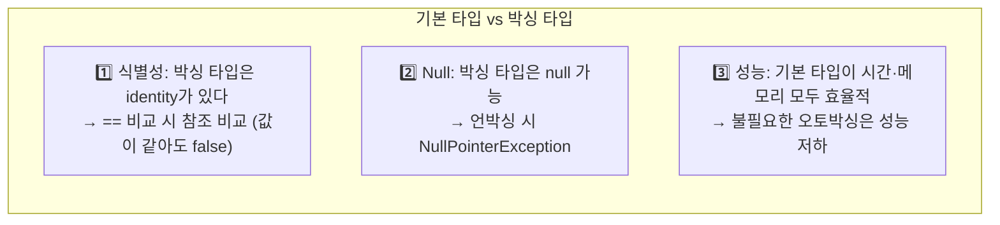

```java
// 함정: new Integer(42) == new Integer(42) → false
Comparator<Integer> naturalOrder = (i, j) -> (i < j) ? -1 : (i == j ? 0 : 1);
// i == j는 참조 비교! → 같은 값이어도 1을 반환

// 해결: 언박싱 후 비교
Comparator<Integer> naturalOrder = (iBoxed, jBoxed) -> {
    int i = iBoxed, j = jBoxed;
    return (i < j) ? -1 : (i == j ? 0 : 1);
};
```

박싱 타입을 써야 하는 곳: 컬렉션의 원소/키/값, 제네릭 타입 매개변수, 리플렉션.

---

### Item 62. 다른 타입이 적절하다면 문자열 사용을 피하라

문자열은 값 타입, 열거 타입, 혼합 타입, 권한(capability)을 대신하기에 적합하지 않다. 수치는 `int`/`BigInteger`, 예/아니오는 `boolean`/`enum`을 써라.

실무에서 자주 보는 안티패턴:

```java
// 나쁜 예: 타입 정보를 문자열로 전달
String compoundKey = className + "#" + fieldName + "/" + typeName;
// → 파싱 오류, equals 구현 복잡, 성능 나쁨

// 좋은 예: 전용 클래스 사용
record FieldKey(String className, String fieldName, String typeName) { }
```

---

### Item 63. 문자열 연결은 느리니 주의하라

반복문 안에서 `+` 연산자를 반복 사용해 문자열을 계속 연결하면, 매번 새로운 문자열을 생성하고 복사하므로 시간 복잡도가 $O(n^2)$이 된다. `String`이 불변이라 매번 양쪽 내용을 복사하기 때문이다. 많은 문자열을 결합할 때는 `StringBuilder`를 쓰라.

```java
// 느림: O(n²)
String result = "";
for (int i = 0; i < n; i++) result += lineForItem(i);

// 빠름: O(n)
StringBuilder sb = new StringBuilder();
for (int i = 0; i < n; i++) sb.append(lineForItem(i));
return sb.toString();
```

---

### Item 64. 객체는 인터페이스를 사용해 참조하라

적합한 인터페이스가 있으면 매개변수, 반환값, 변수, 필드를 전부 인터페이스 타입으로 선언하라. 구현 타입을 바꿀 때 선언부만 수정하면 된다.

```java
Set<Son> sonSet = new LinkedHashSet<>();  // 좋음
LinkedHashSet<Son> sonSet = new LinkedHashSet<>();  // 나쁨 — 구현에 종속
```

적합한 인터페이스가 없다면 클래스 계층에서 가장 상위의 적합한 클래스 타입을 사용하라.

---

### Item 65. 리플렉션보다는 인터페이스를 사용하라

리플렉션의 단점 세 가지: 컴파일타임 검사 불가, 코드가 장황하고 읽기 어려움, 성능 저하.

리플렉션은 인스턴스 생성에만 쓰고, 만든 인스턴스는 인터페이스나 상위 클래스로 참조하라.

```java
Class<? extends Set<String>> cl = (Class<? extends Set<String>>) Class.forName(args[0]);
Set<String> s = cl.getDeclaredConstructor().newInstance();  // 리플렉션은 여기까지만
s.addAll(Arrays.asList(args).subList(1, args.length));       // 이후는 인터페이스로
```

---

### Item 66. 네이티브 메서드는 신중히 사용하라

네이티브 메서드는 C, C++ 같은 언어로 작성한 코드를 JNI 등을 통해 자바에서 호출하는 방식이다. 운영체제 기능에 직접 접근하거나, 이미 존재하는 네이티브 라이브러리를 재사용해야 할 때는 유용하지만 일반적인 애플리케이션 로직의 기본 수단으로 삼기에는 비용이 크다.

네이티브 메서드의 단점은 분명하다.

- 이식성이 떨어진다. 운영체제와 CPU 아키텍처가 바뀌면 다시 빌드하고 검증해야 한다.
- 자바의 안전 장치를 벗어난다. 포인터 오류, 메모리 누수, 잘못된 자원 관리는 JVM 전체 안정성을 해칠 수 있다.
- 디버깅과 배포가 까다롭다. 크래시가 나면 자바 스택만으로 원인을 좁히기 어렵고, 라이브러리 로딩 문제도 자주 생긴다.
- 성능 이점이 항상 크지 않다. JNI 경계를 넘는 비용과 데이터 변환 비용 때문에 작은 작업은 오히려 손해일 수 있다.

```java
public final class NativeMath {
    static {
        System.loadLibrary("native-math");
    }

    private NativeMath() { }

    public static native long fastHash(byte[] input);
}
```

실무에서는 "반드시 운영체제 고유 기능이 필요한가", "이미 검증된 네이티브 라이브러리를 재사용해야 하는가"를 먼저 따져라. 그렇지 않다면 순수 자바 구현이 보통 더 안전하고 유지보수하기 쉽다.

---

### Item 67. 최적화는 신중히 하라

> "섣부른 최적화는 만악의 근원이다" — Donald Knuth

빠른 프로그램이 아닌 좋은 프로그램을 작성하라. 설계가 좋으면 추후 성능 문제가 발생했을 때 전체 아키텍처를 훼손하지 않고 효과적으로 최적화할 수 있다. 성능을 제한하는 설계 결정(API, wire-level 프로토콜, 데이터 포맷)에만 신경 쓰라. 최적화 전후에 반드시 프로파일러로 성능을 측정하라.

---

### Item 68. 일반적으로 통용되는 명명 규칙을 따르라

| 대상 | 규칙 | 예시 |
|------|------|------|
| 패키지 | 소문자, 도메인 역순 | `com.google.common.collect` |
| 클래스/인터페이스 | PascalCase | `HttpUrl`, `FutureTask` |
| 메서드/필드 | camelCase | `ensureCapacity` |
| 상수 | UPPER_SNAKE_CASE | `MIN_VALUE` |
| 타입 매개변수 | 한 글자 | `T`, `E`, `K`, `V`, `X` |

boolean 반환 메서드는 `is`, `has`로 시작하고, 타입 변환 메서드는 `to~`, 뷰 반환은 `as~`, 기본 타입 반환은 `~Value` 형태를 쓴다.

---

## 10장. 예외

### Item 69. 예외는 진짜 예외 상황에만 사용하라

예외를 일상적 제어 흐름에 쓰면 안 된다. try-catch 블록은 JVM 최적화를 제한하므로 오히려 느려진다.

잘 설계된 API는 정상 제어 흐름에서 예외를 쓸 일이 없도록 상태 검사 메서드를 제공한다 (예: `Iterator.hasNext()` + `next()`).

상태 검사 메서드 vs Optional vs 구별값(예: null) 선택 기준:

| 상황 | 추천 |
|------|------|
| 외부 동기화 없이 호출 가능 | 상태 검사 메서드 |
| 동시성 문제 가능성 | Optional 또는 구별값 |
| 성능 중요 | 구별값 |

---

### Item 70. 복구 가능하면 checked exception, 프로그래밍 오류면 runtime exception

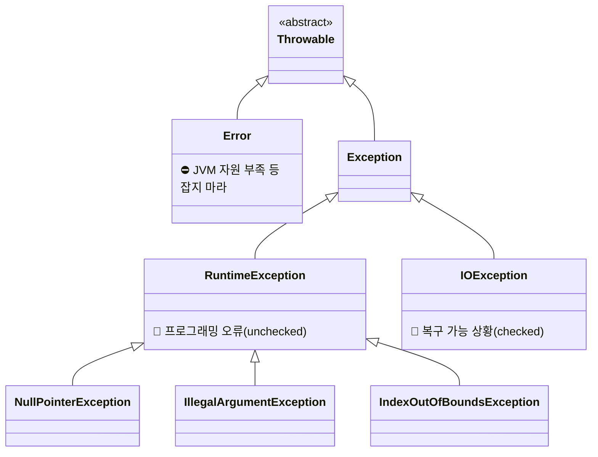

호출자가 복구할 수 있는 상황이면 checked exception을 던지고, 복구에 필요한 정보를 제공하는 접근자 메서드를 함께 제공하라. 프로그래밍 오류(전제조건 위반)에는 runtime exception을 써라.

```java
// checked exception에 복구 정보 제공
public class InsufficientFundsException extends Exception {
    private final long shortfall;  // 부족액

    public InsufficientFundsException(long shortfall) {
        super("\uc794\uc561 \ubd80\uc871: " + shortfall + "\uc6d0");
        this.shortfall = shortfall;
    }

    public long getShortfall() { return shortfall; }  // 복구에 필요한 정보
}
```

원칙: `Error`를 상속하지 마라. `throw`하지도 마라 (`AssertionError` 제외). `Throwable`을 직접 상속하지도 마라.

---

### Item 71. 필요 없는 checked exception 사용은 피하라

checked exception은 API 사용성을 떨어트린다 (try-catch 강제, Stream에서 사용 불가). 복구 방법이 없다면 unchecked exception을 던지라. Optional이나 상태 검사 메서드(메서드 분할) 방식을 먼저 고려하라.

---

### Item 72. 표준 예외를 사용하라

| 예외 | 사용처 |
|------|--------|
| `IllegalArgumentException` | 허용하지 않는 인수값 |
| `IllegalStateException` | 객체 상태가 메서드 수행에 부적합 |
| `NullPointerException` | null 비허용 매개변수에 null |
| `IndexOutOfBoundsException` | 인덱스 범위 초과 |
| `ConcurrentModificationException` | 허용하지 않는 동시 수정 |
| `UnsupportedOperationException` | 지원하지 않는 동작 |

표준 예외를 재사용하면 API가 익히기 쉽고, 예외 클래스가 적어 메모리 사용과 클래스 적재 시간이 줄어든다.

---

### Item 73. 추상화 수준에 맞는 예외를 던져라

저수준 예외를 상위 계층에 전파하면 이상한 예외를 보게 된다. 예외 번역(exception translation)으로 상위 계층에 맞는 예외로 바꿔 던지고, 원인(cause)이 필요하면 예외 연쇄(exception chaining)를 쓰라.

```java
// 예외 번역
try {
    return listIterator(index).next();
} catch (NoSuchElementException e) {
    throw new IndexOutOfBoundsException("Index: " + index);
}

// 예외 연쇄
try {
    // 저수준 추상화 호출
} catch (LowerLevelException cause) {
    throw new HigherLevelException(cause);
}
```

---

### Item 74. 메서드가 던지는 모든 예외를 문서화하라

checked exception은 `@throws`로 하나하나 문서화하고 메서드 선언의 throws 절에 명시하라. unchecked exception도 `@throws`로 문서화하되, throws 절에는 넣지 마라 — checked/unchecked를 시각적으로 구분할 수 있게 된다.

---

### Item 75. 예외의 상세 메시지에 실패 관련 정보를 담으라

실패 순간의 매개변수와 필드 값을 예외 메시지에 담아야 원인을 파악할 수 있다.

```java
// 나쁜 예: 원인 파악 불가
throw new IndexOutOfBoundsException();

// 좋은 예: 즉시 원인 파악
throw new IndexOutOfBoundsException(
    "lowerBound=" + lowerBound + ", upperBound=" + upperBound + ", index=" + index);
```

---

### Item 76. 가능한 한 실패 원자적으로 만들라

실패 원자성(failure atomicity): 메서드가 실패해도 객체는 호출 전 상태를 유지해야 한다.

달성 방법:
1. 불변 객체로 만들기 (가장 간단)
2. 상태 변경 전에 매개변수 유효성 검사
3. 임시 복사본에서 작업 후 성공 시 원본과 교체
4. 실패 시 롤백 코드 작성

---

### Item 77. 예외를 무시하지 말라

빈 catch 블록은 예외를 삼키는 행위다. 예외를 무시해야 한다면 변수 이름을 `ignored`로 짓고 주석으로 이유를 남겨라.

```java
try {
    numColors = f.get(1L, TimeUnit.SECONDS);
} catch (TimeoutException | ExecutionException ignored) {
    // 기본 색상을 쓰면 되므로 무시해도 안전하다
}
```

---

## 11장. 동시성

### Item 78. 공유 중인 가변 데이터는 동기화해 사용하라

`synchronized`는 배타적 실행뿐 아니라 스레드 간 통신(가시성)도 보장한다. 읽기와 쓰기 모두 동기화해야 제대로 동작한다.

```java
// volatile: 가장 최근에 쓴 값을 읽음 보장 (단순 읽기/쓰기 전용)
private static volatile boolean stopRequested;

// AtomicLong: 락 없이 thread-safe한 프로그래밍
private static final AtomicLong nextSerialNumber = new AtomicLong();
public static long generateSerialNumber() {
    return nextSerialNumber.getAndIncrement();
}
```

가장 좋은 방법은 가변 데이터를 공유하지 않는 것이다. 가변 데이터는 단일 스레드에서만 쓰라.

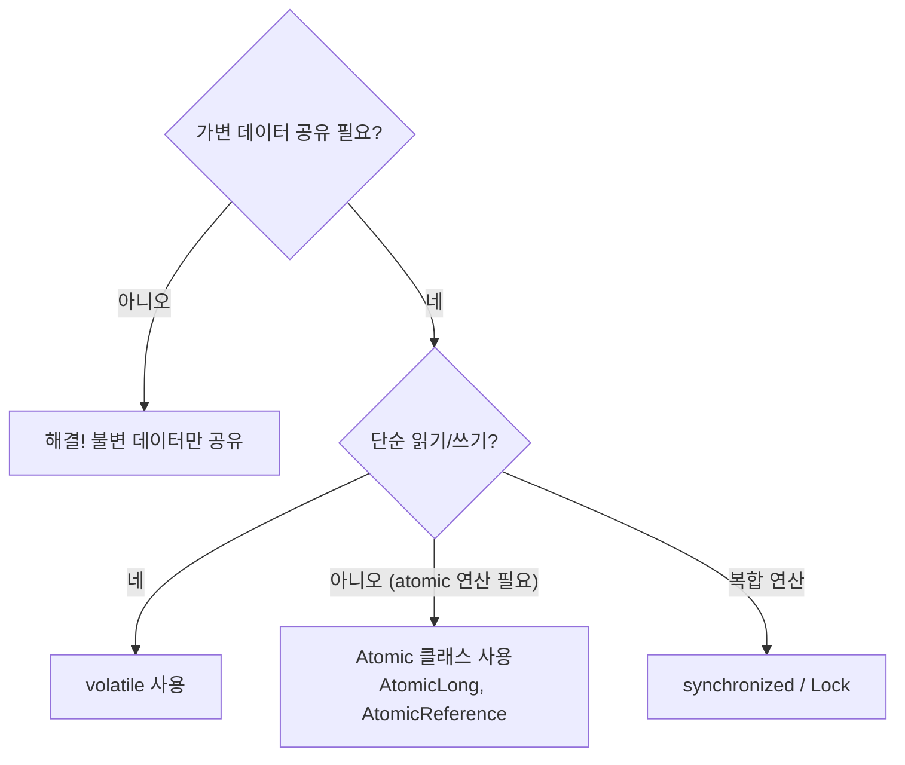

동기화의 두 가지 기능을 항상 기억하라: (1) 배타적 실행 (2) 스레드 간 통신(가시성). 둘 다 충족되지 않으면 동기화가 제대로 되지 않는다.

---

### Item 79. 과도한 동기화는 피하라

동기화 블록 안에서 외계인 메서드(재정의 가능 메서드, 클라이언트 함수 객체)를 호출하지 마라. 교착 상태나 데이터 훼손을 유발한다.

해법: 외계인 메서드 호출을 동기화 블록 바깥으로 옮기거나(열린 호출, open call), `CopyOnWriteArrayList`를 쓰라.

```java
// CopyOnWriteArrayList: 순회가 수정보다 압도적으로 많을 때 최적
private final List<SetObserver<E>> observers = new CopyOnWriteArrayList<>();

public void addObserver(SetObserver<E> observer) {
    observers.add(observer);  // 동기화 불필요!
}

private void notifyElementAdded(E element) {
    for (SetObserver<E> observer : observers)  // 안전한 순회, 동기화 불필요
        observer.added(this, element);
}
```

동기화의 비용은 락 획득이 아니라 **경쟁(contention)** 때문에 발생한다. 과도한 동기화는 병렬성을 잃고 모든 코어가 최신 메모리를 보도록 강제하며 JVM의 코드 최적화를 제한한다.

---

### Item 80. 스레드보다는 실행자, 태스크, 스트림을 애용하라

`Executor` 프레임워크는 작업의 단위(태스크)와 실행 메커니즘을 분리한다.

```java
ExecutorService exec = Executors.newSingleThreadExecutor();
exec.execute(runnable);          // 태스크 제출
exec.shutdown();                 // 종료

// 병렬 작업: ForkJoinPool + parallel stream
```

소규모 서버: `newCachedThreadPool`. 대규모 프로덕션: `newFixedThreadPool` 또는 `ThreadPoolExecutor` 직접 구성.

---

### Item 81. wait와 notify보다는 동시성 유틸리티를 애용하라

`java.util.concurrent`의 동시성 컬렉션(`ConcurrentHashMap`, `BlockingQueue`)과 동기화 장치(`CountDownLatch`, `Semaphore`)가 wait/notify보다 쉽고 안전하다.

`ConcurrentHashMap`은 경쟁이 있는 환경에서 `Collections.synchronizedMap`보다 더 잘 확장되는 경우가 많다. 동시성 컬렉션에 외부 락을 덧씌우면 장점을 스스로 지워버릴 수 있다.

wait를 써야 한다면 반드시 대기 반복문(wait loop) 안에서 호출하라. notify 대신 `notifyAll`을 써라.

---

### Item 82. 스레드 안전성 수준을 문서화하라

synchronized 키워드만으로는 스레드 안전 여부를 알 수 없다. 다음 수준을 명확히 문서화하라.

| 수준 | 설명 | 예시 |
|------|------|------|
| 불변 | 외부 동기화 불필요 | `String`, `Long` |
| 무조건적 thread-safe | 내부 동기화 완비 | `AtomicLong`, `ConcurrentHashMap` |
| 조건부 thread-safe | 일부 메서드에 외부 동기화 필요 | `Collections.synchronized` 래퍼 |
| thread-safe 아님 | 외부 동기화 필수 | `ArrayList`, `HashMap` |

---

### Item 83. 지연 초기화는 신중히 사용하라

대부분의 경우 일반 초기화가 지연 초기화보다 낫다. 지연 초기화가 필요한 경우에는 용도에 맞는 관용구를 써라.

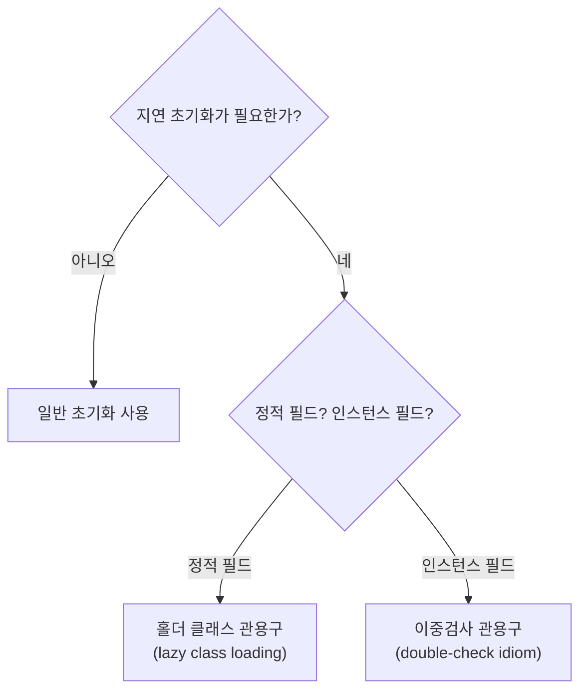

```java
// 정적 필드: 홀더 클래스 관용구 (가장 깔끔)
private static class FieldHolder {
    static final FieldType field = computeFieldValue();
}
private static FieldType getField() { return FieldHolder.field; }

// 인스턴스 필드: 이중검사 관용구
private volatile FieldType field;
private FieldType getField() {
    FieldType result = field;
    if (result != null) return result;       // 첫 번째 검사 (락 없이)
    synchronized (this) {
        if (field == null)                   // 두 번째 검사 (락 안에서)
            field = computeFieldValue();
        return field;
    }
}
```

---

### Item 84. 프로그램의 동작을 스레드 스케줄러에 기대지 말라

정확성이나 성능이 스레드 스케줄러에 의존하면 이식성이 나빠진다. 실행 가능한 스레드 수를 적게 유지하고, 바쁜 대기(busy waiting)를 피하라. `Thread.yield()`와 스레드 우선순위에 의존하지 마라.

---

## 12장. 직렬화

### Item 85. 자바 직렬화의 대안을 찾으라

자바 직렬화는 공격 범위가 넓고, 역직렬화 폭탄으로 서비스 거부 공격이 가능하다. 최선의 방법은 아무것도 역직렬화하지 않는 것이다.

크로스 플랫폼 데이터 표현으로 **JSON**(텍스트, 사람이 읽기 쉬움)이나 **Protocol Buffers**(이진, 고효율, 스키마 제공)를 쓰라.

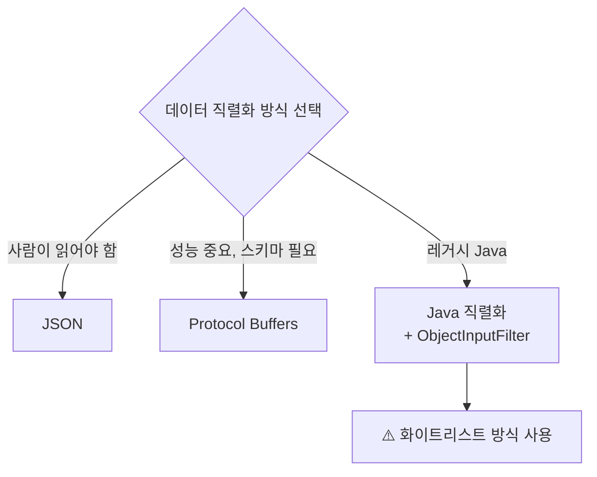

레거시 시스템에서 불가피하면 `ObjectInputFilter`로 역직렬화 필터링을 하되, 화이트리스트 방식을 써라.

---

### Item 86. Serializable을 구현할지는 신중히 결정하라

Serializable을 구현하면 직렬화 형태가 공개 API가 되어 영원히 지원해야 한다. 릴리스마다 직렬화/역직렬화 호환성 테스트 부담이 생기고, 역직렬화는 숨은 생성자로서 불변식 검사를 우회할 수 있다.

`serialVersionUID`를 반드시 명시하라. 상속용 클래스는 Serializable을 구현하지 않는 것이 원칙이다. 내부 클래스(inner class)는 직렬화하지 마라 (정적 멤버 클래스는 가능).

---

### Item 87. 커스텀 직렬화 형태를 고려해보라

물리적 표현과 논리적 내용이 같을 때만 기본 직렬화를 사용하라. 다르다면 `writeObject`/`readObject`를 직접 정의하고 `transient`로 제외할 필드를 지정하라.

```java
// 논리적 내용만 직렬화하는 StringList
private transient int size = 0;
private transient Entry head = null;

private void writeObject(ObjectOutputStream s) throws IOException {
    s.defaultWriteObject();
    s.writeInt(size);
    for (Entry e = head; e != null; e = e.next)
        s.writeObject(e.data);
}
```

`defaultWriteObject()`/`defaultReadObject()` 호출은 향후 transient가 아닌 필드 추가 시 호환성을 위해 반드시 포함하라. `serialVersionUID`를 명시적으로 선언하여 런타임 비용을 줄이고 호환성을 유지하라.

---

### Item 88. readObject 메서드는 방어적으로 작성하라

`readObject`는 바이트 스트림을 받는 public 생성자나 다름없다. 방어적 복사 후 유효성 검사를 수행하고, 재정의 가능 메서드를 호출하지 마라.

```java
private void readObject(ObjectInputStream s) throws IOException, ClassNotFoundException {
    s.defaultReadObject();
    start = new Date(start.getTime());  // 방어적 복사 먼저
    end = new Date(end.getTime());
    if (start.compareTo(end) > 0)        // 유효성 검사 나중에
        throw new InvalidObjectException(start + "가 " + end + "보다 늦다.");
}
```

---

### Item 89. 인스턴스 수를 통제해야 한다면 readResolve보다는 열거 타입을 사용하라

싱글턴 클래스에 `implements Serializable`을 추가하면 더 이상 싱글턴이 아니다. `readResolve`로 유지할 수 있지만 모든 참조 필드를 `transient`로 선언해야 도둑(stealer) 클래스 공격을 방어할 수 있다.

가장 좋은 해법은 **열거 타입**으로 싱글턴을 구현하는 것이다. 자바가 선언된 상수 외에 다른 인스턴스가 만들어지지 않음을 보장한다.

```java
public enum Elvis {
    INSTANCE;
    private String[] favoriteSongs = {"Hound Dog", "Heartbreak Hotel"};
    public void printFavorites() { System.out.println(Arrays.toString(favoriteSongs)); }
}
```

---

### Item 90. 직렬화된 인스턴스 대신 직렬화 프록시 사용을 검토하라

직렬화 프록시 패턴은 바깥 클래스의 논리적 상태를 private static 중첩 클래스에 복사하고, 역직렬화 시 공개 생성자를 통해 인스턴스를 만든다. 방어적 복사보다 강력하다.

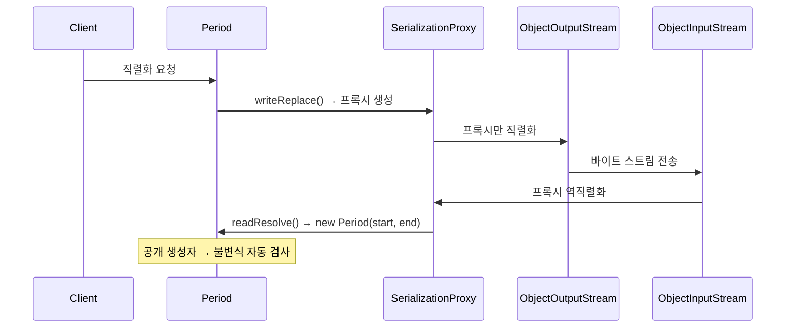

```java
private static class SerializationProxy implements Serializable {
    private final Date start;
    private final Date end;

    SerializationProxy(Period p) {
        this.start = p.start;
        this.end = p.end;
    }

    private Object readResolve() {
        return new Period(start, end);  // 공개 생성자 → 불변식 자동 검사
    }
}

// 바깥 클래스
private Object writeReplace() { return new SerializationProxy(this); }
private void readObject(ObjectInputStream s) throws InvalidObjectException {
    throw new InvalidObjectException("프록시가 필요합니다.");
}
```

한계: 확장 가능한 클래스에는 적용 불가, 객체 그래프에 순환이 있으면 사용 불가.

---

## 참고 자료

- [Effective Java, 3rd Edition - InformIT](https://www.informit.com/store/effective-java-9780134686042)
- [JDK 21 Documentation Home - Oracle](https://docs.oracle.com/en/java/javase/21/)
- [Java SE 21 API Specification - Oracle](https://docs.oracle.com/en/java/javase/21/docs/api/index.html)
- [The Java Language Specification, Java SE 21 Edition - Oracle](https://docs.oracle.com/javase/specs/jls/se21/html/index.html)
- [Object (Java SE 21 & JDK 21) - Oracle](https://docs.oracle.com/en/java/javase/21/docs/api/java.base/java/lang/Object.html)
- [AutoCloseable (Java SE 21 & JDK 21) - Oracle](https://docs.oracle.com/en/java/javase/21/docs/api/java.base/java/lang/AutoCloseable.html)
- [Package java.util.stream (Java SE 21 & JDK 21) - Oracle](https://docs.oracle.com/en/java/javase/21/docs/api/java.base/java/util/stream/package-summary.html)
- [Package java.util.concurrent (Java SE 21 & JDK 21) - Oracle](https://docs.oracle.com/en/java/javase/21/docs/api/java.base/java/util/concurrent/package-summary.html)
- [SplittableRandom (Java SE 21 & JDK 21) - Oracle](https://docs.oracle.com/en/java/javase/21/docs/api/java.base/java/util/SplittableRandom.html)
- [Java Native Interface Specification - Oracle](https://docs.oracle.com/en/java/javase/21/docs/specs/jni/)
- [Java Object Serialization Specification - Oracle](https://docs.oracle.com/en/java/javase/21/docs/specs/serialization/)
- [JEP 421: Deprecate Finalization for Removal - OpenJDK](https://openjdk.org/jeps/421)
- [JEP 395: Records - OpenJDK](https://openjdk.org/jeps/395)
- [JEP 361: Switch Expressions - OpenJDK](https://openjdk.org/jeps/361)
- [Java Collections Framework Overview - Oracle](https://docs.oracle.com/en/java/javase/21/docs/api/java.base/java/util/doc-files/coll-index.html)
- [Project Valhalla (Value Objects) - OpenJDK](https://openjdk.org/projects/valhalla/)
- [Project Loom (Inline Classes) - OpenJDK](https://openjdk.org/projects/loom/)
